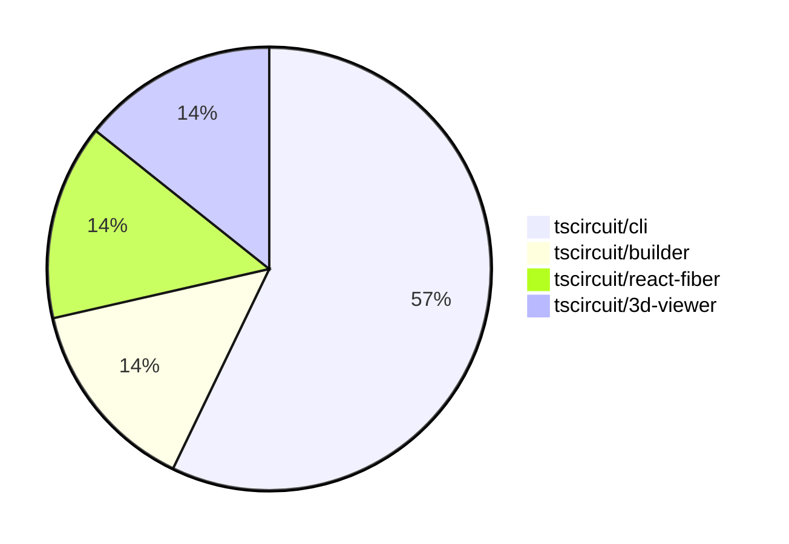

# Contribution Overview 2024-07-06

## PRs by Repository

## Contributor Overview

| Contributor | Major | Minor | Other |
| ----------- | ----- | ----- | ----- |
| seveibar    | 2     | 5     | 0     |

## Changes by Repository

### tscircuit/cli

| PR #                                            | Impact | Contributor | Description                                                              |
| ----------------------------------------------- | ------ | ----------- | ------------------------------------------------------------------------ |
| [#69](https://github.com/tscircuit/cli/pull/69) | Major  | seveibar    | Remove sqlite, refactor to use level                                     |
| [#68](https://github.com/tscircuit/cli/pull/68) | Major  | seveibar    | Introduce a new level schema and handler to migrate off SQLite.          |
| [#71](https://github.com/tscircuit/cli/pull/71) | Minor  | seveibar    | Move the example-project folder to the root directory of the repository. |
| [#67](https://github.com/tscircuit/cli/pull/67) | Minor  | seveibar    | Adds a GitHub Actions workflow for testing the dev-server-api component. |

### tscircuit/builder

| PR #                                                | Impact | Contributor | Description                                                     |
| --------------------------------------------------- | ------ | ----------- | --------------------------------------------------------------- |
| [#66](https://github.com/tscircuit/builder/pull/66) | Minor  | seveibar    | Handle undefined board thickness in the ComponentBuilder class. |

### tscircuit/react-fiber

| PR #                                                    | Impact | Contributor | Description                                                      |
| ------------------------------------------------------- | ------ | ----------- | ---------------------------------------------------------------- |
| [#12](https://github.com/tscircuit/react-fiber/pull/12) | Minor  | seveibar    | Updates and improvements to soup logging and CAD model handling. |

### tscircuit/3d-viewer

| PR #                                                | Impact | Contributor | Description                                          |
| --------------------------------------------------- | ------ | ----------- | ---------------------------------------------------- |
| [#3](https://github.com/tscircuit/3d-viewer/pull/3) | Minor  | seveibar    | Remove old app files, support not having a PCB board |

## Changes by Contributor

### seveibar

| PR #                                                    | Impact | Description                                                              |
| ------------------------------------------------------- | ------ | ------------------------------------------------------------------------ |
| [#69](https://github.com/tscircuit/cli/pull/69)         | Major  | Remove sqlite, refactor to use level                                     |
| [#68](https://github.com/tscircuit/cli/pull/68)         | Major  | Introduce a new level schema and handler to migrate off SQLite.          |
| [#66](https://github.com/tscircuit/builder/pull/66)     | Minor  | Handle undefined board thickness in the ComponentBuilder class.          |
| [#12](https://github.com/tscircuit/react-fiber/pull/12) | Minor  | Updates and improvements to soup logging and CAD model handling.         |
| [#71](https://github.com/tscircuit/cli/pull/71)         | Minor  | Move the example-project folder to the root directory of the repository. |
| [#67](https://github.com/tscircuit/cli/pull/67)         | Minor  | Adds a GitHub Actions workflow for testing the dev-server-api component. |
| [#3](https://github.com/tscircuit/3d-viewer/pull/3)     | Minor  | Remove old app files and support not having a PCB board.                 |
