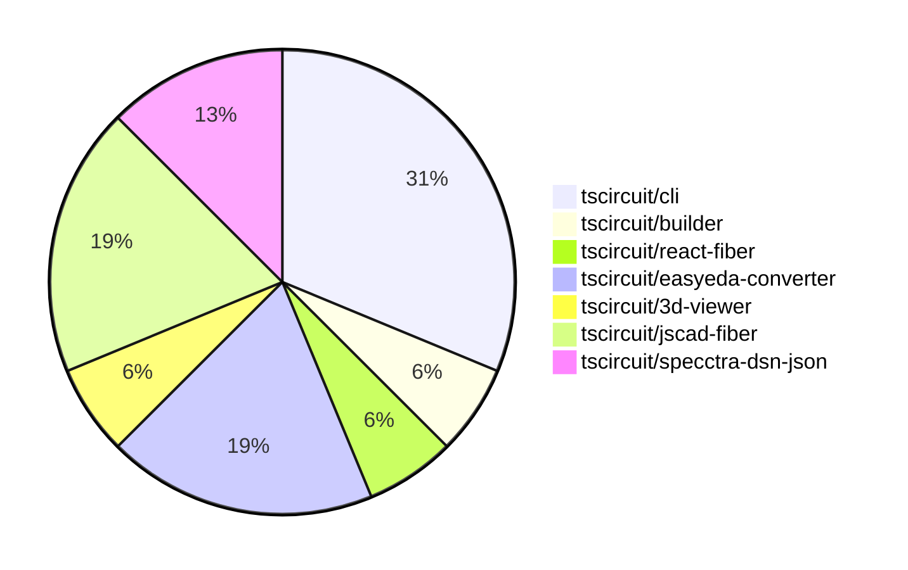

# Contribution Overview 2024-07-06

## PRs by Repository

## Contributor Overview

| Contributor | 🐳 Major | 🐙 Minor | 🐌 Tiny |
|-------------|-------|-------|-------|
| seveibar | 4 | 7 | 0 |
| andrii-balitskyi | 2 | 0 | 0 |
| Slaviiiii | 1 | 0 | 0 |

## Changes by Repository

### [tscircuit/cli](https://github.com/tscircuit/cli)

| PR # | Impact | Contributor | Description |
|------|--------|-------------|-------------|
| [#69](https://github.com/tscircuit/cli/pull/69) | 🐳 Major | seveibar | Remove sqlite, refactor to use level |
| [#68](https://github.com/tscircuit/cli/pull/68) | 🐳 Major | seveibar | Introduce a new Level-based database implementation with Zod validation for the existing database schema. |
| [#67](https://github.com/tscircuit/cli/pull/67) | 🐳 Major | seveibar | Add test setup for dev-server-api |
| [#76](https://github.com/tscircuit/cli/pull/76) | 🐙 Minor | seveibar | Change the database library from 'level' to 'memory-level' to make the application compatible with Stackblitz. |
| [#71](https://github.com/tscircuit/cli/pull/71) | 🐙 Minor | seveibar | Hoist the `example-project` directory to the root of the project. |

### [tscircuit/builder](https://github.com/tscircuit/builder)

| PR # | Impact | Contributor | Description |
|------|--------|-------------|-------------|
| [#66](https://github.com/tscircuit/builder/pull/66) | 🐙 Minor | seveibar | Handle undefined board thickness by using a default value of 0 if the board thickness is not provided. |

### [tscircuit/react-fiber](https://github.com/tscircuit/react-fiber)

| PR # | Impact | Contributor | Description |
|------|--------|-------------|-------------|
| [#12](https://github.com/tscircuit/react-fiber/pull/12) | 🐙 Minor | seveibar | Upgrade dependencies, add new logging functionality, and fix a test fixture. |

### [tscircuit/easyeda-converter](https://github.com/tscircuit/easyeda-converter)

| PR # | Impact | Contributor | Description |
|------|--------|-------------|-------------|
| [#10](https://github.com/tscircuit/easyeda-converter/pull/10) | 🐙 Minor | seveibar | Improve automatic output filenames by using the basename of the input file instead of the full input file name. |
| [#8](https://github.com/tscircuit/easyeda-converter/pull/8) | 🟣 | seveibar | Here's the analysis of the given pull request: |
| [#7](https://github.com/tscircuit/easyeda-converter/pull/7) | 🐳 Major | seveibar | The pull request adds a new test showing broken pad positioning. |

### [tscircuit/3d-viewer](https://github.com/tscircuit/3d-viewer)

| PR # | Impact | Contributor | Description |
|------|--------|-------------|-------------|
| [#3](https://github.com/tscircuit/3d-viewer/pull/3) | 🐙 Minor | seveibar | Remove old app files and support not having a PCB board. |

### [tscircuit/jscad-fiber](https://github.com/tscircuit/jscad-fiber)

| PR # | Impact | Contributor | Description |
|------|--------|-------------|-------------|
| [#8](https://github.com/tscircuit/jscad-fiber/pull/8) | 🐙 Minor | seveibar | Formats the codebase by updating the project's configuration file `biome.json` and adding file ignore rules. |
| [#6](https://github.com/tscircuit/jscad-fiber/pull/6) | 🟣 | seveibar |  |
| [#3](https://github.com/tscircuit/jscad-fiber/pull/3) | 🐳 Major | Slaviiiii | Add missing 3D shapes including cuboid, rounded cuboid, geodesic sphere, ellipsoid, cylinder, and rounded cylinder. |

### [tscircuit/specctra-dsn-json](https://github.com/tscircuit/specctra-dsn-json)

| PR # | Impact | Contributor | Description |
|------|--------|-------------|-------------|
| [#10](https://github.com/tscircuit/specctra-dsn-json/pull/10) | 🐳 Major | andrii-balitskyi | Introduce support for parsing `wiring` DSN element |
| [#9](https://github.com/tscircuit/specctra-dsn-json/pull/9) | 🐳 Major | andrii-balitskyi | Implement parsing of the `network` DSN element, including support for `net`, `via`, `via_rule`, and `class` elements. |

## Changes by Contributor

### [seveibar](https://github.com/seveibar)

| PR # | Impact | Description |
|------|--------|-------------|
| [#69](https://github.com/tscircuit/cli/pull/69) | 🐳 Major | Remove sqlite, refactor to use level |
| [#68](https://github.com/tscircuit/cli/pull/68) | 🐳 Major | Introduce a new Level-based database implementation with Zod validation for the existing database schema. |
| [#67](https://github.com/tscircuit/cli/pull/67) | 🐳 Major | Add test setup for dev-server-api |
| [#66](https://github.com/tscircuit/builder/pull/66) | 🐙 Minor | Handle undefined board thickness by using a default value of 0 if the board thickness is not provided. |
| [#12](https://github.com/tscircuit/react-fiber/pull/12) | 🐙 Minor | Upgrade dependencies, add new logging functionality, and fix a test fixture. |
| [#76](https://github.com/tscircuit/cli/pull/76) | 🐙 Minor | Change the database library from 'level' to 'memory-level' to make the application compatible with Stackblitz. |
| [#71](https://github.com/tscircuit/cli/pull/71) | 🐙 Minor | Hoist the `example-project` directory to the root of the project. |
| [#10](https://github.com/tscircuit/easyeda-converter/pull/10) | 🐙 Minor | Improve automatic output filenames by using the basename of the input file instead of the full input file name. |
| [#8](https://github.com/tscircuit/easyeda-converter/pull/8) | 🟣 | Here's the analysis of the given pull request: |
| [#7](https://github.com/tscircuit/easyeda-converter/pull/7) | 🐳 Major | The pull request adds a new test showing broken pad positioning. |
| [#3](https://github.com/tscircuit/3d-viewer/pull/3) | 🐙 Minor | Remove old app files and support not having a PCB board. |
| [#8](https://github.com/tscircuit/jscad-fiber/pull/8) | 🐙 Minor | Formats the codebase by updating the project's configuration file `biome.json` and adding file ignore rules. |
| [#6](https://github.com/tscircuit/jscad-fiber/pull/6) | 🟣 |  |

### [andrii-balitskyi](https://github.com/andrii-balitskyi)

| PR # | Impact | Description |
|------|--------|-------------|
| [#10](https://github.com/tscircuit/specctra-dsn-json/pull/10) | 🐳 Major | Introduce support for parsing `wiring` DSN element |
| [#9](https://github.com/tscircuit/specctra-dsn-json/pull/9) | 🐳 Major | Implement parsing of the `network` DSN element, including support for `net`, `via`, `via_rule`, and `class` elements. |

### [Slaviiiii](https://github.com/Slaviiiii)

| PR # | Impact | Description |
|------|--------|-------------|
| [#3](https://github.com/tscircuit/jscad-fiber/pull/3) | 🐳 Major | Add missing 3D shapes including cuboid, rounded cuboid, geodesic sphere, ellipsoid, cylinder, and rounded cylinder. |

