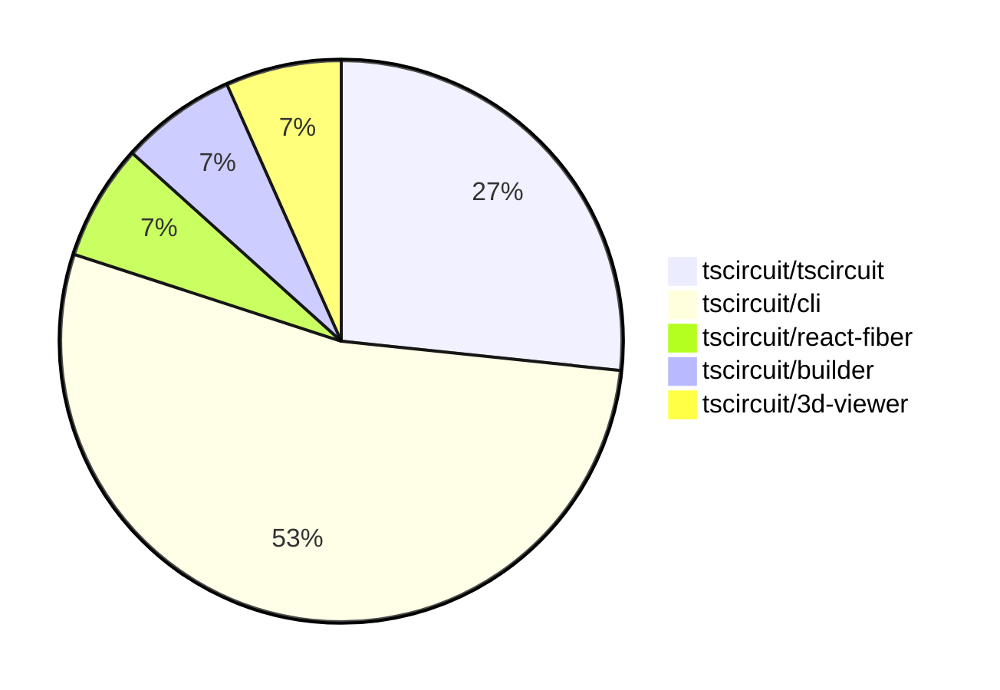

# Contribution Overview 2024-07-06

## PRs by Repository

## Contributor Overview

| Contributor | Major | Minor | Other |
|-------------|-------|-------|-------|
| renovate[bot] | 0 | 2 | 6 |
| seveibar | 2 | 5 | 0 |

## Changes by Repository

### tscircuit/tscircuit

| PR # | Impact | Contributor | Description |
|------|--------|-------------|-------------|
| [#239](https://github.com/tscircuit/tscircuit/pull/239) | Tiny | renovate[bot] | Update the dependency @tscircuit/cli to version ^0.0.122 |
| [#238](https://github.com/tscircuit/tscircuit/pull/238) | Tiny | renovate[bot] | Updates the dependency `@tscircuit/builder` to version `1.5.136`. |
| [#236](https://github.com/tscircuit/tscircuit/pull/236) | Tiny | renovate[bot] | Bump the version of the `@tscircuit/cli` dependency from `^0.0.116` to `^0.0.117`. |
| [#235](https://github.com/tscircuit/tscircuit/pull/235) | Tiny | renovate[bot] | Update the dependency @tscircuit/cli to version ^0.0.116 |

### tscircuit/cli

| PR # | Impact | Contributor | Description |
|------|--------|-------------|-------------|
| [#69](https://github.com/tscircuit/cli/pull/69) | Major | seveibar | Remove sqlite, refactor to use level |
| [#68](https://github.com/tscircuit/cli/pull/68) | Major | seveibar | Introduce a new level-based database schema and handler to migrate off SQLite. |
| [#73](https://github.com/tscircuit/cli/pull/73) | Minor | renovate[bot] | Update the dependency `@tscircuit/layout` from version `0.0.17` to `0.0.24`. |
| [#71](https://github.com/tscircuit/cli/pull/71) | Minor | seveibar | Move the "example-project" directory to the root of the repository. |
| [#45](https://github.com/tscircuit/cli/pull/45) | Minor | renovate[bot] | Update the dependency `@tscircuit/soup-util` from version `^0.0.1` to `^0.0.11`. |
| [#67](https://github.com/tscircuit/cli/pull/67) | Minor | seveibar | Add test setup for dev-server-api |
| [#72](https://github.com/tscircuit/cli/pull/72) | Tiny | renovate[bot] | Update dependency @tscircuit/builder to v1.5.136 |
| [#43](https://github.com/tscircuit/cli/pull/43) | Tiny | renovate[bot] | Update dependency @tscircuit/react-fiber to version 1.1.29 |

### tscircuit/react-fiber

| PR # | Impact | Contributor | Description |
|------|--------|-------------|-------------|
| [#12](https://github.com/tscircuit/react-fiber/pull/12) | Minor | seveibar | Tweaks and improvements with soup logging and cadModel |

### tscircuit/builder

| PR # | Impact | Contributor | Description |
|------|--------|-------------|-------------|
| [#66](https://github.com/tscircuit/builder/pull/66) | Minor | seveibar | Handle undefined board thickness in the ComponentBuilder class. |

### tscircuit/3d-viewer

| PR # | Impact | Contributor | Description |
|------|--------|-------------|-------------|
| [#3](https://github.com/tscircuit/3d-viewer/pull/3) | Minor | seveibar | Removes old app files and supports not having a PCB board. |

## Changes by Contributor

### renovate[bot]

| PR # | Impact | Description |
|------|--------|-------------|
| [#239](https://github.com/tscircuit/tscircuit/pull/239) | Tiny | Update the dependency @tscircuit/cli to version ^0.0.122 |
| [#238](https://github.com/tscircuit/tscircuit/pull/238) | Tiny | Updates the dependency `@tscircuit/builder` to version `1.5.136`. |
| [#236](https://github.com/tscircuit/tscircuit/pull/236) | Tiny | Bump the version of the `@tscircuit/cli` dependency from `^0.0.116` to `^0.0.117`. |
| [#235](https://github.com/tscircuit/tscircuit/pull/235) | Tiny | Update the dependency @tscircuit/cli to version ^0.0.116 |
| [#72](https://github.com/tscircuit/cli/pull/72) | Tiny | Update dependency @tscircuit/builder to v1.5.136 |
| [#73](https://github.com/tscircuit/cli/pull/73) | Minor | Update the dependency `@tscircuit/layout` from version `0.0.17` to `0.0.24`. |
| [#45](https://github.com/tscircuit/cli/pull/45) | Minor | Update the dependency `@tscircuit/soup-util` from version `^0.0.1` to `^0.0.11`. |
| [#43](https://github.com/tscircuit/cli/pull/43) | Tiny | Update dependency @tscircuit/react-fiber to version 1.1.29 |

### seveibar

| PR # | Impact | Description |
|------|--------|-------------|
| [#71](https://github.com/tscircuit/cli/pull/71) | Minor | Move the "example-project" directory to the root of the repository. |
| [#69](https://github.com/tscircuit/cli/pull/69) | Major | Remove sqlite, refactor to use level |
| [#68](https://github.com/tscircuit/cli/pull/68) | Major | Introduce a new level-based database schema and handler to migrate off SQLite. |
| [#67](https://github.com/tscircuit/cli/pull/67) | Minor | Add test setup for dev-server-api |
| [#12](https://github.com/tscircuit/react-fiber/pull/12) | Minor | Tweaks and improvements with soup logging and cadModel |
| [#66](https://github.com/tscircuit/builder/pull/66) | Minor | Handle undefined board thickness in the ComponentBuilder class. |
| [#3](https://github.com/tscircuit/3d-viewer/pull/3) | Minor | Removes old app files and supports not having a PCB board. |

