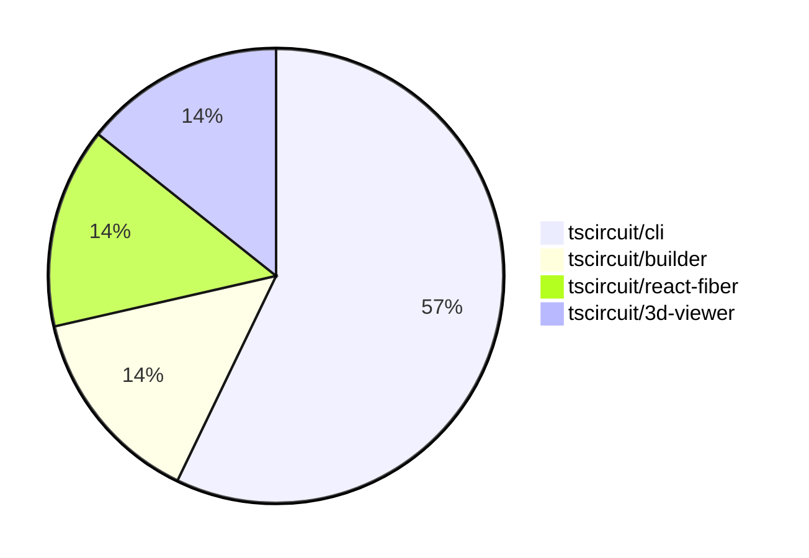

# Contribution Overview 2024-07-06

## PRs by Repository

## Contributor Overview

| Contributor | Major | Minor | Other |
|-------------|-------|-------|-------|
| seveibar | 3 | 4 | 0 |

## Changes by Repository

### tscircuit/cli

| PR # | Impact | Contributor | Description |
|------|--------|-------------|-------------|
| [#69](https://github.com/tscircuit/cli/pull/69) | Major | seveibar | Remove sqlite, refactor to use level |
| [#68](https://github.com/tscircuit/cli/pull/68) | Major | seveibar | Introduce a new level-based database schema and handler to migrate the application off SQLite. |
| [#67](https://github.com/tscircuit/cli/pull/67) | Major | seveibar | Add test setup for dev-server-api |
| [#71](https://github.com/tscircuit/cli/pull/71) | Minor | seveibar | Move the `example-project` directory from `tests/assets` to the root directory. |

### tscircuit/builder

| PR # | Impact | Contributor | Description |
|------|--------|-------------|-------------|
| [#66](https://github.com/tscircuit/builder/pull/66) | Minor | seveibar | Handle the case when the `board_thickness` property is `undefined` by setting it to 0 as a fallback. |

### tscircuit/react-fiber

| PR # | Impact | Contributor | Description |
|------|--------|-------------|-------------|
| [#12](https://github.com/tscircuit/react-fiber/pull/12) | Minor | seveibar | Introduce updates to dependencies, including @tscircuit/builder, @tscircuit/props, and add @tscircuit/log-soup. |

### tscircuit/3d-viewer

| PR # | Impact | Contributor | Description |
|------|--------|-------------|-------------|
| [#3](https://github.com/tscircuit/3d-viewer/pull/3) | Minor | seveibar | Remove old app files, support not having a PCB board |

## Changes by Contributor

### seveibar

| PR # | Impact | Description |
|------|--------|-------------|
| [#69](https://github.com/tscircuit/cli/pull/69) | Major | Remove sqlite, refactor to use level |
| [#68](https://github.com/tscircuit/cli/pull/68) | Major | Introduce a new level-based database schema and handler to migrate the application off SQLite. |
| [#67](https://github.com/tscircuit/cli/pull/67) | Major | Add test setup for dev-server-api |
| [#66](https://github.com/tscircuit/builder/pull/66) | Minor | Handle the case when the `board_thickness` property is `undefined` by setting it to 0 as a fallback. |
| [#12](https://github.com/tscircuit/react-fiber/pull/12) | Minor | Introduce updates to dependencies, including @tscircuit/builder, @tscircuit/props, and add @tscircuit/log-soup. |
| [#71](https://github.com/tscircuit/cli/pull/71) | Minor | Move the `example-project` directory from `tests/assets` to the root directory. |
| [#3](https://github.com/tscircuit/3d-viewer/pull/3) | Minor | Remove old app files, support not having a PCB board |

