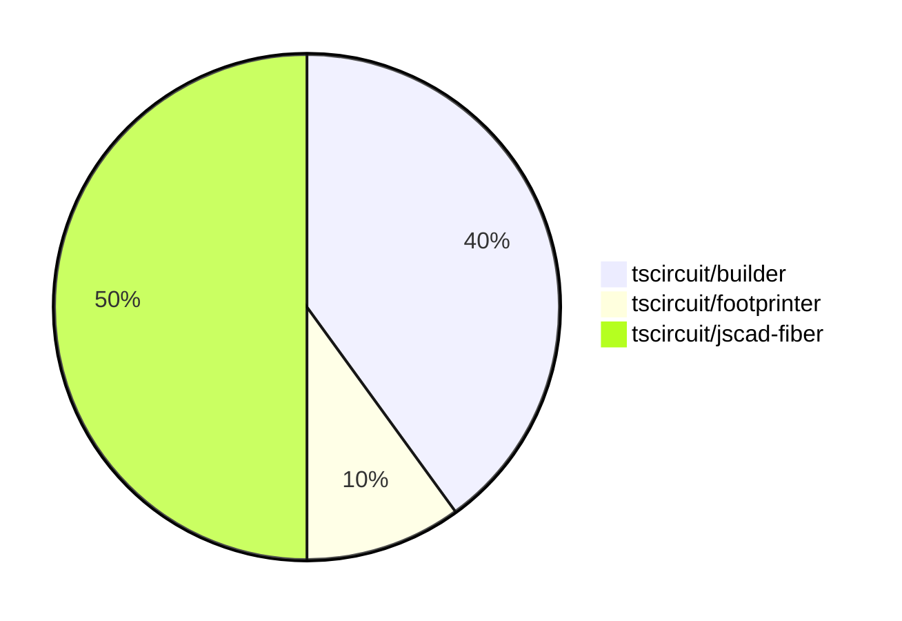

# Contribution Overview 2024-07-13

## PRs by Repository

## Contributor Overview

| Contributor | 🐳 Major | 🐙 Minor | 🐌 Tiny |
|-------------|-------|-------|-------|
| seveibar | 4 | 2 | 0 |
| Slaviiiii | 2 | 0 | 0 |

## Changes by Repository

### [tscircuit/builder](https://github.com/tscircuit/builder)

| PR # | Impact | Contributor | Description |
|------|--------|-------------|-------------|
| [#73](https://github.com/tscircuit/builder/pull/73) | 🐳 Major | seveibar | Fix bad usage of `convert` function in `plated-hole-builder.ts` |
| [#72](https://github.com/tscircuit/builder/pull/72) | 🟣 | seveibar |  |
| [#71](https://github.com/tscircuit/builder/pull/71) | 🐳 Major | seveibar | Fix default plated hole construction when there's no outer width or hole width |
| [#70](https://github.com/tscircuit/builder/pull/70) | 🐙 Minor | seveibar | Upgrade the Footprinter dependency to version 0.0.44 |

### [tscircuit/footprinter](https://github.com/tscircuit/footprinter)

| PR # | Impact | Contributor | Description |
|------|--------|-------------|-------------|
| [#11](https://github.com/tscircuit/footprinter/pull/11) | 🐳 Major | seveibar | Add a `pinrow` function and a `biome.json` file with configuration for formatting and linting. |

### [tscircuit/jscad-fiber](https://github.com/tscircuit/jscad-fiber)

| PR # | Impact | Contributor | Description |
|------|--------|-------------|-------------|
| [#16](https://github.com/tscircuit/jscad-fiber/pull/16) | 🐳 Major | seveibar | Add test and release workflow, fix exports, and add build system |
| [#19](https://github.com/tscircuit/jscad-fiber/pull/19) | 🐳 Major | Slaviiiii | Update functions and shapes |
| [#20](https://github.com/tscircuit/jscad-fiber/pull/20) | 🐙 Minor | seveibar | Fix the `predeploy` script to correctly build the Cosmos export before deploying to GitHub Pages. |
| [#12](https://github.com/tscircuit/jscad-fiber/pull/12) | 🟣 | Slaviiiii | Adds support for extruding shapes in various ways (helical, rectangular, and rotational) using new components (`ExtrudeHelical`, `ExtrudeRectangular`, `ExtrudeRotate`) and their corresponding props.
   - |
| [#15](https://github.com/tscircuit/jscad-fiber/pull/15) | 🐳 Major | Slaviiiii | Add support for geometry colorization in the JSCAD fixture component. |

## Changes by Contributor

### [seveibar](https://github.com/seveibar)

| PR # | Impact | Description |
|------|--------|-------------|
| [#73](https://github.com/tscircuit/builder/pull/73) | 🐳 Major | Fix bad usage of `convert` function in `plated-hole-builder.ts` |
| [#72](https://github.com/tscircuit/builder/pull/72) | 🟣 |  |
| [#71](https://github.com/tscircuit/builder/pull/71) | 🐳 Major | Fix default plated hole construction when there's no outer width or hole width |
| [#11](https://github.com/tscircuit/footprinter/pull/11) | 🐳 Major | Add a `pinrow` function and a `biome.json` file with configuration for formatting and linting. |
| [#16](https://github.com/tscircuit/jscad-fiber/pull/16) | 🐳 Major | Add test and release workflow, fix exports, and add build system |
| [#70](https://github.com/tscircuit/builder/pull/70) | 🐙 Minor | Upgrade the Footprinter dependency to version 0.0.44 |
| [#20](https://github.com/tscircuit/jscad-fiber/pull/20) | 🐙 Minor | Fix the `predeploy` script to correctly build the Cosmos export before deploying to GitHub Pages. |

### [Slaviiiii](https://github.com/Slaviiiii)

| PR # | Impact | Description |
|------|--------|-------------|
| [#19](https://github.com/tscircuit/jscad-fiber/pull/19) | 🐳 Major | Update functions and shapes |
| [#12](https://github.com/tscircuit/jscad-fiber/pull/12) | 🟣 | Adds support for extruding shapes in various ways (helical, rectangular, and rotational) using new components (`ExtrudeHelical`, `ExtrudeRectangular`, `ExtrudeRotate`) and their corresponding props.
   - |
| [#15](https://github.com/tscircuit/jscad-fiber/pull/15) | 🐳 Major | Add support for geometry colorization in the JSCAD fixture component. |

