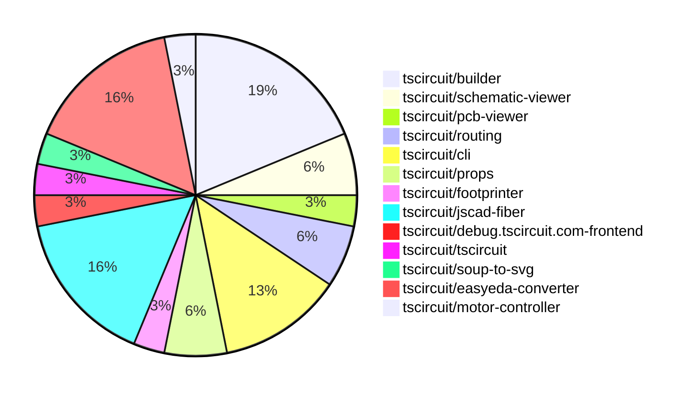

# Contribution Overview 2024-07-13

## PRs by Repository

## Contributor Overview

| Contributor | 🐳 Major | 🐙 Minor | 🐌 Tiny |
|-------------|-------|-------|-------|
| seveibar | 10 | 9 | 0 |
| imrishabh18 | 1 | 1 | 0 |
| andrii-balitskyi | 3 | 3 | 1 |
| Slaviiiii | 2 | 1 | 0 |

## Changes by Repository

### [tscircuit/builder](https://github.com/tscircuit/builder)

| PR # | Impact | Contributor | Description |
|------|--------|-------------|-------------|
| [#74](https://github.com/tscircuit/builder/pull/74) | 🐳 Major | seveibar | Fix issue where failure to connect routes doesn't show an error that routes failed to connect. |
| [#72](https://github.com/tscircuit/builder/pull/72) | 🐳 Major | seveibar | Fix default plated hole construction when there's no outer width or hole width |
| [#71](https://github.com/tscircuit/builder/pull/71) | 🐳 Major | seveibar | Fix the default plated hole construction when there's no outer width or hole width. |
| [#75](https://github.com/tscircuit/builder/pull/75) | 🐙 Minor | seveibar | Autorouting Segment Size Benchmark |
| [#73](https://github.com/tscircuit/builder/pull/73) | 🐙 Minor | seveibar | Fix bad usage of `convert` function in `plated-hole-builder.ts` |
| [#70](https://github.com/tscircuit/builder/pull/70) | 🐙 Minor | seveibar | Upgrade the Footprinter dependency to a newer version |

### [tscircuit/schematic-viewer](https://github.com/tscircuit/schematic-viewer)

| PR # | Impact | Contributor | Description |
|------|--------|-------------|-------------|
| [#41](https://github.com/tscircuit/schematic-viewer/pull/41) | 🐳 Major | seveibar | Add typecheck and chromatic visual testing workflows |
| [#37](https://github.com/tscircuit/schematic-viewer/pull/37) | 🐙 Minor | seveibar | Update the Renovate configuration to avoid creating too many pull requests. |

### [tscircuit/pcb-viewer](https://github.com/tscircuit/pcb-viewer)

| PR # | Impact | Contributor | Description |
|------|--------|-------------|-------------|
| [#25](https://github.com/tscircuit/pcb-viewer/pull/25) | 🐳 Major | seveibar | Fix port aliases not appearing for SMTPADS and plated holes for most components |

### [tscircuit/routing](https://github.com/tscircuit/routing)

| PR # | Impact | Contributor | Description |
|------|--------|-------------|-------------|
| [#10](https://github.com/tscircuit/routing/pull/10) | 🐳 Major | seveibar | Automatically adjust the viewbox to fit the entire board when the text area content changes. |
| [#11](https://github.com/tscircuit/routing/pull/11) | 🐙 Minor | seveibar | Add a landing page for the Storybook stories |

### [tscircuit/cli](https://github.com/tscircuit/cli)

| PR # | Impact | Contributor | Description |
|------|--------|-------------|-------------|
| [#99](https://github.com/tscircuit/cli/pull/99) | 🐳 Major | seveibar | Fix "over dragging" issue, add debug logging, fix LEVEL_NOT_FOUND error messages |
| [#98](https://github.com/tscircuit/cli/pull/98) | 🐙 Minor | seveibar | Add a `--no-cleanup` flag to keep temporary entrypoints around for debugging. |
| [#102](https://github.com/tscircuit/cli/pull/102) | 🐙 Minor | imrishabh18 | Fix issue with localhost being interpreted as IPv6 instead of IPv4 by the axiosInstance package. |
| [#100](https://github.com/tscircuit/cli/pull/100) | 🐙 Minor | andrii-balitskyi | Improve 401 error messages |

### [tscircuit/props](https://github.com/tscircuit/props)

| PR # | Impact | Contributor | Description |
|------|--------|-------------|-------------|
| [#6](https://github.com/tscircuit/props/pull/6) | 🐳 Major | seveibar | Add formatter and format check, and add typecheck workflow. |
| [#7](https://github.com/tscircuit/props/pull/7) | 🐙 Minor | Slaviiiii | Change the property names from `pcbCenterX` and `pcbCenterY` to `pcbX` and `pcbY` in the `boardProps` type. |

### [tscircuit/footprinter](https://github.com/tscircuit/footprinter)

| PR # | Impact | Contributor | Description |
|------|--------|-------------|-------------|
| [#11](https://github.com/tscircuit/footprinter/pull/11) | 🐳 Major | seveibar | Add new `pinrow` function and `biome.json` configuration |

### [tscircuit/jscad-fiber](https://github.com/tscircuit/jscad-fiber)

| PR # | Impact | Contributor | Description |
|------|--------|-------------|-------------|
| [#16](https://github.com/tscircuit/jscad-fiber/pull/16) | 🐳 Major | seveibar | Add test and release workflows, fix exports, and add build system |
| [#19](https://github.com/tscircuit/jscad-fiber/pull/19) | 🐳 Major | Slaviiiii | Update functions and shapes |
| [#20](https://github.com/tscircuit/jscad-fiber/pull/20) | 🐙 Minor | seveibar | Update the `predeploy` script to correctly build the Cosmos export before deploying to GitHub Pages. |
| [#12](https://github.com/tscircuit/jscad-fiber/pull/12) | 🟣 | Slaviiiii | ** Add support for extrusion functions (helical, rectangular, and rotational) in the JsCad library.
   ** |
| [#15](https://github.com/tscircuit/jscad-fiber/pull/15) | 🐳 Major | Slaviiiii | Adds support for colorization of geometries in the JSCAD fixture component. |

### [tscircuit/debug.tscircuit.com-frontend](https://github.com/tscircuit/debug.tscircuit.com-frontend)

| PR # | Impact | Contributor | Description |
|------|--------|-------------|-------------|
| [#134](https://github.com/tscircuit/debug.tscircuit.com-frontend/pull/134) | 🐙 Minor | seveibar | Update the versions of the `@tscircuit/builder` and `@tscircuit/soup-util` dependencies to fix issues with blank schematics. |

### [tscircuit/tscircuit](https://github.com/tscircuit/tscircuit)

| PR # | Impact | Contributor | Description |
|------|--------|-------------|-------------|
| [#263](https://github.com/tscircuit/tscircuit/pull/263) | 🐙 Minor | seveibar | Add `@tscircuit/soup-util` dependency to fix build errors |

### [tscircuit/soup-to-svg](https://github.com/tscircuit/soup-to-svg)

| PR # | Impact | Contributor | Description |
|------|--------|-------------|-------------|
| [#2](https://github.com/tscircuit/soup-to-svg/pull/2) | 🐳 Major | imrishabh18 | Initialized the lib with build and type checking |

### [tscircuit/easyeda-converter](https://github.com/tscircuit/easyeda-converter)

| PR # | Impact | Contributor | Description |
|------|--------|-------------|-------------|
| [#27](https://github.com/tscircuit/easyeda-converter/pull/27) | 🐳 Major | andrii-balitskyi | Fix handling of negative coordinates for SOLIDREGION package detail shape. |
| [#25](https://github.com/tscircuit/easyeda-converter/pull/25) | 🐳 Major | andrii-balitskyi | Use manufacturer part number as TypeScript component name |
| [#23](https://github.com/tscircuit/easyeda-converter/pull/23) | 🐳 Major | andrii-balitskyi | Introduce support for parsing `RECT` package detail shape |
| [#28](https://github.com/tscircuit/easyeda-converter/pull/28) | 🐙 Minor | andrii-balitskyi | Prefix numeric pin labels with `pin` in the generated TypeScript component |
| [#26](https://github.com/tscircuit/easyeda-converter/pull/26) | 🐙 Minor | andrii-balitskyi | Export `normalizeManufacturerPartNumber` function |

### [tscircuit/motor-controller](https://github.com/tscircuit/motor-controller)

| PR # | Impact | Contributor | Description |
|------|--------|-------------|-------------|
| [#2](https://github.com/tscircuit/motor-controller/pull/2) | 🐌 Tiny | andrii-balitskyi | Fix the formatting of the table in the README.md file. |

## Changes by Contributor

### [seveibar](https://github.com/seveibar)

| PR # | Impact | Description |
|------|--------|-------------|
| [#74](https://github.com/tscircuit/builder/pull/74) | 🐳 Major | Fix issue where failure to connect routes doesn't show an error that routes failed to connect. |
| [#72](https://github.com/tscircuit/builder/pull/72) | 🐳 Major | Fix default plated hole construction when there's no outer width or hole width |
| [#71](https://github.com/tscircuit/builder/pull/71) | 🐳 Major | Fix the default plated hole construction when there's no outer width or hole width. |
| [#41](https://github.com/tscircuit/schematic-viewer/pull/41) | 🐳 Major | Add typecheck and chromatic visual testing workflows |
| [#25](https://github.com/tscircuit/pcb-viewer/pull/25) | 🐳 Major | Fix port aliases not appearing for SMTPADS and plated holes for most components |
| [#10](https://github.com/tscircuit/routing/pull/10) | 🐳 Major | Automatically adjust the viewbox to fit the entire board when the text area content changes. |
| [#99](https://github.com/tscircuit/cli/pull/99) | 🐳 Major | Fix "over dragging" issue, add debug logging, fix LEVEL_NOT_FOUND error messages |
| [#6](https://github.com/tscircuit/props/pull/6) | 🐳 Major | Add formatter and format check, and add typecheck workflow. |
| [#11](https://github.com/tscircuit/footprinter/pull/11) | 🐳 Major | Add new `pinrow` function and `biome.json` configuration |
| [#16](https://github.com/tscircuit/jscad-fiber/pull/16) | 🐳 Major | Add test and release workflows, fix exports, and add build system |
| [#75](https://github.com/tscircuit/builder/pull/75) | 🐙 Minor | Autorouting Segment Size Benchmark |
| [#73](https://github.com/tscircuit/builder/pull/73) | 🐙 Minor | Fix bad usage of `convert` function in `plated-hole-builder.ts` |
| [#70](https://github.com/tscircuit/builder/pull/70) | 🐙 Minor | Upgrade the Footprinter dependency to a newer version |
| [#37](https://github.com/tscircuit/schematic-viewer/pull/37) | 🐙 Minor | Update the Renovate configuration to avoid creating too many pull requests. |
| [#134](https://github.com/tscircuit/debug.tscircuit.com-frontend/pull/134) | 🐙 Minor | Update the versions of the `@tscircuit/builder` and `@tscircuit/soup-util` dependencies to fix issues with blank schematics. |
| [#11](https://github.com/tscircuit/routing/pull/11) | 🐙 Minor | Add a landing page for the Storybook stories |
| [#263](https://github.com/tscircuit/tscircuit/pull/263) | 🐙 Minor | Add `@tscircuit/soup-util` dependency to fix build errors |
| [#98](https://github.com/tscircuit/cli/pull/98) | 🐙 Minor | Add a `--no-cleanup` flag to keep temporary entrypoints around for debugging. |
| [#20](https://github.com/tscircuit/jscad-fiber/pull/20) | 🐙 Minor | Update the `predeploy` script to correctly build the Cosmos export before deploying to GitHub Pages. |

### [imrishabh18](https://github.com/imrishabh18)

| PR # | Impact | Description |
|------|--------|-------------|
| [#2](https://github.com/tscircuit/soup-to-svg/pull/2) | 🐳 Major | Initialized the lib with build and type checking |
| [#102](https://github.com/tscircuit/cli/pull/102) | 🐙 Minor | Fix issue with localhost being interpreted as IPv6 instead of IPv4 by the axiosInstance package. |

### [andrii-balitskyi](https://github.com/andrii-balitskyi)

| PR # | Impact | Description |
|------|--------|-------------|
| [#27](https://github.com/tscircuit/easyeda-converter/pull/27) | 🐳 Major | Fix handling of negative coordinates for SOLIDREGION package detail shape. |
| [#25](https://github.com/tscircuit/easyeda-converter/pull/25) | 🐳 Major | Use manufacturer part number as TypeScript component name |
| [#23](https://github.com/tscircuit/easyeda-converter/pull/23) | 🐳 Major | Introduce support for parsing `RECT` package detail shape |
| [#100](https://github.com/tscircuit/cli/pull/100) | 🐙 Minor | Improve 401 error messages |
| [#28](https://github.com/tscircuit/easyeda-converter/pull/28) | 🐙 Minor | Prefix numeric pin labels with `pin` in the generated TypeScript component |
| [#26](https://github.com/tscircuit/easyeda-converter/pull/26) | 🐙 Minor | Export `normalizeManufacturerPartNumber` function |
| [#2](https://github.com/tscircuit/motor-controller/pull/2) | 🐌 Tiny | Fix the formatting of the table in the README.md file. |

### [Slaviiiii](https://github.com/Slaviiiii)

| PR # | Impact | Description |
|------|--------|-------------|
| [#19](https://github.com/tscircuit/jscad-fiber/pull/19) | 🐳 Major | Update functions and shapes |
| [#7](https://github.com/tscircuit/props/pull/7) | 🐙 Minor | Change the property names from `pcbCenterX` and `pcbCenterY` to `pcbX` and `pcbY` in the `boardProps` type. |
| [#12](https://github.com/tscircuit/jscad-fiber/pull/12) | 🟣 | ** Add support for extrusion functions (helical, rectangular, and rotational) in the JsCad library.
   ** |
| [#15](https://github.com/tscircuit/jscad-fiber/pull/15) | 🐳 Major | Adds support for colorization of geometries in the JSCAD fixture component. |

