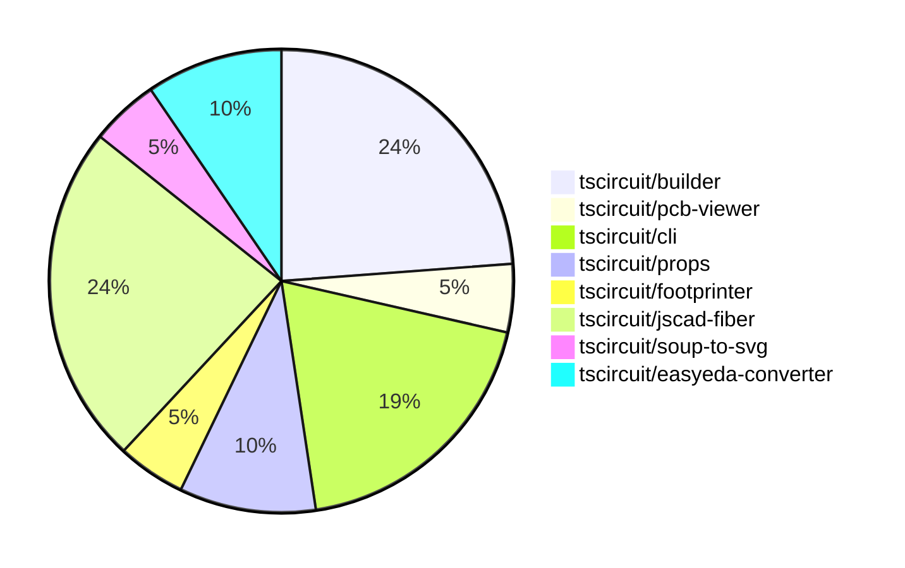

# Contribution Overview 2024-07-13

## PRs by Repository

## Contributor Overview

| Contributor | 🐳 Major | 🐙 Minor | 🐌 Tiny |
|-------------|-------|-------|-------|
| seveibar | 9 | 3 | 0 |
| imrishabh18 | 2 | 0 | 0 |
| andrii-balitskyi | 2 | 1 | 0 |
| Slaviiiii | 1 | 2 | 0 |

## Changes by Repository

### [tscircuit/builder](https://github.com/tscircuit/builder)

| PR # | Impact | Contributor | Description |
|------|--------|-------------|-------------|
| [#74](https://github.com/tscircuit/builder/pull/74) | 🐳 Major | seveibar | Fix an issue where failure to connect routes does not show an error that routes failed to connect. |
| [#73](https://github.com/tscircuit/builder/pull/73) | 🐳 Major | seveibar | Fix bad usage of `convert` function in `plated-hole-builder.ts` |
| [#72](https://github.com/tscircuit/builder/pull/72) | 🐳 Major | seveibar | Fix default plated hole construction when there's no outer width or hole width |
| [#71](https://github.com/tscircuit/builder/pull/71) | 🐳 Major | seveibar | Fix default plated hole construction when there's no outer width or hole width |
| [#70](https://github.com/tscircuit/builder/pull/70) | 🐙 Minor | seveibar | Upgrade the Footprinter package to version 0.0.44 |

### [tscircuit/pcb-viewer](https://github.com/tscircuit/pcb-viewer)

| PR # | Impact | Contributor | Description |
|------|--------|-------------|-------------|
| [#25](https://github.com/tscircuit/pcb-viewer/pull/25) | 🐳 Major | seveibar | Fix port aliases not appearing for SMTPads and plated holes for most components |

### [tscircuit/cli](https://github.com/tscircuit/cli)

| PR # | Impact | Contributor | Description |
|------|--------|-------------|-------------|
| [#99](https://github.com/tscircuit/cli/pull/99) | 🐳 Major | seveibar | Fix "over dragging" issue, add debug logging, and fix LEVEL_NOT_FOUND error messages |
| [#102](https://github.com/tscircuit/cli/pull/102) | 🐳 Major | imrishabh18 | Fix issue where localhost is interpreted as IPv6 instead of IPv4 by the axiosInstance package. |
| [#98](https://github.com/tscircuit/cli/pull/98) | 🐙 Minor | seveibar | Add a `--no-cleanup` flag to keep temporary entrypoints around for debugging purposes. |
| [#100](https://github.com/tscircuit/cli/pull/100) | 🐙 Minor | andrii-balitskyi | Improve 401 error messages with a better user-friendly message and exit the process. |

### [tscircuit/props](https://github.com/tscircuit/props)

| PR # | Impact | Contributor | Description |
|------|--------|-------------|-------------|
| [#6](https://github.com/tscircuit/props/pull/6) | 🐳 Major | seveibar | Add format check and typecheck workflows to the project. |
| [#7](https://github.com/tscircuit/props/pull/7) | 🐙 Minor | Slaviiiii | Change the property names from `pcbCenterX` and `pcbCenterY` to `pcbX` and `pcbY` in the `boardProps` type. |

### [tscircuit/footprinter](https://github.com/tscircuit/footprinter)

| PR # | Impact | Contributor | Description |
|------|--------|-------------|-------------|
| [#11](https://github.com/tscircuit/footprinter/pull/11) | 🐳 Major | seveibar | Add a new `pinrow` function and a corresponding `biome.json` configuration. |

### [tscircuit/jscad-fiber](https://github.com/tscircuit/jscad-fiber)

| PR # | Impact | Contributor | Description |
|------|--------|-------------|-------------|
| [#16](https://github.com/tscircuit/jscad-fiber/pull/16) | 🐳 Major | seveibar | Add test and release workflows, fix exports, and add build system |
| [#20](https://github.com/tscircuit/jscad-fiber/pull/20) | 🐙 Minor | seveibar | Fix the `predeploy` script to build the Cosmos export instead of the library. |
| [#19](https://github.com/tscircuit/jscad-fiber/pull/19) | 🐙 Minor | Slaviiiii | Update functions and shapes in the examples |
| [#12](https://github.com/tscircuit/jscad-fiber/pull/12) | 🟣 | Slaviiiii | Adds support for various extrusion operations, including helical, rectangular, and rotational extrusions.
   - |
| [#15](https://github.com/tscircuit/jscad-fiber/pull/15) | 🐳 Major | Slaviiiii | Add support for geometry colorization in the JSCAD fixture component. |

### [tscircuit/soup-to-svg](https://github.com/tscircuit/soup-to-svg)

| PR # | Impact | Contributor | Description |
|------|--------|-------------|-------------|
| [#2](https://github.com/tscircuit/soup-to-svg/pull/2) | 🐳 Major | imrishabh18 | Initialized the lib with build and type checking. |

### [tscircuit/easyeda-converter](https://github.com/tscircuit/easyeda-converter)

| PR # | Impact | Contributor | Description |
|------|--------|-------------|-------------|
| [#25](https://github.com/tscircuit/easyeda-converter/pull/25) | 🐳 Major | andrii-balitskyi | Use the manufacturer part number as the TypeScript component name, with normalization to ensure valid names. |
| [#23](https://github.com/tscircuit/easyeda-converter/pull/23) | 🐳 Major | andrii-balitskyi | Add support for parsing `RECT` package detail shape |

## Changes by Contributor

### [seveibar](https://github.com/seveibar)

| PR # | Impact | Description |
|------|--------|-------------|
| [#74](https://github.com/tscircuit/builder/pull/74) | 🐳 Major | Fix an issue where failure to connect routes does not show an error that routes failed to connect. |
| [#73](https://github.com/tscircuit/builder/pull/73) | 🐳 Major | Fix bad usage of `convert` function in `plated-hole-builder.ts` |
| [#72](https://github.com/tscircuit/builder/pull/72) | 🐳 Major | Fix default plated hole construction when there's no outer width or hole width |
| [#71](https://github.com/tscircuit/builder/pull/71) | 🐳 Major | Fix default plated hole construction when there's no outer width or hole width |
| [#25](https://github.com/tscircuit/pcb-viewer/pull/25) | 🐳 Major | Fix port aliases not appearing for SMTPads and plated holes for most components |
| [#99](https://github.com/tscircuit/cli/pull/99) | 🐳 Major | Fix "over dragging" issue, add debug logging, and fix LEVEL_NOT_FOUND error messages |
| [#6](https://github.com/tscircuit/props/pull/6) | 🐳 Major | Add format check and typecheck workflows to the project. |
| [#11](https://github.com/tscircuit/footprinter/pull/11) | 🐳 Major | Add a new `pinrow` function and a corresponding `biome.json` configuration. |
| [#16](https://github.com/tscircuit/jscad-fiber/pull/16) | 🐳 Major | Add test and release workflows, fix exports, and add build system |
| [#70](https://github.com/tscircuit/builder/pull/70) | 🐙 Minor | Upgrade the Footprinter package to version 0.0.44 |
| [#98](https://github.com/tscircuit/cli/pull/98) | 🐙 Minor | Add a `--no-cleanup` flag to keep temporary entrypoints around for debugging purposes. |
| [#20](https://github.com/tscircuit/jscad-fiber/pull/20) | 🐙 Minor | Fix the `predeploy` script to build the Cosmos export instead of the library. |

### [imrishabh18](https://github.com/imrishabh18)

| PR # | Impact | Description |
|------|--------|-------------|
| [#102](https://github.com/tscircuit/cli/pull/102) | 🐳 Major | Fix issue where localhost is interpreted as IPv6 instead of IPv4 by the axiosInstance package. |
| [#2](https://github.com/tscircuit/soup-to-svg/pull/2) | 🐳 Major | Initialized the lib with build and type checking. |

### [andrii-balitskyi](https://github.com/andrii-balitskyi)

| PR # | Impact | Description |
|------|--------|-------------|
| [#25](https://github.com/tscircuit/easyeda-converter/pull/25) | 🐳 Major | Use the manufacturer part number as the TypeScript component name, with normalization to ensure valid names. |
| [#23](https://github.com/tscircuit/easyeda-converter/pull/23) | 🐳 Major | Add support for parsing `RECT` package detail shape |
| [#100](https://github.com/tscircuit/cli/pull/100) | 🐙 Minor | Improve 401 error messages with a better user-friendly message and exit the process. |

### [Slaviiiii](https://github.com/Slaviiiii)

| PR # | Impact | Description |
|------|--------|-------------|
| [#7](https://github.com/tscircuit/props/pull/7) | 🐙 Minor | Change the property names from `pcbCenterX` and `pcbCenterY` to `pcbX` and `pcbY` in the `boardProps` type. |
| [#19](https://github.com/tscircuit/jscad-fiber/pull/19) | 🐙 Minor | Update functions and shapes in the examples |
| [#12](https://github.com/tscircuit/jscad-fiber/pull/12) | 🟣 | Adds support for various extrusion operations, including helical, rectangular, and rotational extrusions.
   - |
| [#15](https://github.com/tscircuit/jscad-fiber/pull/15) | 🐳 Major | Add support for geometry colorization in the JSCAD fixture component. |

