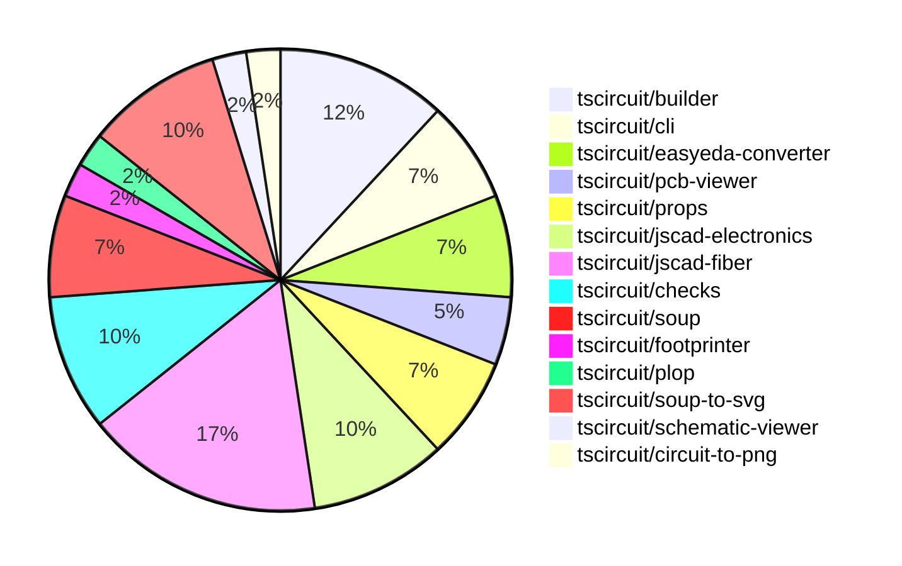

# Contribution Overview 2024-07-20

## PRs by Repository

## Contributor Overview

| Contributor | 🐳 Major | 🐙 Minor | 🐌 Tiny |
|-------------|-------|-------|-------|
| andrii-balitskyi | 3 | 2 | 0 |
| seveibar | 10 | 8 | 0 |
| imrishabh18 | 4 | 3 | 0 |
| DamilolaAlao | 0 | 1 | 0 |
| syedbarimanjan | 0 | 0 | 1 |
| Slaviiiii | 5 | 0 | 0 |
| r-bt | 2 | 0 | 1 |

## Changes by Repository

### [tscircuit/builder](https://github.com/tscircuit/builder)

| PR # | Impact | Contributor | Description |
|------|--------|-------------|-------------|
| [#82](https://github.com/tscircuit/builder/pull/82) | 🐳 Major | andrii-balitskyi | Set the `y` coordinate of `cad_component` to `180` when it's on the bottom layer |
| [#80](https://github.com/tscircuit/builder/pull/80) | 🐳 Major | seveibar | Handle PCB routes when finding the center of bounds and handle cases where there are no available points in the bounds. |
| [#79](https://github.com/tscircuit/builder/pull/79) | 🐳 Major | seveibar | Introduce support for `pcbX` and `pcbY` properties in the `<board />` component, deprecating the use of `center_x`, `center_y`, and `center`. |
| [#81](https://github.com/tscircuit/builder/pull/81) | 🐙 Minor | seveibar | Adds a new function `buildPcbTraceElements` to the `index.ts` file for exporting PCB trace elements for benchmarking. |
| [#78](https://github.com/tscircuit/builder/pull/78) | 🐙 Minor | seveibar | Add a development guide to the project |

### [tscircuit/cli](https://github.com/tscircuit/cli)

| PR # | Impact | Contributor | Description |
|------|--------|-------------|-------------|
| [#107](https://github.com/tscircuit/cli/pull/107) | 🟣 | andrii-balitskyi | Add biome and formatbot workflow |
| [#108](https://github.com/tscircuit/cli/pull/108) | 🐳 Major | andrii-balitskyi | Ensure that the .npmignore file is read when publishing packages, in addition to the .gitignore and .promptignore files. |
| [#111](https://github.com/tscircuit/cli/pull/111) | 🐙 Minor | DamilolaAlao | Add a new command "go" that opens the TSCircuit Getting Started tutorial in the user's default browser. |

### [tscircuit/easyeda-converter](https://github.com/tscircuit/easyeda-converter)

| PR # | Impact | Contributor | Description |
|------|--------|-------------|-------------|
| [#35](https://github.com/tscircuit/easyeda-converter/pull/35) | 🐳 Major | andrii-balitskyi | Ensure that the model object URL resolves when generating TypeScript components. |
| [#34](https://github.com/tscircuit/easyeda-converter/pull/34) | 🐙 Minor | andrii-balitskyi | Make the `SMT` and `jlcOnSale` properties optional in the `EasyEdaJsonSchema`. |
| [#33](https://github.com/tscircuit/easyeda-converter/pull/33) | 🐙 Minor | andrii-balitskyi | When specifying `-t tsx`, base the component filename on the manufacturer part number instead of the input file basename. |

### [tscircuit/pcb-viewer](https://github.com/tscircuit/pcb-viewer)

| PR # | Impact | Contributor | Description |
|------|--------|-------------|-------------|
| [#28](https://github.com/tscircuit/pcb-viewer/pull/28) | 🐳 Major | seveibar | Add npm build workflow and fix build error |
| [#26](https://github.com/tscircuit/pcb-viewer/pull/26) | 🐙 Minor | seveibar | Fix a deprecated builder import in the project. |

### [tscircuit/props](https://github.com/tscircuit/props)

| PR # | Impact | Contributor | Description |
|------|--------|-------------|-------------|
| [#10](https://github.com/tscircuit/props/pull/10) | 🐳 Major | seveibar | Add a GitHub Actions workflow to automatically format code in pull requests. |
| [#8](https://github.com/tscircuit/props/pull/8) | 🐙 Minor | seveibar | Make `pinLabels` and `schPortArrangement` optional in the component builder. |
| [#9](https://github.com/tscircuit/props/pull/9) | 🐙 Minor | imrishabh18 | Add a new optional property "manufacturerPartNumber" to the "bugProps" type. |

### [tscircuit/jscad-electronics](https://github.com/tscircuit/jscad-electronics)

| PR # | Impact | Contributor | Description |
|------|--------|-------------|-------------|
| [#7](https://github.com/tscircuit/jscad-electronics/pull/7) | 🐳 Major | seveibar | Adds footprint pads for sizing, and a 0603 resistor footprint with a 3D model. |
| [#10](https://github.com/tscircuit/jscad-electronics/pull/10) | 🐳 Major | Slaviiiii | Implement the 0402 component by creating a 3D model using Cuboid components. |
| [#9](https://github.com/tscircuit/jscad-electronics/pull/9) | 🐳 Major | Slaviiiii | Add a new 0805 component to the project |
| [#8](https://github.com/tscircuit/jscad-electronics/pull/8) | 🐳 Major | Slaviiiii | Adds support for 0603 resistor footprint and extruded pads |

### [tscircuit/jscad-fiber](https://github.com/tscircuit/jscad-fiber)

| PR # | Impact | Contributor | Description |
|------|--------|-------------|-------------|
| [#34](https://github.com/tscircuit/jscad-fiber/pull/34) | 🐳 Major | seveibar | Add support for `offset` and `color` props to the `<Cuboid>` component, enabling more flexible positioning and coloring of cuboids. |
| [#28](https://github.com/tscircuit/jscad-fiber/pull/28) | 🟣 | seveibar | Have format ignore `package.json`, fix status checks |
| [#37](https://github.com/tscircuit/jscad-fiber/pull/37) | 🐳 Major | Slaviiiii | Add a Rotate wrapper component to the library |
| [#29](https://github.com/tscircuit/jscad-fiber/pull/29) | 🐳 Major | Slaviiiii | Implement union and translate wrappers |
| [#26](https://github.com/tscircuit/jscad-fiber/pull/26) | 🐳 Major | r-bt | Introduces a new JSCadThreeMesh component that uses the useJSCADRenderer hook to render 3D objects created with the JSCAD library. |
| [#22](https://github.com/tscircuit/jscad-fiber/pull/22) | 🐳 Major | r-bt | Adds a `<custom>` component that supports rendering custom geometry, which is useful for testing and for geometry that cannot be made declaratively. |
| [#24](https://github.com/tscircuit/jscad-fiber/pull/24) | 🐌 Tiny | r-bt | Update the package version to 0.0.10 to publish the package on npm |

### [tscircuit/checks](https://github.com/tscircuit/checks)

| PR # | Impact | Contributor | Description |
|------|--------|-------------|-------------|
| [#5](https://github.com/tscircuit/checks/pull/5) | 🐳 Major | seveibar | Add a hack to allow missing `start_pcb_port_ids` and `end_pcb_port_ids` on PCB traces without breaking overlap testing when a trace only contains two ports. |
| [#4](https://github.com/tscircuit/checks/pull/4) | 🐳 Major | seveibar | Fix overlap test failing when port ids are not correctly added to trace, add regression test case |
| [#3](https://github.com/tscircuit/checks/pull/3) | 🐳 Major | seveibar | Implement nonoverlapping checks, add NetManager system for detecting connected traces, and add GitHub workflows for testing, formatting, building, and publishing the package. |
| [#6](https://github.com/tscircuit/checks/pull/6) | 🐳 Major | seveibar | The pull request fixes an issue with the `tracesOverlap` function by returning the intersection point instead of just a boolean value. |

### [tscircuit/soup](https://github.com/tscircuit/soup)

| PR # | Impact | Contributor | Description |
|------|--------|-------------|-------------|
| [#14](https://github.com/tscircuit/soup/pull/14) | 🐙 Minor | seveibar | Add "center" to pcb_trace_error schema and add biome.json file |
| [#13](https://github.com/tscircuit/soup/pull/13) | 🐙 Minor | imrishabh18 | Add manufacturer part number to source component base |
| [#12](https://github.com/tscircuit/soup/pull/12) | 🐌 Tiny | syedbarimanjan | Corrects the export declaration to match the file name. |

### [tscircuit/footprinter](https://github.com/tscircuit/footprinter)

| PR # | Impact | Contributor | Description |
|------|--------|-------------|-------------|
| [#12](https://github.com/tscircuit/footprinter/pull/12) | 🐙 Minor | seveibar | Update the build system to avoid the Vite lodash issue by changing the target to "esnext" and the module to "esnext". |

### [tscircuit/plop](https://github.com/tscircuit/plop)

| PR # | Impact | Contributor | Description |
|------|--------|-------------|-------------|
| [#2](https://github.com/tscircuit/plop/pull/2) | 🐙 Minor | seveibar | Fix looking for biome dependency inside of dependencies rather than devDependencies |

### [tscircuit/soup-to-svg](https://github.com/tscircuit/soup-to-svg)

| PR # | Impact | Contributor | Description |
|------|--------|-------------|-------------|
| [#6](https://github.com/tscircuit/soup-to-svg/pull/6) | 🐳 Major | imrishabh18 | Implemented PCB rendering functionality by adding a new `pcbSoupToSvg` function that takes a soup of PCB elements and generates an SVG representation. |
| [#5](https://github.com/tscircuit/soup-to-svg/pull/5) | 🐳 Major | imrishabh18 | Adds Storybook to the project |
| [#3](https://github.com/tscircuit/soup-to-svg/pull/3) | 🐳 Major | imrishabh18 | The pull request adds a new function `soupToSvg` to generate SVG from the soup data structure. |
| [#8](https://github.com/tscircuit/soup-to-svg/pull/8) | 🐙 Minor | seveibar | Rename the package from "@tscircuit/soup-to-svg" to "circuit-to-svg" and update the package description to "Convert Circuit JSON to SVG". |

### [tscircuit/schematic-viewer](https://github.com/tscircuit/schematic-viewer)

| PR # | Impact | Contributor | Description |
|------|--------|-------------|-------------|
| [#47](https://github.com/tscircuit/schematic-viewer/pull/47) | 🐳 Major | imrishabh18 | Introduce the "manufacturer part number" feature for the "simple bug" component in the tscircuit project. |

### [tscircuit/circuit-to-png](https://github.com/tscircuit/circuit-to-png)

| PR # | Impact | Contributor | Description |
|------|--------|-------------|-------------|
| [#2](https://github.com/tscircuit/circuit-to-png/pull/2) | 🐙 Minor | imrishabh18 | Initialized a new repository with a basic project structure and configuration files. |

## Changes by Contributor

### [andrii-balitskyi](https://github.com/andrii-balitskyi)

| PR # | Impact | Description |
|------|--------|-------------|
| [#82](https://github.com/tscircuit/builder/pull/82) | 🐳 Major | Set the `y` coordinate of `cad_component` to `180` when it's on the bottom layer |
| [#107](https://github.com/tscircuit/cli/pull/107) | 🟣 | Add biome and formatbot workflow |
| [#108](https://github.com/tscircuit/cli/pull/108) | 🐳 Major | Ensure that the .npmignore file is read when publishing packages, in addition to the .gitignore and .promptignore files. |
| [#35](https://github.com/tscircuit/easyeda-converter/pull/35) | 🐳 Major | Ensure that the model object URL resolves when generating TypeScript components. |
| [#34](https://github.com/tscircuit/easyeda-converter/pull/34) | 🐙 Minor | Make the `SMT` and `jlcOnSale` properties optional in the `EasyEdaJsonSchema`. |
| [#33](https://github.com/tscircuit/easyeda-converter/pull/33) | 🐙 Minor | When specifying `-t tsx`, base the component filename on the manufacturer part number instead of the input file basename. |

### [seveibar](https://github.com/seveibar)

| PR # | Impact | Description |
|------|--------|-------------|
| [#80](https://github.com/tscircuit/builder/pull/80) | 🐳 Major | Handle PCB routes when finding the center of bounds and handle cases where there are no available points in the bounds. |
| [#79](https://github.com/tscircuit/builder/pull/79) | 🐳 Major | Introduce support for `pcbX` and `pcbY` properties in the `<board />` component, deprecating the use of `center_x`, `center_y`, and `center`. |
| [#28](https://github.com/tscircuit/pcb-viewer/pull/28) | 🐳 Major | Add npm build workflow and fix build error |
| [#10](https://github.com/tscircuit/props/pull/10) | 🐳 Major | Add a GitHub Actions workflow to automatically format code in pull requests. |
| [#7](https://github.com/tscircuit/jscad-electronics/pull/7) | 🐳 Major | Adds footprint pads for sizing, and a 0603 resistor footprint with a 3D model. |
| [#34](https://github.com/tscircuit/jscad-fiber/pull/34) | 🐳 Major | Add support for `offset` and `color` props to the `<Cuboid>` component, enabling more flexible positioning and coloring of cuboids. |
| [#5](https://github.com/tscircuit/checks/pull/5) | 🐳 Major | Add a hack to allow missing `start_pcb_port_ids` and `end_pcb_port_ids` on PCB traces without breaking overlap testing when a trace only contains two ports. |
| [#4](https://github.com/tscircuit/checks/pull/4) | 🐳 Major | Fix overlap test failing when port ids are not correctly added to trace, add regression test case |
| [#3](https://github.com/tscircuit/checks/pull/3) | 🐳 Major | Implement nonoverlapping checks, add NetManager system for detecting connected traces, and add GitHub workflows for testing, formatting, building, and publishing the package. |
| [#81](https://github.com/tscircuit/builder/pull/81) | 🐙 Minor | Adds a new function `buildPcbTraceElements` to the `index.ts` file for exporting PCB trace elements for benchmarking. |
| [#78](https://github.com/tscircuit/builder/pull/78) | 🐙 Minor | Add a development guide to the project |
| [#26](https://github.com/tscircuit/pcb-viewer/pull/26) | 🐙 Minor | Fix a deprecated builder import in the project. |
| [#14](https://github.com/tscircuit/soup/pull/14) | 🐙 Minor | Add "center" to pcb_trace_error schema and add biome.json file |
| [#8](https://github.com/tscircuit/props/pull/8) | 🐙 Minor | Make `pinLabels` and `schPortArrangement` optional in the component builder. |
| [#12](https://github.com/tscircuit/footprinter/pull/12) | 🐙 Minor | Update the build system to avoid the Vite lodash issue by changing the target to "esnext" and the module to "esnext". |
| [#28](https://github.com/tscircuit/jscad-fiber/pull/28) | 🟣 | Have format ignore `package.json`, fix status checks |
| [#6](https://github.com/tscircuit/checks/pull/6) | 🐳 Major | The pull request fixes an issue with the `tracesOverlap` function by returning the intersection point instead of just a boolean value. |
| [#2](https://github.com/tscircuit/plop/pull/2) | 🐙 Minor | Fix looking for biome dependency inside of dependencies rather than devDependencies |
| [#8](https://github.com/tscircuit/soup-to-svg/pull/8) | 🐙 Minor | Rename the package from "@tscircuit/soup-to-svg" to "circuit-to-svg" and update the package description to "Convert Circuit JSON to SVG". |

### [imrishabh18](https://github.com/imrishabh18)

| PR # | Impact | Description |
|------|--------|-------------|
| [#47](https://github.com/tscircuit/schematic-viewer/pull/47) | 🐳 Major | Introduce the "manufacturer part number" feature for the "simple bug" component in the tscircuit project. |
| [#6](https://github.com/tscircuit/soup-to-svg/pull/6) | 🐳 Major | Implemented PCB rendering functionality by adding a new `pcbSoupToSvg` function that takes a soup of PCB elements and generates an SVG representation. |
| [#5](https://github.com/tscircuit/soup-to-svg/pull/5) | 🐳 Major | Adds Storybook to the project |
| [#3](https://github.com/tscircuit/soup-to-svg/pull/3) | 🐳 Major | The pull request adds a new function `soupToSvg` to generate SVG from the soup data structure. |
| [#13](https://github.com/tscircuit/soup/pull/13) | 🐙 Minor | Add manufacturer part number to source component base |
| [#9](https://github.com/tscircuit/props/pull/9) | 🐙 Minor | Add a new optional property "manufacturerPartNumber" to the "bugProps" type. |
| [#2](https://github.com/tscircuit/circuit-to-png/pull/2) | 🐙 Minor | Initialized a new repository with a basic project structure and configuration files. |

### [DamilolaAlao](https://github.com/DamilolaAlao)

| PR # | Impact | Description |
|------|--------|-------------|
| [#111](https://github.com/tscircuit/cli/pull/111) | 🐙 Minor | Add a new command "go" that opens the TSCircuit Getting Started tutorial in the user's default browser. |

### [syedbarimanjan](https://github.com/syedbarimanjan)

| PR # | Impact | Description |
|------|--------|-------------|
| [#12](https://github.com/tscircuit/soup/pull/12) | 🐌 Tiny | Corrects the export declaration to match the file name. |

### [Slaviiiii](https://github.com/Slaviiiii)

| PR # | Impact | Description |
|------|--------|-------------|
| [#10](https://github.com/tscircuit/jscad-electronics/pull/10) | 🐳 Major | Implement the 0402 component by creating a 3D model using Cuboid components. |
| [#9](https://github.com/tscircuit/jscad-electronics/pull/9) | 🐳 Major | Add a new 0805 component to the project |
| [#8](https://github.com/tscircuit/jscad-electronics/pull/8) | 🐳 Major | Adds support for 0603 resistor footprint and extruded pads |
| [#37](https://github.com/tscircuit/jscad-fiber/pull/37) | 🐳 Major | Add a Rotate wrapper component to the library |
| [#29](https://github.com/tscircuit/jscad-fiber/pull/29) | 🐳 Major | Implement union and translate wrappers |

### [r-bt](https://github.com/r-bt)

| PR # | Impact | Description |
|------|--------|-------------|
| [#26](https://github.com/tscircuit/jscad-fiber/pull/26) | 🐳 Major | Introduces a new JSCadThreeMesh component that uses the useJSCADRenderer hook to render 3D objects created with the JSCAD library. |
| [#22](https://github.com/tscircuit/jscad-fiber/pull/22) | 🐳 Major | Adds a `<custom>` component that supports rendering custom geometry, which is useful for testing and for geometry that cannot be made declaratively. |
| [#24](https://github.com/tscircuit/jscad-fiber/pull/24) | 🐌 Tiny | Update the package version to 0.0.10 to publish the package on npm |

