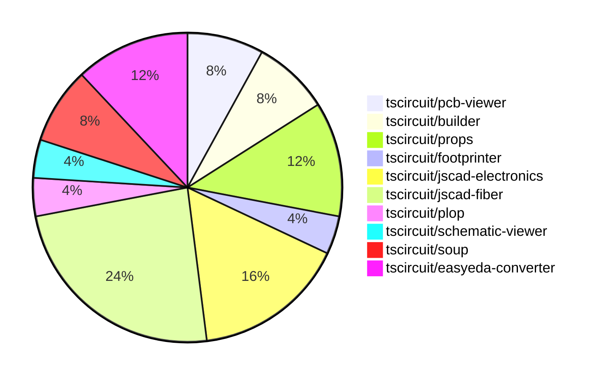

# Contribution Overview 2024-07-20

## PRs by Repository

## Contributor Overview

| Contributor | 🐳 Major | 🐙 Minor | 🐌 Tiny |
|-------------|-------|-------|-------|
| seveibar | 3 | 7 | 0 |
| imrishabh18 | 1 | 2 | 0 |
| syedbarimanjan | 0 | 0 | 1 |
| andrii-balitskyi | 2 | 1 | 0 |
| Slaviiiii | 4 | 0 | 0 |
| r-bt | 2 | 0 | 1 |

## Changes by Repository

### [tscircuit/pcb-viewer](https://github.com/tscircuit/pcb-viewer)

| PR # | Impact | Contributor | Description |
|------|--------|-------------|-------------|
| [#28](https://github.com/tscircuit/pcb-viewer/pull/28) | 🐳 Major | seveibar | Add npm build workflow and fix build error |
| [#26](https://github.com/tscircuit/pcb-viewer/pull/26) | 🐳 Major | seveibar | Updates the deprecated builder import to the new soup package |

### [tscircuit/builder](https://github.com/tscircuit/builder)

| PR # | Impact | Contributor | Description |
|------|--------|-------------|-------------|
| [#79](https://github.com/tscircuit/builder/pull/79) | 🐙 Minor | seveibar | Introduce support for the legacy `center_x`, `center_y`, and `center` properties in the `<board />` component, and add support for the `pcbX` and `pcbY` properties as an alternative. |
| [#78](https://github.com/tscircuit/builder/pull/78) | 🐙 Minor | seveibar | Create a DEVELOPMENT.md file to provide development guidelines for the `@tscircuit/builder` library. |

### [tscircuit/props](https://github.com/tscircuit/props)

| PR # | Impact | Contributor | Description |
|------|--------|-------------|-------------|
| [#10](https://github.com/tscircuit/props/pull/10) | 🐙 Minor | seveibar | Add a GitHub Actions workflow to automatically format code in pull requests |
| [#8](https://github.com/tscircuit/props/pull/8) | 🐙 Minor | seveibar | Make `pinLabels` and `schPortArrangement` optional in the `bugProps` type. |
| [#9](https://github.com/tscircuit/props/pull/9) | 🐙 Minor | imrishabh18 | Add manufacturer part number to the `bugProps` component in the library. |

### [tscircuit/footprinter](https://github.com/tscircuit/footprinter)

| PR # | Impact | Contributor | Description |
|------|--------|-------------|-------------|
| [#12](https://github.com/tscircuit/footprinter/pull/12) | 🐙 Minor | seveibar | Update the build system to target the `esnext` version of ECMAScript instead of `es2022` to avoid issues with the `lodash` dependency used by `vite`. |

### [tscircuit/jscad-electronics](https://github.com/tscircuit/jscad-electronics)

| PR # | Impact | Contributor | Description |
|------|--------|-------------|-------------|
| [#7](https://github.com/tscircuit/jscad-electronics/pull/7) | 🟣 | seveibar | Add footprint pads for sizing, add 0603 resistor footprint, and 3D model. |
| [#10](https://github.com/tscircuit/jscad-electronics/pull/10) | 🐳 Major | Slaviiiii | Implement the 0402 component with accurate dimensions and separate body and terminator parts. |
| [#9](https://github.com/tscircuit/jscad-electronics/pull/9) | 🐳 Major | Slaviiiii | Adds a new 0805 component to the project. |
| [#8](https://github.com/tscircuit/jscad-electronics/pull/8) | 🐳 Major | Slaviiiii | Adds support for A0603 component and extruded pads in the project |

### [tscircuit/jscad-fiber](https://github.com/tscircuit/jscad-fiber)

| PR # | Impact | Contributor | Description |
|------|--------|-------------|-------------|
| [#34](https://github.com/tscircuit/jscad-fiber/pull/34) | 🐳 Major | seveibar | Adds support for `offset` and `color` props to the `Cuboid` component, enabling `<Cuboid offset={{...}} color="blue" />` usage. |
| [#29](https://github.com/tscircuit/jscad-fiber/pull/29) | 🐳 Major | Slaviiiii | Implement union and translate wrappers |
| [#26](https://github.com/tscircuit/jscad-fiber/pull/26) | 🐳 Major | r-bt | Add a new `JSCadThreeMesh` component that uses the `useJSCADRenderer` hook to render JSCAD geometry with Three.js. |
| [#22](https://github.com/tscircuit/jscad-fiber/pull/22) | 🐳 Major | r-bt | Adds a `<custom>` component that supports rendering custom geometry, which is useful for testing and for cases where the geometry can't be made declaratively. |
| [#28](https://github.com/tscircuit/jscad-fiber/pull/28) | 🐙 Minor | seveibar | Have format ignore package.json, fix status checks |
| [#24](https://github.com/tscircuit/jscad-fiber/pull/24) | 🐌 Tiny | r-bt | Update the version of the package in package.json to publish a new version on npm |

### [tscircuit/plop](https://github.com/tscircuit/plop)

| PR # | Impact | Contributor | Description |
|------|--------|-------------|-------------|
| [#2](https://github.com/tscircuit/plop/pull/2) | 🐙 Minor | seveibar | Fix looking for biome dependency inside of dependencies rather than devDependencies |

### [tscircuit/schematic-viewer](https://github.com/tscircuit/schematic-viewer)

| PR # | Impact | Contributor | Description |
|------|--------|-------------|-------------|
| [#47](https://github.com/tscircuit/schematic-viewer/pull/47) | 🐳 Major | imrishabh18 | Adds support for displaying the manufacturer part number of a simple bug component in the schematic view. |

### [tscircuit/soup](https://github.com/tscircuit/soup)

| PR # | Impact | Contributor | Description |
|------|--------|-------------|-------------|
| [#13](https://github.com/tscircuit/soup/pull/13) | 🐙 Minor | imrishabh18 | Add manufacturer part number to source component base |
| [#12](https://github.com/tscircuit/soup/pull/12) | 🐌 Tiny | syedbarimanjan | Rename the exported module from "cad_component_model" to "cad_component" to match the file name. |

### [tscircuit/easyeda-converter](https://github.com/tscircuit/easyeda-converter)

| PR # | Impact | Contributor | Description |
|------|--------|-------------|-------------|
| [#35](https://github.com/tscircuit/easyeda-converter/pull/35) | 🐳 Major | andrii-balitskyi | This pull request fixes a bug where the model object URL may not resolve when generating TypeScript components. |
| [#33](https://github.com/tscircuit/easyeda-converter/pull/33) | 🐳 Major | andrii-balitskyi | When specifying `-t tsx`, base component filename on manufacturer part number |
| [#34](https://github.com/tscircuit/easyeda-converter/pull/34) | 🐙 Minor | andrii-balitskyi | Make `SMT` and `jlcOnSale` properties optional in the `EasyEdaJsonSchema`. |

## Changes by Contributor

### [seveibar](https://github.com/seveibar)

| PR # | Impact | Description |
|------|--------|-------------|
| [#28](https://github.com/tscircuit/pcb-viewer/pull/28) | 🐳 Major | Add npm build workflow and fix build error |
| [#26](https://github.com/tscircuit/pcb-viewer/pull/26) | 🐳 Major | Updates the deprecated builder import to the new soup package |
| [#79](https://github.com/tscircuit/builder/pull/79) | 🐙 Minor | Introduce support for the legacy `center_x`, `center_y`, and `center` properties in the `<board />` component, and add support for the `pcbX` and `pcbY` properties as an alternative. |
| [#78](https://github.com/tscircuit/builder/pull/78) | 🐙 Minor | Create a DEVELOPMENT.md file to provide development guidelines for the `@tscircuit/builder` library. |
| [#10](https://github.com/tscircuit/props/pull/10) | 🐙 Minor | Add a GitHub Actions workflow to automatically format code in pull requests |
| [#8](https://github.com/tscircuit/props/pull/8) | 🐙 Minor | Make `pinLabels` and `schPortArrangement` optional in the `bugProps` type. |
| [#12](https://github.com/tscircuit/footprinter/pull/12) | 🐙 Minor | Update the build system to target the `esnext` version of ECMAScript instead of `es2022` to avoid issues with the `lodash` dependency used by `vite`. |
| [#7](https://github.com/tscircuit/jscad-electronics/pull/7) | 🟣 | Add footprint pads for sizing, add 0603 resistor footprint, and 3D model. |
| [#34](https://github.com/tscircuit/jscad-fiber/pull/34) | 🐳 Major | Adds support for `offset` and `color` props to the `Cuboid` component, enabling `<Cuboid offset={{...}} color="blue" />` usage. |
| [#28](https://github.com/tscircuit/jscad-fiber/pull/28) | 🐙 Minor | Have format ignore package.json, fix status checks |
| [#2](https://github.com/tscircuit/plop/pull/2) | 🐙 Minor | Fix looking for biome dependency inside of dependencies rather than devDependencies |

### [imrishabh18](https://github.com/imrishabh18)

| PR # | Impact | Description |
|------|--------|-------------|
| [#47](https://github.com/tscircuit/schematic-viewer/pull/47) | 🐳 Major | Adds support for displaying the manufacturer part number of a simple bug component in the schematic view. |
| [#13](https://github.com/tscircuit/soup/pull/13) | 🐙 Minor | Add manufacturer part number to source component base |
| [#9](https://github.com/tscircuit/props/pull/9) | 🐙 Minor | Add manufacturer part number to the `bugProps` component in the library. |

### [syedbarimanjan](https://github.com/syedbarimanjan)

| PR # | Impact | Description |
|------|--------|-------------|
| [#12](https://github.com/tscircuit/soup/pull/12) | 🐌 Tiny | Rename the exported module from "cad_component_model" to "cad_component" to match the file name. |

### [andrii-balitskyi](https://github.com/andrii-balitskyi)

| PR # | Impact | Description |
|------|--------|-------------|
| [#35](https://github.com/tscircuit/easyeda-converter/pull/35) | 🐳 Major | This pull request fixes a bug where the model object URL may not resolve when generating TypeScript components. |
| [#33](https://github.com/tscircuit/easyeda-converter/pull/33) | 🐳 Major | When specifying `-t tsx`, base component filename on manufacturer part number |
| [#34](https://github.com/tscircuit/easyeda-converter/pull/34) | 🐙 Minor | Make `SMT` and `jlcOnSale` properties optional in the `EasyEdaJsonSchema`. |

### [Slaviiiii](https://github.com/Slaviiiii)

| PR # | Impact | Description |
|------|--------|-------------|
| [#10](https://github.com/tscircuit/jscad-electronics/pull/10) | 🐳 Major | Implement the 0402 component with accurate dimensions and separate body and terminator parts. |
| [#9](https://github.com/tscircuit/jscad-electronics/pull/9) | 🐳 Major | Adds a new 0805 component to the project. |
| [#8](https://github.com/tscircuit/jscad-electronics/pull/8) | 🐳 Major | Adds support for A0603 component and extruded pads in the project |
| [#29](https://github.com/tscircuit/jscad-fiber/pull/29) | 🐳 Major | Implement union and translate wrappers |

### [r-bt](https://github.com/r-bt)

| PR # | Impact | Description |
|------|--------|-------------|
| [#26](https://github.com/tscircuit/jscad-fiber/pull/26) | 🐳 Major | Add a new `JSCadThreeMesh` component that uses the `useJSCADRenderer` hook to render JSCAD geometry with Three.js. |
| [#22](https://github.com/tscircuit/jscad-fiber/pull/22) | 🐳 Major | Adds a `<custom>` component that supports rendering custom geometry, which is useful for testing and for cases where the geometry can't be made declaratively. |
| [#24](https://github.com/tscircuit/jscad-fiber/pull/24) | 🐌 Tiny | Update the version of the package in package.json to publish a new version on npm |

