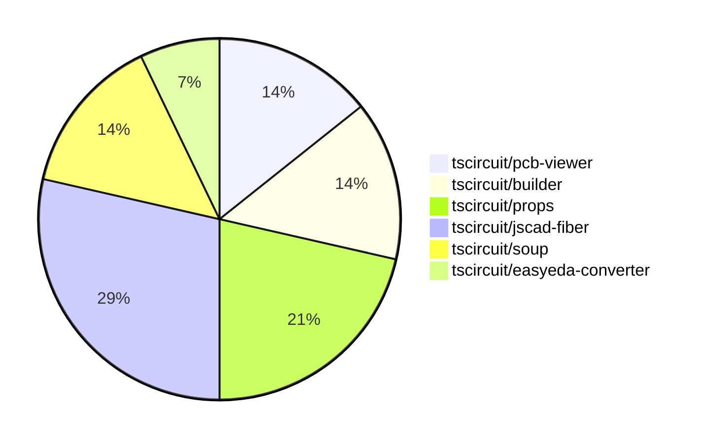

# Contribution Overview 2024-07-20

## PRs by Repository

## Contributor Overview

| Contributor | 🐳 Major | 🐙 Minor | 🐌 Tiny |
|-------------|-------|-------|-------|
| seveibar | 1 | 6 | 0 |
| imrishabh18 | 0 | 2 | 0 |
| syedbarimanjan | 0 | 0 | 1 |
| andrii-balitskyi | 1 | 0 | 0 |
| r-bt | 2 | 0 | 1 |

## Changes by Repository

### [tscircuit/pcb-viewer](https://github.com/tscircuit/pcb-viewer)

| PR # | Impact | Contributor | Description |
|------|--------|-------------|-------------|
| [#28](https://github.com/tscircuit/pcb-viewer/pull/28) | 🐳 Major | seveibar | Add npm build workflow and fix build error |
| [#26](https://github.com/tscircuit/pcb-viewer/pull/26) | 🐙 Minor | seveibar | Fixes the deprecated import of `@tscircuit/builder` by replacing it with `@tscircuit/soup`. |

### [tscircuit/builder](https://github.com/tscircuit/builder)

| PR # | Impact | Contributor | Description |
|------|--------|-------------|-------------|
| [#79](https://github.com/tscircuit/builder/pull/79) | 🐙 Minor | seveibar | Allow the `<board />` component to accept `pcbX` and `pcbY` properties in addition to the existing `center_x` and `center_y` properties. |
| [#78](https://github.com/tscircuit/builder/pull/78) | 🐙 Minor | seveibar | Create a DEVELOPMENT.md file that provides a guide for working on the `@tscircuit/builder` library, including information on the test suite and development workflow. |

### [tscircuit/props](https://github.com/tscircuit/props)

| PR # | Impact | Contributor | Description |
|------|--------|-------------|-------------|
| [#10](https://github.com/tscircuit/props/pull/10) | 🐙 Minor | seveibar | Add a GitHub Actions workflow to automatically format code in pull requests. |
| [#8](https://github.com/tscircuit/props/pull/8) | 🐙 Minor | seveibar | Make the `pinLabels` and `schPortArrangement` properties optional in the `bugProps` type. |
| [#9](https://github.com/tscircuit/props/pull/9) | 🐙 Minor | imrishabh18 | Add manufacturer part number to component props |

### [tscircuit/jscad-fiber](https://github.com/tscircuit/jscad-fiber)

| PR # | Impact | Contributor | Description |
|------|--------|-------------|-------------|
| [#26](https://github.com/tscircuit/jscad-fiber/pull/26) | 🐳 Major | r-bt | Add a new `JSCadThreeMesh` component that uses the `useJSCADRenderer` hook to render JSCAD geometries with Three.js. |
| [#22](https://github.com/tscircuit/jscad-fiber/pull/22) | 🐳 Major | r-bt | Adds support for rendering custom geometry using the `<custom>` component. |
| [#28](https://github.com/tscircuit/jscad-fiber/pull/28) | 🐙 Minor | seveibar | Have format ignore package.json, fix status checks |
| [#24](https://github.com/tscircuit/jscad-fiber/pull/24) | 🐌 Tiny | r-bt | Bump version to publish on npm |

### [tscircuit/soup](https://github.com/tscircuit/soup)

| PR # | Impact | Contributor | Description |
|------|--------|-------------|-------------|
| [#13](https://github.com/tscircuit/soup/pull/13) | 🐙 Minor | imrishabh18 | Add manufacturer part number to source component base. |
| [#12](https://github.com/tscircuit/soup/pull/12) | 🐌 Tiny | syedbarimanjan | Matches the export declaration to the file name |

### [tscircuit/easyeda-converter](https://github.com/tscircuit/easyeda-converter)

| PR # | Impact | Contributor | Description |
|------|--------|-------------|-------------|
| [#33](https://github.com/tscircuit/easyeda-converter/pull/33) | 🐳 Major | andrii-balitskyi | When specifying `-t tsx`, the base component filename is now based on the manufacturer part number instead of the input file name. |

## Changes by Contributor

### [seveibar](https://github.com/seveibar)

| PR # | Impact | Description |
|------|--------|-------------|
| [#28](https://github.com/tscircuit/pcb-viewer/pull/28) | 🐳 Major | Add npm build workflow and fix build error |
| [#79](https://github.com/tscircuit/builder/pull/79) | 🐙 Minor | Allow the `<board />` component to accept `pcbX` and `pcbY` properties in addition to the existing `center_x` and `center_y` properties. |
| [#78](https://github.com/tscircuit/builder/pull/78) | 🐙 Minor | Create a DEVELOPMENT.md file that provides a guide for working on the `@tscircuit/builder` library, including information on the test suite and development workflow. |
| [#26](https://github.com/tscircuit/pcb-viewer/pull/26) | 🐙 Minor | Fixes the deprecated import of `@tscircuit/builder` by replacing it with `@tscircuit/soup`. |
| [#10](https://github.com/tscircuit/props/pull/10) | 🐙 Minor | Add a GitHub Actions workflow to automatically format code in pull requests. |
| [#8](https://github.com/tscircuit/props/pull/8) | 🐙 Minor | Make the `pinLabels` and `schPortArrangement` properties optional in the `bugProps` type. |
| [#28](https://github.com/tscircuit/jscad-fiber/pull/28) | 🐙 Minor | Have format ignore package.json, fix status checks |

### [imrishabh18](https://github.com/imrishabh18)

| PR # | Impact | Description |
|------|--------|-------------|
| [#13](https://github.com/tscircuit/soup/pull/13) | 🐙 Minor | Add manufacturer part number to source component base. |
| [#9](https://github.com/tscircuit/props/pull/9) | 🐙 Minor | Add manufacturer part number to component props |

### [syedbarimanjan](https://github.com/syedbarimanjan)

| PR # | Impact | Description |
|------|--------|-------------|
| [#12](https://github.com/tscircuit/soup/pull/12) | 🐌 Tiny | Matches the export declaration to the file name |

### [andrii-balitskyi](https://github.com/andrii-balitskyi)

| PR # | Impact | Description |
|------|--------|-------------|
| [#33](https://github.com/tscircuit/easyeda-converter/pull/33) | 🐳 Major | When specifying `-t tsx`, the base component filename is now based on the manufacturer part number instead of the input file name. |

### [r-bt](https://github.com/r-bt)

| PR # | Impact | Description |
|------|--------|-------------|
| [#26](https://github.com/tscircuit/jscad-fiber/pull/26) | 🐳 Major | Add a new `JSCadThreeMesh` component that uses the `useJSCADRenderer` hook to render JSCAD geometries with Three.js. |
| [#22](https://github.com/tscircuit/jscad-fiber/pull/22) | 🐳 Major | Adds support for rendering custom geometry using the `<custom>` component. |
| [#24](https://github.com/tscircuit/jscad-fiber/pull/24) | 🐌 Tiny | Bump version to publish on npm |

