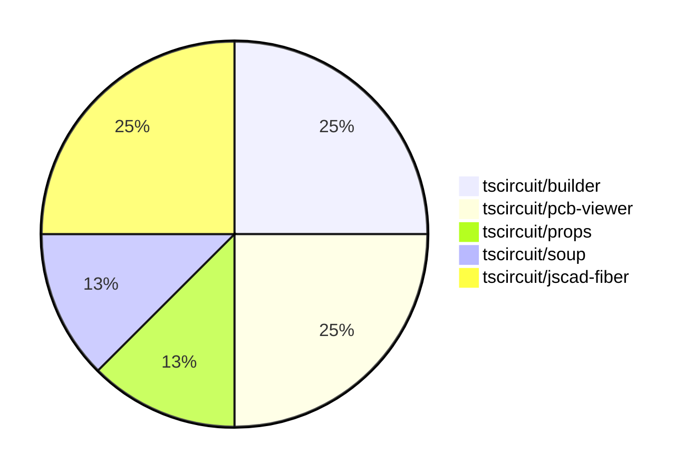

# Contribution Overview 2024-07-20

## PRs by Repository

## Contributor Overview

| Contributor | 🐳 Major | 🐙 Minor | 🐌 Tiny |
|-------------|-------|-------|-------|
| seveibar | 3 | 2 | 0 |
| syedbarimanjan | 0 | 0 | 1 |
| r-bt | 1 | 0 | 1 |

## Changes by Repository

### [tscircuit/builder](https://github.com/tscircuit/builder)

| PR # | Impact | Contributor | Description |
|------|--------|-------------|-------------|
| [#79](https://github.com/tscircuit/builder/pull/79) | 🐳 Major | seveibar | The pull request adds support for `pcbX` and `pcbY` properties in the `<board />` component, which are used to set the center of the board. |
| [#78](https://github.com/tscircuit/builder/pull/78) | 🐳 Major | seveibar | Create a DEVELOPMENT.md file providing guidance on how to develop and test the `@tscircuit/builder` library. |

### [tscircuit/pcb-viewer](https://github.com/tscircuit/pcb-viewer)

| PR # | Impact | Contributor | Description |
|------|--------|-------------|-------------|
| [#28](https://github.com/tscircuit/pcb-viewer/pull/28) | 🐳 Major | seveibar | Add npm build workflow and fix build error |
| [#26](https://github.com/tscircuit/pcb-viewer/pull/26) | 🐙 Minor | seveibar | Fix a deprecated builder import by updating to the latest version of the `@tscircuit/soup` package. |

### [tscircuit/props](https://github.com/tscircuit/props)

| PR # | Impact | Contributor | Description |
|------|--------|-------------|-------------|
| [#8](https://github.com/tscircuit/props/pull/8) | 🐙 Minor | seveibar | Make `pinLabels` and `schPortArrangement` optional in the `bugProps` type |

### [tscircuit/soup](https://github.com/tscircuit/soup)

| PR # | Impact | Contributor | Description |
|------|--------|-------------|-------------|
| [#12](https://github.com/tscircuit/soup/pull/12) | 🐌 Tiny | syedbarimanjan | Match export declaration to file name in "cad" module |

### [tscircuit/jscad-fiber](https://github.com/tscircuit/jscad-fiber)

| PR # | Impact | Contributor | Description |
|------|--------|-------------|-------------|
| [#22](https://github.com/tscircuit/jscad-fiber/pull/22) | 🐳 Major | r-bt | Adds support for rendering custom geometry using the `<custom>` component. |
| [#24](https://github.com/tscircuit/jscad-fiber/pull/24) | 🐌 Tiny | r-bt | Bump the package version to 0.0.10 for publishing on npm |

## Changes by Contributor

### [seveibar](https://github.com/seveibar)

| PR # | Impact | Description |
|------|--------|-------------|
| [#79](https://github.com/tscircuit/builder/pull/79) | 🐳 Major | The pull request adds support for `pcbX` and `pcbY` properties in the `<board />` component, which are used to set the center of the board. |
| [#78](https://github.com/tscircuit/builder/pull/78) | 🐳 Major | Create a DEVELOPMENT.md file providing guidance on how to develop and test the `@tscircuit/builder` library. |
| [#28](https://github.com/tscircuit/pcb-viewer/pull/28) | 🐳 Major | Add npm build workflow and fix build error |
| [#26](https://github.com/tscircuit/pcb-viewer/pull/26) | 🐙 Minor | Fix a deprecated builder import by updating to the latest version of the `@tscircuit/soup` package. |
| [#8](https://github.com/tscircuit/props/pull/8) | 🐙 Minor | Make `pinLabels` and `schPortArrangement` optional in the `bugProps` type |

### [syedbarimanjan](https://github.com/syedbarimanjan)

| PR # | Impact | Description |
|------|--------|-------------|
| [#12](https://github.com/tscircuit/soup/pull/12) | 🐌 Tiny | Match export declaration to file name in "cad" module |

### [r-bt](https://github.com/r-bt)

| PR # | Impact | Description |
|------|--------|-------------|
| [#22](https://github.com/tscircuit/jscad-fiber/pull/22) | 🐳 Major | Adds support for rendering custom geometry using the `<custom>` component. |
| [#24](https://github.com/tscircuit/jscad-fiber/pull/24) | 🐌 Tiny | Bump the package version to 0.0.10 for publishing on npm |

