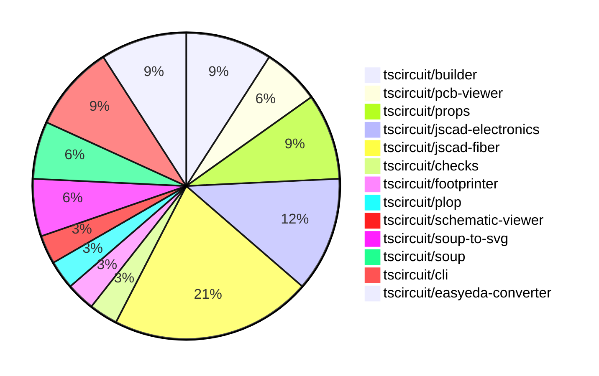

# Contribution Overview 2024-07-20

## PRs by Repository

## Contributor Overview

| Contributor | 🐳 Major | 🐙 Minor | 🐌 Tiny |
|-------------|-------|-------|-------|
| seveibar | 6 | 7 | 0 |
| imrishabh18 | 3 | 2 | 0 |
| DamilolaAlao | 0 | 1 | 0 |
| andrii-balitskyi | 2 | 2 | 0 |
| syedbarimanjan | 0 | 0 | 1 |
| Slaviiiii | 5 | 0 | 0 |
| r-bt | 2 | 0 | 1 |

## Changes by Repository

### [tscircuit/builder](https://github.com/tscircuit/builder)

| PR # | Impact | Contributor | Description |
|------|--------|-------------|-------------|
| [#80](https://github.com/tscircuit/builder/pull/80) | 🐳 Major | seveibar | Handles PCB routes when finding the center of bounds, and returns zero dimensions when there are no available points in the bounds. |
| [#79](https://github.com/tscircuit/builder/pull/79) | 🐙 Minor | seveibar | Accept `pcbX` and `pcbY` for the `<board />` component in addition to the existing `center_x` and `center_y` properties. |
| [#78](https://github.com/tscircuit/builder/pull/78) | 🐙 Minor | seveibar | Create a DEVELOPMENT.md file that provides a guide for developers on how to develop and test the `@tscircuit/builder` library. |

### [tscircuit/pcb-viewer](https://github.com/tscircuit/pcb-viewer)

| PR # | Impact | Contributor | Description |
|------|--------|-------------|-------------|
| [#28](https://github.com/tscircuit/pcb-viewer/pull/28) | 🐳 Major | seveibar | Add npm build workflow and fix build error |
| [#26](https://github.com/tscircuit/pcb-viewer/pull/26) | 🐙 Minor | seveibar | Fix deprecated builder import |

### [tscircuit/props](https://github.com/tscircuit/props)

| PR # | Impact | Contributor | Description |
|------|--------|-------------|-------------|
| [#10](https://github.com/tscircuit/props/pull/10) | 🐳 Major | seveibar | Add a GitHub Actions workflow to automatically format code in pull requests. |
| [#8](https://github.com/tscircuit/props/pull/8) | 🐙 Minor | seveibar | Make `pinLabels` and `schPortArrangement` optional in the `bugProps` interface. |
| [#9](https://github.com/tscircuit/props/pull/9) | 🐙 Minor | imrishabh18 | Add `manufacturerPartNumber` to the `bugProps` type in the `lib/index.ts` file. |

### [tscircuit/jscad-electronics](https://github.com/tscircuit/jscad-electronics)

| PR # | Impact | Contributor | Description |
|------|--------|-------------|-------------|
| [#7](https://github.com/tscircuit/jscad-electronics/pull/7) | 🐳 Major | seveibar | Add footprint pads for sizing and a 0603 resistor footprint with a 3D model |
| [#10](https://github.com/tscircuit/jscad-electronics/pull/10) | 🐳 Major | Slaviiiii | Implement the 0402 component by adding a body and two terminator cuboids. |
| [#9](https://github.com/tscircuit/jscad-electronics/pull/9) | 🐳 Major | Slaviiiii | Add a new 0805 component to the library. |
| [#8](https://github.com/tscircuit/jscad-electronics/pull/8) | 🐳 Major | Slaviiiii | Add new 0603 component and extruded pads |

### [tscircuit/jscad-fiber](https://github.com/tscircuit/jscad-fiber)

| PR # | Impact | Contributor | Description |
|------|--------|-------------|-------------|
| [#34](https://github.com/tscircuit/jscad-fiber/pull/34) | 🐳 Major | seveibar | Adds support for color and offset properties to the `Cuboid` component, enabling `<Cuboid offset={{...}} color="blue" />`. |
| [#37](https://github.com/tscircuit/jscad-fiber/pull/37) | 🐳 Major | Slaviiiii | Adds a new Rotate component to the project that allows rotating a JSCAD primitive by a given set of angles. |
| [#29](https://github.com/tscircuit/jscad-fiber/pull/29) | 🐳 Major | Slaviiiii | Implement union and translate wrappers |
| [#26](https://github.com/tscircuit/jscad-fiber/pull/26) | 🐳 Major | r-bt | Add a new `JSCadThreeMesh` component that uses the `useJSCADRenderer` hook to render JSCAD geometry with Three.js. |
| [#22](https://github.com/tscircuit/jscad-fiber/pull/22) | 🐳 Major | r-bt | Adds a new `<custom>` component that supports rendering custom geometry, which is useful for testing and cases where the geometry cannot be easily created declaratively. |
| [#28](https://github.com/tscircuit/jscad-fiber/pull/28) | 🐙 Minor | seveibar | Have format ignore package.json, fix status checks |
| [#24](https://github.com/tscircuit/jscad-fiber/pull/24) | 🐌 Tiny | r-bt | Bump the version of the package to 0.0.10 to publish on npm. |

### [tscircuit/checks](https://github.com/tscircuit/checks)

| PR # | Impact | Contributor | Description |
|------|--------|-------------|-------------|
| [#3](https://github.com/tscircuit/checks/pull/3) | 🐳 Major | seveibar | Implement nonoverlapping checks, add NetManager system for detecting connected traces, and add workflows |

### [tscircuit/footprinter](https://github.com/tscircuit/footprinter)

| PR # | Impact | Contributor | Description |
|------|--------|-------------|-------------|
| [#12](https://github.com/tscircuit/footprinter/pull/12) | 🐙 Minor | seveibar | Update the build system to avoid the Vite lodash issue by changing the TypeScript target and module settings. |

### [tscircuit/plop](https://github.com/tscircuit/plop)

| PR # | Impact | Contributor | Description |
|------|--------|-------------|-------------|
| [#2](https://github.com/tscircuit/plop/pull/2) | 🐙 Minor | seveibar | Fix looking for biome dependency inside of dependencies rather than devDependencies |

### [tscircuit/schematic-viewer](https://github.com/tscircuit/schematic-viewer)

| PR # | Impact | Contributor | Description |
|------|--------|-------------|-------------|
| [#47](https://github.com/tscircuit/schematic-viewer/pull/47) | 🐳 Major | imrishabh18 | Add manufacturer part number to source component and display it on the schematic |

### [tscircuit/soup-to-svg](https://github.com/tscircuit/soup-to-svg)

| PR # | Impact | Contributor | Description |
|------|--------|-------------|-------------|
| [#5](https://github.com/tscircuit/soup-to-svg/pull/5) | 🐳 Major | imrishabh18 | Storybook added to the project. |
| [#3](https://github.com/tscircuit/soup-to-svg/pull/3) | 🐳 Major | imrishabh18 | Adds a new script to generate SVG output from the `soup` data structure. |

### [tscircuit/soup](https://github.com/tscircuit/soup)

| PR # | Impact | Contributor | Description |
|------|--------|-------------|-------------|
| [#13](https://github.com/tscircuit/soup/pull/13) | 🐙 Minor | imrishabh18 | Add manufacturer part number to source component base |
| [#12](https://github.com/tscircuit/soup/pull/12) | 🐌 Tiny | syedbarimanjan | Corrects export declaration in `index.ts` to match file name. |

### [tscircuit/cli](https://github.com/tscircuit/cli)

| PR # | Impact | Contributor | Description |
|------|--------|-------------|-------------|
| [#111](https://github.com/tscircuit/cli/pull/111) | 🐙 Minor | DamilolaAlao | Add a new "go" command to open the TSCircuit Getting Started tutorial in the user's browser. |
| [#107](https://github.com/tscircuit/cli/pull/107) | 🟣 | andrii-balitskyi | Add biome and formatbot workflow |
| [#108](https://github.com/tscircuit/cli/pull/108) | 🐳 Major | andrii-balitskyi | Ensures that the `.npmignore` file is read when publishing packages. |

### [tscircuit/easyeda-converter](https://github.com/tscircuit/easyeda-converter)

| PR # | Impact | Contributor | Description |
|------|--------|-------------|-------------|
| [#35](https://github.com/tscircuit/easyeda-converter/pull/35) | 🐳 Major | andrii-balitskyi | Ensure that the model object URL resolves when generating TypeScript components. |
| [#34](https://github.com/tscircuit/easyeda-converter/pull/34) | 🐙 Minor | andrii-balitskyi | Make the `SMT` and `jlcOnSale` properties optional in the `EasyEdaJsonSchema`. |
| [#33](https://github.com/tscircuit/easyeda-converter/pull/33) | 🐙 Minor | andrii-balitskyi | When specifying `-t tsx`, use the normalized manufacturer part number as the base component filename. |

## Changes by Contributor

### [seveibar](https://github.com/seveibar)

| PR # | Impact | Description |
|------|--------|-------------|
| [#80](https://github.com/tscircuit/builder/pull/80) | 🐳 Major | Handles PCB routes when finding the center of bounds, and returns zero dimensions when there are no available points in the bounds. |
| [#28](https://github.com/tscircuit/pcb-viewer/pull/28) | 🐳 Major | Add npm build workflow and fix build error |
| [#10](https://github.com/tscircuit/props/pull/10) | 🐳 Major | Add a GitHub Actions workflow to automatically format code in pull requests. |
| [#7](https://github.com/tscircuit/jscad-electronics/pull/7) | 🐳 Major | Add footprint pads for sizing and a 0603 resistor footprint with a 3D model |
| [#34](https://github.com/tscircuit/jscad-fiber/pull/34) | 🐳 Major | Adds support for color and offset properties to the `Cuboid` component, enabling `<Cuboid offset={{...}} color="blue" />`. |
| [#3](https://github.com/tscircuit/checks/pull/3) | 🐳 Major | Implement nonoverlapping checks, add NetManager system for detecting connected traces, and add workflows |
| [#79](https://github.com/tscircuit/builder/pull/79) | 🐙 Minor | Accept `pcbX` and `pcbY` for the `<board />` component in addition to the existing `center_x` and `center_y` properties. |
| [#78](https://github.com/tscircuit/builder/pull/78) | 🐙 Minor | Create a DEVELOPMENT.md file that provides a guide for developers on how to develop and test the `@tscircuit/builder` library. |
| [#26](https://github.com/tscircuit/pcb-viewer/pull/26) | 🐙 Minor | Fix deprecated builder import |
| [#8](https://github.com/tscircuit/props/pull/8) | 🐙 Minor | Make `pinLabels` and `schPortArrangement` optional in the `bugProps` interface. |
| [#12](https://github.com/tscircuit/footprinter/pull/12) | 🐙 Minor | Update the build system to avoid the Vite lodash issue by changing the TypeScript target and module settings. |
| [#28](https://github.com/tscircuit/jscad-fiber/pull/28) | 🐙 Minor | Have format ignore package.json, fix status checks |
| [#2](https://github.com/tscircuit/plop/pull/2) | 🐙 Minor | Fix looking for biome dependency inside of dependencies rather than devDependencies |

### [imrishabh18](https://github.com/imrishabh18)

| PR # | Impact | Description |
|------|--------|-------------|
| [#47](https://github.com/tscircuit/schematic-viewer/pull/47) | 🐳 Major | Add manufacturer part number to source component and display it on the schematic |
| [#5](https://github.com/tscircuit/soup-to-svg/pull/5) | 🐳 Major | Storybook added to the project. |
| [#3](https://github.com/tscircuit/soup-to-svg/pull/3) | 🐳 Major | Adds a new script to generate SVG output from the `soup` data structure. |
| [#13](https://github.com/tscircuit/soup/pull/13) | 🐙 Minor | Add manufacturer part number to source component base |
| [#9](https://github.com/tscircuit/props/pull/9) | 🐙 Minor | Add `manufacturerPartNumber` to the `bugProps` type in the `lib/index.ts` file. |

### [DamilolaAlao](https://github.com/DamilolaAlao)

| PR # | Impact | Description |
|------|--------|-------------|
| [#111](https://github.com/tscircuit/cli/pull/111) | 🐙 Minor | Add a new "go" command to open the TSCircuit Getting Started tutorial in the user's browser. |

### [andrii-balitskyi](https://github.com/andrii-balitskyi)

| PR # | Impact | Description |
|------|--------|-------------|
| [#107](https://github.com/tscircuit/cli/pull/107) | 🟣 | Add biome and formatbot workflow |
| [#108](https://github.com/tscircuit/cli/pull/108) | 🐳 Major | Ensures that the `.npmignore` file is read when publishing packages. |
| [#35](https://github.com/tscircuit/easyeda-converter/pull/35) | 🐳 Major | Ensure that the model object URL resolves when generating TypeScript components. |
| [#34](https://github.com/tscircuit/easyeda-converter/pull/34) | 🐙 Minor | Make the `SMT` and `jlcOnSale` properties optional in the `EasyEdaJsonSchema`. |
| [#33](https://github.com/tscircuit/easyeda-converter/pull/33) | 🐙 Minor | When specifying `-t tsx`, use the normalized manufacturer part number as the base component filename. |

### [syedbarimanjan](https://github.com/syedbarimanjan)

| PR # | Impact | Description |
|------|--------|-------------|
| [#12](https://github.com/tscircuit/soup/pull/12) | 🐌 Tiny | Corrects export declaration in `index.ts` to match file name. |

### [Slaviiiii](https://github.com/Slaviiiii)

| PR # | Impact | Description |
|------|--------|-------------|
| [#10](https://github.com/tscircuit/jscad-electronics/pull/10) | 🐳 Major | Implement the 0402 component by adding a body and two terminator cuboids. |
| [#9](https://github.com/tscircuit/jscad-electronics/pull/9) | 🐳 Major | Add a new 0805 component to the library. |
| [#8](https://github.com/tscircuit/jscad-electronics/pull/8) | 🐳 Major | Add new 0603 component and extruded pads |
| [#37](https://github.com/tscircuit/jscad-fiber/pull/37) | 🐳 Major | Adds a new Rotate component to the project that allows rotating a JSCAD primitive by a given set of angles. |
| [#29](https://github.com/tscircuit/jscad-fiber/pull/29) | 🐳 Major | Implement union and translate wrappers |

### [r-bt](https://github.com/r-bt)

| PR # | Impact | Description |
|------|--------|-------------|
| [#26](https://github.com/tscircuit/jscad-fiber/pull/26) | 🐳 Major | Add a new `JSCadThreeMesh` component that uses the `useJSCADRenderer` hook to render JSCAD geometry with Three.js. |
| [#22](https://github.com/tscircuit/jscad-fiber/pull/22) | 🐳 Major | Adds a new `<custom>` component that supports rendering custom geometry, which is useful for testing and cases where the geometry cannot be easily created declaratively. |
| [#24](https://github.com/tscircuit/jscad-fiber/pull/24) | 🐌 Tiny | Bump the version of the package to 0.0.10 to publish on npm. |

