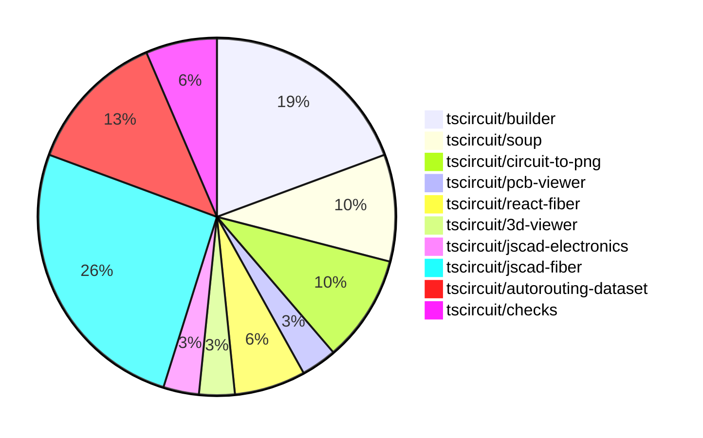

# Contribution Overview 2024-07-27

## PRs by Repository

## Contributor Overview

| Contributor | 🐳 Major | 🐙 Minor | 🐌 Tiny |
|-------------|-------|-------|-------|
| imrishabh18 | 3 | 6 | 1 |
| seveibar | 8 | 2 | 0 |
| abhijitxy | 2 | 0 | 0 |
| Slaviiiii | 2 | 4 | 0 |
| r-bt | 1 | 0 | 0 |

## Changes by Repository

### [tscircuit/builder](https://github.com/tscircuit/builder)

| PR # | Impact | Contributor | Description |
|------|--------|-------------|-------------|
| [#90](https://github.com/tscircuit/builder/pull/90) | 🐳 Major | imrishabh18 | Add a feature to write PCB snapshot PNG files for test fixtures. |
| [#89](https://github.com/tscircuit/builder/pull/89) | 🐳 Major | imrishabh18 | Added a new feature to write a PNG snapshot of the schematic circuit to the `__snapshots__` directory. |
| [#88](https://github.com/tscircuit/builder/pull/88) | 🐳 Major | imrishabh18 | Add port IDs to the PCB trace route. |
| [#94](https://github.com/tscircuit/builder/pull/94) | 🐙 Minor | imrishabh18 | Adds a `trace_width` option to the `NetBuilder` interface and uses it to set the trace thickness in the `build-trace-for-single-port-and-net.ts` file. |
| [#93](https://github.com/tscircuit/builder/pull/93) | 🐙 Minor | imrishabh18 | Fix the directory URL generation for the second time in the `writePcbSnapshotPng` and `writeSchematicSnapshotPng` functions. |
| [#92](https://github.com/tscircuit/builder/pull/92) | 🐙 Minor | imrishabh18 | Add a suffix to the snapshot file name to differentiate between PCB and schematic snapshots. |

### [tscircuit/soup](https://github.com/tscircuit/soup)

| PR # | Impact | Contributor | Description |
|------|--------|-------------|-------------|
| [#16](https://github.com/tscircuit/soup/pull/16) | 🐳 Major | seveibar | Add a GitHub Actions workflow to automatically format code in pull requests. |
| [#15](https://github.com/tscircuit/soup/pull/15) | 🐳 Major | abhijitxy | Introduce a new `simple_chip` type into the `tscircuit/soup` library. |
| [#17](https://github.com/tscircuit/soup/pull/17) | 🐙 Minor | imrishabh18 | Add a new optional `trace_width` property to the `SourceNet` type. |

### [tscircuit/circuit-to-png](https://github.com/tscircuit/circuit-to-png)

| PR # | Impact | Contributor | Description |
|------|--------|-------------|-------------|
| [#11](https://github.com/tscircuit/circuit-to-png/pull/11) | 🐙 Minor | imrishabh18 | Add "@tscircuit/soup" as a peer dependency |
| [#10](https://github.com/tscircuit/circuit-to-png/pull/10) | 🐙 Minor | imrishabh18 | Add missing version field in package.json |
| [#9](https://github.com/tscircuit/circuit-to-png/pull/9) | 🐌 Tiny | imrishabh18 | Update the lock file to the latest version |

### [tscircuit/pcb-viewer](https://github.com/tscircuit/pcb-viewer)

| PR # | Impact | Contributor | Description |
|------|--------|-------------|-------------|
| [#31](https://github.com/tscircuit/pcb-viewer/pull/31) | 🐳 Major | seveibar | Introduce a rats nest toggle, allow setting PCB viewer initial state |

### [tscircuit/react-fiber](https://github.com/tscircuit/react-fiber)

| PR # | Impact | Contributor | Description |
|------|--------|-------------|-------------|
| [#15](https://github.com/tscircuit/react-fiber/pull/15) | 🟣 | seveibar | Fix broken types/build, add `useChildrenSoup` |
| [#14](https://github.com/tscircuit/react-fiber/pull/14) | 🐳 Major | abhijitxy | Translate "chip" into "bug" in the component-hooks/index.tsx file and add a new "useChip" function in the component-hooks/use-chip.ts file. |

### [tscircuit/3d-viewer](https://github.com/tscircuit/3d-viewer)

| PR # | Impact | Contributor | Description |
|------|--------|-------------|-------------|
| [#10](https://github.com/tscircuit/3d-viewer/pull/10) | 🐳 Major | seveibar | Add the ability to render a jscad plan from a `cad_component`. |

### [tscircuit/jscad-electronics](https://github.com/tscircuit/jscad-electronics)

| PR # | Impact | Contributor | Description |
|------|--------|-------------|-------------|
| [#12](https://github.com/tscircuit/jscad-electronics/pull/12) | 🐳 Major | seveibar | Introduces a new component `SmdChipLead` for creating curved leads for surface-mount chip components. |

### [tscircuit/jscad-fiber](https://github.com/tscircuit/jscad-fiber)

| PR # | Impact | Contributor | Description |
|------|--------|-------------|-------------|
| [#44](https://github.com/tscircuit/jscad-fiber/pull/44) | 🐳 Major | Slaviiiii | Introduce two new JSX components, `<Hull>` and `<HullChain>`, to create convex hulls and chains of hulls in the 3D scene. |
| [#43](https://github.com/tscircuit/jscad-fiber/pull/43) | 🐳 Major | Slaviiiii | Add a new rectangle shape component to the library. |
| [#40](https://github.com/tscircuit/jscad-fiber/pull/40) | 🐳 Major | r-bt | Allow component props to be updated |
| [#51](https://github.com/tscircuit/jscad-fiber/pull/51) | 🐙 Minor | seveibar | Added an export for the `convert-csg-to-three-geom` module, allowing users to convert JSCAD geometry to Three.js geometry. |
| [#53](https://github.com/tscircuit/jscad-fiber/pull/53) | 🐙 Minor | Slaviiiii | Add color support to Sphere |
| [#41](https://github.com/tscircuit/jscad-fiber/pull/41) | 🐙 Minor | Slaviiiii | Add a new `Circle` component to the library |
| [#42](https://github.com/tscircuit/jscad-fiber/pull/42) | 🐙 Minor | Slaviiiii | Update the add-circle workflow to restore lock files before committing changes. |
| [#39](https://github.com/tscircuit/jscad-fiber/pull/39) | 🐙 Minor | Slaviiiii | Changed the `Rotate` component to accept either `rotation` or `angles` props, and added support for both scalar and array values. |

### [tscircuit/autorouting-dataset](https://github.com/tscircuit/autorouting-dataset)

| PR # | Impact | Contributor | Description |
|------|--------|-------------|-------------|
| [#13](https://github.com/tscircuit/autorouting-dataset/pull/13) | 🟣 | seveibar |  |
| [#11](https://github.com/tscircuit/autorouting-dataset/pull/11) | 🐳 Major | seveibar | Adds a new `/solve` endpoint to the development server and adds a test for it. |
| [#7](https://github.com/tscircuit/autorouting-dataset/pull/7) | 🐳 Major | seveibar |  |
| [#6](https://github.com/tscircuit/autorouting-dataset/pull/6) | 🐳 Major | seveibar | Finish the implementation of the distant single trace dataset by introducing a `distance` prop to the `SingleTraceCircuit` component and updating the corresponding tests. |

### [tscircuit/checks](https://github.com/tscircuit/checks)

| PR # | Impact | Contributor | Description |
|------|--------|-------------|-------------|
| [#12](https://github.com/tscircuit/checks/pull/12) | 🐳 Major | seveibar | Fix port association failure when traceWidth makes them overlap |
| [#11](https://github.com/tscircuit/checks/pull/11) | 🐙 Minor | seveibar | Improves error messages to use selectors instead of IDs, making them more readable. |

## Changes by Contributor

### [imrishabh18](https://github.com/imrishabh18)

| PR # | Impact | Description |
|------|--------|-------------|
| [#90](https://github.com/tscircuit/builder/pull/90) | 🐳 Major | Add a feature to write PCB snapshot PNG files for test fixtures. |
| [#89](https://github.com/tscircuit/builder/pull/89) | 🐳 Major | Added a new feature to write a PNG snapshot of the schematic circuit to the `__snapshots__` directory. |
| [#88](https://github.com/tscircuit/builder/pull/88) | 🐳 Major | Add port IDs to the PCB trace route. |
| [#94](https://github.com/tscircuit/builder/pull/94) | 🐙 Minor | Adds a `trace_width` option to the `NetBuilder` interface and uses it to set the trace thickness in the `build-trace-for-single-port-and-net.ts` file. |
| [#93](https://github.com/tscircuit/builder/pull/93) | 🐙 Minor | Fix the directory URL generation for the second time in the `writePcbSnapshotPng` and `writeSchematicSnapshotPng` functions. |
| [#92](https://github.com/tscircuit/builder/pull/92) | 🐙 Minor | Add a suffix to the snapshot file name to differentiate between PCB and schematic snapshots. |
| [#17](https://github.com/tscircuit/soup/pull/17) | 🐙 Minor | Add a new optional `trace_width` property to the `SourceNet` type. |
| [#11](https://github.com/tscircuit/circuit-to-png/pull/11) | 🐙 Minor | Add "@tscircuit/soup" as a peer dependency |
| [#10](https://github.com/tscircuit/circuit-to-png/pull/10) | 🐙 Minor | Add missing version field in package.json |
| [#9](https://github.com/tscircuit/circuit-to-png/pull/9) | 🐌 Tiny | Update the lock file to the latest version |

### [seveibar](https://github.com/seveibar)

| PR # | Impact | Description |
|------|--------|-------------|
| [#31](https://github.com/tscircuit/pcb-viewer/pull/31) | 🐳 Major | Introduce a rats nest toggle, allow setting PCB viewer initial state |
| [#15](https://github.com/tscircuit/react-fiber/pull/15) | 🟣 | Fix broken types/build, add `useChildrenSoup` |
| [#16](https://github.com/tscircuit/soup/pull/16) | 🐳 Major | Add a GitHub Actions workflow to automatically format code in pull requests. |
| [#10](https://github.com/tscircuit/3d-viewer/pull/10) | 🐳 Major | Add the ability to render a jscad plan from a `cad_component`. |
| [#12](https://github.com/tscircuit/jscad-electronics/pull/12) | 🐳 Major | Introduces a new component `SmdChipLead` for creating curved leads for surface-mount chip components. |
| [#51](https://github.com/tscircuit/jscad-fiber/pull/51) | 🐙 Minor | Added an export for the `convert-csg-to-three-geom` module, allowing users to convert JSCAD geometry to Three.js geometry. |
| [#13](https://github.com/tscircuit/autorouting-dataset/pull/13) | 🟣 |  |
| [#11](https://github.com/tscircuit/autorouting-dataset/pull/11) | 🐳 Major | Adds a new `/solve` endpoint to the development server and adds a test for it. |
| [#7](https://github.com/tscircuit/autorouting-dataset/pull/7) | 🐳 Major |  |
| [#6](https://github.com/tscircuit/autorouting-dataset/pull/6) | 🐳 Major | Finish the implementation of the distant single trace dataset by introducing a `distance` prop to the `SingleTraceCircuit` component and updating the corresponding tests. |
| [#12](https://github.com/tscircuit/checks/pull/12) | 🐳 Major | Fix port association failure when traceWidth makes them overlap |
| [#11](https://github.com/tscircuit/checks/pull/11) | 🐙 Minor | Improves error messages to use selectors instead of IDs, making them more readable. |

### [abhijitxy](https://github.com/abhijitxy)

| PR # | Impact | Description |
|------|--------|-------------|
| [#14](https://github.com/tscircuit/react-fiber/pull/14) | 🐳 Major | Translate "chip" into "bug" in the component-hooks/index.tsx file and add a new "useChip" function in the component-hooks/use-chip.ts file. |
| [#15](https://github.com/tscircuit/soup/pull/15) | 🐳 Major | Introduce a new `simple_chip` type into the `tscircuit/soup` library. |

### [Slaviiiii](https://github.com/Slaviiiii)

| PR # | Impact | Description |
|------|--------|-------------|
| [#44](https://github.com/tscircuit/jscad-fiber/pull/44) | 🐳 Major | Introduce two new JSX components, `<Hull>` and `<HullChain>`, to create convex hulls and chains of hulls in the 3D scene. |
| [#43](https://github.com/tscircuit/jscad-fiber/pull/43) | 🐳 Major | Add a new rectangle shape component to the library. |
| [#53](https://github.com/tscircuit/jscad-fiber/pull/53) | 🐙 Minor | Add color support to Sphere |
| [#41](https://github.com/tscircuit/jscad-fiber/pull/41) | 🐙 Minor | Add a new `Circle` component to the library |
| [#42](https://github.com/tscircuit/jscad-fiber/pull/42) | 🐙 Minor | Update the add-circle workflow to restore lock files before committing changes. |
| [#39](https://github.com/tscircuit/jscad-fiber/pull/39) | 🐙 Minor | Changed the `Rotate` component to accept either `rotation` or `angles` props, and added support for both scalar and array values. |

### [r-bt](https://github.com/r-bt)

| PR # | Impact | Description |
|------|--------|-------------|
| [#40](https://github.com/tscircuit/jscad-fiber/pull/40) | 🐳 Major | Allow component props to be updated |

