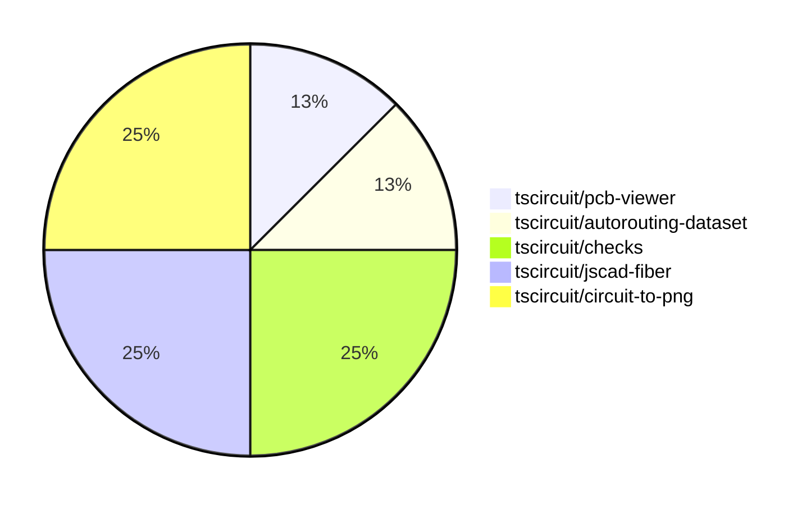

# Contribution Overview 2024-07-27

## PRs by Repository

## Contributor Overview

| Contributor | 🐳 Major | 🐙 Minor | 🐌 Tiny |
|-------------|-------|-------|-------|
| seveibar | 4 | 0 | 0 |
| r-bt | 1 | 0 | 0 |
| Slaviiiii | 0 | 1 | 0 |
| imrishabh18 | 0 | 2 | 0 |

## Changes by Repository

### [tscircuit/pcb-viewer](https://github.com/tscircuit/pcb-viewer)

| PR # | Impact | Contributor | Description |
|------|--------|-------------|-------------|
| [#31](https://github.com/tscircuit/pcb-viewer/pull/31) | 🐳 Major | seveibar | Introduce a rats nest toggle and allow setting the initial state of the PCBViewer component. |

### [tscircuit/autorouting-dataset](https://github.com/tscircuit/autorouting-dataset)

| PR # | Impact | Contributor | Description |
|------|--------|-------------|-------------|
| [#6](https://github.com/tscircuit/autorouting-dataset/pull/6) | 🐳 Major | seveibar | Introduce a new distance parameter to the `SingleTraceCircuit` component to generate a PCB trace with a specified distance between the start and end points. |

### [tscircuit/checks](https://github.com/tscircuit/checks)

| PR # | Impact | Contributor | Description |
|------|--------|-------------|-------------|
| [#12](https://github.com/tscircuit/checks/pull/12) | 🐳 Major | seveibar | Fix port association failure when traceWidth makes them overlap |
| [#11](https://github.com/tscircuit/checks/pull/11) | 🐳 Major | seveibar | Improve the error messages to use selectors instead of IDs for better readability. |

### [tscircuit/jscad-fiber](https://github.com/tscircuit/jscad-fiber)

| PR # | Impact | Contributor | Description |
|------|--------|-------------|-------------|
| [#40](https://github.com/tscircuit/jscad-fiber/pull/40) | 🐳 Major | r-bt | Allow component props to be updated |
| [#39](https://github.com/tscircuit/jscad-fiber/pull/39) | 🐙 Minor | Slaviiiii | Change the props for the `Rotate` component to accept either `rotation` or `angles` as optional parameters. |

### [tscircuit/circuit-to-png](https://github.com/tscircuit/circuit-to-png)

| PR # | Impact | Contributor | Description |
|------|--------|-------------|-------------|
| [#10](https://github.com/tscircuit/circuit-to-png/pull/10) | 🐙 Minor | imrishabh18 | Add missing version field in package.json |
| [#9](https://github.com/tscircuit/circuit-to-png/pull/9) | 🐙 Minor | imrishabh18 | Fixes the latest lock file. |

## Changes by Contributor

### [seveibar](https://github.com/seveibar)

| PR # | Impact | Description |
|------|--------|-------------|
| [#31](https://github.com/tscircuit/pcb-viewer/pull/31) | 🐳 Major | Introduce a rats nest toggle and allow setting the initial state of the PCBViewer component. |
| [#6](https://github.com/tscircuit/autorouting-dataset/pull/6) | 🐳 Major | Introduce a new distance parameter to the `SingleTraceCircuit` component to generate a PCB trace with a specified distance between the start and end points. |
| [#12](https://github.com/tscircuit/checks/pull/12) | 🐳 Major | Fix port association failure when traceWidth makes them overlap |
| [#11](https://github.com/tscircuit/checks/pull/11) | 🐳 Major | Improve the error messages to use selectors instead of IDs for better readability. |

### [r-bt](https://github.com/r-bt)

| PR # | Impact | Description |
|------|--------|-------------|
| [#40](https://github.com/tscircuit/jscad-fiber/pull/40) | 🐳 Major | Allow component props to be updated |

### [Slaviiiii](https://github.com/Slaviiiii)

| PR # | Impact | Description |
|------|--------|-------------|
| [#39](https://github.com/tscircuit/jscad-fiber/pull/39) | 🐙 Minor | Change the props for the `Rotate` component to accept either `rotation` or `angles` as optional parameters. |

### [imrishabh18](https://github.com/imrishabh18)

| PR # | Impact | Description |
|------|--------|-------------|
| [#10](https://github.com/tscircuit/circuit-to-png/pull/10) | 🐙 Minor | Add missing version field in package.json |
| [#9](https://github.com/tscircuit/circuit-to-png/pull/9) | 🐙 Minor | Fixes the latest lock file. |

