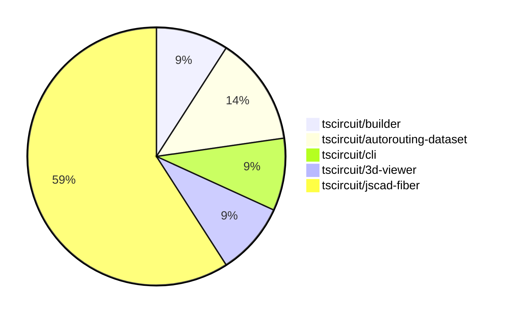

# Contribution Overview 2024-08-03

## PRs by Repository

## Contributor Overview

| Contributor | 🐳 Major | 🐙 Minor | 🐌 Tiny |
|-------------|-------|-------|-------|
| seveibar | 2 | 0 | 1 |
| imrishabh18 | 5 | 0 | 0 |
| Slaviiiii | 1 | 12 | 0 |

## Changes by Repository

### [tscircuit/builder](https://github.com/tscircuit/builder)

| PR # | Impact | Contributor | Description |
|------|--------|-------------|-------------|
| [#95](https://github.com/tscircuit/builder/pull/95) | 🐳 Major | imrishabh18 | Fix the issue where the component's schematic center is not properly set when only one of the x or y coordinates is provided. |
| [#96](https://github.com/tscircuit/builder/pull/96) | 🐌 Tiny | seveibar | Add code owners for the repository |

### [tscircuit/autorouting-dataset](https://github.com/tscircuit/autorouting-dataset)

| PR # | Impact | Contributor | Description |
|------|--------|-------------|-------------|
| [#20](https://github.com/tscircuit/autorouting-dataset/pull/20) | 🟣 | seveibar |  |
| [#19](https://github.com/tscircuit/autorouting-dataset/pull/19) | 🐳 Major | seveibar | Add mesh support for gridless POI and bootstrap incremental gridless POI |
| [#15](https://github.com/tscircuit/autorouting-dataset/pull/15) | 🐳 Major | seveibar | Introduce a point-of-interest-based algorithm for gridless autorouting on a PCB. |

### [tscircuit/cli](https://github.com/tscircuit/cli)

| PR # | Impact | Contributor | Description |
|------|--------|-------------|-------------|
| [#119](https://github.com/tscircuit/cli/pull/119) | 🐳 Major | imrishabh18 | Introduce a new `render` command to render circuit as image (PCB or schematic view) |
| [#117](https://github.com/tscircuit/cli/pull/117) | 🐳 Major | imrishabh18 | Introduce a "Debug" button in the menu to add the current example package's TSCIRCUIT soup data to the debug.tscircuit.com website. |

### [tscircuit/3d-viewer](https://github.com/tscircuit/3d-viewer)

| PR # | Impact | Contributor | Description |
|------|--------|-------------|-------------|
| [#12](https://github.com/tscircuit/3d-viewer/pull/12) | 🐳 Major | imrishabh18 | Fix the overlap issue with the top left cube in the application. |
| [#11](https://github.com/tscircuit/3d-viewer/pull/11) | 🐳 Major | imrishabh18 | Added better error handling for bad URLs in the `useGlobalObjLoader` hook. |

### [tscircuit/jscad-fiber](https://github.com/tscircuit/jscad-fiber)

| PR # | Impact | Contributor | Description |
|------|--------|-------------|-------------|
| [#60](https://github.com/tscircuit/jscad-fiber/pull/60) | 🐳 Major | Slaviiiii | Add color and center properties to the Cube component |
| [#68](https://github.com/tscircuit/jscad-fiber/pull/68) | 🐙 Minor | Slaviiiii | Wrap the `Rotate` component with `withColorProp` and `withOffsetProp` higher-order components to add color and center props. |
| [#67](https://github.com/tscircuit/jscad-fiber/pull/67) | 🐙 Minor | Slaviiiii | Adds color and center props to the `Torus` component. |
| [#66](https://github.com/tscircuit/jscad-fiber/pull/66) | 🐙 Minor | Slaviiiii | Wrap the `GeodesicSphere` component with `withColorProp` and `withOffsetProp` higher-order components to add color and offset functionality. |
| [#64](https://github.com/tscircuit/jscad-fiber/pull/64) | 🐙 Minor | Slaviiiii | Wrap `CylinderElliptic` component with `withColorProp` and `withOffsetProp` HOCs |
| [#65](https://github.com/tscircuit/jscad-fiber/pull/65) | 🐙 Minor | Slaviiiii | Wrap the `Ellipsoid` component with `withColorProp` and `withOffsetProp` wrappers to add color and offset functionality. |
| [#63](https://github.com/tscircuit/jscad-fiber/pull/63) | 🐙 Minor | Slaviiiii | Wrap the `RoundedCylinder` component with the `withColorProp` and `withOffsetProp` higher-order components to add color and position functionality. |
| [#62](https://github.com/tscircuit/jscad-fiber/pull/62) | 🐙 Minor | Slaviiiii | Add color and center properties to the Cylinder component |
| [#61](https://github.com/tscircuit/jscad-fiber/pull/61) | 🐙 Minor | Slaviiiii | Add a color property to the `RoundedCuboid` component and wrap it with a `withColorProp` higher-order component. |
| [#59](https://github.com/tscircuit/jscad-fiber/pull/59) | 🐙 Minor | Slaviiiii | Wrap the `ExtrudeRotate` component with `withColorProp` and `withOffsetProp` higher-order components to add color and offset functionality. |
| [#58](https://github.com/tscircuit/jscad-fiber/pull/58) | 🐙 Minor | Slaviiiii | Wrap the `ExtrudeRectangular` component with the `withColorProp` and `withOffsetProp` higher-order components to add support for color and offset properties. |
| [#56](https://github.com/tscircuit/jscad-fiber/pull/56) | 🐙 Minor | Slaviiiii | Wrap ExtrudeHelical component with `withColorProp` and `withOffsetProp` wrappers |
| [#57](https://github.com/tscircuit/jscad-fiber/pull/57) | 🐙 Minor | Slaviiiii | Wrap the `ExtrudeLinear` component with `withColorProp` and `withOffsetProp` wrappers to add support for `color` and `center` props. |

## Changes by Contributor

### [seveibar](https://github.com/seveibar)

| PR # | Impact | Description |
|------|--------|-------------|
| [#96](https://github.com/tscircuit/builder/pull/96) | 🐌 Tiny | Add code owners for the repository |
| [#20](https://github.com/tscircuit/autorouting-dataset/pull/20) | 🟣 |  |
| [#19](https://github.com/tscircuit/autorouting-dataset/pull/19) | 🐳 Major | Add mesh support for gridless POI and bootstrap incremental gridless POI |
| [#15](https://github.com/tscircuit/autorouting-dataset/pull/15) | 🐳 Major | Introduce a point-of-interest-based algorithm for gridless autorouting on a PCB. |

### [imrishabh18](https://github.com/imrishabh18)

| PR # | Impact | Description |
|------|--------|-------------|
| [#95](https://github.com/tscircuit/builder/pull/95) | 🐳 Major | Fix the issue where the component's schematic center is not properly set when only one of the x or y coordinates is provided. |
| [#119](https://github.com/tscircuit/cli/pull/119) | 🐳 Major | Introduce a new `render` command to render circuit as image (PCB or schematic view) |
| [#117](https://github.com/tscircuit/cli/pull/117) | 🐳 Major | Introduce a "Debug" button in the menu to add the current example package's TSCIRCUIT soup data to the debug.tscircuit.com website. |
| [#12](https://github.com/tscircuit/3d-viewer/pull/12) | 🐳 Major | Fix the overlap issue with the top left cube in the application. |
| [#11](https://github.com/tscircuit/3d-viewer/pull/11) | 🐳 Major | Added better error handling for bad URLs in the `useGlobalObjLoader` hook. |

### [Slaviiiii](https://github.com/Slaviiiii)

| PR # | Impact | Description |
|------|--------|-------------|
| [#60](https://github.com/tscircuit/jscad-fiber/pull/60) | 🐳 Major | Add color and center properties to the Cube component |
| [#68](https://github.com/tscircuit/jscad-fiber/pull/68) | 🐙 Minor | Wrap the `Rotate` component with `withColorProp` and `withOffsetProp` higher-order components to add color and center props. |
| [#67](https://github.com/tscircuit/jscad-fiber/pull/67) | 🐙 Minor | Adds color and center props to the `Torus` component. |
| [#66](https://github.com/tscircuit/jscad-fiber/pull/66) | 🐙 Minor | Wrap the `GeodesicSphere` component with `withColorProp` and `withOffsetProp` higher-order components to add color and offset functionality. |
| [#64](https://github.com/tscircuit/jscad-fiber/pull/64) | 🐙 Minor | Wrap `CylinderElliptic` component with `withColorProp` and `withOffsetProp` HOCs |
| [#65](https://github.com/tscircuit/jscad-fiber/pull/65) | 🐙 Minor | Wrap the `Ellipsoid` component with `withColorProp` and `withOffsetProp` wrappers to add color and offset functionality. |
| [#63](https://github.com/tscircuit/jscad-fiber/pull/63) | 🐙 Minor | Wrap the `RoundedCylinder` component with the `withColorProp` and `withOffsetProp` higher-order components to add color and position functionality. |
| [#62](https://github.com/tscircuit/jscad-fiber/pull/62) | 🐙 Minor | Add color and center properties to the Cylinder component |
| [#61](https://github.com/tscircuit/jscad-fiber/pull/61) | 🐙 Minor | Add a color property to the `RoundedCuboid` component and wrap it with a `withColorProp` higher-order component. |
| [#59](https://github.com/tscircuit/jscad-fiber/pull/59) | 🐙 Minor | Wrap the `ExtrudeRotate` component with `withColorProp` and `withOffsetProp` higher-order components to add color and offset functionality. |
| [#58](https://github.com/tscircuit/jscad-fiber/pull/58) | 🐙 Minor | Wrap the `ExtrudeRectangular` component with the `withColorProp` and `withOffsetProp` higher-order components to add support for color and offset properties. |
| [#56](https://github.com/tscircuit/jscad-fiber/pull/56) | 🐙 Minor | Wrap ExtrudeHelical component with `withColorProp` and `withOffsetProp` wrappers |
| [#57](https://github.com/tscircuit/jscad-fiber/pull/57) | 🐙 Minor | Wrap the `ExtrudeLinear` component with `withColorProp` and `withOffsetProp` wrappers to add support for `color` and `center` props. |

