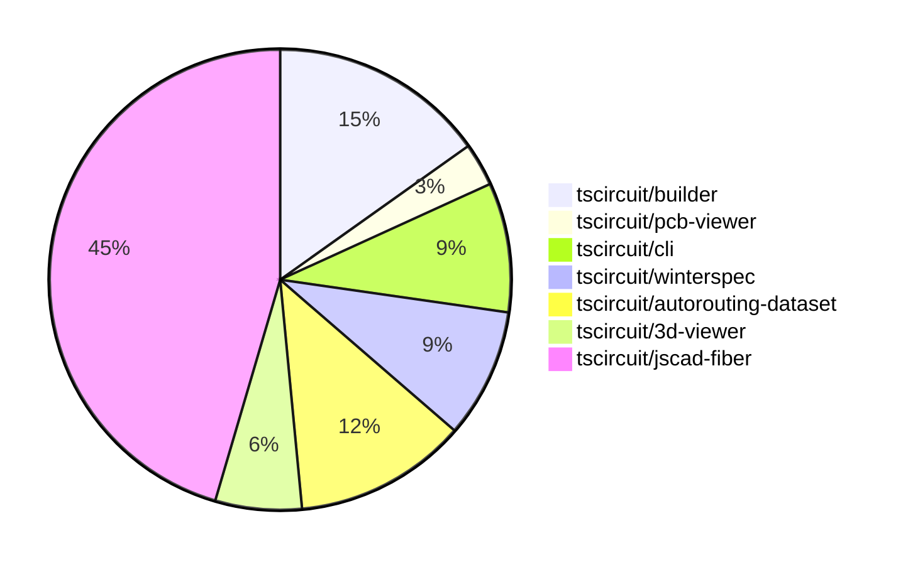

# Contribution Overview 2024-08-03

## PRs by Repository

## Contributor Overview

| Contributor | 🐳 Major | 🐙 Minor | 🐌 Tiny |
|-------------|-------|-------|-------|
| seveibar | 9 | 4 | 0 |
| imrishabh18 | 5 | 0 | 0 |
| Slaviiiii | 0 | 15 | 0 |

## Changes by Repository

### [tscircuit/builder](https://github.com/tscircuit/builder)

| PR # | Impact | Contributor | Description |
|------|--------|-------------|-------------|
| [#100](https://github.com/tscircuit/builder/pull/100) | 🐳 Major | seveibar | When routing is disabled, do not route schematic routes with autorouter, instead use a straight route solver. |
| [#98](https://github.com/tscircuit/builder/pull/98) | 🐳 Major | seveibar | Fix the issue where `routingDisabled` was not disabling routing |
| [#95](https://github.com/tscircuit/builder/pull/95) | 🐳 Major | imrishabh18 | Fix the center alignment of components even with only one prop. |
| [#99](https://github.com/tscircuit/builder/pull/99) | 🐙 Minor | seveibar | Adds additional debug logging to determine when trace building is being skipped due to routing being disabled. |
| [#96](https://github.com/tscircuit/builder/pull/96) | 🐙 Minor | seveibar | Add CODEOWNERS file to specify code owners for the repository. |

### [tscircuit/pcb-viewer](https://github.com/tscircuit/pcb-viewer)

| PR # | Impact | Contributor | Description |
|------|--------|-------------|-------------|
| [#32](https://github.com/tscircuit/pcb-viewer/pull/32) | 🐳 Major | seveibar | Fix stroke width not being used for fabrication note paths and fix a color not found error for fabrication note colors. |

### [tscircuit/cli](https://github.com/tscircuit/cli)

| PR # | Impact | Contributor | Description |
|------|--------|-------------|-------------|
| [#120](https://github.com/tscircuit/cli/pull/120) | 🐳 Major | seveibar | The pull request reorganizes the codebase into four main directories (`api`, `frontend`, `cli`, and `example-project`), introduces a single `package.json`, fixes all types, and improves imports and organization. |
| [#119](https://github.com/tscircuit/cli/pull/119) | 🐳 Major | imrishabh18 | New `render` command added to render circuit as image (PNG or SVG) |
| [#117](https://github.com/tscircuit/cli/pull/117) | 🐳 Major | imrishabh18 | Add a debug button to the menu that allows the user to send the current circuit data to the debug.tscircuit.com server. |

### [tscircuit/winterspec](https://github.com/tscircuit/winterspec)

| PR # | Impact | Contributor | Description |
|------|--------|-------------|-------------|
| [#7](https://github.com/tscircuit/winterspec/pull/7) | 🐳 Major | seveibar | Fix for passing options when creating bundles from directories, causing middleware not to run. |
| [#6](https://github.com/tscircuit/winterspec/pull/6) | 🐙 Minor | seveibar | Add support for fetch middleware in the node.js adapter. |
| [#5](https://github.com/tscircuit/winterspec/pull/5) | 🐙 Minor | seveibar | Switch to using relative route imports in the bundle-routes command |

### [tscircuit/autorouting-dataset](https://github.com/tscircuit/autorouting-dataset)

| PR # | Impact | Contributor | Description |
|------|--------|-------------|-------------|
| [#21](https://github.com/tscircuit/autorouting-dataset/pull/21) | 🐳 Major | seveibar | Fix sample freezing on static build |
| [#20](https://github.com/tscircuit/autorouting-dataset/pull/20) | 🐳 Major | seveibar |  |
| [#19](https://github.com/tscircuit/autorouting-dataset/pull/19) | 🐳 Major | seveibar | Add mesh-based graph construction using Delaunay triangulation and quadtree-based obstacle detection to the gridless POI algorithm. |
| [#15](https://github.com/tscircuit/autorouting-dataset/pull/15) | 🐳 Major | seveibar | Introduces a new algorithm for gridless point-of-interest routing, which computes optimal points for routing around obstacles and constructs a graph to find the optimal path between connection points. |

### [tscircuit/3d-viewer](https://github.com/tscircuit/3d-viewer)

| PR # | Impact | Contributor | Description |
|------|--------|-------------|-------------|
| [#12](https://github.com/tscircuit/3d-viewer/pull/12) | 🐳 Major | imrishabh18 | Fix the overlapping issue of the top left cube in the UI. |
| [#11](https://github.com/tscircuit/3d-viewer/pull/11) | 🐳 Major | imrishabh18 | Added better error handling for bad URLs in the `useGlobalObjLoader` hook. |

### [tscircuit/jscad-fiber](https://github.com/tscircuit/jscad-fiber)

| PR # | Impact | Contributor | Description |
|------|--------|-------------|-------------|
| [#70](https://github.com/tscircuit/jscad-fiber/pull/70) | 🐙 Minor | Slaviiiii | Wrap `HullChain` component with `withColorProp` and `withOffsetProp` higher-order components |
| [#69](https://github.com/tscircuit/jscad-fiber/pull/69) | 🐙 Minor | Slaviiiii | Wrap the `Hull` component with `withColorProp` and `withOffsetProp` wrappers. |
| [#68](https://github.com/tscircuit/jscad-fiber/pull/68) | 🐙 Minor | Slaviiiii | Wrap the `Rotate` component with `withColorProp` and `withOffsetProp` to add support for `color` and `center` properties. |
| [#67](https://github.com/tscircuit/jscad-fiber/pull/67) | 🐙 Minor | Slaviiiii | Wrap the `Torus` component with `withColorProp` and `withOffsetProp` higher-order components. |
| [#66](https://github.com/tscircuit/jscad-fiber/pull/66) | 🐙 Minor | Slaviiiii | Wrap `GeodesicSphere` component with `withColorProp` and `withOffsetProp` higher-order components to add color and offset properties. |
| [#64](https://github.com/tscircuit/jscad-fiber/pull/64) | 🐙 Minor | Slaviiiii | Wrap `CylinderElliptic` component with `withColorProp` and `withOffsetProp` higher-order components. |
| [#65](https://github.com/tscircuit/jscad-fiber/pull/65) | 🐙 Minor | Slaviiiii | Wrap the `Ellipsoid` component with `withColorProp` and `withOffsetProp` wrappers to add support for color and center properties. |
| [#63](https://github.com/tscircuit/jscad-fiber/pull/63) | 🐙 Minor | Slaviiiii | Add color and center properties to the RoundedCylinder component. |
| [#62](https://github.com/tscircuit/jscad-fiber/pull/62) | 🐙 Minor | Slaviiiii | Wrap the `Cylinder` component with `withColorProp` and `withOffsetProp` to add color and center properties. |
| [#61](https://github.com/tscircuit/jscad-fiber/pull/61) | 🐙 Minor | Slaviiiii | Wrap the `RoundedCuboid` component with a color wrapper to allow setting the color. |
| [#60](https://github.com/tscircuit/jscad-fiber/pull/60) | 🐙 Minor | Slaviiiii | Wrap the `Cube` component with `withColorProp` and `withOffsetProp` to add support for color and offset properties. |
| [#59](https://github.com/tscircuit/jscad-fiber/pull/59) | 🐙 Minor | Slaviiiii | Wrap ExtrudeRotate component with `withColorProp` and `withOffsetProp` wrappers. |
| [#58](https://github.com/tscircuit/jscad-fiber/pull/58) | 🐙 Minor | Slaviiiii | Wrap `ExtrudeRectangular` component with `withColorProp` and `withOffsetProp` higher-order components to add support for `color` and `center` props. |
| [#56](https://github.com/tscircuit/jscad-fiber/pull/56) | 🐙 Minor | Slaviiiii | Wrap the `ExtrudeHelical` component with `withColorProp` and `withOffsetProp` higher-order components to add color and offset properties. |
| [#57](https://github.com/tscircuit/jscad-fiber/pull/57) | 🐙 Minor | Slaviiiii | Wrap the `ExtrudeLinear` component with `withColorProp` and `withOffsetProp` higher-order components to add support for `color` and `center` properties. |

## Changes by Contributor

### [seveibar](https://github.com/seveibar)

| PR # | Impact | Description |
|------|--------|-------------|
| [#100](https://github.com/tscircuit/builder/pull/100) | 🐳 Major | When routing is disabled, do not route schematic routes with autorouter, instead use a straight route solver. |
| [#98](https://github.com/tscircuit/builder/pull/98) | 🐳 Major | Fix the issue where `routingDisabled` was not disabling routing |
| [#32](https://github.com/tscircuit/pcb-viewer/pull/32) | 🐳 Major | Fix stroke width not being used for fabrication note paths and fix a color not found error for fabrication note colors. |
| [#120](https://github.com/tscircuit/cli/pull/120) | 🐳 Major | The pull request reorganizes the codebase into four main directories (`api`, `frontend`, `cli`, and `example-project`), introduces a single `package.json`, fixes all types, and improves imports and organization. |
| [#7](https://github.com/tscircuit/winterspec/pull/7) | 🐳 Major | Fix for passing options when creating bundles from directories, causing middleware not to run. |
| [#21](https://github.com/tscircuit/autorouting-dataset/pull/21) | 🐳 Major | Fix sample freezing on static build |
| [#20](https://github.com/tscircuit/autorouting-dataset/pull/20) | 🐳 Major |  |
| [#19](https://github.com/tscircuit/autorouting-dataset/pull/19) | 🐳 Major | Add mesh-based graph construction using Delaunay triangulation and quadtree-based obstacle detection to the gridless POI algorithm. |
| [#15](https://github.com/tscircuit/autorouting-dataset/pull/15) | 🐳 Major | Introduces a new algorithm for gridless point-of-interest routing, which computes optimal points for routing around obstacles and constructs a graph to find the optimal path between connection points. |
| [#99](https://github.com/tscircuit/builder/pull/99) | 🐙 Minor | Adds additional debug logging to determine when trace building is being skipped due to routing being disabled. |
| [#96](https://github.com/tscircuit/builder/pull/96) | 🐙 Minor | Add CODEOWNERS file to specify code owners for the repository. |
| [#6](https://github.com/tscircuit/winterspec/pull/6) | 🐙 Minor | Add support for fetch middleware in the node.js adapter. |
| [#5](https://github.com/tscircuit/winterspec/pull/5) | 🐙 Minor | Switch to using relative route imports in the bundle-routes command |

### [imrishabh18](https://github.com/imrishabh18)

| PR # | Impact | Description |
|------|--------|-------------|
| [#95](https://github.com/tscircuit/builder/pull/95) | 🐳 Major | Fix the center alignment of components even with only one prop. |
| [#119](https://github.com/tscircuit/cli/pull/119) | 🐳 Major | New `render` command added to render circuit as image (PNG or SVG) |
| [#117](https://github.com/tscircuit/cli/pull/117) | 🐳 Major | Add a debug button to the menu that allows the user to send the current circuit data to the debug.tscircuit.com server. |
| [#12](https://github.com/tscircuit/3d-viewer/pull/12) | 🐳 Major | Fix the overlapping issue of the top left cube in the UI. |
| [#11](https://github.com/tscircuit/3d-viewer/pull/11) | 🐳 Major | Added better error handling for bad URLs in the `useGlobalObjLoader` hook. |

### [Slaviiiii](https://github.com/Slaviiiii)

| PR # | Impact | Description |
|------|--------|-------------|
| [#70](https://github.com/tscircuit/jscad-fiber/pull/70) | 🐙 Minor | Wrap `HullChain` component with `withColorProp` and `withOffsetProp` higher-order components |
| [#69](https://github.com/tscircuit/jscad-fiber/pull/69) | 🐙 Minor | Wrap the `Hull` component with `withColorProp` and `withOffsetProp` wrappers. |
| [#68](https://github.com/tscircuit/jscad-fiber/pull/68) | 🐙 Minor | Wrap the `Rotate` component with `withColorProp` and `withOffsetProp` to add support for `color` and `center` properties. |
| [#67](https://github.com/tscircuit/jscad-fiber/pull/67) | 🐙 Minor | Wrap the `Torus` component with `withColorProp` and `withOffsetProp` higher-order components. |
| [#66](https://github.com/tscircuit/jscad-fiber/pull/66) | 🐙 Minor | Wrap `GeodesicSphere` component with `withColorProp` and `withOffsetProp` higher-order components to add color and offset properties. |
| [#64](https://github.com/tscircuit/jscad-fiber/pull/64) | 🐙 Minor | Wrap `CylinderElliptic` component with `withColorProp` and `withOffsetProp` higher-order components. |
| [#65](https://github.com/tscircuit/jscad-fiber/pull/65) | 🐙 Minor | Wrap the `Ellipsoid` component with `withColorProp` and `withOffsetProp` wrappers to add support for color and center properties. |
| [#63](https://github.com/tscircuit/jscad-fiber/pull/63) | 🐙 Minor | Add color and center properties to the RoundedCylinder component. |
| [#62](https://github.com/tscircuit/jscad-fiber/pull/62) | 🐙 Minor | Wrap the `Cylinder` component with `withColorProp` and `withOffsetProp` to add color and center properties. |
| [#61](https://github.com/tscircuit/jscad-fiber/pull/61) | 🐙 Minor | Wrap the `RoundedCuboid` component with a color wrapper to allow setting the color. |
| [#60](https://github.com/tscircuit/jscad-fiber/pull/60) | 🐙 Minor | Wrap the `Cube` component with `withColorProp` and `withOffsetProp` to add support for color and offset properties. |
| [#59](https://github.com/tscircuit/jscad-fiber/pull/59) | 🐙 Minor | Wrap ExtrudeRotate component with `withColorProp` and `withOffsetProp` wrappers. |
| [#58](https://github.com/tscircuit/jscad-fiber/pull/58) | 🐙 Minor | Wrap `ExtrudeRectangular` component with `withColorProp` and `withOffsetProp` higher-order components to add support for `color` and `center` props. |
| [#56](https://github.com/tscircuit/jscad-fiber/pull/56) | 🐙 Minor | Wrap the `ExtrudeHelical` component with `withColorProp` and `withOffsetProp` higher-order components to add color and offset properties. |
| [#57](https://github.com/tscircuit/jscad-fiber/pull/57) | 🐙 Minor | Wrap the `ExtrudeLinear` component with `withColorProp` and `withOffsetProp` higher-order components to add support for `color` and `center` properties. |

