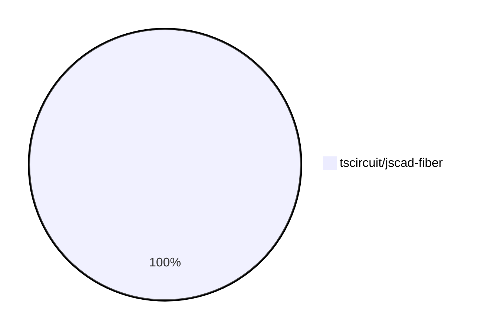

# Contribution Overview 2024-08-03

## PRs by Repository

## Contributor Overview

| Contributor | 🐳 Major | 🐙 Minor | 🐌 Tiny |
|-------------|-------|-------|-------|
| Slaviiiii | 2 | 2 | 0 |

## Changes by Repository

### [tscircuit/jscad-fiber](https://github.com/tscircuit/jscad-fiber)

| PR # | Impact | Contributor | Description |
|------|--------|-------------|-------------|
| [#58](https://github.com/tscircuit/jscad-fiber/pull/58) | 🐳 Major | Slaviiiii | Wrap the `ExtrudeRectangular` component with the `withColorProp` and `withOffsetProp` higher-order components to add color and offset functionality. |
| [#57](https://github.com/tscircuit/jscad-fiber/pull/57) | 🐳 Major | Slaviiiii | Wrap ExtrudeLinear component with color and offset props using higher-order components. |
| [#59](https://github.com/tscircuit/jscad-fiber/pull/59) | 🐙 Minor | Slaviiiii | Wrap the `ExtrudeRotate` component with `withColorProp` and `withOffsetProp` higher-order components. |
| [#56](https://github.com/tscircuit/jscad-fiber/pull/56) | 🐙 Minor | Slaviiiii | Wrap the `ExtrudeHelical` component with `withColorProp` and `withOffsetProp` wrappers to add support for `color` and `center` props. |

## Changes by Contributor

### [Slaviiiii](https://github.com/Slaviiiii)

| PR # | Impact | Description |
|------|--------|-------------|
| [#58](https://github.com/tscircuit/jscad-fiber/pull/58) | 🐳 Major | Wrap the `ExtrudeRectangular` component with the `withColorProp` and `withOffsetProp` higher-order components to add color and offset functionality. |
| [#57](https://github.com/tscircuit/jscad-fiber/pull/57) | 🐳 Major | Wrap ExtrudeLinear component with color and offset props using higher-order components. |
| [#59](https://github.com/tscircuit/jscad-fiber/pull/59) | 🐙 Minor | Wrap the `ExtrudeRotate` component with `withColorProp` and `withOffsetProp` higher-order components. |
| [#56](https://github.com/tscircuit/jscad-fiber/pull/56) | 🐙 Minor | Wrap the `ExtrudeHelical` component with `withColorProp` and `withOffsetProp` wrappers to add support for `color` and `center` props. |

