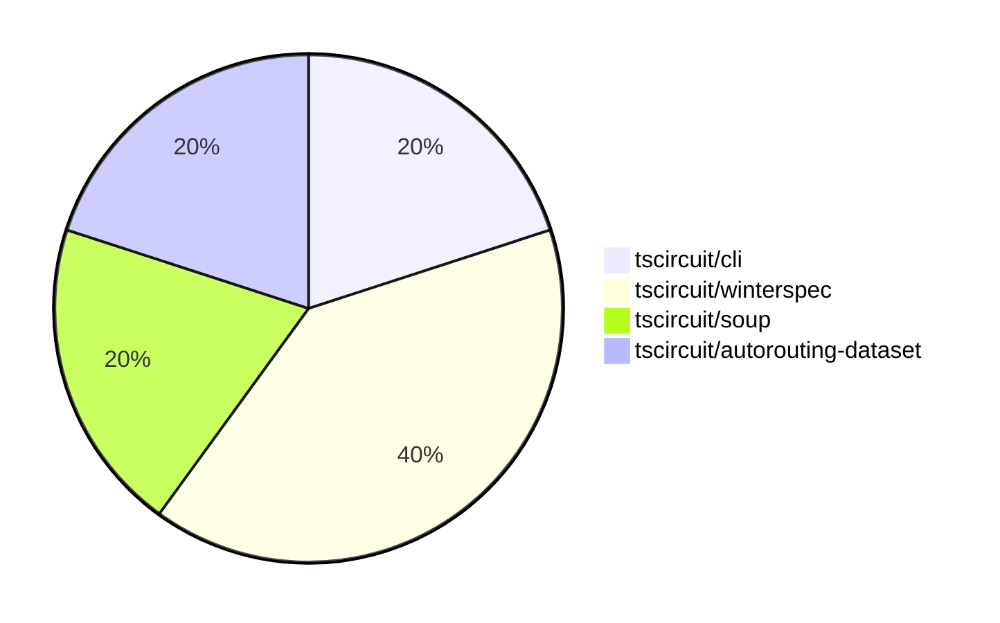

# Contribution Overview 2024-08-10

## PRs by Repository

## Contributor Overview

| Contributor | 🐳 Major | 🐙 Minor | 🐌 Tiny |
|-------------|-------|-------|-------|
| seveibar | 2 | 1 | 0 |
| imrishabh18 | 1 | 0 | 0 |
| angelacaq | 1 | 0 | 0 |

## Changes by Repository

### [tscircuit/cli](https://github.com/tscircuit/cli)

| PR # | Impact | Contributor | Description |
|------|--------|-------------|-------------|
| [#120](https://github.com/tscircuit/cli/pull/120) | 🐳 Major | seveibar |  |

### [tscircuit/winterspec](https://github.com/tscircuit/winterspec)

| PR # | Impact | Contributor | Description |
|------|--------|-------------|-------------|
| [#7](https://github.com/tscircuit/winterspec/pull/7) | 🐳 Major | seveibar | Fix opts not passing when creating bundles from dirs causing middleware not to run |
| [#6](https://github.com/tscircuit/winterspec/pull/6) | 🐙 Minor | seveibar | Add support for fetch middleware in the createFetchHandlerFromDir function. |

### [tscircuit/soup](https://github.com/tscircuit/soup)

| PR # | Impact | Contributor | Description |
|------|--------|-------------|-------------|
| [#18](https://github.com/tscircuit/soup/pull/18) | 🐳 Major | imrishabh18 | Introduce a new `pcb_keepout` type to the PCB data model, allowing the specification of keepout areas on the PCB. |

### [tscircuit/autorouting-dataset](https://github.com/tscircuit/autorouting-dataset)

| PR # | Impact | Contributor | Description |
|------|--------|-------------|-------------|
| [#22](https://github.com/tscircuit/autorouting-dataset/pull/22) | 🐳 Major | angelacaq | Introduce a new grid solver using the Jump Point algorithm, which improves the performance of the "distant-single-trace" routing by 2x compared to the A* algorithm. |

## Changes by Contributor

### [seveibar](https://github.com/seveibar)

| PR # | Impact | Description |
|------|--------|-------------|
| [#120](https://github.com/tscircuit/cli/pull/120) | 🐳 Major |  |
| [#7](https://github.com/tscircuit/winterspec/pull/7) | 🐳 Major | Fix opts not passing when creating bundles from dirs causing middleware not to run |
| [#6](https://github.com/tscircuit/winterspec/pull/6) | 🐙 Minor | Add support for fetch middleware in the createFetchHandlerFromDir function. |

### [imrishabh18](https://github.com/imrishabh18)

| PR # | Impact | Description |
|------|--------|-------------|
| [#18](https://github.com/tscircuit/soup/pull/18) | 🐳 Major | Introduce a new `pcb_keepout` type to the PCB data model, allowing the specification of keepout areas on the PCB. |

### [angelacaq](https://github.com/angelacaq)

| PR # | Impact | Description |
|------|--------|-------------|
| [#22](https://github.com/tscircuit/autorouting-dataset/pull/22) | 🐳 Major | Introduce a new grid solver using the Jump Point algorithm, which improves the performance of the "distant-single-trace" routing by 2x compared to the A* algorithm. |

