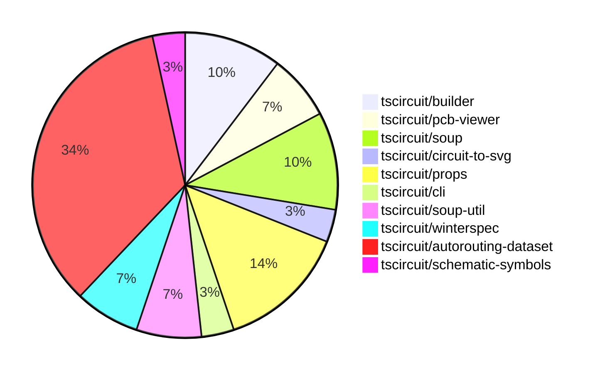

# Contribution Overview 2024-08-10

## PRs by Repository

## Contributor Overview

| Contributor | 🐳 Major | 🐙 Minor | 🐌 Tiny |
|-------------|-------|-------|-------|
| imrishabh18 | 4 | 6 | 0 |
| abhijitxy | 1 | 2 | 0 |
| seveibar | 13 | 2 | 0 |
| angelacaq | 1 | 0 | 0 |

## Changes by Repository

### [tscircuit/builder](https://github.com/tscircuit/builder)

| PR # | Impact | Contributor | Description |
|------|--------|-------------|-------------|
| [#102](https://github.com/tscircuit/builder/pull/102) | 🐳 Major | imrishabh18 | Introduces a new `trace_width` property in the `TraceHint` object, which can be specified in the `offset` parameter. |
| [#97](https://github.com/tscircuit/builder/pull/97) | 🐳 Major | abhijitxy | Add a test to replicate the issue of duplicate port hints by creating a `bug` with `footprint="soic8"`. |
| [#101](https://github.com/tscircuit/builder/pull/101) | 🐙 Minor | imrishabh18 | Add trace width property to the `TraceHintProps` type. |

### [tscircuit/pcb-viewer](https://github.com/tscircuit/pcb-viewer)

| PR # | Impact | Contributor | Description |
|------|--------|-------------|-------------|
| [#35](https://github.com/tscircuit/pcb-viewer/pull/35) | 🐳 Major | imrishabh18 | Add the ability to specify trace width in the `PcbTraceHint` component. |
| [#34](https://github.com/tscircuit/pcb-viewer/pull/34) | 🐙 Minor | imrishabh18 | Fix a TypeScript issue by updating import statements in multiple files. |

### [tscircuit/soup](https://github.com/tscircuit/soup)

| PR # | Impact | Contributor | Description |
|------|--------|-------------|-------------|
| [#18](https://github.com/tscircuit/soup/pull/18) | 🐳 Major | imrishabh18 | Introduce a new `pcb_keepout` entity to represent keepout areas on a PCB. |
| [#20](https://github.com/tscircuit/soup/pull/20) | 🐙 Minor | imrishabh18 | Add `trace_width` field to `pcb_trace_hint` and `route_hint_point` types. |
| [#19](https://github.com/tscircuit/soup/pull/19) | 🐙 Minor | imrishabh18 | Introduce a new optional property `trace_width` to the `pcb_trace_hint` schema. |

### [tscircuit/circuit-to-svg](https://github.com/tscircuit/circuit-to-svg)

| PR # | Impact | Contributor | Description |
|------|--------|-------------|-------------|
| [#12](https://github.com/tscircuit/circuit-to-svg/pull/12) | 🐳 Major | imrishabh18 | Flips the schematic in the Y-axis to match the schematic-viewer and adds support for parsing and displaying schematic ports. |

### [tscircuit/props](https://github.com/tscircuit/props)

| PR # | Impact | Contributor | Description |
|------|--------|-------------|-------------|
| [#18](https://github.com/tscircuit/props/pull/18) | 🐙 Minor | imrishabh18 | Update the version of the "@tscircuit/soup" dependency from 0.0.17 to 0.0.50. |
| [#16](https://github.com/tscircuit/props/pull/16) | 🐙 Minor | imrishabh18 | Add a new optional `traceWidth` property to the `TraceHintProps` type. |
| [#17](https://github.com/tscircuit/props/pull/17) | 🐙 Minor | abhijitxy | Added `SwitchProps` to standardize props for the `Switch` component. |
| [#14](https://github.com/tscircuit/props/pull/14) | 🐙 Minor | abhijitxy | Rename BugProps to ChipProps and deprecate the old name |

### [tscircuit/cli](https://github.com/tscircuit/cli)

| PR # | Impact | Contributor | Description |
|------|--------|-------------|-------------|
| [#120](https://github.com/tscircuit/cli/pull/120) | 🐳 Major | seveibar | Reorganizes the project into a single package.json, fixes all types, improves imports, and improves overall organization. |

### [tscircuit/soup-util](https://github.com/tscircuit/soup-util)

| PR # | Impact | Contributor | Description |
|------|--------|-------------|-------------|
| [#7](https://github.com/tscircuit/soup-util/pull/7) | 🐳 Major | seveibar | Add a delete method to the SoupUtils library. |
| [#6](https://github.com/tscircuit/soup-util/pull/6) | 🐳 Major | seveibar | Add support for the `insert` method and the `toArray` method to the `su` object. |

### [tscircuit/winterspec](https://github.com/tscircuit/winterspec)

| PR # | Impact | Contributor | Description |
|------|--------|-------------|-------------|
| [#7](https://github.com/tscircuit/winterspec/pull/7) | 🐳 Major | seveibar | Fix for not passing `opts` when creating bundles from directories, causing middleware not to run |
| [#6](https://github.com/tscircuit/winterspec/pull/6) | 🐙 Minor | seveibar | Add support for fetch middleware in the `createFetchHandlerFromDir` function. |

### [tscircuit/autorouting-dataset](https://github.com/tscircuit/autorouting-dataset)

| PR # | Impact | Contributor | Description |
|------|--------|-------------|-------------|
| [#37](https://github.com/tscircuit/autorouting-dataset/pull/37) | 🐳 Major | seveibar | Publish the "ijump" algorithm as a package |
| [#33](https://github.com/tscircuit/autorouting-dataset/pull/33) | 🐳 Major | seveibar | Introduce the `ijump-max (ijump v2)` algorithm, enhance logging, and refactor the infinite grid autorouter. |
| [#32](https://github.com/tscircuit/autorouting-dataset/pull/32) | 🐳 Major | seveibar | Check and regenerate examples that have overlapping pads |
| [#30](https://github.com/tscircuit/autorouting-dataset/pull/30) | 🐳 Major | seveibar | Introduce support for multi-trace routing and conjoined obstacle detection in the ijump-astar algorithm. |
| [#26](https://github.com/tscircuit/autorouting-dataset/pull/26) | 🐳 Major | seveibar | Optimizes the "ijump" algorithm by introducing orthogonal intersection detection and improved step calculations. |
| [#25](https://github.com/tscircuit/autorouting-dataset/pull/25) | 🐳 Major | seveibar | Optimize the non-diagonal neighbors calculation in the infgrid-ijump AStar algorithm. |
| [#24](https://github.com/tscircuit/autorouting-dataset/pull/24) | 🐳 Major | seveibar | Adds a benchmark for the "jumpy-grid" algorithm that uses the A* pathfinding algorithm to find routes in an infinite grid with obstacles. |
| [#23](https://github.com/tscircuit/autorouting-dataset/pull/23) | 🐳 Major | seveibar | Adding a Typescript algorithm template for an autorouting algorithm. |
| [#22](https://github.com/tscircuit/autorouting-dataset/pull/22) | 🐳 Major | angelacaq | Introduces a benchmark and a new algorithm (Jump Point Finder) for the autorouting solver, which is shown to have a 2x speed improvement over the previous A* algorithm for distant-single-trace cases. |
| [#29](https://github.com/tscircuit/autorouting-dataset/pull/29) | 🐙 Minor | seveibar | Remove diagonals from ortho implementation and add flag for fast step heuristic |

### [tscircuit/schematic-symbols](https://github.com/tscircuit/schematic-symbols)

| PR # | Impact | Contributor | Description |
|------|--------|-------------|-------------|
| [#2](https://github.com/tscircuit/schematic-symbols/pull/2) | 🐳 Major | seveibar | Added a new symbol for a fuse in both horizontal and vertical orientations. |

## Changes by Contributor

### [imrishabh18](https://github.com/imrishabh18)

| PR # | Impact | Description |
|------|--------|-------------|
| [#102](https://github.com/tscircuit/builder/pull/102) | 🐳 Major | Introduces a new `trace_width` property in the `TraceHint` object, which can be specified in the `offset` parameter. |
| [#35](https://github.com/tscircuit/pcb-viewer/pull/35) | 🐳 Major | Add the ability to specify trace width in the `PcbTraceHint` component. |
| [#18](https://github.com/tscircuit/soup/pull/18) | 🐳 Major | Introduce a new `pcb_keepout` entity to represent keepout areas on a PCB. |
| [#12](https://github.com/tscircuit/circuit-to-svg/pull/12) | 🐳 Major | Flips the schematic in the Y-axis to match the schematic-viewer and adds support for parsing and displaying schematic ports. |
| [#101](https://github.com/tscircuit/builder/pull/101) | 🐙 Minor | Add trace width property to the `TraceHintProps` type. |
| [#34](https://github.com/tscircuit/pcb-viewer/pull/34) | 🐙 Minor | Fix a TypeScript issue by updating import statements in multiple files. |
| [#20](https://github.com/tscircuit/soup/pull/20) | 🐙 Minor | Add `trace_width` field to `pcb_trace_hint` and `route_hint_point` types. |
| [#19](https://github.com/tscircuit/soup/pull/19) | 🐙 Minor | Introduce a new optional property `trace_width` to the `pcb_trace_hint` schema. |
| [#18](https://github.com/tscircuit/props/pull/18) | 🐙 Minor | Update the version of the "@tscircuit/soup" dependency from 0.0.17 to 0.0.50. |
| [#16](https://github.com/tscircuit/props/pull/16) | 🐙 Minor | Add a new optional `traceWidth` property to the `TraceHintProps` type. |

### [abhijitxy](https://github.com/abhijitxy)

| PR # | Impact | Description |
|------|--------|-------------|
| [#97](https://github.com/tscircuit/builder/pull/97) | 🐳 Major | Add a test to replicate the issue of duplicate port hints by creating a `bug` with `footprint="soic8"`. |
| [#17](https://github.com/tscircuit/props/pull/17) | 🐙 Minor | Added `SwitchProps` to standardize props for the `Switch` component. |
| [#14](https://github.com/tscircuit/props/pull/14) | 🐙 Minor | Rename BugProps to ChipProps and deprecate the old name |

### [seveibar](https://github.com/seveibar)

| PR # | Impact | Description |
|------|--------|-------------|
| [#120](https://github.com/tscircuit/cli/pull/120) | 🐳 Major | Reorganizes the project into a single package.json, fixes all types, improves imports, and improves overall organization. |
| [#7](https://github.com/tscircuit/soup-util/pull/7) | 🐳 Major | Add a delete method to the SoupUtils library. |
| [#6](https://github.com/tscircuit/soup-util/pull/6) | 🐳 Major | Add support for the `insert` method and the `toArray` method to the `su` object. |
| [#7](https://github.com/tscircuit/winterspec/pull/7) | 🐳 Major | Fix for not passing `opts` when creating bundles from directories, causing middleware not to run |
| [#37](https://github.com/tscircuit/autorouting-dataset/pull/37) | 🐳 Major | Publish the "ijump" algorithm as a package |
| [#33](https://github.com/tscircuit/autorouting-dataset/pull/33) | 🐳 Major | Introduce the `ijump-max (ijump v2)` algorithm, enhance logging, and refactor the infinite grid autorouter. |
| [#32](https://github.com/tscircuit/autorouting-dataset/pull/32) | 🐳 Major | Check and regenerate examples that have overlapping pads |
| [#30](https://github.com/tscircuit/autorouting-dataset/pull/30) | 🐳 Major | Introduce support for multi-trace routing and conjoined obstacle detection in the ijump-astar algorithm. |
| [#26](https://github.com/tscircuit/autorouting-dataset/pull/26) | 🐳 Major | Optimizes the "ijump" algorithm by introducing orthogonal intersection detection and improved step calculations. |
| [#25](https://github.com/tscircuit/autorouting-dataset/pull/25) | 🐳 Major | Optimize the non-diagonal neighbors calculation in the infgrid-ijump AStar algorithm. |
| [#24](https://github.com/tscircuit/autorouting-dataset/pull/24) | 🐳 Major | Adds a benchmark for the "jumpy-grid" algorithm that uses the A* pathfinding algorithm to find routes in an infinite grid with obstacles. |
| [#23](https://github.com/tscircuit/autorouting-dataset/pull/23) | 🐳 Major | Adding a Typescript algorithm template for an autorouting algorithm. |
| [#2](https://github.com/tscircuit/schematic-symbols/pull/2) | 🐳 Major | Added a new symbol for a fuse in both horizontal and vertical orientations. |
| [#6](https://github.com/tscircuit/winterspec/pull/6) | 🐙 Minor | Add support for fetch middleware in the `createFetchHandlerFromDir` function. |
| [#29](https://github.com/tscircuit/autorouting-dataset/pull/29) | 🐙 Minor | Remove diagonals from ortho implementation and add flag for fast step heuristic |

### [angelacaq](https://github.com/angelacaq)

| PR # | Impact | Description |
|------|--------|-------------|
| [#22](https://github.com/tscircuit/autorouting-dataset/pull/22) | 🐳 Major | Introduces a benchmark and a new algorithm (Jump Point Finder) for the autorouting solver, which is shown to have a 2x speed improvement over the previous A* algorithm for distant-single-trace cases. |

