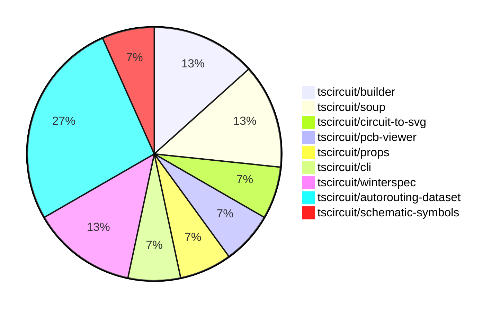

# Contribution Overview 2024-08-10

## PRs by Repository

## Contributor Overview

| Contributor | 🐳 Major | 🐙 Minor | 🐌 Tiny |
|-------------|-------|-------|-------|
| imrishabh18 | 3 | 3 | 0 |
| abhijitxy | 1 | 0 | 0 |
| seveibar | 7 | 0 | 0 |
| angelacaq | 1 | 0 | 0 |

## Changes by Repository

### [tscircuit/builder](https://github.com/tscircuit/builder)

| PR # | Impact | Contributor | Description |
|------|--------|-------------|-------------|
| [#101](https://github.com/tscircuit/builder/pull/101) | 🐳 Major | imrishabh18 | Adds support for specifying the trace width in the `TraceHintBuilder`. |
| [#97](https://github.com/tscircuit/builder/pull/97) | 🐳 Major | abhijitxy | Add a test to replicate the issue of duplicate port hints by creating a `bug` with `footprint="soic8"`. |

### [tscircuit/soup](https://github.com/tscircuit/soup)

| PR # | Impact | Contributor | Description |
|------|--------|-------------|-------------|
| [#18](https://github.com/tscircuit/soup/pull/18) | 🐳 Major | imrishabh18 | Introduce a new `pcb_keepout` feature to the project. |
| [#19](https://github.com/tscircuit/soup/pull/19) | 🐙 Minor | imrishabh18 | Add an optional `trace_width` field to the `pcb_trace_hint` schema. |

### [tscircuit/circuit-to-svg](https://github.com/tscircuit/circuit-to-svg)

| PR # | Impact | Contributor | Description |
|------|--------|-------------|-------------|
| [#12](https://github.com/tscircuit/circuit-to-svg/pull/12) | 🐳 Major | imrishabh18 | Fixes the schematic port rendering and flips the schematic in the Y-axis to match the schematic-viewer. |

### [tscircuit/pcb-viewer](https://github.com/tscircuit/pcb-viewer)

| PR # | Impact | Contributor | Description |
|------|--------|-------------|-------------|
| [#34](https://github.com/tscircuit/pcb-viewer/pull/34) | 🐙 Minor | imrishabh18 | Fix a TypeScript issue by updating import statements in the project. |

### [tscircuit/props](https://github.com/tscircuit/props)

| PR # | Impact | Contributor | Description |
|------|--------|-------------|-------------|
| [#16](https://github.com/tscircuit/props/pull/16) | 🐙 Minor | imrishabh18 | Add a new optional property `traceWidth` to `TraceHintProps` type |

### [tscircuit/cli](https://github.com/tscircuit/cli)

| PR # | Impact | Contributor | Description |
|------|--------|-------------|-------------|
| [#120](https://github.com/tscircuit/cli/pull/120) | 🐳 Major | seveibar | The pull request reorganizes the project into four main directories (`api`, `frontend`, `cli` and `example-project`), fixes all types, improves imports, and enhances the overall organization of the codebase. |

### [tscircuit/winterspec](https://github.com/tscircuit/winterspec)

| PR # | Impact | Contributor | Description |
|------|--------|-------------|-------------|
| [#7](https://github.com/tscircuit/winterspec/pull/7) | 🐳 Major | seveibar | Fixes an issue where `opts` were not being passed when creating bundles from directories, causing middleware not to run. |
| [#6](https://github.com/tscircuit/winterspec/pull/6) | 🐳 Major | seveibar | Add support for fetch middleware in the WinterSpec adapter. |

### [tscircuit/autorouting-dataset](https://github.com/tscircuit/autorouting-dataset)

| PR # | Impact | Contributor | Description |
|------|--------|-------------|-------------|
| [#25](https://github.com/tscircuit/autorouting-dataset/pull/25) | 🐳 Major | seveibar | Optimizes the non-diagonal movement in the `infgrid-ijump` A* pathfinding algorithm. |
| [#24](https://github.com/tscircuit/autorouting-dataset/pull/24) | 🐳 Major | seveibar | Implements an A* algorithm for pathfinding on an infinite grid with obstacles. |
| [#23](https://github.com/tscircuit/autorouting-dataset/pull/23) | 🐳 Major | seveibar | Adds a TypeScript algorithm template for an autorouting algorithm. |
| [#22](https://github.com/tscircuit/autorouting-dataset/pull/22) | 🐳 Major | angelacaq | Introduce a new algorithm, the Jump Point Finder algorithm, to solve the grid routing problem for distant-single-trace connections, which shows a 2x speedup over the A* algorithm. |

### [tscircuit/schematic-symbols](https://github.com/tscircuit/schematic-symbols)

| PR # | Impact | Contributor | Description |
|------|--------|-------------|-------------|
| [#2](https://github.com/tscircuit/schematic-symbols/pull/2) | 🐳 Major | seveibar | Added a new "fuse" symbol in both horizontal and vertical orientations. |

## Changes by Contributor

### [imrishabh18](https://github.com/imrishabh18)

| PR # | Impact | Description |
|------|--------|-------------|
| [#101](https://github.com/tscircuit/builder/pull/101) | 🐳 Major | Adds support for specifying the trace width in the `TraceHintBuilder`. |
| [#18](https://github.com/tscircuit/soup/pull/18) | 🐳 Major | Introduce a new `pcb_keepout` feature to the project. |
| [#12](https://github.com/tscircuit/circuit-to-svg/pull/12) | 🐳 Major | Fixes the schematic port rendering and flips the schematic in the Y-axis to match the schematic-viewer. |
| [#34](https://github.com/tscircuit/pcb-viewer/pull/34) | 🐙 Minor | Fix a TypeScript issue by updating import statements in the project. |
| [#19](https://github.com/tscircuit/soup/pull/19) | 🐙 Minor | Add an optional `trace_width` field to the `pcb_trace_hint` schema. |
| [#16](https://github.com/tscircuit/props/pull/16) | 🐙 Minor | Add a new optional property `traceWidth` to `TraceHintProps` type |

### [abhijitxy](https://github.com/abhijitxy)

| PR # | Impact | Description |
|------|--------|-------------|
| [#97](https://github.com/tscircuit/builder/pull/97) | 🐳 Major | Add a test to replicate the issue of duplicate port hints by creating a `bug` with `footprint="soic8"`. |

### [seveibar](https://github.com/seveibar)

| PR # | Impact | Description |
|------|--------|-------------|
| [#120](https://github.com/tscircuit/cli/pull/120) | 🐳 Major | The pull request reorganizes the project into four main directories (`api`, `frontend`, `cli` and `example-project`), fixes all types, improves imports, and enhances the overall organization of the codebase. |
| [#7](https://github.com/tscircuit/winterspec/pull/7) | 🐳 Major | Fixes an issue where `opts` were not being passed when creating bundles from directories, causing middleware not to run. |
| [#6](https://github.com/tscircuit/winterspec/pull/6) | 🐳 Major | Add support for fetch middleware in the WinterSpec adapter. |
| [#25](https://github.com/tscircuit/autorouting-dataset/pull/25) | 🐳 Major | Optimizes the non-diagonal movement in the `infgrid-ijump` A* pathfinding algorithm. |
| [#24](https://github.com/tscircuit/autorouting-dataset/pull/24) | 🐳 Major | Implements an A* algorithm for pathfinding on an infinite grid with obstacles. |
| [#23](https://github.com/tscircuit/autorouting-dataset/pull/23) | 🐳 Major | Adds a TypeScript algorithm template for an autorouting algorithm. |
| [#2](https://github.com/tscircuit/schematic-symbols/pull/2) | 🐳 Major | Added a new "fuse" symbol in both horizontal and vertical orientations. |

### [angelacaq](https://github.com/angelacaq)

| PR # | Impact | Description |
|------|--------|-------------|
| [#22](https://github.com/tscircuit/autorouting-dataset/pull/22) | 🐳 Major | Introduce a new algorithm, the Jump Point Finder algorithm, to solve the grid routing problem for distant-single-trace connections, which shows a 2x speedup over the A* algorithm. |

