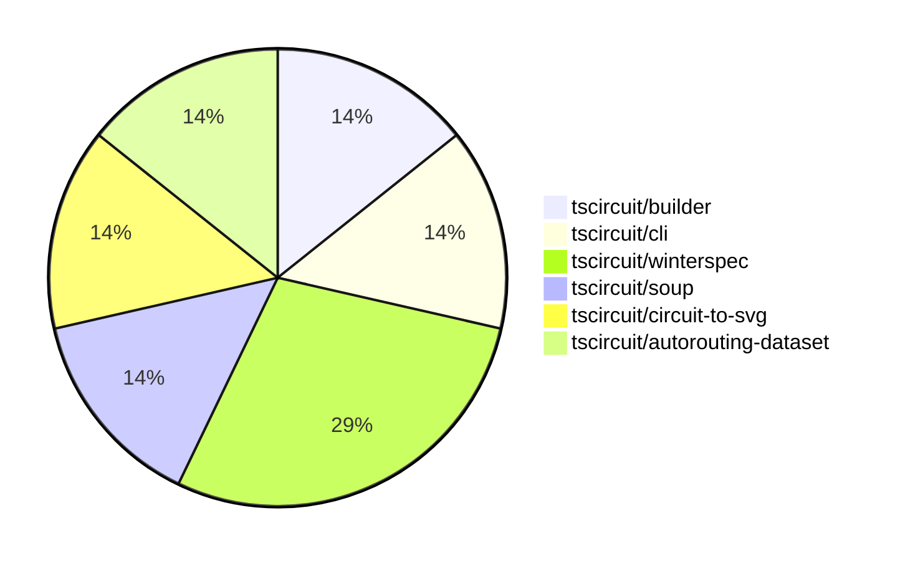

# Contribution Overview 2024-08-10

## PRs by Repository

## Contributor Overview

| Contributor | 🐳 Major | 🐙 Minor | 🐌 Tiny |
|-------------|-------|-------|-------|
| abhijitxy | 1 | 0 | 0 |
| seveibar | 2 | 1 | 0 |
| imrishabh18 | 2 | 0 | 0 |
| angelacaq | 1 | 0 | 0 |

## Changes by Repository

### [tscircuit/builder](https://github.com/tscircuit/builder)

| PR # | Impact | Contributor | Description |
|------|--------|-------------|-------------|
| [#97](https://github.com/tscircuit/builder/pull/97) | 🐳 Major | abhijitxy | Add a test to replicate the issue of duplicate port hints by creating a `bug` with `footprint="soic8"`. |

### [tscircuit/cli](https://github.com/tscircuit/cli)

| PR # | Impact | Contributor | Description |
|------|--------|-------------|-------------|
| [#120](https://github.com/tscircuit/cli/pull/120) | 🐳 Major | seveibar |  |

### [tscircuit/winterspec](https://github.com/tscircuit/winterspec)

| PR # | Impact | Contributor | Description |
|------|--------|-------------|-------------|
| [#7](https://github.com/tscircuit/winterspec/pull/7) | 🐳 Major | seveibar | Fix a bug where the `opts` parameter was not being passed when creating bundles from directories, causing middleware not to run. |
| [#6](https://github.com/tscircuit/winterspec/pull/6) | 🐙 Minor | seveibar | Add support for fetch middleware in the createFetchHandlerFromDir function. |

### [tscircuit/soup](https://github.com/tscircuit/soup)

| PR # | Impact | Contributor | Description |
|------|--------|-------------|-------------|
| [#18](https://github.com/tscircuit/soup/pull/18) | 🐳 Major | imrishabh18 | Introduce a new PCB keepout feature, which allows defining rectangular or circular keepout areas on the PCB. |

### [tscircuit/circuit-to-svg](https://github.com/tscircuit/circuit-to-svg)

| PR # | Impact | Contributor | Description |
|------|--------|-------------|-------------|
| [#12](https://github.com/tscircuit/circuit-to-svg/pull/12) | 🐳 Major | imrishabh18 | Fix issue #12 by adding support for schematic ports and flipping the schematic in the Y-axis to match the schematic-viewer |

### [tscircuit/autorouting-dataset](https://github.com/tscircuit/autorouting-dataset)

| PR # | Impact | Contributor | Description |
|------|--------|-------------|-------------|
| [#22](https://github.com/tscircuit/autorouting-dataset/pull/22) | 🐳 Major | angelacaq | Introduce a new algorithm (Jump Point finder) to solve distant-single-trace routing, which is 2x faster than the previous A* algorithm. |

## Changes by Contributor

### [abhijitxy](https://github.com/abhijitxy)

| PR # | Impact | Description |
|------|--------|-------------|
| [#97](https://github.com/tscircuit/builder/pull/97) | 🐳 Major | Add a test to replicate the issue of duplicate port hints by creating a `bug` with `footprint="soic8"`. |

### [seveibar](https://github.com/seveibar)

| PR # | Impact | Description |
|------|--------|-------------|
| [#120](https://github.com/tscircuit/cli/pull/120) | 🐳 Major |  |
| [#7](https://github.com/tscircuit/winterspec/pull/7) | 🐳 Major | Fix a bug where the `opts` parameter was not being passed when creating bundles from directories, causing middleware not to run. |
| [#6](https://github.com/tscircuit/winterspec/pull/6) | 🐙 Minor | Add support for fetch middleware in the createFetchHandlerFromDir function. |

### [imrishabh18](https://github.com/imrishabh18)

| PR # | Impact | Description |
|------|--------|-------------|
| [#18](https://github.com/tscircuit/soup/pull/18) | 🐳 Major | Introduce a new PCB keepout feature, which allows defining rectangular or circular keepout areas on the PCB. |
| [#12](https://github.com/tscircuit/circuit-to-svg/pull/12) | 🐳 Major | Fix issue #12 by adding support for schematic ports and flipping the schematic in the Y-axis to match the schematic-viewer |

### [angelacaq](https://github.com/angelacaq)

| PR # | Impact | Description |
|------|--------|-------------|
| [#22](https://github.com/tscircuit/autorouting-dataset/pull/22) | 🐳 Major | Introduce a new algorithm (Jump Point finder) to solve distant-single-trace routing, which is 2x faster than the previous A* algorithm. |

