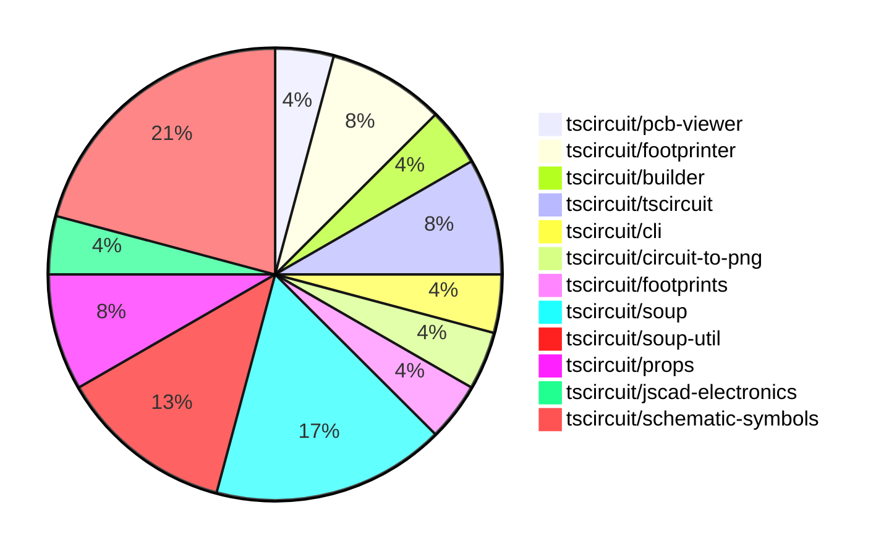

# Contribution Overview 2024-08-17

## PRs by Repository

## Contributor Overview

| Contributor | 🐳 Major | 🐙 Minor | 🐌 Tiny |
|-------------|-------|-------|-------|
| imrishabh18 | 2 | 5 | 0 |
| seveibar | 10 | 6 | 0 |
| abhijitxy | 1 | 0 | 0 |

## Changes by Repository

### [tscircuit/pcb-viewer](https://github.com/tscircuit/pcb-viewer)

| PR # | Impact | Contributor | Description |
|------|--------|-------------|-------------|
| [#37](https://github.com/tscircuit/pcb-viewer/pull/37) | 🐳 Major | imrishabh18 | Add the bulge in the trace |

### [tscircuit/footprinter](https://github.com/tscircuit/footprinter)

| PR # | Impact | Contributor | Description |
|------|--------|-------------|-------------|
| [#17](https://github.com/tscircuit/footprinter/pull/17) | 🐳 Major | imrishabh18 | Add circuit-to-svg package and update tests to use it for creating SVG snapshots. |
| [#15](https://github.com/tscircuit/footprinter/pull/15) | 🐳 Major | abhijitxy | Add SOT23 package definition |

### [tscircuit/builder](https://github.com/tscircuit/builder)

| PR # | Impact | Contributor | Description |
|------|--------|-------------|-------------|
| [#103](https://github.com/tscircuit/builder/pull/103) | 🐙 Minor | imrishabh18 | Added `circuit-to-png` as a development dependency |

### [tscircuit/tscircuit](https://github.com/tscircuit/tscircuit)

| PR # | Impact | Contributor | Description |
|------|--------|-------------|-------------|
| [#351](https://github.com/tscircuit/tscircuit/pull/351) | 🐙 Minor | imrishabh18 | Automatically update package version by checking for updates and creating a pull request if a newer version is available. |
| [#349](https://github.com/tscircuit/tscircuit/pull/349) | 🐙 Minor | imrishabh18 | Update the package dependency "@tscircuit/builder" from version 1.5.141 to 1.11.1 |

### [tscircuit/cli](https://github.com/tscircuit/cli)

| PR # | Impact | Contributor | Description |
|------|--------|-------------|-------------|
| [#124](https://github.com/tscircuit/cli/pull/124) | 🐙 Minor | imrishabh18 | Fix: add dynamic import |

### [tscircuit/circuit-to-png](https://github.com/tscircuit/circuit-to-png)

| PR # | Impact | Contributor | Description |
|------|--------|-------------|-------------|
| [#13](https://github.com/tscircuit/circuit-to-png/pull/13) | 🐙 Minor | imrishabh18 | Removes the `@resvg/resvg-wasm` package dependency as it is not being used. |

### [tscircuit/footprints](https://github.com/tscircuit/footprints)

| PR # | Impact | Contributor | Description |
|------|--------|-------------|-------------|
| [#3](https://github.com/tscircuit/footprints/pull/3) | 🐳 Major | seveibar | This pull request performs a huge repository cleanup, switches to the Bun runtime, fixes type issues, adds workflows for format checking, type checking, and publishing to npm. |

### [tscircuit/soup](https://github.com/tscircuit/soup)

| PR # | Impact | Contributor | Description |
|------|--------|-------------|-------------|
| [#27](https://github.com/tscircuit/soup/pull/27) | 🐳 Major | seveibar | Introduces a new formatbot that has special behavior for forks (only checks without autofix) |
| [#23](https://github.com/tscircuit/soup/pull/23) | 🐳 Major | seveibar | Add route thickness mode and should_round_corners property to the PCB trace schema. |
| [#24](https://github.com/tscircuit/soup/pull/24) | 🐙 Minor | seveibar | Add optional `symbol_name` field to `SchematicComponent` type. |
| [#22](https://github.com/tscircuit/soup/pull/22) | 🐙 Minor | seveibar | Add a new property `pcb_board_id` to the `pcb_board` object with a default value of `"pcb_board_0"`. |

### [tscircuit/soup-util](https://github.com/tscircuit/soup-util)

| PR # | Impact | Contributor | Description |
|------|--------|-------------|-------------|
| [#8](https://github.com/tscircuit/soup-util/pull/8) | 🐳 Major | seveibar | Add an update method to the su module. |
| [#7](https://github.com/tscircuit/soup-util/pull/7) | 🐳 Major | seveibar | Add a new `delete` method to the `su` object to remove an element from the soup based on its ID. |
| [#6](https://github.com/tscircuit/soup-util/pull/6) | 🐳 Major | seveibar | Adds support for the `insert` method and `toArray` method to the `SoupUtilObjects` type. |

### [tscircuit/props](https://github.com/tscircuit/props)

| PR # | Impact | Contributor | Description |
|------|--------|-------------|-------------|
| [#20](https://github.com/tscircuit/props/pull/20) | 🐳 Major | seveibar | Improve published types and add support for port references that use a function |
| [#21](https://github.com/tscircuit/props/pull/21) | 🐙 Minor | seveibar | Avoid parsing `portRef` reference and losing the reference. |

### [tscircuit/jscad-electronics](https://github.com/tscircuit/jscad-electronics)

| PR # | Impact | Contributor | Description |
|------|--------|-------------|-------------|
| [#13](https://github.com/tscircuit/jscad-electronics/pull/13) | 🐳 Major | seveibar | Implement tssop package component |

### [tscircuit/schematic-symbols](https://github.com/tscircuit/schematic-symbols)

| PR # | Impact | Contributor | Description |
|------|--------|-------------|-------------|
| [#7](https://github.com/tscircuit/schematic-symbols/pull/7) | 🐳 Major | seveibar | Add formatcheck and typecheck CI workflows, run format, and add formatbot. |
| [#4](https://github.com/tscircuit/schematic-symbols/pull/4) | 🐳 Major | seveibar | Initial release of the project, including adding a Vercel build script, fixing type errors, and publishing version 0.0.1. |
| [#9](https://github.com/tscircuit/schematic-symbols/pull/9) | 🐙 Minor | seveibar | Fix the coordinates of the diode and LED symbols |
| [#6](https://github.com/tscircuit/schematic-symbols/pull/6) | 🐙 Minor | seveibar | Add computed fields to the exported symbols object to make it easier to use. |
| [#5](https://github.com/tscircuit/schematic-symbols/pull/5) | 🐙 Minor | seveibar | Add type exports for drawing primitives |

## Changes by Contributor

### [imrishabh18](https://github.com/imrishabh18)

| PR # | Impact | Description |
|------|--------|-------------|
| [#37](https://github.com/tscircuit/pcb-viewer/pull/37) | 🐳 Major | Add the bulge in the trace |
| [#17](https://github.com/tscircuit/footprinter/pull/17) | 🐳 Major | Add circuit-to-svg package and update tests to use it for creating SVG snapshots. |
| [#103](https://github.com/tscircuit/builder/pull/103) | 🐙 Minor | Added `circuit-to-png` as a development dependency |
| [#351](https://github.com/tscircuit/tscircuit/pull/351) | 🐙 Minor | Automatically update package version by checking for updates and creating a pull request if a newer version is available. |
| [#349](https://github.com/tscircuit/tscircuit/pull/349) | 🐙 Minor | Update the package dependency "@tscircuit/builder" from version 1.5.141 to 1.11.1 |
| [#124](https://github.com/tscircuit/cli/pull/124) | 🐙 Minor | Fix: add dynamic import |
| [#13](https://github.com/tscircuit/circuit-to-png/pull/13) | 🐙 Minor | Removes the `@resvg/resvg-wasm` package dependency as it is not being used. |

### [seveibar](https://github.com/seveibar)

| PR # | Impact | Description |
|------|--------|-------------|
| [#3](https://github.com/tscircuit/footprints/pull/3) | 🐳 Major | This pull request performs a huge repository cleanup, switches to the Bun runtime, fixes type issues, adds workflows for format checking, type checking, and publishing to npm. |
| [#27](https://github.com/tscircuit/soup/pull/27) | 🐳 Major | Introduces a new formatbot that has special behavior for forks (only checks without autofix) |
| [#23](https://github.com/tscircuit/soup/pull/23) | 🐳 Major | Add route thickness mode and should_round_corners property to the PCB trace schema. |
| [#8](https://github.com/tscircuit/soup-util/pull/8) | 🐳 Major | Add an update method to the su module. |
| [#7](https://github.com/tscircuit/soup-util/pull/7) | 🐳 Major | Add a new `delete` method to the `su` object to remove an element from the soup based on its ID. |
| [#6](https://github.com/tscircuit/soup-util/pull/6) | 🐳 Major | Adds support for the `insert` method and `toArray` method to the `SoupUtilObjects` type. |
| [#20](https://github.com/tscircuit/props/pull/20) | 🐳 Major | Improve published types and add support for port references that use a function |
| [#13](https://github.com/tscircuit/jscad-electronics/pull/13) | 🐳 Major | Implement tssop package component |
| [#7](https://github.com/tscircuit/schematic-symbols/pull/7) | 🐳 Major | Add formatcheck and typecheck CI workflows, run format, and add formatbot. |
| [#4](https://github.com/tscircuit/schematic-symbols/pull/4) | 🐳 Major | Initial release of the project, including adding a Vercel build script, fixing type errors, and publishing version 0.0.1. |
| [#24](https://github.com/tscircuit/soup/pull/24) | 🐙 Minor | Add optional `symbol_name` field to `SchematicComponent` type. |
| [#22](https://github.com/tscircuit/soup/pull/22) | 🐙 Minor | Add a new property `pcb_board_id` to the `pcb_board` object with a default value of `"pcb_board_0"`. |
| [#21](https://github.com/tscircuit/props/pull/21) | 🐙 Minor | Avoid parsing `portRef` reference and losing the reference. |
| [#9](https://github.com/tscircuit/schematic-symbols/pull/9) | 🐙 Minor | Fix the coordinates of the diode and LED symbols |
| [#6](https://github.com/tscircuit/schematic-symbols/pull/6) | 🐙 Minor | Add computed fields to the exported symbols object to make it easier to use. |
| [#5](https://github.com/tscircuit/schematic-symbols/pull/5) | 🐙 Minor | Add type exports for drawing primitives |

### [abhijitxy](https://github.com/abhijitxy)

| PR # | Impact | Description |
|------|--------|-------------|
| [#15](https://github.com/tscircuit/footprinter/pull/15) | 🐳 Major | Add SOT23 package definition |

