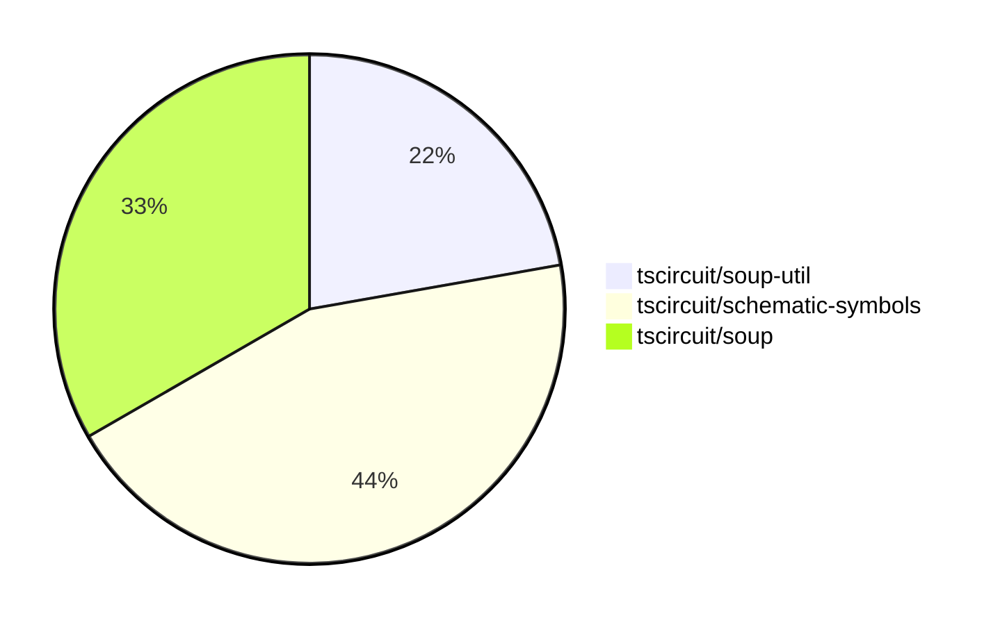

# Contribution Overview 2024-08-17

## PRs by Repository

## Contributor Overview

| Contributor | 🐳 Major | 🐙 Minor | 🐌 Tiny |
|-------------|-------|-------|-------|
| seveibar | 4 | 5 | 0 |

## Changes by Repository

### [tscircuit/soup-util](https://github.com/tscircuit/soup-util)

| PR # | Impact | Contributor | Description |
|------|--------|-------------|-------------|
| [#7](https://github.com/tscircuit/soup-util/pull/7) | 🐳 Major | seveibar | Add a new `delete` method to the `su` object, which allows deleting an element from the soup based on its ID. |
| [#6](https://github.com/tscircuit/soup-util/pull/6) | 🐳 Major | seveibar | Adds support for the `insert` method and the `toArray` method to the `SoupUtilObjects` type. |

### [tscircuit/schematic-symbols](https://github.com/tscircuit/schematic-symbols)

| PR # | Impact | Contributor | Description |
|------|--------|-------------|-------------|
| [#7](https://github.com/tscircuit/schematic-symbols/pull/7) | 🐳 Major | seveibar | Add formatcheck and typecheck GitHub Actions workflows and a formatbot to automatically format code on pull requests. |
| [#4](https://github.com/tscircuit/schematic-symbols/pull/4) | 🐳 Major | seveibar | Initial release with Vercel build script, type error fixes, and v0.0.1 release. |
| [#6](https://github.com/tscircuit/schematic-symbols/pull/6) | 🐙 Minor | seveibar | Add computed fields to the exported symbols to make it easier to use them. |
| [#5](https://github.com/tscircuit/schematic-symbols/pull/5) | 🐙 Minor | seveibar | Add type exports to the library's public API. |

### [tscircuit/soup](https://github.com/tscircuit/soup)

| PR # | Impact | Contributor | Description |
|------|--------|-------------|-------------|
| [#23](https://github.com/tscircuit/soup/pull/23) | 🐙 Minor | seveibar | Add route thickness mode and should_round_corners property to PCB trace schema |
| [#24](https://github.com/tscircuit/soup/pull/24) | 🐙 Minor | seveibar | Add an optional `symbol_name` field to schematic components. |
| [#22](https://github.com/tscircuit/soup/pull/22) | 🐙 Minor | seveibar | Add a new `pcb_board_id` field to the `pcb_board` object schema. |

## Changes by Contributor

### [seveibar](https://github.com/seveibar)

| PR # | Impact | Description |
|------|--------|-------------|
| [#7](https://github.com/tscircuit/soup-util/pull/7) | 🐳 Major | Add a new `delete` method to the `su` object, which allows deleting an element from the soup based on its ID. |
| [#6](https://github.com/tscircuit/soup-util/pull/6) | 🐳 Major | Adds support for the `insert` method and the `toArray` method to the `SoupUtilObjects` type. |
| [#7](https://github.com/tscircuit/schematic-symbols/pull/7) | 🐳 Major | Add formatcheck and typecheck GitHub Actions workflows and a formatbot to automatically format code on pull requests. |
| [#4](https://github.com/tscircuit/schematic-symbols/pull/4) | 🐳 Major | Initial release with Vercel build script, type error fixes, and v0.0.1 release. |
| [#23](https://github.com/tscircuit/soup/pull/23) | 🐙 Minor | Add route thickness mode and should_round_corners property to PCB trace schema |
| [#24](https://github.com/tscircuit/soup/pull/24) | 🐙 Minor | Add an optional `symbol_name` field to schematic components. |
| [#22](https://github.com/tscircuit/soup/pull/22) | 🐙 Minor | Add a new `pcb_board_id` field to the `pcb_board` object schema. |
| [#6](https://github.com/tscircuit/schematic-symbols/pull/6) | 🐙 Minor | Add computed fields to the exported symbols to make it easier to use them. |
| [#5](https://github.com/tscircuit/schematic-symbols/pull/5) | 🐙 Minor | Add type exports to the library's public API. |

