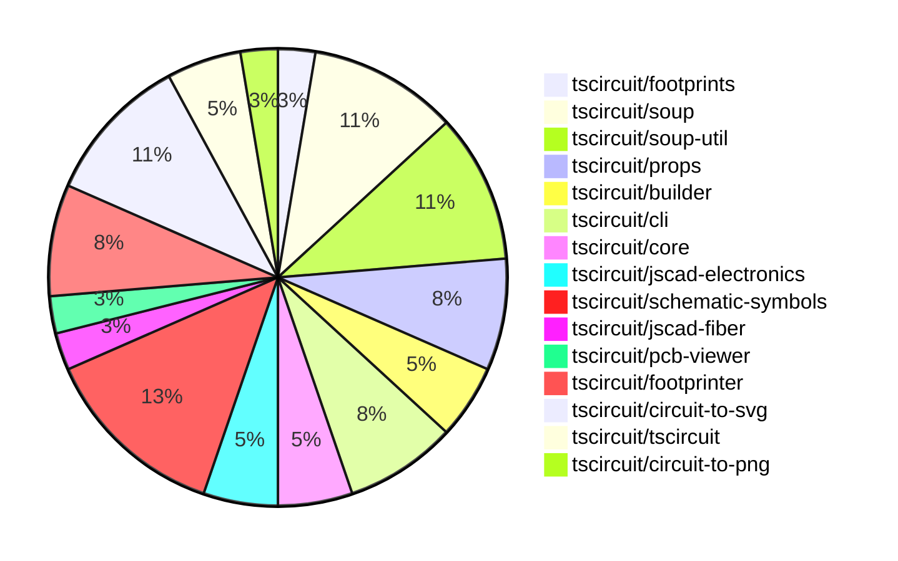

# Contribution Overview 2024-08-17

## PRs by Repository

## Contributor Overview

| Contributor | 🐳 Major | 🐙 Minor | 🐌 Tiny |
|-------------|-------|-------|-------|
| seveibar | 12 | 11 | 0 |
| imrishabh18 | 3 | 6 | 2 |
| anas-sarkez | 0 | 1 | 0 |
| abhijitxy | 2 | 0 | 0 |

## Changes by Repository

### [tscircuit/footprints](https://github.com/tscircuit/footprints)

| PR # | Impact | Contributor | Description |
|------|--------|-------------|-------------|
| [#3](https://github.com/tscircuit/footprints/pull/3) | 🐳 Major | seveibar | The pull request performs a major cleanup of the repository, including switching to the Bun runtime, fixing type issues, adding workflows for format checking, type checking, and publishing to npm, and fixing a published types error. |

### [tscircuit/soup](https://github.com/tscircuit/soup)

| PR # | Impact | Contributor | Description |
|------|--------|-------------|-------------|
| [#27](https://github.com/tscircuit/soup/pull/27) | 🐳 Major | seveibar | Introduce a new formatbot that has special behavior for forks, where it only checks without autofix. |
| [#23](https://github.com/tscircuit/soup/pull/23) | 🐙 Minor | seveibar | Add a new property `route_thickness_mode` to support constant or interpolated route thickness, and a new optional property `should_round_corners`. |
| [#24](https://github.com/tscircuit/soup/pull/24) | 🐙 Minor | seveibar | Add an optional `symbol_name` field to the `SchematicComponent` type. |
| [#22](https://github.com/tscircuit/soup/pull/22) | 🐙 Minor | seveibar | Add `pcb_board_id` field to `pcb_board` object |

### [tscircuit/soup-util](https://github.com/tscircuit/soup-util)

| PR # | Impact | Contributor | Description |
|------|--------|-------------|-------------|
| [#9](https://github.com/tscircuit/soup-util/pull/9) | 🐳 Major | seveibar | Adds an option to the `su` function to enable validation when inserting new elements into the soup. |
| [#8](https://github.com/tscircuit/soup-util/pull/8) | 🐳 Major | seveibar | Add an "update" method to the `su` object that allows modifying the properties of an existing element in the soup. |
| [#7](https://github.com/tscircuit/soup-util/pull/7) | 🐳 Major | seveibar | Add a new delete method to the su module |
| [#6](https://github.com/tscircuit/soup-util/pull/6) | 🐳 Major | seveibar | Add support for `insert` and `toArray` methods to the `su` utility object. |

### [tscircuit/props](https://github.com/tscircuit/props)

| PR # | Impact | Contributor | Description |
|------|--------|-------------|-------------|
| [#20](https://github.com/tscircuit/props/pull/20) | 🐳 Major | seveibar | Introduce a new `portRef` type and update the `traceProps` type to use the new `portRef` type instead of strings for `from` and `to` fields. |
| [#22](https://github.com/tscircuit/props/pull/22) | 🐙 Minor | seveibar | Make `<tracehint for="..." />` optional to support new syntax. |
| [#21](https://github.com/tscircuit/props/pull/21) | 🐙 Minor | seveibar | Avoid parsing `portRef` reference to prevent losing the reference. |

### [tscircuit/builder](https://github.com/tscircuit/builder)

| PR # | Impact | Contributor | Description |
|------|--------|-------------|-------------|
| [#104](https://github.com/tscircuit/builder/pull/104) | 🐙 Minor | seveibar | Fix the default value of `flip_y_axis` to false in the `convertSoupToExcellonDrillCommands`, `convertSoupToGerberCommands`, and `generatePickAndPlaceCSV` functions. |
| [#103](https://github.com/tscircuit/builder/pull/103) | 🐙 Minor | imrishabh18 | Added "circuit-to-png" as a devDependency |

### [tscircuit/cli](https://github.com/tscircuit/cli)

| PR # | Impact | Contributor | Description |
|------|--------|-------------|-------------|
| [#130](https://github.com/tscircuit/cli/pull/130) | 🐙 Minor | seveibar | Flip the Y-axis for Gerber and drill commands from true to false. |
| [#128](https://github.com/tscircuit/cli/pull/128) | 🐙 Minor | seveibar | Move `@tscircuit/builder` from `devDependencies` to `dependencies` |
| [#124](https://github.com/tscircuit/cli/pull/124) | 🐙 Minor | imrishabh18 | Add dynamic import for `circuitToPng` to improve performance. |

### [tscircuit/core](https://github.com/tscircuit/core)

| PR # | Impact | Contributor | Description |
|------|--------|-------------|-------------|
| [#4](https://github.com/tscircuit/core/pull/4) | 🟣 | seveibar |  |
| [#3](https://github.com/tscircuit/core/pull/3) | 🐳 Major | seveibar | Improve the implementation of the `selectAll` method in `PrimitiveComponent` to use the new `isMatchingSelector` utility function, and update the `Port` component to use the new `isMatchingNameOrAlias` and `isMatchingAnyOf` methods. |

### [tscircuit/jscad-electronics](https://github.com/tscircuit/jscad-electronics)

| PR # | Impact | Contributor | Description |
|------|--------|-------------|-------------|
| [#13](https://github.com/tscircuit/jscad-electronics/pull/13) | 🐳 Major | seveibar | Implement tssop component |
| [#14](https://github.com/tscircuit/jscad-electronics/pull/14) | 🐳 Major | abhijitxy | Implement a new component for the SOT-23-3P (Small Outline Transistor with 3 Pins) package. |

### [tscircuit/schematic-symbols](https://github.com/tscircuit/schematic-symbols)

| PR # | Impact | Contributor | Description |
|------|--------|-------------|-------------|
| [#9](https://github.com/tscircuit/schematic-symbols/pull/9) | 🐳 Major | seveibar | Fix the coordinates of the diode and LED symbols |
| [#7](https://github.com/tscircuit/schematic-symbols/pull/7) | 🐳 Major | seveibar | Add format check and type check workflows, run code format, and add a format bot to automatically format code in pull requests. |
| [#4](https://github.com/tscircuit/schematic-symbols/pull/4) | 🐳 Major | seveibar | Initial release of the schematic symbols project |
| [#6](https://github.com/tscircuit/schematic-symbols/pull/6) | 🐙 Minor | seveibar | Add computed fields to the exported symbols to make it easier to use them. |
| [#5](https://github.com/tscircuit/schematic-symbols/pull/5) | 🐙 Minor | seveibar | Add type exports for drawing primitives |

### [tscircuit/jscad-fiber](https://github.com/tscircuit/jscad-fiber)

| PR # | Impact | Contributor | Description |
|------|--------|-------------|-------------|
| [#71](https://github.com/tscircuit/jscad-fiber/pull/71) | 🐙 Minor | seveibar | Add a `zAxisUp` prop to the `JsCadFixture` component to allow rotating the scene by -90 degrees around the X-axis. |

### [tscircuit/pcb-viewer](https://github.com/tscircuit/pcb-viewer)

| PR # | Impact | Contributor | Description |
|------|--------|-------------|-------------|
| [#37](https://github.com/tscircuit/pcb-viewer/pull/37) | 🐳 Major | imrishabh18 | Add the buldge in the trace |

### [tscircuit/footprinter](https://github.com/tscircuit/footprinter)

| PR # | Impact | Contributor | Description |
|------|--------|-------------|-------------|
| [#17](https://github.com/tscircuit/footprinter/pull/17) | 🐳 Major | imrishabh18 | Introduce a new package `circuit-to-svg` to convert circuit soup to SVG. |
| [#15](https://github.com/tscircuit/footprinter/pull/15) | 🐳 Major | abhijitxy | Add SOT23 package definition |
| [#18](https://github.com/tscircuit/footprinter/pull/18) | 🐙 Minor | anas-sarkez | Added test and snapshot for tssop |

### [tscircuit/circuit-to-svg](https://github.com/tscircuit/circuit-to-svg)

| PR # | Impact | Contributor | Description |
|------|--------|-------------|-------------|
| [#21](https://github.com/tscircuit/circuit-to-svg/pull/21) | 🐳 Major | imrishabh18 | The pull request adds the 'svgson' library to the project's dependencies and modifies the 'pcb-soup-to-svg.ts' file to use the 'svgson' library to generate the SVG output. |
| [#24](https://github.com/tscircuit/circuit-to-svg/pull/24) | 🐙 Minor | imrishabh18 | Add a white background to the SVG element. |
| [#23](https://github.com/tscircuit/circuit-to-svg/pull/23) | 🐙 Minor | imrishabh18 | The pull request renames two functions, `pcbSoupToSvg` to `circuitJsonToPcbSvg` and `soupToSvg` to `circuitJsonToSchematicSvg`, to better reflect their purpose. |
| [#22](https://github.com/tscircuit/circuit-to-svg/pull/22) | 🐌 Tiny | imrishabh18 | Fix a typo in the `pcb-soup-to-svg.ts` file. |

### [tscircuit/tscircuit](https://github.com/tscircuit/tscircuit)

| PR # | Impact | Contributor | Description |
|------|--------|-------------|-------------|
| [#351](https://github.com/tscircuit/tscircuit/pull/351) | 🐙 Minor | imrishabh18 | Automatically update the package version by checking for updates daily and creating a pull request with the update if the tests pass. |
| [#349](https://github.com/tscircuit/tscircuit/pull/349) | 🐙 Minor | imrishabh18 | Upgrade the '@tscircuit/builder' dependency to version ^1.11.1 |

### [tscircuit/circuit-to-png](https://github.com/tscircuit/circuit-to-png)

| PR # | Impact | Contributor | Description |
|------|--------|-------------|-------------|
| [#13](https://github.com/tscircuit/circuit-to-png/pull/13) | 🐌 Tiny | imrishabh18 | Remove unused `@resvg/resvg-wasm` package from dependencies |

## Changes by Contributor

### [seveibar](https://github.com/seveibar)

| PR # | Impact | Description |
|------|--------|-------------|
| [#3](https://github.com/tscircuit/footprints/pull/3) | 🐳 Major | The pull request performs a major cleanup of the repository, including switching to the Bun runtime, fixing type issues, adding workflows for format checking, type checking, and publishing to npm, and fixing a published types error. |
| [#27](https://github.com/tscircuit/soup/pull/27) | 🐳 Major | Introduce a new formatbot that has special behavior for forks, where it only checks without autofix. |
| [#9](https://github.com/tscircuit/soup-util/pull/9) | 🐳 Major | Adds an option to the `su` function to enable validation when inserting new elements into the soup. |
| [#8](https://github.com/tscircuit/soup-util/pull/8) | 🐳 Major | Add an "update" method to the `su` object that allows modifying the properties of an existing element in the soup. |
| [#7](https://github.com/tscircuit/soup-util/pull/7) | 🐳 Major | Add a new delete method to the su module |
| [#6](https://github.com/tscircuit/soup-util/pull/6) | 🐳 Major | Add support for `insert` and `toArray` methods to the `su` utility object. |
| [#20](https://github.com/tscircuit/props/pull/20) | 🐳 Major | Introduce a new `portRef` type and update the `traceProps` type to use the new `portRef` type instead of strings for `from` and `to` fields. |
| [#104](https://github.com/tscircuit/builder/pull/104) | 🐙 Minor | Fix the default value of `flip_y_axis` to false in the `convertSoupToExcellonDrillCommands`, `convertSoupToGerberCommands`, and `generatePickAndPlaceCSV` functions. |
| [#130](https://github.com/tscircuit/cli/pull/130) | 🐙 Minor | Flip the Y-axis for Gerber and drill commands from true to false. |
| [#128](https://github.com/tscircuit/cli/pull/128) | 🐙 Minor | Move `@tscircuit/builder` from `devDependencies` to `dependencies` |
| [#23](https://github.com/tscircuit/soup/pull/23) | 🐙 Minor | Add a new property `route_thickness_mode` to support constant or interpolated route thickness, and a new optional property `should_round_corners`. |
| [#24](https://github.com/tscircuit/soup/pull/24) | 🐙 Minor | Add an optional `symbol_name` field to the `SchematicComponent` type. |
| [#22](https://github.com/tscircuit/soup/pull/22) | 🐙 Minor | Add `pcb_board_id` field to `pcb_board` object |
| [#22](https://github.com/tscircuit/props/pull/22) | 🐙 Minor | Make `<tracehint for="..." />` optional to support new syntax. |
| [#21](https://github.com/tscircuit/props/pull/21) | 🐙 Minor | Avoid parsing `portRef` reference to prevent losing the reference. |
| [#4](https://github.com/tscircuit/core/pull/4) | 🟣 |  |
| [#3](https://github.com/tscircuit/core/pull/3) | 🐳 Major | Improve the implementation of the `selectAll` method in `PrimitiveComponent` to use the new `isMatchingSelector` utility function, and update the `Port` component to use the new `isMatchingNameOrAlias` and `isMatchingAnyOf` methods. |
| [#13](https://github.com/tscircuit/jscad-electronics/pull/13) | 🐳 Major | Implement tssop component |
| [#9](https://github.com/tscircuit/schematic-symbols/pull/9) | 🐳 Major | Fix the coordinates of the diode and LED symbols |
| [#7](https://github.com/tscircuit/schematic-symbols/pull/7) | 🐳 Major | Add format check and type check workflows, run code format, and add a format bot to automatically format code in pull requests. |
| [#4](https://github.com/tscircuit/schematic-symbols/pull/4) | 🐳 Major | Initial release of the schematic symbols project |
| [#71](https://github.com/tscircuit/jscad-fiber/pull/71) | 🐙 Minor | Add a `zAxisUp` prop to the `JsCadFixture` component to allow rotating the scene by -90 degrees around the X-axis. |
| [#6](https://github.com/tscircuit/schematic-symbols/pull/6) | 🐙 Minor | Add computed fields to the exported symbols to make it easier to use them. |
| [#5](https://github.com/tscircuit/schematic-symbols/pull/5) | 🐙 Minor | Add type exports for drawing primitives |

### [imrishabh18](https://github.com/imrishabh18)

| PR # | Impact | Description |
|------|--------|-------------|
| [#37](https://github.com/tscircuit/pcb-viewer/pull/37) | 🐳 Major | Add the buldge in the trace |
| [#17](https://github.com/tscircuit/footprinter/pull/17) | 🐳 Major | Introduce a new package `circuit-to-svg` to convert circuit soup to SVG. |
| [#21](https://github.com/tscircuit/circuit-to-svg/pull/21) | 🐳 Major | The pull request adds the 'svgson' library to the project's dependencies and modifies the 'pcb-soup-to-svg.ts' file to use the 'svgson' library to generate the SVG output. |
| [#103](https://github.com/tscircuit/builder/pull/103) | 🐙 Minor | Added "circuit-to-png" as a devDependency |
| [#351](https://github.com/tscircuit/tscircuit/pull/351) | 🐙 Minor | Automatically update the package version by checking for updates daily and creating a pull request with the update if the tests pass. |
| [#349](https://github.com/tscircuit/tscircuit/pull/349) | 🐙 Minor | Upgrade the '@tscircuit/builder' dependency to version ^1.11.1 |
| [#124](https://github.com/tscircuit/cli/pull/124) | 🐙 Minor | Add dynamic import for `circuitToPng` to improve performance. |
| [#24](https://github.com/tscircuit/circuit-to-svg/pull/24) | 🐙 Minor | Add a white background to the SVG element. |
| [#23](https://github.com/tscircuit/circuit-to-svg/pull/23) | 🐙 Minor | The pull request renames two functions, `pcbSoupToSvg` to `circuitJsonToPcbSvg` and `soupToSvg` to `circuitJsonToSchematicSvg`, to better reflect their purpose. |
| [#22](https://github.com/tscircuit/circuit-to-svg/pull/22) | 🐌 Tiny | Fix a typo in the `pcb-soup-to-svg.ts` file. |
| [#13](https://github.com/tscircuit/circuit-to-png/pull/13) | 🐌 Tiny | Remove unused `@resvg/resvg-wasm` package from dependencies |

### [anas-sarkez](https://github.com/anas-sarkez)

| PR # | Impact | Description |
|------|--------|-------------|
| [#18](https://github.com/tscircuit/footprinter/pull/18) | 🐙 Minor | Added test and snapshot for tssop |

### [abhijitxy](https://github.com/abhijitxy)

| PR # | Impact | Description |
|------|--------|-------------|
| [#15](https://github.com/tscircuit/footprinter/pull/15) | 🐳 Major | Add SOT23 package definition |
| [#14](https://github.com/tscircuit/jscad-electronics/pull/14) | 🐳 Major | Implement a new component for the SOT-23-3P (Small Outline Transistor with 3 Pins) package. |

