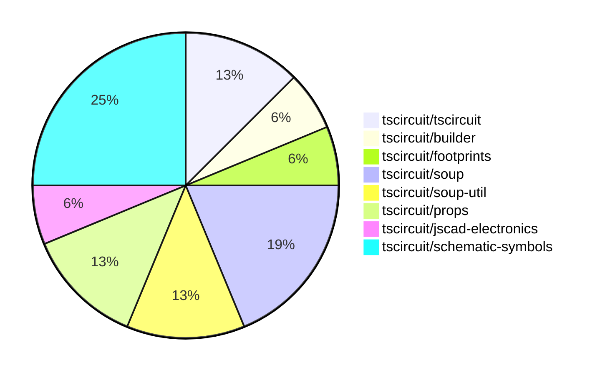

# Contribution Overview 2024-08-17

## PRs by Repository

## Contributor Overview

| Contributor | 🐳 Major | 🐙 Minor | 🐌 Tiny |
|-------------|-------|-------|-------|
| imrishabh18 | 0 | 2 | 1 |
| seveibar | 8 | 5 | 0 |

## Changes by Repository

### [tscircuit/tscircuit](https://github.com/tscircuit/tscircuit)

| PR # | Impact | Contributor | Description |
|------|--------|-------------|-------------|
| [#351](https://github.com/tscircuit/tscircuit/pull/351) | 🐙 Minor | imrishabh18 | Automatically update the package version daily. |
| [#349](https://github.com/tscircuit/tscircuit/pull/349) | 🐙 Minor | imrishabh18 | Update the "@tscircuit/builder" dependency from version 1.5.141 to 1.11.1 |

### [tscircuit/builder](https://github.com/tscircuit/builder)

| PR # | Impact | Contributor | Description |
|------|--------|-------------|-------------|
| [#103](https://github.com/tscircuit/builder/pull/103) | 🐌 Tiny | imrishabh18 | Added "circuit-to-png" as a devDependency. |

### [tscircuit/footprints](https://github.com/tscircuit/footprints)

| PR # | Impact | Contributor | Description |
|------|--------|-------------|-------------|
| [#3](https://github.com/tscircuit/footprints/pull/3) | 🐳 Major | seveibar | Huge repository cleanup, switch to Bun, fix types, add workflows, and fix published types error. |

### [tscircuit/soup](https://github.com/tscircuit/soup)

| PR # | Impact | Contributor | Description |
|------|--------|-------------|-------------|
| [#23](https://github.com/tscircuit/soup/pull/23) | 🐳 Major | seveibar | Add route thickness mode and should_round_corners property to the PCB trace |
| [#24](https://github.com/tscircuit/soup/pull/24) | 🐙 Minor | seveibar | Add an optional `symbol_name` field to the `schematic_component` schema. |
| [#22](https://github.com/tscircuit/soup/pull/22) | 🐙 Minor | seveibar | Add a new `pcb_board_id` field to the `pcb_board` object schema. |

### [tscircuit/soup-util](https://github.com/tscircuit/soup-util)

| PR # | Impact | Contributor | Description |
|------|--------|-------------|-------------|
| [#7](https://github.com/tscircuit/soup-util/pull/7) | 🐳 Major | seveibar | Add a new `delete` method to the `su` library to remove elements from the soup. |
| [#6](https://github.com/tscircuit/soup-util/pull/6) | 🐳 Major | seveibar | Add support for `insert` and `toArray` methods to the `su` object. |

### [tscircuit/props](https://github.com/tscircuit/props)

| PR # | Impact | Contributor | Description |
|------|--------|-------------|-------------|
| [#20](https://github.com/tscircuit/props/pull/20) | 🐳 Major | seveibar | Improve published types and add support for port references that use a function |
| [#21](https://github.com/tscircuit/props/pull/21) | 🐙 Minor | seveibar | Avoid parsing `portRef` reference to prevent losing the reference. |

### [tscircuit/jscad-electronics](https://github.com/tscircuit/jscad-electronics)

| PR # | Impact | Contributor | Description |
|------|--------|-------------|-------------|
| [#13](https://github.com/tscircuit/jscad-electronics/pull/13) | 🐳 Major | seveibar | Implement TSSOP (Thin Shrink Small Outline Package) component |

### [tscircuit/schematic-symbols](https://github.com/tscircuit/schematic-symbols)

| PR # | Impact | Contributor | Description |
|------|--------|-------------|-------------|
| [#7](https://github.com/tscircuit/schematic-symbols/pull/7) | 🐳 Major | seveibar | Introduce format checks, type checks, and a format bot for the project. |
| [#4](https://github.com/tscircuit/schematic-symbols/pull/4) | 🐳 Major | seveibar | Initial release of the project with various setup files and configurations. |
| [#6](https://github.com/tscircuit/schematic-symbols/pull/6) | 🐙 Minor | seveibar | Add computed fields to make it easier to use symbols |
| [#5](https://github.com/tscircuit/schematic-symbols/pull/5) | 🐙 Minor | seveibar | Adds type exports for drawing primitives |

## Changes by Contributor

### [imrishabh18](https://github.com/imrishabh18)

| PR # | Impact | Description |
|------|--------|-------------|
| [#351](https://github.com/tscircuit/tscircuit/pull/351) | 🐙 Minor | Automatically update the package version daily. |
| [#349](https://github.com/tscircuit/tscircuit/pull/349) | 🐙 Minor | Update the "@tscircuit/builder" dependency from version 1.5.141 to 1.11.1 |
| [#103](https://github.com/tscircuit/builder/pull/103) | 🐌 Tiny | Added "circuit-to-png" as a devDependency. |

### [seveibar](https://github.com/seveibar)

| PR # | Impact | Description |
|------|--------|-------------|
| [#3](https://github.com/tscircuit/footprints/pull/3) | 🐳 Major | Huge repository cleanup, switch to Bun, fix types, add workflows, and fix published types error. |
| [#23](https://github.com/tscircuit/soup/pull/23) | 🐳 Major | Add route thickness mode and should_round_corners property to the PCB trace |
| [#7](https://github.com/tscircuit/soup-util/pull/7) | 🐳 Major | Add a new `delete` method to the `su` library to remove elements from the soup. |
| [#6](https://github.com/tscircuit/soup-util/pull/6) | 🐳 Major | Add support for `insert` and `toArray` methods to the `su` object. |
| [#20](https://github.com/tscircuit/props/pull/20) | 🐳 Major | Improve published types and add support for port references that use a function |
| [#13](https://github.com/tscircuit/jscad-electronics/pull/13) | 🐳 Major | Implement TSSOP (Thin Shrink Small Outline Package) component |
| [#7](https://github.com/tscircuit/schematic-symbols/pull/7) | 🐳 Major | Introduce format checks, type checks, and a format bot for the project. |
| [#4](https://github.com/tscircuit/schematic-symbols/pull/4) | 🐳 Major | Initial release of the project with various setup files and configurations. |
| [#24](https://github.com/tscircuit/soup/pull/24) | 🐙 Minor | Add an optional `symbol_name` field to the `schematic_component` schema. |
| [#22](https://github.com/tscircuit/soup/pull/22) | 🐙 Minor | Add a new `pcb_board_id` field to the `pcb_board` object schema. |
| [#21](https://github.com/tscircuit/props/pull/21) | 🐙 Minor | Avoid parsing `portRef` reference to prevent losing the reference. |
| [#6](https://github.com/tscircuit/schematic-symbols/pull/6) | 🐙 Minor | Add computed fields to make it easier to use symbols |
| [#5](https://github.com/tscircuit/schematic-symbols/pull/5) | 🐙 Minor | Adds type exports for drawing primitives |

