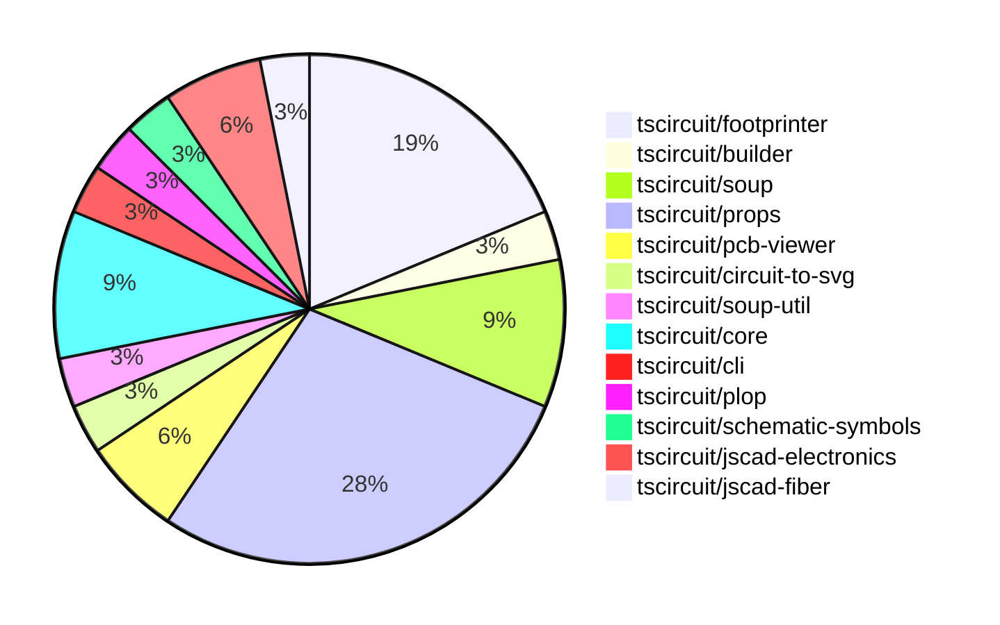

# Contribution Overview 2024-08-24

## PRs by Repository

## Contributor Overview

| Contributor | 🐳 Major | 🐙 Minor | 🐌 Tiny |
|-------------|-------|-------|-------|
| ShiboSoftwareDev | 1 | 4 | 0 |
| imrishabh18 | 3 | 1 | 0 |
| seveibar | 7 | 6 | 0 |
| anas-sarkez | 2 | 3 | 0 |
| abhijitxy | 3 | 0 | 0 |

## Changes by Repository

### [tscircuit/footprinter](https://github.com/tscircuit/footprinter)

| PR # | Impact | Contributor | Description |
|------|--------|-------------|-------------|
| [#19](https://github.com/tscircuit/footprinter/pull/19) | 🐳 Major | ShiboSoftwareDev | Added ms-012 and ms-013 footprints |
| [#24](https://github.com/tscircuit/footprinter/pull/24) | 🐳 Major | anas-sarkez | Added a new component called "SOT723" with its implementation and test cases. |
| [#23](https://github.com/tscircuit/footprinter/pull/23) | 🐳 Major | anas-sarkez | Added SOT563 footprint and test |
| [#25](https://github.com/tscircuit/footprinter/pull/25) | 🐙 Minor | anas-sarkez | Fixed silkscreen issue of some components |
| [#21](https://github.com/tscircuit/footprinter/pull/21) | 🐙 Minor | anas-sarkez | Added more tests for a BGA component with 64 pins, 10mm x 10mm size, 8x8 grid, and 1.27mm pitch. |
| [#20](https://github.com/tscircuit/footprinter/pull/20) | 🐙 Minor | anas-sarkez | Added some missing tests and snapshots |

### [tscircuit/builder](https://github.com/tscircuit/builder)

| PR # | Impact | Contributor | Description |
|------|--------|-------------|-------------|
| [#105](https://github.com/tscircuit/builder/pull/105) | 🐙 Minor | ShiboSoftwareDev | Added optional `outline` prop to `board-builder` |

### [tscircuit/soup](https://github.com/tscircuit/soup)

| PR # | Impact | Contributor | Description |
|------|--------|-------------|-------------|
| [#29](https://github.com/tscircuit/soup/pull/29) | 🐙 Minor | ShiboSoftwareDev | Make the `pcb_board_id` and `route_thickness_mode` properties optional in the PCB board and trace schemas. |
| [#28](https://github.com/tscircuit/soup/pull/28) | 🐙 Minor | ShiboSoftwareDev | Added the `outline` property to the `pcb_board` type to define the board outline of the PCB. |
| [#30](https://github.com/tscircuit/soup/pull/30) | 🐙 Minor | seveibar | Add support for `pin_styles` in the `schematic_component` schema |

### [tscircuit/props](https://github.com/tscircuit/props)

| PR # | Impact | Contributor | Description |
|------|--------|-------------|-------------|
| [#32](https://github.com/tscircuit/props/pull/32) | 🐳 Major | seveibar | Refactoring the project into multiple files, splitting the props from Zod and adding a type check to ensure parity. |
| [#31](https://github.com/tscircuit/props/pull/31) | 🐳 Major | seveibar | Add testing and template for new structure |
| [#30](https://github.com/tscircuit/props/pull/30) | 🐳 Major | seveibar | Revert build system to use `--dts`, add `schPinStyle` and other schematic box improvements, add support for camelCase route hint points |
| [#25](https://github.com/tscircuit/props/pull/25) | 🐙 Minor | ShiboSoftwareDev | Added a new optional `outline` property to the `boardProps` object. |
| [#34](https://github.com/tscircuit/props/pull/34) | 🐙 Minor | imrishabh18 | Add symbol name as prop to the CommonComponentProps type |
| [#33](https://github.com/tscircuit/props/pull/33) | 🐙 Minor | seveibar | Remove the "auto" option for some parameters in the chip component. |
| [#29](https://github.com/tscircuit/props/pull/29) | 🐙 Minor | seveibar | Update the formatbot GitHub Action to not run against forks. |
| [#24](https://github.com/tscircuit/props/pull/24) | 🐙 Minor | seveibar | Update the `pinLabels` property in the `chipProps` type to accept both numbers and strings to fix React parsing issues. |
| [#22](https://github.com/tscircuit/props/pull/22) | 🐙 Minor | seveibar | Make the `tracehint` `for` property optional to support a new syntax for the `<trace>` component. |

### [tscircuit/pcb-viewer](https://github.com/tscircuit/pcb-viewer)

| PR # | Impact | Contributor | Description |
|------|--------|-------------|-------------|
| [#42](https://github.com/tscircuit/pcb-viewer/pull/42) | 🐳 Major | imrishabh18 | Add a new `polygon` method to the `Drawer` class to draw filled polygons with outlines. |
| [#40](https://github.com/tscircuit/pcb-viewer/pull/40) | 🐳 Major | imrishabh18 | Add support for tracing plated holes in the circuit editor |

### [tscircuit/circuit-to-svg](https://github.com/tscircuit/circuit-to-svg)

| PR # | Impact | Contributor | Description |
|------|--------|-------------|-------------|
| [#25](https://github.com/tscircuit/circuit-to-svg/pull/25) | 🐳 Major | imrishabh18 | Integrate schematic symbols by using the `circuitJsonToSchematicSvg` function as a Promise and parse the returned string using `svgson`. |

### [tscircuit/soup-util](https://github.com/tscircuit/soup-util)

| PR # | Impact | Contributor | Description |
|------|--------|-------------|-------------|
| [#9](https://github.com/tscircuit/soup-util/pull/9) | 🐳 Major | seveibar | Introduce a new option `validateInserts` to the `su` function, which allows creating a soup util with validation turned on. |

### [tscircuit/core](https://github.com/tscircuit/core)

| PR # | Impact | Contributor | Description |
|------|--------|-------------|-------------|
| [#10](https://github.com/tscircuit/core/pull/10) | 🐳 Major | seveibar | Introduce a new "Chip" component and related functionality to the library. |
| [#6](https://github.com/tscircuit/core/pull/6) | 🐳 Major | seveibar | Implement trace hint functionality to support routing traces between ports and trace hints. |
| [#4](https://github.com/tscircuit/core/pull/4) | 🟣 | seveibar |  |

### [tscircuit/cli](https://github.com/tscircuit/cli)

| PR # | Impact | Contributor | Description |
|------|--------|-------------|-------------|
| [#130](https://github.com/tscircuit/cli/pull/130) | 🐙 Minor | seveibar | Update the `flip_y_axis` option in the `convertSoupToGerberCommands` and `convertSoupToExcellonDrillCommands` functions to `false` instead of `true`. |

### [tscircuit/plop](https://github.com/tscircuit/plop)

| PR # | Impact | Contributor | Description |
|------|--------|-------------|-------------|
| [#4](https://github.com/tscircuit/plop/pull/4) | 🟣 | seveibar | Update the formatbot to not run against forks |

### [tscircuit/schematic-symbols](https://github.com/tscircuit/schematic-symbols)

| PR # | Impact | Contributor | Description |
|------|--------|-------------|-------------|
| [#10](https://github.com/tscircuit/schematic-symbols/pull/10) | 🐳 Major | seveibar | Introduce a new function `getInnerSvg` that extracts the inner SVG elements of a schematic symbol. |

### [tscircuit/jscad-electronics](https://github.com/tscircuit/jscad-electronics)

| PR # | Impact | Contributor | Description |
|------|--------|-------------|-------------|
| [#16](https://github.com/tscircuit/jscad-electronics/pull/16) | 🐳 Major | abhijitxy | Implement a BGA (Ball Grid Array) component with customizable properties and support for displaying balls via footprint string. |
| [#14](https://github.com/tscircuit/jscad-electronics/pull/14) | 🐳 Major | abhijitxy | Implement a new component for the SOT-23-3P package. |

### [tscircuit/jscad-fiber](https://github.com/tscircuit/jscad-fiber)

| PR # | Impact | Contributor | Description |
|------|--------|-------------|-------------|
| [#72](https://github.com/tscircuit/jscad-fiber/pull/72) | 🐳 Major | abhijitxy | Implemented support for 180deg string input in the Rotate component. |

## Changes by Contributor

### [ShiboSoftwareDev](https://github.com/ShiboSoftwareDev)

| PR # | Impact | Description |
|------|--------|-------------|
| [#19](https://github.com/tscircuit/footprinter/pull/19) | 🐳 Major | Added ms-012 and ms-013 footprints |
| [#105](https://github.com/tscircuit/builder/pull/105) | 🐙 Minor | Added optional `outline` prop to `board-builder` |
| [#29](https://github.com/tscircuit/soup/pull/29) | 🐙 Minor | Make the `pcb_board_id` and `route_thickness_mode` properties optional in the PCB board and trace schemas. |
| [#28](https://github.com/tscircuit/soup/pull/28) | 🐙 Minor | Added the `outline` property to the `pcb_board` type to define the board outline of the PCB. |
| [#25](https://github.com/tscircuit/props/pull/25) | 🐙 Minor | Added a new optional `outline` property to the `boardProps` object. |

### [imrishabh18](https://github.com/imrishabh18)

| PR # | Impact | Description |
|------|--------|-------------|
| [#42](https://github.com/tscircuit/pcb-viewer/pull/42) | 🐳 Major | Add a new `polygon` method to the `Drawer` class to draw filled polygons with outlines. |
| [#40](https://github.com/tscircuit/pcb-viewer/pull/40) | 🐳 Major | Add support for tracing plated holes in the circuit editor |
| [#25](https://github.com/tscircuit/circuit-to-svg/pull/25) | 🐳 Major | Integrate schematic symbols by using the `circuitJsonToSchematicSvg` function as a Promise and parse the returned string using `svgson`. |
| [#34](https://github.com/tscircuit/props/pull/34) | 🐙 Minor | Add symbol name as prop to the CommonComponentProps type |

### [seveibar](https://github.com/seveibar)

| PR # | Impact | Description |
|------|--------|-------------|
| [#9](https://github.com/tscircuit/soup-util/pull/9) | 🐳 Major | Introduce a new option `validateInserts` to the `su` function, which allows creating a soup util with validation turned on. |
| [#32](https://github.com/tscircuit/props/pull/32) | 🐳 Major | Refactoring the project into multiple files, splitting the props from Zod and adding a type check to ensure parity. |
| [#31](https://github.com/tscircuit/props/pull/31) | 🐳 Major | Add testing and template for new structure |
| [#30](https://github.com/tscircuit/props/pull/30) | 🐳 Major | Revert build system to use `--dts`, add `schPinStyle` and other schematic box improvements, add support for camelCase route hint points |
| [#10](https://github.com/tscircuit/core/pull/10) | 🐳 Major | Introduce a new "Chip" component and related functionality to the library. |
| [#6](https://github.com/tscircuit/core/pull/6) | 🐳 Major | Implement trace hint functionality to support routing traces between ports and trace hints. |
| [#130](https://github.com/tscircuit/cli/pull/130) | 🐙 Minor | Update the `flip_y_axis` option in the `convertSoupToGerberCommands` and `convertSoupToExcellonDrillCommands` functions to `false` instead of `true`. |
| [#30](https://github.com/tscircuit/soup/pull/30) | 🐙 Minor | Add support for `pin_styles` in the `schematic_component` schema |
| [#33](https://github.com/tscircuit/props/pull/33) | 🐙 Minor | Remove the "auto" option for some parameters in the chip component. |
| [#29](https://github.com/tscircuit/props/pull/29) | 🐙 Minor | Update the formatbot GitHub Action to not run against forks. |
| [#24](https://github.com/tscircuit/props/pull/24) | 🐙 Minor | Update the `pinLabels` property in the `chipProps` type to accept both numbers and strings to fix React parsing issues. |
| [#22](https://github.com/tscircuit/props/pull/22) | 🐙 Minor | Make the `tracehint` `for` property optional to support a new syntax for the `<trace>` component. |
| [#4](https://github.com/tscircuit/core/pull/4) | 🟣 |  |
| [#4](https://github.com/tscircuit/plop/pull/4) | 🟣 | Update the formatbot to not run against forks |
| [#10](https://github.com/tscircuit/schematic-symbols/pull/10) | 🐳 Major | Introduce a new function `getInnerSvg` that extracts the inner SVG elements of a schematic symbol. |

### [anas-sarkez](https://github.com/anas-sarkez)

| PR # | Impact | Description |
|------|--------|-------------|
| [#24](https://github.com/tscircuit/footprinter/pull/24) | 🐳 Major | Added a new component called "SOT723" with its implementation and test cases. |
| [#23](https://github.com/tscircuit/footprinter/pull/23) | 🐳 Major | Added SOT563 footprint and test |
| [#25](https://github.com/tscircuit/footprinter/pull/25) | 🐙 Minor | Fixed silkscreen issue of some components |
| [#21](https://github.com/tscircuit/footprinter/pull/21) | 🐙 Minor | Added more tests for a BGA component with 64 pins, 10mm x 10mm size, 8x8 grid, and 1.27mm pitch. |
| [#20](https://github.com/tscircuit/footprinter/pull/20) | 🐙 Minor | Added some missing tests and snapshots |

### [abhijitxy](https://github.com/abhijitxy)

| PR # | Impact | Description |
|------|--------|-------------|
| [#16](https://github.com/tscircuit/jscad-electronics/pull/16) | 🐳 Major | Implement a BGA (Ball Grid Array) component with customizable properties and support for displaying balls via footprint string. |
| [#14](https://github.com/tscircuit/jscad-electronics/pull/14) | 🐳 Major | Implement a new component for the SOT-23-3P package. |
| [#72](https://github.com/tscircuit/jscad-fiber/pull/72) | 🐳 Major | Implemented support for 180deg string input in the Rotate component. |

