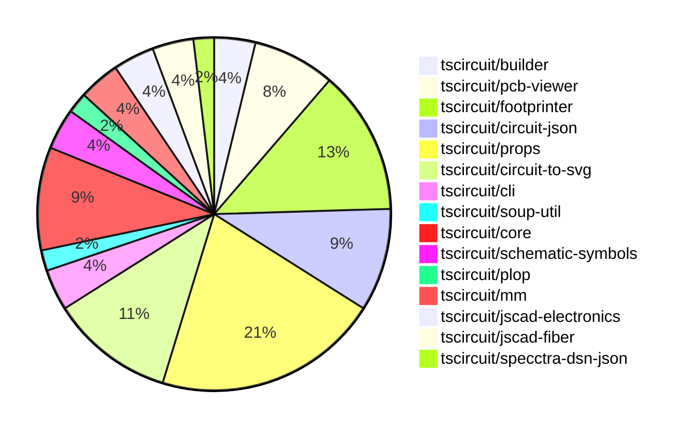

# Contribution Overview 2024-08-24

## PRs by Repository

## Contributor Overview

| Contributor | 🐳 Major | 🐙 Minor | 🐌 Tiny |
|-------------|-------|-------|-------|
| ShiboSoftwareDev | 3 | 5 | 0 |
| imrishabh18 | 5 | 2 | 0 |
| seveibar | 13 | 8 | 0 |
| abhijitxy | 5 | 1 | 0 |
| anas-sarkez | 2 | 4 | 3 |
| andrii-balitskyi | 1 | 0 | 0 |

## Changes by Repository

### [tscircuit/builder](https://github.com/tscircuit/builder)

| PR # | Impact | Contributor | Description |
|------|--------|-------------|-------------|
| [#106](https://github.com/tscircuit/builder/pull/106) | 🐳 Major | ShiboSoftwareDev | Gerber now supports board outline. |
| [#105](https://github.com/tscircuit/builder/pull/105) | 🐙 Minor | ShiboSoftwareDev | Added an optional "outline" prop to the board-builder component to allow drawing the board with an outline. |

### [tscircuit/pcb-viewer](https://github.com/tscircuit/pcb-viewer)

| PR # | Impact | Contributor | Description |
|------|--------|-------------|-------------|
| [#43](https://github.com/tscircuit/pcb-viewer/pull/43) | 🐳 Major | ShiboSoftwareDev | Added support for custom PCB board outlines and provided several examples in the Storybook |
| [#44](https://github.com/tscircuit/pcb-viewer/pull/44) | 🐳 Major | imrishabh18 | Fix the trace rendering to handle the "constant" route_thickness_mode correctly. |
| [#42](https://github.com/tscircuit/pcb-viewer/pull/42) | 🐳 Major | imrishabh18 | Render the PCB trace inside the Trace element using the new `polygon()` method in the Drawer class. |
| [#40](https://github.com/tscircuit/pcb-viewer/pull/40) | 🐳 Major | imrishabh18 | Add support for trace-hint for plated-hole. |

### [tscircuit/footprinter](https://github.com/tscircuit/footprinter)

| PR # | Impact | Contributor | Description |
|------|--------|-------------|-------------|
| [#19](https://github.com/tscircuit/footprinter/pull/19) | 🐳 Major | ShiboSoftwareDev | Added ms-012 and ms-013 footprints |
| [#24](https://github.com/tscircuit/footprinter/pull/24) | 🐳 Major | anas-sarkez | Added a new component called SOT723. |
| [#23](https://github.com/tscircuit/footprinter/pull/23) | 🐳 Major | anas-sarkez | Added SOT563 function and test |
| [#28](https://github.com/tscircuit/footprinter/pull/28) | 🐙 Minor | seveibar | Update the `circuit-to-svg` dependency to version `0.0.13` to fix issues with the snapshot generation. |
| [#25](https://github.com/tscircuit/footprinter/pull/25) | 🐙 Minor | anas-sarkez | Fixed silkscreen issue of some components |
| [#21](https://github.com/tscircuit/footprinter/pull/21) | 🐙 Minor | anas-sarkez | Added more tests for a BGA footprint with 64 pins, 10mm x 10mm size, 8x8 grid, and 1.27mm pitch. |
| [#20](https://github.com/tscircuit/footprinter/pull/20) | 🐙 Minor | anas-sarkez | Added some missing tests and snapshots |

### [tscircuit/circuit-json](https://github.com/tscircuit/circuit-json)

| PR # | Impact | Contributor | Description |
|------|--------|-------------|-------------|
| [#32](https://github.com/tscircuit/circuit-json/pull/32) | 🐙 Minor | ShiboSoftwareDev | Changed the type of the `layer` field in the `pcb_trace` schema from `string` to `layer_ref`. |
| [#29](https://github.com/tscircuit/circuit-json/pull/29) | 🐙 Minor | ShiboSoftwareDev | Make `pcb_board_id` and `route_thickness_mode` optional in the PCB board and trace schemas. |
| [#28](https://github.com/tscircuit/circuit-json/pull/28) | 🐙 Minor | ShiboSoftwareDev | Added a new `outline` property of type `z.array(point).optional()` to the `pcb_board` type. |
| [#31](https://github.com/tscircuit/circuit-json/pull/31) | 🐙 Minor | imrishabh18 | Change the default mode for `trace` from "interpolated" to "constant". |
| [#30](https://github.com/tscircuit/circuit-json/pull/30) | 🐙 Minor | seveibar | Add support for `pin_styles` in the `schematic_component` schema. |

### [tscircuit/props](https://github.com/tscircuit/props)

| PR # | Impact | Contributor | Description |
|------|--------|-------------|-------------|
| [#36](https://github.com/tscircuit/props/pull/36) | 🐳 Major | seveibar | Add schematic direction and port arrangement to jumper component. |
| [#35](https://github.com/tscircuit/props/pull/35) | 🐳 Major | seveibar | More refactoring to better defined props, split out capacitor and resistor, add jumper, add pullupFor, decouplingFor |
| [#32](https://github.com/tscircuit/props/pull/32) | 🐳 Major | seveibar | Refactoring the project into multiple files, splitting props from zod, and adding a type check to ensure parity |
| [#31](https://github.com/tscircuit/props/pull/31) | 🐳 Major | seveibar | Add testing and template for new structure |
| [#30](https://github.com/tscircuit/props/pull/30) | 🐳 Major | seveibar | Revert build system to use --dts, add schPinStyle and other schematic box improvements, add support for camelCase route hint points |
| [#25](https://github.com/tscircuit/props/pull/25) | 🐙 Minor | ShiboSoftwareDev | Added the `outline` prop type to the `boardProps` object. |
| [#34](https://github.com/tscircuit/props/pull/34) | 🐙 Minor | imrishabh18 | Add a new optional prop `symbolName` to the `commonComponentProps` type. |
| [#33](https://github.com/tscircuit/props/pull/33) | 🐙 Minor | seveibar | Remove "auto" options for some parameters in the chip component. |
| [#29](https://github.com/tscircuit/props/pull/29) | 🐙 Minor | seveibar | Update formatbot to not run against forks |
| [#24](https://github.com/tscircuit/props/pull/24) | 🐙 Minor | seveibar | Change the type of `pinLabels` in the `chipProps` interface to accept either numbers or strings to fix issues with React parsing. |
| [#22](https://github.com/tscircuit/props/pull/22) | 🐙 Minor | seveibar | Make the `for` property in `<tracehint>` optional to support a new syntax where the `<tracehint>` is placed directly inside the `<trace>` element. |

### [tscircuit/circuit-to-svg](https://github.com/tscircuit/circuit-to-svg)

| PR # | Impact | Contributor | Description |
|------|--------|-------------|-------------|
| [#28](https://github.com/tscircuit/circuit-to-svg/pull/28) | 🐳 Major | imrishabh18 | Fix schematic symbols attributes to properly handle position, width, height, and rotation. |
| [#25](https://github.com/tscircuit/circuit-to-svg/pull/25) | 🐳 Major | imrishabh18 | Integrate the schematic-symbols library to generate SVG for circuit components and improve the rotation of symbols. |
| [#29](https://github.com/tscircuit/circuit-to-svg/pull/29) | 🐙 Minor | anas-sarkez | Integrated custom silkscreen |
| [#31](https://github.com/tscircuit/circuit-to-svg/pull/31) | 🐌 Tiny | anas-sarkez | Removed the console log statement in the `pcb-soup-to-svg.ts` file. |
| [#30](https://github.com/tscircuit/circuit-to-svg/pull/30) | 🐌 Tiny | anas-sarkez | Removed unnecessary console logs from the PCB to SVG conversion function. |
| [#27](https://github.com/tscircuit/circuit-to-svg/pull/27) | 🐌 Tiny | anas-sarkez | Fixed silkscreen |

### [tscircuit/cli](https://github.com/tscircuit/cli)

| PR # | Impact | Contributor | Description |
|------|--------|-------------|-------------|
| [#131](https://github.com/tscircuit/cli/pull/131) | 🐳 Major | seveibar | Adds support for the `@tscircuit/core` beta by introducing a new `--core` option to the CLI commands. |
| [#130](https://github.com/tscircuit/cli/pull/130) | 🐙 Minor | seveibar | Change the `flip_y_axis` option to `false` in the `export-gerbers.ts` file. |

### [tscircuit/soup-util](https://github.com/tscircuit/soup-util)

| PR # | Impact | Contributor | Description |
|------|--------|-------------|-------------|
| [#9](https://github.com/tscircuit/soup-util/pull/9) | 🐳 Major | seveibar | Adds an option to the `su` function to enable validation of inserted elements. |

### [tscircuit/core](https://github.com/tscircuit/core)

| PR # | Impact | Contributor | Description |
|------|--------|-------------|-------------|
| [#14](https://github.com/tscircuit/core/pull/14) | 🐳 Major | seveibar | Add support for tracking the install size of the project in addition to the bundle size. |
| [#13](https://github.com/tscircuit/core/pull/13) | 🐳 Major | seveibar | Introduce a GitHub Actions workflow to track the bundle size of a pull request and report the difference compared to the base branch. |
| [#10](https://github.com/tscircuit/core/pull/10) | 🐳 Major | seveibar | Introduce a new "Chip" component and related functionality, including the ability to define pin labels, render source components, schematic components, and PCB components. |
| [#6](https://github.com/tscircuit/core/pull/6) | 🐳 Major | seveibar | Adds support for trace hints, allowing multi-layer routing by defining route points and layers to pass through. |
| [#4](https://github.com/tscircuit/core/pull/4) | 🟣 | seveibar |  |

### [tscircuit/schematic-symbols](https://github.com/tscircuit/schematic-symbols)

| PR # | Impact | Contributor | Description |
|------|--------|-------------|-------------|
| [#12](https://github.com/tscircuit/schematic-symbols/pull/12) | 🐳 Major | seveibar | Explicitly specifying the generated files for the build system |
| [#10](https://github.com/tscircuit/schematic-symbols/pull/10) | 🐳 Major | seveibar | Introduce a new function `getInnerSvg` to extract the inner SVG content from the `getSvg` function. |

### [tscircuit/plop](https://github.com/tscircuit/plop)

| PR # | Impact | Contributor | Description |
|------|--------|-------------|-------------|
| [#4](https://github.com/tscircuit/plop/pull/4) | 🐙 Minor | seveibar | Update formatbot to not run against forks |

### [tscircuit/mm](https://github.com/tscircuit/mm)

| PR # | Impact | Contributor | Description |
|------|--------|-------------|-------------|
| [#3](https://github.com/tscircuit/mm/pull/3) | 🐳 Major | abhijitxy | Add custom unit conversion |
| [#4](https://github.com/tscircuit/mm/pull/4) | 🐙 Minor | abhijitxy | Updated the package.json file to remove the `@types/convert-units` and `convert-units` dependencies. |

### [tscircuit/jscad-electronics](https://github.com/tscircuit/jscad-electronics)

| PR # | Impact | Contributor | Description |
|------|--------|-------------|-------------|
| [#16](https://github.com/tscircuit/jscad-electronics/pull/16) | 🐳 Major | abhijitxy | Implement a new BGA (Ball Grid Array) component with customizable parameters and support for both manual ball placement and footprint string-based placement. |
| [#14](https://github.com/tscircuit/jscad-electronics/pull/14) | 🐳 Major | abhijitxy | Implement the SOT-23-3P component, which is a type of surface-mount transistor package. |

### [tscircuit/jscad-fiber](https://github.com/tscircuit/jscad-fiber)

| PR # | Impact | Contributor | Description |
|------|--------|-------------|-------------|
| [#73](https://github.com/tscircuit/jscad-fiber/pull/73) | 🐳 Major | abhijitxy | Introduce a feature to convert degrees to radians for the `rotate` function. |
| [#72](https://github.com/tscircuit/jscad-fiber/pull/72) | 🐳 Major | abhijitxy | Implemented a new feature to support 180-degree string input for the Rotate component. |

### [tscircuit/specctra-dsn-json](https://github.com/tscircuit/specctra-dsn-json)

| PR # | Impact | Contributor | Description |
|------|--------|-------------|-------------|
| [#12](https://github.com/tscircuit/specctra-dsn-json/pull/12) | 🐳 Major | andrii-balitskyi | Convert the test suite from AVA to Bun:Test |

## Changes by Contributor

### [ShiboSoftwareDev](https://github.com/ShiboSoftwareDev)

| PR # | Impact | Description |
|------|--------|-------------|
| [#106](https://github.com/tscircuit/builder/pull/106) | 🐳 Major | Gerber now supports board outline. |
| [#43](https://github.com/tscircuit/pcb-viewer/pull/43) | 🐳 Major | Added support for custom PCB board outlines and provided several examples in the Storybook |
| [#19](https://github.com/tscircuit/footprinter/pull/19) | 🐳 Major | Added ms-012 and ms-013 footprints |
| [#105](https://github.com/tscircuit/builder/pull/105) | 🐙 Minor | Added an optional "outline" prop to the board-builder component to allow drawing the board with an outline. |
| [#32](https://github.com/tscircuit/circuit-json/pull/32) | 🐙 Minor | Changed the type of the `layer` field in the `pcb_trace` schema from `string` to `layer_ref`. |
| [#29](https://github.com/tscircuit/circuit-json/pull/29) | 🐙 Minor | Make `pcb_board_id` and `route_thickness_mode` optional in the PCB board and trace schemas. |
| [#28](https://github.com/tscircuit/circuit-json/pull/28) | 🐙 Minor | Added a new `outline` property of type `z.array(point).optional()` to the `pcb_board` type. |
| [#25](https://github.com/tscircuit/props/pull/25) | 🐙 Minor | Added the `outline` prop type to the `boardProps` object. |

### [imrishabh18](https://github.com/imrishabh18)

| PR # | Impact | Description |
|------|--------|-------------|
| [#44](https://github.com/tscircuit/pcb-viewer/pull/44) | 🐳 Major | Fix the trace rendering to handle the "constant" route_thickness_mode correctly. |
| [#42](https://github.com/tscircuit/pcb-viewer/pull/42) | 🐳 Major | Render the PCB trace inside the Trace element using the new `polygon()` method in the Drawer class. |
| [#40](https://github.com/tscircuit/pcb-viewer/pull/40) | 🐳 Major | Add support for trace-hint for plated-hole. |
| [#28](https://github.com/tscircuit/circuit-to-svg/pull/28) | 🐳 Major | Fix schematic symbols attributes to properly handle position, width, height, and rotation. |
| [#25](https://github.com/tscircuit/circuit-to-svg/pull/25) | 🐳 Major | Integrate the schematic-symbols library to generate SVG for circuit components and improve the rotation of symbols. |
| [#31](https://github.com/tscircuit/circuit-json/pull/31) | 🐙 Minor | Change the default mode for `trace` from "interpolated" to "constant". |
| [#34](https://github.com/tscircuit/props/pull/34) | 🐙 Minor | Add a new optional prop `symbolName` to the `commonComponentProps` type. |

### [seveibar](https://github.com/seveibar)

| PR # | Impact | Description |
|------|--------|-------------|
| [#131](https://github.com/tscircuit/cli/pull/131) | 🐳 Major | Adds support for the `@tscircuit/core` beta by introducing a new `--core` option to the CLI commands. |
| [#9](https://github.com/tscircuit/soup-util/pull/9) | 🐳 Major | Adds an option to the `su` function to enable validation of inserted elements. |
| [#36](https://github.com/tscircuit/props/pull/36) | 🐳 Major | Add schematic direction and port arrangement to jumper component. |
| [#35](https://github.com/tscircuit/props/pull/35) | 🐳 Major | More refactoring to better defined props, split out capacitor and resistor, add jumper, add pullupFor, decouplingFor |
| [#32](https://github.com/tscircuit/props/pull/32) | 🐳 Major | Refactoring the project into multiple files, splitting props from zod, and adding a type check to ensure parity |
| [#31](https://github.com/tscircuit/props/pull/31) | 🐳 Major | Add testing and template for new structure |
| [#30](https://github.com/tscircuit/props/pull/30) | 🐳 Major | Revert build system to use --dts, add schPinStyle and other schematic box improvements, add support for camelCase route hint points |
| [#14](https://github.com/tscircuit/core/pull/14) | 🐳 Major | Add support for tracking the install size of the project in addition to the bundle size. |
| [#13](https://github.com/tscircuit/core/pull/13) | 🐳 Major | Introduce a GitHub Actions workflow to track the bundle size of a pull request and report the difference compared to the base branch. |
| [#10](https://github.com/tscircuit/core/pull/10) | 🐳 Major | Introduce a new "Chip" component and related functionality, including the ability to define pin labels, render source components, schematic components, and PCB components. |
| [#6](https://github.com/tscircuit/core/pull/6) | 🐳 Major | Adds support for trace hints, allowing multi-layer routing by defining route points and layers to pass through. |
| [#130](https://github.com/tscircuit/cli/pull/130) | 🐙 Minor | Change the `flip_y_axis` option to `false` in the `export-gerbers.ts` file. |
| [#30](https://github.com/tscircuit/circuit-json/pull/30) | 🐙 Minor | Add support for `pin_styles` in the `schematic_component` schema. |
| [#33](https://github.com/tscircuit/props/pull/33) | 🐙 Minor | Remove "auto" options for some parameters in the chip component. |
| [#29](https://github.com/tscircuit/props/pull/29) | 🐙 Minor | Update formatbot to not run against forks |
| [#24](https://github.com/tscircuit/props/pull/24) | 🐙 Minor | Change the type of `pinLabels` in the `chipProps` interface to accept either numbers or strings to fix issues with React parsing. |
| [#22](https://github.com/tscircuit/props/pull/22) | 🐙 Minor | Make the `for` property in `<tracehint>` optional to support a new syntax where the `<tracehint>` is placed directly inside the `<trace>` element. |
| [#28](https://github.com/tscircuit/footprinter/pull/28) | 🐙 Minor | Update the `circuit-to-svg` dependency to version `0.0.13` to fix issues with the snapshot generation. |
| [#4](https://github.com/tscircuit/core/pull/4) | 🟣 |  |
| [#12](https://github.com/tscircuit/schematic-symbols/pull/12) | 🐳 Major | Explicitly specifying the generated files for the build system |
| [#10](https://github.com/tscircuit/schematic-symbols/pull/10) | 🐳 Major | Introduce a new function `getInnerSvg` to extract the inner SVG content from the `getSvg` function. |
| [#4](https://github.com/tscircuit/plop/pull/4) | 🐙 Minor | Update formatbot to not run against forks |

### [abhijitxy](https://github.com/abhijitxy)

| PR # | Impact | Description |
|------|--------|-------------|
| [#3](https://github.com/tscircuit/mm/pull/3) | 🐳 Major | Add custom unit conversion |
| [#16](https://github.com/tscircuit/jscad-electronics/pull/16) | 🐳 Major | Implement a new BGA (Ball Grid Array) component with customizable parameters and support for both manual ball placement and footprint string-based placement. |
| [#14](https://github.com/tscircuit/jscad-electronics/pull/14) | 🐳 Major | Implement the SOT-23-3P component, which is a type of surface-mount transistor package. |
| [#73](https://github.com/tscircuit/jscad-fiber/pull/73) | 🐳 Major | Introduce a feature to convert degrees to radians for the `rotate` function. |
| [#72](https://github.com/tscircuit/jscad-fiber/pull/72) | 🐳 Major | Implemented a new feature to support 180-degree string input for the Rotate component. |
| [#4](https://github.com/tscircuit/mm/pull/4) | 🐙 Minor | Updated the package.json file to remove the `@types/convert-units` and `convert-units` dependencies. |

### [anas-sarkez](https://github.com/anas-sarkez)

| PR # | Impact | Description |
|------|--------|-------------|
| [#24](https://github.com/tscircuit/footprinter/pull/24) | 🐳 Major | Added a new component called SOT723. |
| [#23](https://github.com/tscircuit/footprinter/pull/23) | 🐳 Major | Added SOT563 function and test |
| [#25](https://github.com/tscircuit/footprinter/pull/25) | 🐙 Minor | Fixed silkscreen issue of some components |
| [#21](https://github.com/tscircuit/footprinter/pull/21) | 🐙 Minor | Added more tests for a BGA footprint with 64 pins, 10mm x 10mm size, 8x8 grid, and 1.27mm pitch. |
| [#20](https://github.com/tscircuit/footprinter/pull/20) | 🐙 Minor | Added some missing tests and snapshots |
| [#29](https://github.com/tscircuit/circuit-to-svg/pull/29) | 🐙 Minor | Integrated custom silkscreen |
| [#31](https://github.com/tscircuit/circuit-to-svg/pull/31) | 🐌 Tiny | Removed the console log statement in the `pcb-soup-to-svg.ts` file. |
| [#30](https://github.com/tscircuit/circuit-to-svg/pull/30) | 🐌 Tiny | Removed unnecessary console logs from the PCB to SVG conversion function. |
| [#27](https://github.com/tscircuit/circuit-to-svg/pull/27) | 🐌 Tiny | Fixed silkscreen |

### [andrii-balitskyi](https://github.com/andrii-balitskyi)

| PR # | Impact | Description |
|------|--------|-------------|
| [#12](https://github.com/tscircuit/specctra-dsn-json/pull/12) | 🐳 Major | Convert the test suite from AVA to Bun:Test |

