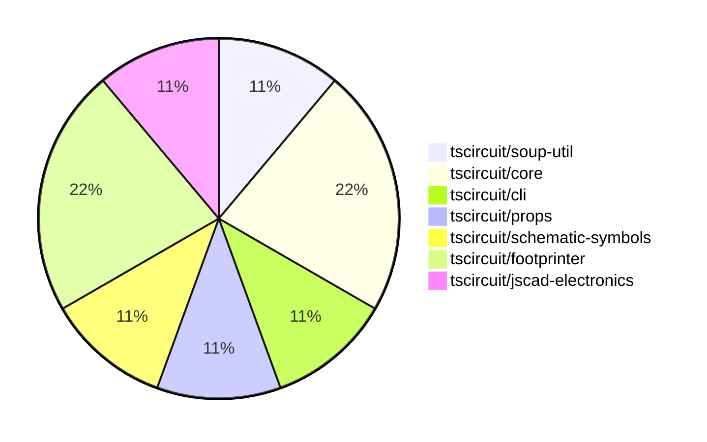

# Contribution Overview 2024-08-24

## PRs by Repository

## Contributor Overview

| Contributor | 🐳 Major | 🐙 Minor | 🐌 Tiny |
|-------------|-------|-------|-------|
| seveibar | 3 | 2 | 0 |
| anas-sarkez | 0 | 1 | 0 |
| ShiboSoftwareDev | 1 | 0 | 0 |
| abhijitxy | 1 | 0 | 0 |

## Changes by Repository

### [tscircuit/soup-util](https://github.com/tscircuit/soup-util)

| PR # | Impact | Contributor | Description |
|------|--------|-------------|-------------|
| [#9](https://github.com/tscircuit/soup-util/pull/9) | 🐳 Major | seveibar | Add an option to enable validation when creating a soup utility. |

### [tscircuit/core](https://github.com/tscircuit/core)

| PR # | Impact | Contributor | Description |
|------|--------|-------------|-------------|
| [#6](https://github.com/tscircuit/core/pull/6) | 🐳 Major | seveibar | Implement trace hint support for routing traces between multiple ports with custom layer constraints. |
| [#4](https://github.com/tscircuit/core/pull/4) | 🟣 | seveibar |  |

### [tscircuit/cli](https://github.com/tscircuit/cli)

| PR # | Impact | Contributor | Description |
|------|--------|-------------|-------------|
| [#130](https://github.com/tscircuit/cli/pull/130) | 🐙 Minor | seveibar | Update the `flip_y_axis` option in the `export-gerbers.ts` file to set it to `false` instead of `true`. |

### [tscircuit/props](https://github.com/tscircuit/props)

| PR # | Impact | Contributor | Description |
|------|--------|-------------|-------------|
| [#22](https://github.com/tscircuit/props/pull/22) | 🐙 Minor | seveibar | Make the `for` property in `tracehint` component optional to support new syntax |

### [tscircuit/schematic-symbols](https://github.com/tscircuit/schematic-symbols)

| PR # | Impact | Contributor | Description |
|------|--------|-------------|-------------|
| [#10](https://github.com/tscircuit/schematic-symbols/pull/10) | 🐳 Major | seveibar | Introduce `getInnerSvg` export to return the inner SVG elements without the outer `<svg>` tag. |

### [tscircuit/footprinter](https://github.com/tscircuit/footprinter)

| PR # | Impact | Contributor | Description |
|------|--------|-------------|-------------|
| [#19](https://github.com/tscircuit/footprinter/pull/19) | 🐳 Major | ShiboSoftwareDev | Added new footprints ms-012 and ms-013 to the library. |
| [#20](https://github.com/tscircuit/footprinter/pull/20) | 🐙 Minor | anas-sarkez | Added some missing tests and snapshots |

### [tscircuit/jscad-electronics](https://github.com/tscircuit/jscad-electronics)

| PR # | Impact | Contributor | Description |
|------|--------|-------------|-------------|
| [#14](https://github.com/tscircuit/jscad-electronics/pull/14) | 🐳 Major | abhijitxy | Implement a new component for the SOT-23-3P package. |

## Changes by Contributor

### [seveibar](https://github.com/seveibar)

| PR # | Impact | Description |
|------|--------|-------------|
| [#9](https://github.com/tscircuit/soup-util/pull/9) | 🐳 Major | Add an option to enable validation when creating a soup utility. |
| [#6](https://github.com/tscircuit/core/pull/6) | 🐳 Major | Implement trace hint support for routing traces between multiple ports with custom layer constraints. |
| [#130](https://github.com/tscircuit/cli/pull/130) | 🐙 Minor | Update the `flip_y_axis` option in the `export-gerbers.ts` file to set it to `false` instead of `true`. |
| [#22](https://github.com/tscircuit/props/pull/22) | 🐙 Minor | Make the `for` property in `tracehint` component optional to support new syntax |
| [#4](https://github.com/tscircuit/core/pull/4) | 🟣 |  |
| [#10](https://github.com/tscircuit/schematic-symbols/pull/10) | 🐳 Major | Introduce `getInnerSvg` export to return the inner SVG elements without the outer `<svg>` tag. |

### [anas-sarkez](https://github.com/anas-sarkez)

| PR # | Impact | Description |
|------|--------|-------------|
| [#20](https://github.com/tscircuit/footprinter/pull/20) | 🐙 Minor | Added some missing tests and snapshots |

### [ShiboSoftwareDev](https://github.com/ShiboSoftwareDev)

| PR # | Impact | Description |
|------|--------|-------------|
| [#19](https://github.com/tscircuit/footprinter/pull/19) | 🐳 Major | Added new footprints ms-012 and ms-013 to the library. |

### [abhijitxy](https://github.com/abhijitxy)

| PR # | Impact | Description |
|------|--------|-------------|
| [#14](https://github.com/tscircuit/jscad-electronics/pull/14) | 🐳 Major | Implement a new component for the SOT-23-3P package. |

