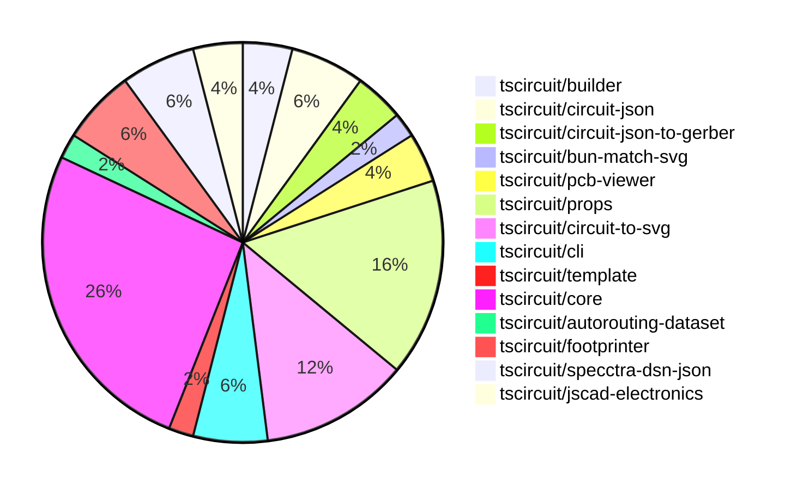

# Contribution Overview 2024-08-31

## PRs by Repository

## Contributor Overview

| Contributor | 🐳 Major | 🐙 Minor | 🐌 Tiny |
|-------------|-------|-------|-------|
| ShiboSoftwareDev | 2 | 2 | 1 |
| imrishabh18 | 7 | 5 | 0 |
| seveibar | 15 | 11 | 0 |
| anas-sarkez | 2 | 0 | 0 |
| andrii-balitskyi | 2 | 0 | 0 |
| abhijitxy | 1 | 1 | 0 |

## Changes by Repository

### [tscircuit/builder](https://github.com/tscircuit/builder)

| PR # | Impact | Contributor | Description |
|------|--------|-------------|-------------|
| [#106](https://github.com/tscircuit/builder/pull/106) | 🐳 Major | ShiboSoftwareDev | Gerber now supports board outline. |
| [#107](https://github.com/tscircuit/builder/pull/107) | 🐙 Minor | ShiboSoftwareDev | Changed the `convertSoupToExcellonDrillCommands` function to use metric units instead of inches. |

### [tscircuit/circuit-json](https://github.com/tscircuit/circuit-json)

| PR # | Impact | Contributor | Description |
|------|--------|-------------|-------------|
| [#35](https://github.com/tscircuit/circuit-json/pull/35) | 🐳 Major | imrishabh18 | Add support for circular PCB keepout shapes. |
| [#32](https://github.com/tscircuit/circuit-json/pull/32) | 🐙 Minor | ShiboSoftwareDev | Changed the type of the `layer` field in the `pcb_trace` schema from `string` to `layer_ref`. |
| [#34](https://github.com/tscircuit/circuit-json/pull/34) | 🐌 Tiny | ShiboSoftwareDev | Fixes the import source for `layer_ref` in the `pcb_trace.ts` file. |

### [tscircuit/circuit-json-to-gerber](https://github.com/tscircuit/circuit-json-to-gerber)

| PR # | Impact | Contributor | Description |
|------|--------|-------------|-------------|
| [#4](https://github.com/tscircuit/circuit-json-to-gerber/pull/4) | 🟣 | ShiboSoftwareDev | Integrated board outline |
| [#5](https://github.com/tscircuit/circuit-json-to-gerber/pull/5) | 🐳 Major | anas-sarkez | Fixed a bug in the handling of multilayer SVG gerber layers. |

### [tscircuit/bun-match-svg](https://github.com/tscircuit/bun-match-svg)

| PR # | Impact | Contributor | Description |
|------|--------|-------------|-------------|
| [#2](https://github.com/tscircuit/bun-match-svg/pull/2) | 🐳 Major | ShiboSoftwareDev | Added a new function `toMatchMultipleSvgSnapshots` that allows testing multiple SVG snapshots in a single test. |

### [tscircuit/pcb-viewer](https://github.com/tscircuit/pcb-viewer)

| PR # | Impact | Contributor | Description |
|------|--------|-------------|-------------|
| [#45](https://github.com/tscircuit/pcb-viewer/pull/45) | 🐳 Major | imrishabh18 | Adds support for drawing PCB keepout areas using a mesh pattern. |
| [#44](https://github.com/tscircuit/pcb-viewer/pull/44) | 🐳 Major | imrishabh18 | Fix the rendering of traces by handling both "constant" and "interpolated" `route_thickness_mode` cases. |

### [tscircuit/props](https://github.com/tscircuit/props)

| PR # | Impact | Contributor | Description |
|------|--------|-------------|-------------|
| [#41](https://github.com/tscircuit/props/pull/41) | 🐳 Major | imrishabh18 | Adds new `pcbKeepoutProps` type to define the properties for PCB keepout areas, which can be either circular or rectangular. |
| [#42](https://github.com/tscircuit/props/pull/42) | 🐳 Major | seveibar | Refactor the chip component to use a new type pattern, and add the constrainedlayout and constraint components. |
| [#39](https://github.com/tscircuit/props/pull/39) | 🐳 Major | seveibar | Introduce subcircuit group props |
| [#35](https://github.com/tscircuit/props/pull/35) | 🐳 Major | seveibar | More refactoring to better define props, split out capacitor and resistor, add jumper, add pullupFor, decouplingFor |
| [#43](https://github.com/tscircuit/props/pull/43) | 🐙 Minor | seveibar | Remove legacy constraint props |
| [#38](https://github.com/tscircuit/props/pull/38) | 🐙 Minor | seveibar | Introduce a new `NetProps` interface and a `netProps` Zod schema to define the props for the `net` component. |
| [#37](https://github.com/tscircuit/props/pull/37) | 🐙 Minor | seveibar | Refactor group props by moving the `GroupProps` interface and `groupProps` schema to a separate file. |
| [#36](https://github.com/tscircuit/props/pull/36) | 🐙 Minor | seveibar | Add schematic direction to jumper component |

### [tscircuit/circuit-to-svg](https://github.com/tscircuit/circuit-to-svg)

| PR # | Impact | Contributor | Description |
|------|--------|-------------|-------------|
| [#43](https://github.com/tscircuit/circuit-to-svg/pull/43) | 🐳 Major | imrishabh18 | Modify the `createPcbTrace` function to create smooth traces with rounded corners. |
| [#38](https://github.com/tscircuit/circuit-to-svg/pull/38) | 🐳 Major | imrishabh18 | Fix the usage of `pcb_plated_hole` and standard color in the `circuit-to-pcb-svg.ts` file. |
| [#28](https://github.com/tscircuit/circuit-to-svg/pull/28) | 🐳 Major | imrishabh18 | Fix schematic symbols attributes to handle position, width, height, and rotation correctly. |
| [#44](https://github.com/tscircuit/circuit-to-svg/pull/44) | 🐙 Minor | imrishabh18 | Fixed the order of the silkscreen layer to be the topmost layer in the PCB SVG. |
| [#39](https://github.com/tscircuit/circuit-to-svg/pull/39) | 🐙 Minor | imrishabh18 | Fix the silkscreen colors and rendering in the PCB viewer. |
| [#34](https://github.com/tscircuit/circuit-to-svg/pull/34) | 🐙 Minor | imrishabh18 | Rename two files: "pcb-soup-to-svg.ts" to "circuit-to-pcb-svg.ts" and "soup-to-svg.ts" to "circuit-to-schematic-svg.ts" |

### [tscircuit/cli](https://github.com/tscircuit/cli)

| PR # | Impact | Contributor | Description |
|------|--------|-------------|-------------|
| [#142](https://github.com/tscircuit/cli/pull/142) | 🐙 Minor | imrishabh18 | Fix the import path for the `MyCircuit` component in the example file. |
| [#149](https://github.com/tscircuit/cli/pull/149) | 🐙 Minor | seveibar | Update the test workflow to use the `--no-core` option instead of `--core` and update the soupify command accordingly. |
| [#144](https://github.com/tscircuit/cli/pull/144) | 🐙 Minor | seveibar | Fix the `dev:test-project` command in the `package.json` file. |

### [tscircuit/template](https://github.com/tscircuit/template)

| PR # | Impact | Contributor | Description |
|------|--------|-------------|-------------|
| [#3](https://github.com/tscircuit/template/pull/3) | 🐙 Minor | imrishabh18 | Fix a bug in the CLI by updating the import path for the MyCircuit component |

### [tscircuit/core](https://github.com/tscircuit/core)

| PR # | Impact | Contributor | Description |
|------|--------|-------------|-------------|
| [#32](https://github.com/tscircuit/core/pull/32) | 🐳 Major | seveibar | Refactor the Project class to use the `firstChild` instead of `rootComponent`, implement the `InitializePortsFromChildren` render phase, and fix the footprint port initialization. |
| [#31](https://github.com/tscircuit/core/pull/31) | 🐳 Major | seveibar | Correctly compute the size of PCB components based on their children primitives. |
| [#30](https://github.com/tscircuit/core/pull/30) | 🐳 Major | seveibar | Fix a bug where manual placements were not moving the children of a component (such as SMT pads). |
| [#29](https://github.com/tscircuit/core/pull/29) | 🐳 Major | seveibar | Implement a new feature to support manual placements for PCB components in subcircuit layouts. |
| [#28](https://github.com/tscircuit/core/pull/28) | 🐳 Major | seveibar | Improve same-net detection and autorouter functionality in the `Trace` component. |
| [#26](https://github.com/tscircuit/core/pull/26) | 🐳 Major | seveibar | Adds Net component, introduces a new render phase for PcbRouteNetIslands, and renames OpaqueGroup to Subcircuit. |
| [#21](https://github.com/tscircuit/core/pull/21) | 🐳 Major | seveibar | Add a GitHub Actions workflow to automatically respond to pull request reviews and run the "bunaider" tool to fix issues. |
| [#20](https://github.com/tscircuit/core/pull/20) | 🐳 Major | seveibar | Adds support for pullupFor, pullupTo, decouplingTo, and decouplingFor props in resistors and other components, and renames the Project class to Circuit. |
| [#18](https://github.com/tscircuit/core/pull/18) | 🐳 Major | seveibar | Fixes trace overlapping, rotation issues for SMTPads and SilkscreenPaths, and adjusts rotation for jumper. |
| [#16](https://github.com/tscircuit/core/pull/16) | 🐳 Major | seveibar | Add support for rendering plated holes in the PCB layout. |
| [#15](https://github.com/tscircuit/core/pull/15) | 🐳 Major | seveibar | Adds support for jumper components, fixes pinLabel selectors, and adds new features like Resistor.pullup, Capacitor.decoupling, and Silkscreen drawings. |
| [#27](https://github.com/tscircuit/core/pull/27) | 🐙 Minor | seveibar | Upgrade `circuit-to-svg` dependency to improve SVG snapshots |
| [#23](https://github.com/tscircuit/core/pull/23) | 🐙 Minor | seveibar | Add support for tagging with "bunaider" label in the GitHub Actions workflow. |

### [tscircuit/autorouting-dataset](https://github.com/tscircuit/autorouting-dataset)

| PR # | Impact | Contributor | Description |
|------|--------|-------------|-------------|
| [#39](https://github.com/tscircuit/autorouting-dataset/pull/39) | 🐳 Major | seveibar | Adds support for PCB trace and hole obstacles in dataset autorouting |

### [tscircuit/footprinter](https://github.com/tscircuit/footprinter)

| PR # | Impact | Contributor | Description |
|------|--------|-------------|-------------|
| [#29](https://github.com/tscircuit/footprinter/pull/29) | 🐳 Major | anas-sarkez | Add silkscreen for all passive-fn components (e.g., 0402, 0603) and add a plus sign property and silkscreen. |
| [#30](https://github.com/tscircuit/footprinter/pull/30) | 🐙 Minor | seveibar | Reverts a previous change that added silkscreen for passive components and a plus sign prop. |
| [#28](https://github.com/tscircuit/footprinter/pull/28) | 🐙 Minor | seveibar | Update the `circuit-to-svg` package to version `0.0.13` to fix snapshots |

### [tscircuit/specctra-dsn-json](https://github.com/tscircuit/specctra-dsn-json)

| PR # | Impact | Contributor | Description |
|------|--------|-------------|-------------|
| [#11](https://github.com/tscircuit/specctra-dsn-json/pull/11) | 🐳 Major | andrii-balitskyi | The pull request updates the `convertPcbJsonToTscircuitSoupJson` function to convert the DSN `via` element to the soup format. |
| [#12](https://github.com/tscircuit/specctra-dsn-json/pull/12) | 🐳 Major | andrii-balitskyi | Convert the test suite from AVA to Bun's built-in test runner |
| [#13](https://github.com/tscircuit/specctra-dsn-json/pull/13) | 🐙 Minor | seveibar | Added a GitHub Actions workflow for running Bun tests. |

### [tscircuit/jscad-electronics](https://github.com/tscircuit/jscad-electronics)

| PR # | Impact | Contributor | Description |
|------|--------|-------------|-------------|
| [#20](https://github.com/tscircuit/jscad-electronics/pull/20) | 🐳 Major | abhijitxy | Add a new component 'QFP' (Quad Flat Package) that renders a quad flat package with configurable pin count and dimensions. |
| [#22](https://github.com/tscircuit/jscad-electronics/pull/22) | 🐙 Minor | abhijitxy | Update all fixtures to use `zAxisUp` in the `JsCadFixture` component. |

## Changes by Contributor

### [ShiboSoftwareDev](https://github.com/ShiboSoftwareDev)

| PR # | Impact | Description |
|------|--------|-------------|
| [#106](https://github.com/tscircuit/builder/pull/106) | 🐳 Major | Gerber now supports board outline. |
| [#107](https://github.com/tscircuit/builder/pull/107) | 🐙 Minor | Changed the `convertSoupToExcellonDrillCommands` function to use metric units instead of inches. |
| [#32](https://github.com/tscircuit/circuit-json/pull/32) | 🐙 Minor | Changed the type of the `layer` field in the `pcb_trace` schema from `string` to `layer_ref`. |
| [#34](https://github.com/tscircuit/circuit-json/pull/34) | 🐌 Tiny | Fixes the import source for `layer_ref` in the `pcb_trace.ts` file. |
| [#4](https://github.com/tscircuit/circuit-json-to-gerber/pull/4) | 🟣 | Integrated board outline |
| [#2](https://github.com/tscircuit/bun-match-svg/pull/2) | 🐳 Major | Added a new function `toMatchMultipleSvgSnapshots` that allows testing multiple SVG snapshots in a single test. |

### [imrishabh18](https://github.com/imrishabh18)

| PR # | Impact | Description |
|------|--------|-------------|
| [#45](https://github.com/tscircuit/pcb-viewer/pull/45) | 🐳 Major | Adds support for drawing PCB keepout areas using a mesh pattern. |
| [#44](https://github.com/tscircuit/pcb-viewer/pull/44) | 🐳 Major | Fix the rendering of traces by handling both "constant" and "interpolated" `route_thickness_mode` cases. |
| [#35](https://github.com/tscircuit/circuit-json/pull/35) | 🐳 Major | Add support for circular PCB keepout shapes. |
| [#41](https://github.com/tscircuit/props/pull/41) | 🐳 Major | Adds new `pcbKeepoutProps` type to define the properties for PCB keepout areas, which can be either circular or rectangular. |
| [#43](https://github.com/tscircuit/circuit-to-svg/pull/43) | 🐳 Major | Modify the `createPcbTrace` function to create smooth traces with rounded corners. |
| [#38](https://github.com/tscircuit/circuit-to-svg/pull/38) | 🐳 Major | Fix the usage of `pcb_plated_hole` and standard color in the `circuit-to-pcb-svg.ts` file. |
| [#28](https://github.com/tscircuit/circuit-to-svg/pull/28) | 🐳 Major | Fix schematic symbols attributes to handle position, width, height, and rotation correctly. |
| [#142](https://github.com/tscircuit/cli/pull/142) | 🐙 Minor | Fix the import path for the `MyCircuit` component in the example file. |
| [#44](https://github.com/tscircuit/circuit-to-svg/pull/44) | 🐙 Minor | Fixed the order of the silkscreen layer to be the topmost layer in the PCB SVG. |
| [#39](https://github.com/tscircuit/circuit-to-svg/pull/39) | 🐙 Minor | Fix the silkscreen colors and rendering in the PCB viewer. |
| [#34](https://github.com/tscircuit/circuit-to-svg/pull/34) | 🐙 Minor | Rename two files: "pcb-soup-to-svg.ts" to "circuit-to-pcb-svg.ts" and "soup-to-svg.ts" to "circuit-to-schematic-svg.ts" |
| [#3](https://github.com/tscircuit/template/pull/3) | 🐙 Minor | Fix a bug in the CLI by updating the import path for the MyCircuit component |

### [seveibar](https://github.com/seveibar)

| PR # | Impact | Description |
|------|--------|-------------|
| [#42](https://github.com/tscircuit/props/pull/42) | 🐳 Major | Refactor the chip component to use a new type pattern, and add the constrainedlayout and constraint components. |
| [#39](https://github.com/tscircuit/props/pull/39) | 🐳 Major | Introduce subcircuit group props |
| [#35](https://github.com/tscircuit/props/pull/35) | 🐳 Major | More refactoring to better define props, split out capacitor and resistor, add jumper, add pullupFor, decouplingFor |
| [#32](https://github.com/tscircuit/core/pull/32) | 🐳 Major | Refactor the Project class to use the `firstChild` instead of `rootComponent`, implement the `InitializePortsFromChildren` render phase, and fix the footprint port initialization. |
| [#31](https://github.com/tscircuit/core/pull/31) | 🐳 Major | Correctly compute the size of PCB components based on their children primitives. |
| [#30](https://github.com/tscircuit/core/pull/30) | 🐳 Major | Fix a bug where manual placements were not moving the children of a component (such as SMT pads). |
| [#29](https://github.com/tscircuit/core/pull/29) | 🐳 Major | Implement a new feature to support manual placements for PCB components in subcircuit layouts. |
| [#28](https://github.com/tscircuit/core/pull/28) | 🐳 Major | Improve same-net detection and autorouter functionality in the `Trace` component. |
| [#26](https://github.com/tscircuit/core/pull/26) | 🐳 Major | Adds Net component, introduces a new render phase for PcbRouteNetIslands, and renames OpaqueGroup to Subcircuit. |
| [#21](https://github.com/tscircuit/core/pull/21) | 🐳 Major | Add a GitHub Actions workflow to automatically respond to pull request reviews and run the "bunaider" tool to fix issues. |
| [#20](https://github.com/tscircuit/core/pull/20) | 🐳 Major | Adds support for pullupFor, pullupTo, decouplingTo, and decouplingFor props in resistors and other components, and renames the Project class to Circuit. |
| [#18](https://github.com/tscircuit/core/pull/18) | 🐳 Major | Fixes trace overlapping, rotation issues for SMTPads and SilkscreenPaths, and adjusts rotation for jumper. |
| [#16](https://github.com/tscircuit/core/pull/16) | 🐳 Major | Add support for rendering plated holes in the PCB layout. |
| [#15](https://github.com/tscircuit/core/pull/15) | 🐳 Major | Adds support for jumper components, fixes pinLabel selectors, and adds new features like Resistor.pullup, Capacitor.decoupling, and Silkscreen drawings. |
| [#39](https://github.com/tscircuit/autorouting-dataset/pull/39) | 🐳 Major | Adds support for PCB trace and hole obstacles in dataset autorouting |
| [#149](https://github.com/tscircuit/cli/pull/149) | 🐙 Minor | Update the test workflow to use the `--no-core` option instead of `--core` and update the soupify command accordingly. |
| [#144](https://github.com/tscircuit/cli/pull/144) | 🐙 Minor | Fix the `dev:test-project` command in the `package.json` file. |
| [#43](https://github.com/tscircuit/props/pull/43) | 🐙 Minor | Remove legacy constraint props |
| [#38](https://github.com/tscircuit/props/pull/38) | 🐙 Minor | Introduce a new `NetProps` interface and a `netProps` Zod schema to define the props for the `net` component. |
| [#37](https://github.com/tscircuit/props/pull/37) | 🐙 Minor | Refactor group props by moving the `GroupProps` interface and `groupProps` schema to a separate file. |
| [#36](https://github.com/tscircuit/props/pull/36) | 🐙 Minor | Add schematic direction to jumper component |
| [#30](https://github.com/tscircuit/footprinter/pull/30) | 🐙 Minor | Reverts a previous change that added silkscreen for passive components and a plus sign prop. |
| [#28](https://github.com/tscircuit/footprinter/pull/28) | 🐙 Minor | Update the `circuit-to-svg` package to version `0.0.13` to fix snapshots |
| [#13](https://github.com/tscircuit/specctra-dsn-json/pull/13) | 🐙 Minor | Added a GitHub Actions workflow for running Bun tests. |
| [#27](https://github.com/tscircuit/core/pull/27) | 🐙 Minor | Upgrade `circuit-to-svg` dependency to improve SVG snapshots |
| [#23](https://github.com/tscircuit/core/pull/23) | 🐙 Minor | Add support for tagging with "bunaider" label in the GitHub Actions workflow. |

### [anas-sarkez](https://github.com/anas-sarkez)

| PR # | Impact | Description |
|------|--------|-------------|
| [#29](https://github.com/tscircuit/footprinter/pull/29) | 🐳 Major | Add silkscreen for all passive-fn components (e.g., 0402, 0603) and add a plus sign property and silkscreen. |
| [#5](https://github.com/tscircuit/circuit-json-to-gerber/pull/5) | 🐳 Major | Fixed a bug in the handling of multilayer SVG gerber layers. |

### [andrii-balitskyi](https://github.com/andrii-balitskyi)

| PR # | Impact | Description |
|------|--------|-------------|
| [#11](https://github.com/tscircuit/specctra-dsn-json/pull/11) | 🐳 Major | The pull request updates the `convertPcbJsonToTscircuitSoupJson` function to convert the DSN `via` element to the soup format. |
| [#12](https://github.com/tscircuit/specctra-dsn-json/pull/12) | 🐳 Major | Convert the test suite from AVA to Bun's built-in test runner |

### [abhijitxy](https://github.com/abhijitxy)

| PR # | Impact | Description |
|------|--------|-------------|
| [#20](https://github.com/tscircuit/jscad-electronics/pull/20) | 🐳 Major | Add a new component 'QFP' (Quad Flat Package) that renders a quad flat package with configurable pin count and dimensions. |
| [#22](https://github.com/tscircuit/jscad-electronics/pull/22) | 🐙 Minor | Update all fixtures to use `zAxisUp` in the `JsCadFixture` component. |

