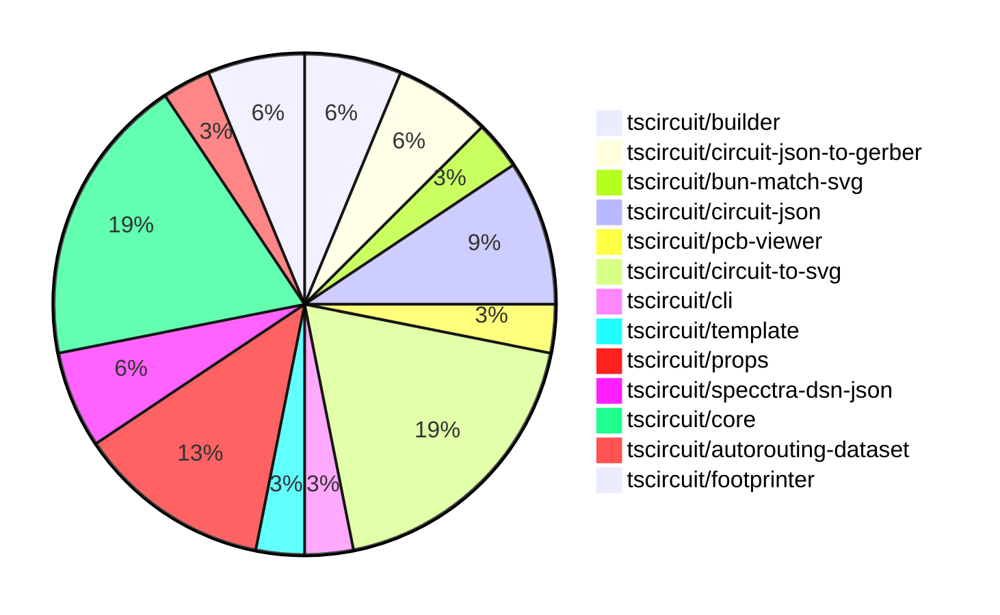

# Contribution Overview 2024-08-31

## PRs by Repository

## Contributor Overview

| Contributor | 🐳 Major | 🐙 Minor | 🐌 Tiny |
|-------------|-------|-------|-------|
| ShiboSoftwareDev | 3 | 3 | 0 |
| imrishabh18 | 6 | 4 | 0 |
| seveibar | 10 | 3 | 0 |
| anas-sarkez | 2 | 0 | 0 |
| andrii-balitskyi | 0 | 0 | 0 |

## Changes by Repository

### [tscircuit/builder](https://github.com/tscircuit/builder)

| PR # | Impact | Contributor | Description |
|------|--------|-------------|-------------|
| [#106](https://github.com/tscircuit/builder/pull/106) | 🐳 Major | ShiboSoftwareDev | Gerber now supports board outline |
| [#107](https://github.com/tscircuit/builder/pull/107) | 🐙 Minor | ShiboSoftwareDev | Changed the conversion function from millimeters to inches to use the correct conversion factor. |

### [tscircuit/circuit-json-to-gerber](https://github.com/tscircuit/circuit-json-to-gerber)

| PR # | Impact | Contributor | Description |
|------|--------|-------------|-------------|
| [#4](https://github.com/tscircuit/circuit-json-to-gerber/pull/4) | 🐳 Major | ShiboSoftwareDev | Integrates the board outline into the Gerber generation process. |
| [#5](https://github.com/tscircuit/circuit-json-to-gerber/pull/5) | 🐳 Major | anas-sarkez | Fixed issue with multilayer SVG gerber layers |

### [tscircuit/bun-match-svg](https://github.com/tscircuit/bun-match-svg)

| PR # | Impact | Contributor | Description |
|------|--------|-------------|-------------|
| [#2](https://github.com/tscircuit/bun-match-svg/pull/2) | 🐳 Major | ShiboSoftwareDev | Added a new custom matcher `toMatchMultipleSvgSnapshots` to compare multiple SVG snapshots. |

### [tscircuit/circuit-json](https://github.com/tscircuit/circuit-json)

| PR # | Impact | Contributor | Description |
|------|--------|-------------|-------------|
| [#35](https://github.com/tscircuit/circuit-json/pull/35) | 🐳 Major | imrishabh18 | Add support for circular PCB keepouts |
| [#34](https://github.com/tscircuit/circuit-json/pull/34) | 🐙 Minor | ShiboSoftwareDev | Fixed the import source for the `layer_ref` module. |
| [#32](https://github.com/tscircuit/circuit-json/pull/32) | 🐙 Minor | ShiboSoftwareDev | Changed the type of the "layer" property on the `pcb_trace` object from a string to a `layer_ref` type. |

### [tscircuit/pcb-viewer](https://github.com/tscircuit/pcb-viewer)

| PR # | Impact | Contributor | Description |
|------|--------|-------------|-------------|
| [#44](https://github.com/tscircuit/pcb-viewer/pull/44) | 🐳 Major | imrishabh18 | Fix trace rendering based on `route_thickness_mode` value. |

### [tscircuit/circuit-to-svg](https://github.com/tscircuit/circuit-to-svg)

| PR # | Impact | Contributor | Description |
|------|--------|-------------|-------------|
| [#43](https://github.com/tscircuit/circuit-to-svg/pull/43) | 🐳 Major | imrishabh18 | Refactors the `createPcbTrace` function to generate smooth, rounded traces with configurable corner radius. |
| [#39](https://github.com/tscircuit/circuit-to-svg/pull/39) | 🐳 Major | imrishabh18 | Fix the silkscreen rendering in the PCB viewer |
| [#38](https://github.com/tscircuit/circuit-to-svg/pull/38) | 🐳 Major | imrishabh18 | Fix `pcb_plated_hole` and standardize color usage in the PCB SVG rendering |
| [#28](https://github.com/tscircuit/circuit-to-svg/pull/28) | 🐳 Major | imrishabh18 | Fix issues with schematic symbols attributes, including position, width, height, and rotation. |
| [#44](https://github.com/tscircuit/circuit-to-svg/pull/44) | 🐙 Minor | imrishabh18 | Moves the silkscreen layer to the top-most layer in the SVG representation of the circuit board. |
| [#34](https://github.com/tscircuit/circuit-to-svg/pull/34) | 🐙 Minor | imrishabh18 | Rename files `pcb-soup-to-svg.ts` to `circuit-to-pcb-svg.ts` and `soup-to-svg.ts` to `circuit-to-schematic-svg.ts` |

### [tscircuit/cli](https://github.com/tscircuit/cli)

| PR # | Impact | Contributor | Description |
|------|--------|-------------|-------------|
| [#142](https://github.com/tscircuit/cli/pull/142) | 🐙 Minor | imrishabh18 | Fix the import path for MyCircuit in the generated example file. |

### [tscircuit/template](https://github.com/tscircuit/template)

| PR # | Impact | Contributor | Description |
|------|--------|-------------|-------------|
| [#3](https://github.com/tscircuit/template/pull/3) | 🐙 Minor | imrishabh18 | Fix a bug in the CLI by updating the import path of `MyCircuit` component |

### [tscircuit/props](https://github.com/tscircuit/props)

| PR # | Impact | Contributor | Description |
|------|--------|-------------|-------------|
| [#37](https://github.com/tscircuit/props/pull/37) | 🐳 Major | seveibar | Refactor group component props by moving them to a separate file and using Zod for type inference. |
| [#36](https://github.com/tscircuit/props/pull/36) | 🐳 Major | seveibar | Add support for specifying the schematic direction and port arrangement for jumper components. |
| [#35](https://github.com/tscircuit/props/pull/35) | 🐳 Major | seveibar | Refactored `cadModel` and `layout` modules, introduced new types for `CadModelProp`, `CommonLayoutProps`, `SupplierProps`, and `CommonComponentProps`, and added new modules for `schematicPinStyle` and `capacitor` component. |
| [#38](https://github.com/tscircuit/props/pull/38) | 🐙 Minor | seveibar | Introduce `netProps` interface and type definitions for handling network components. |

### [tscircuit/specctra-dsn-json](https://github.com/tscircuit/specctra-dsn-json)

| PR # | Impact | Contributor | Description |
|------|--------|-------------|-------------|
| [#13](https://github.com/tscircuit/specctra-dsn-json/pull/13) | 🐳 Major | seveibar | Add GitHub Actions workflows for running Bun tests and type checking. |
| [#12](https://github.com/tscircuit/specctra-dsn-json/pull/12) | 🟣 | andrii-balitskyi | Convert test suite from AVA to bun:test |

### [tscircuit/core](https://github.com/tscircuit/core)

| PR # | Impact | Contributor | Description |
|------|--------|-------------|-------------|
| [#21](https://github.com/tscircuit/core/pull/21) | 🐳 Major | seveibar | Add GitHub workflows to automatically respond to pull request reviews and automatically fix issues labeled with 'aider'. |
| [#20](https://github.com/tscircuit/core/pull/20) | 🐳 Major | seveibar |  |
| [#18](https://github.com/tscircuit/core/pull/18) | 🐳 Major | seveibar | Fix trace overlapping, fix SMTPads not rotating, and fix SilkscreenPaths transforming properly. |
| [#16](https://github.com/tscircuit/core/pull/16) | 🐳 Major | seveibar | Add PlatedHole component and implement PCB plated hole rendering |
| [#15](https://github.com/tscircuit/core/pull/15) | 🐳 Major | seveibar | Introduce jumper support, fix chip pinLabel selectors, and add new component types (Resistor.pullup, Capacitor.decoupling, SilkscreenPath). |
| [#23](https://github.com/tscircuit/core/pull/23) | 🐙 Minor | seveibar | Add support for tagging with 'bunaider' in the GitHub Actions workflow |

### [tscircuit/autorouting-dataset](https://github.com/tscircuit/autorouting-dataset)

| PR # | Impact | Contributor | Description |
|------|--------|-------------|-------------|
| [#39](https://github.com/tscircuit/autorouting-dataset/pull/39) | 🐳 Major | seveibar | Introduced a feature to support PCB trace obstacles in the dataset autorouting algorithm. |

### [tscircuit/footprinter](https://github.com/tscircuit/footprinter)

| PR # | Impact | Contributor | Description |
|------|--------|-------------|-------------|
| [#29](https://github.com/tscircuit/footprinter/pull/29) | 🐳 Major | anas-sarkez | Add silkscreen for all passive-fn for example [0402,0603...], and add plus sign prop and silkscreen |
| [#28](https://github.com/tscircuit/footprinter/pull/28) | 🐙 Minor | seveibar | Update the `circuit-to-svg` dependency to version `0.0.13` to fix issues with generating SVG snapshots. |

## Changes by Contributor

### [ShiboSoftwareDev](https://github.com/ShiboSoftwareDev)

| PR # | Impact | Description |
|------|--------|-------------|
| [#106](https://github.com/tscircuit/builder/pull/106) | 🐳 Major | Gerber now supports board outline |
| [#4](https://github.com/tscircuit/circuit-json-to-gerber/pull/4) | 🐳 Major | Integrates the board outline into the Gerber generation process. |
| [#2](https://github.com/tscircuit/bun-match-svg/pull/2) | 🐳 Major | Added a new custom matcher `toMatchMultipleSvgSnapshots` to compare multiple SVG snapshots. |
| [#107](https://github.com/tscircuit/builder/pull/107) | 🐙 Minor | Changed the conversion function from millimeters to inches to use the correct conversion factor. |
| [#34](https://github.com/tscircuit/circuit-json/pull/34) | 🐙 Minor | Fixed the import source for the `layer_ref` module. |
| [#32](https://github.com/tscircuit/circuit-json/pull/32) | 🐙 Minor | Changed the type of the "layer" property on the `pcb_trace` object from a string to a `layer_ref` type. |

### [imrishabh18](https://github.com/imrishabh18)

| PR # | Impact | Description |
|------|--------|-------------|
| [#44](https://github.com/tscircuit/pcb-viewer/pull/44) | 🐳 Major | Fix trace rendering based on `route_thickness_mode` value. |
| [#35](https://github.com/tscircuit/circuit-json/pull/35) | 🐳 Major | Add support for circular PCB keepouts |
| [#43](https://github.com/tscircuit/circuit-to-svg/pull/43) | 🐳 Major | Refactors the `createPcbTrace` function to generate smooth, rounded traces with configurable corner radius. |
| [#39](https://github.com/tscircuit/circuit-to-svg/pull/39) | 🐳 Major | Fix the silkscreen rendering in the PCB viewer |
| [#38](https://github.com/tscircuit/circuit-to-svg/pull/38) | 🐳 Major | Fix `pcb_plated_hole` and standardize color usage in the PCB SVG rendering |
| [#28](https://github.com/tscircuit/circuit-to-svg/pull/28) | 🐳 Major | Fix issues with schematic symbols attributes, including position, width, height, and rotation. |
| [#142](https://github.com/tscircuit/cli/pull/142) | 🐙 Minor | Fix the import path for MyCircuit in the generated example file. |
| [#44](https://github.com/tscircuit/circuit-to-svg/pull/44) | 🐙 Minor | Moves the silkscreen layer to the top-most layer in the SVG representation of the circuit board. |
| [#34](https://github.com/tscircuit/circuit-to-svg/pull/34) | 🐙 Minor | Rename files `pcb-soup-to-svg.ts` to `circuit-to-pcb-svg.ts` and `soup-to-svg.ts` to `circuit-to-schematic-svg.ts` |
| [#3](https://github.com/tscircuit/template/pull/3) | 🐙 Minor | Fix a bug in the CLI by updating the import path of `MyCircuit` component |

### [seveibar](https://github.com/seveibar)

| PR # | Impact | Description |
|------|--------|-------------|
| [#37](https://github.com/tscircuit/props/pull/37) | 🐳 Major | Refactor group component props by moving them to a separate file and using Zod for type inference. |
| [#36](https://github.com/tscircuit/props/pull/36) | 🐳 Major | Add support for specifying the schematic direction and port arrangement for jumper components. |
| [#35](https://github.com/tscircuit/props/pull/35) | 🐳 Major | Refactored `cadModel` and `layout` modules, introduced new types for `CadModelProp`, `CommonLayoutProps`, `SupplierProps`, and `CommonComponentProps`, and added new modules for `schematicPinStyle` and `capacitor` component. |
| [#13](https://github.com/tscircuit/specctra-dsn-json/pull/13) | 🐳 Major | Add GitHub Actions workflows for running Bun tests and type checking. |
| [#21](https://github.com/tscircuit/core/pull/21) | 🐳 Major | Add GitHub workflows to automatically respond to pull request reviews and automatically fix issues labeled with 'aider'. |
| [#20](https://github.com/tscircuit/core/pull/20) | 🐳 Major |  |
| [#18](https://github.com/tscircuit/core/pull/18) | 🐳 Major | Fix trace overlapping, fix SMTPads not rotating, and fix SilkscreenPaths transforming properly. |
| [#16](https://github.com/tscircuit/core/pull/16) | 🐳 Major | Add PlatedHole component and implement PCB plated hole rendering |
| [#15](https://github.com/tscircuit/core/pull/15) | 🐳 Major | Introduce jumper support, fix chip pinLabel selectors, and add new component types (Resistor.pullup, Capacitor.decoupling, SilkscreenPath). |
| [#39](https://github.com/tscircuit/autorouting-dataset/pull/39) | 🐳 Major | Introduced a feature to support PCB trace obstacles in the dataset autorouting algorithm. |
| [#38](https://github.com/tscircuit/props/pull/38) | 🐙 Minor | Introduce `netProps` interface and type definitions for handling network components. |
| [#28](https://github.com/tscircuit/footprinter/pull/28) | 🐙 Minor | Update the `circuit-to-svg` dependency to version `0.0.13` to fix issues with generating SVG snapshots. |
| [#23](https://github.com/tscircuit/core/pull/23) | 🐙 Minor | Add support for tagging with 'bunaider' in the GitHub Actions workflow |

### [anas-sarkez](https://github.com/anas-sarkez)

| PR # | Impact | Description |
|------|--------|-------------|
| [#29](https://github.com/tscircuit/footprinter/pull/29) | 🐳 Major | Add silkscreen for all passive-fn for example [0402,0603...], and add plus sign prop and silkscreen |
| [#5](https://github.com/tscircuit/circuit-json-to-gerber/pull/5) | 🐳 Major | Fixed issue with multilayer SVG gerber layers |

### [andrii-balitskyi](https://github.com/andrii-balitskyi)

| PR # | Impact | Description |
|------|--------|-------------|
| [#12](https://github.com/tscircuit/specctra-dsn-json/pull/12) | 🟣 | Convert test suite from AVA to bun:test |

