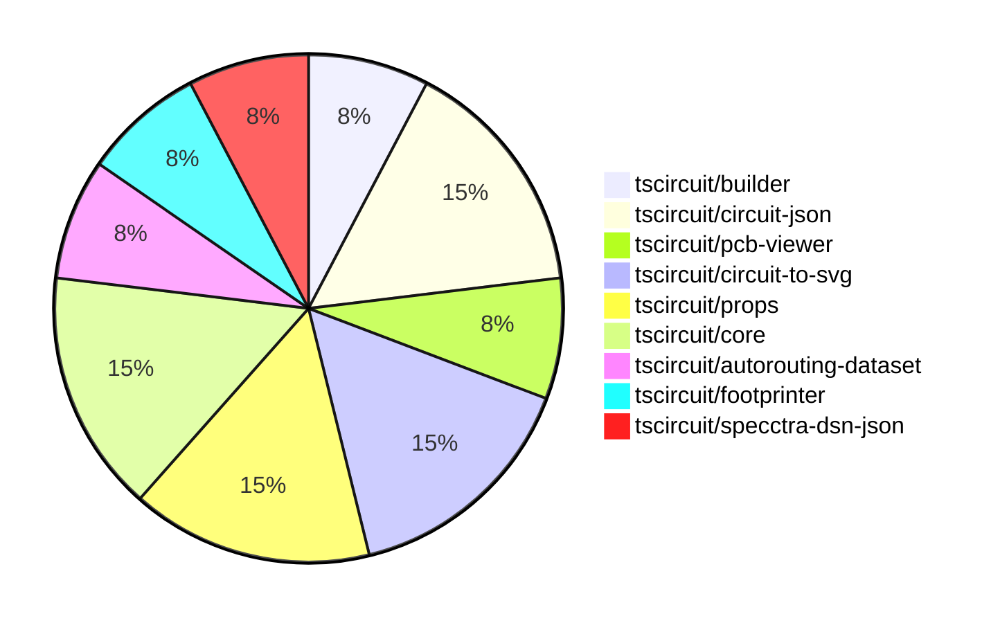

# Contribution Overview 2024-08-31

## PRs by Repository

## Contributor Overview

| Contributor | 🐳 Major | 🐙 Minor | 🐌 Tiny |
|-------------|-------|-------|-------|
| ShiboSoftwareDev | 1 | 1 | 1 |
| imrishabh18 | 1 | 1 | 0 |
| seveibar | 5 | 1 | 0 |
| andrii-balitskyi | 0 | 1 | 0 |

## Changes by Repository

### [tscircuit/builder](https://github.com/tscircuit/builder)

| PR # | Impact | Contributor | Description |
|------|--------|-------------|-------------|
| [#106](https://github.com/tscircuit/builder/pull/106) | 🐳 Major | ShiboSoftwareDev | Adds support for board outline in the Gerber format |

### [tscircuit/circuit-json](https://github.com/tscircuit/circuit-json)

| PR # | Impact | Contributor | Description |
|------|--------|-------------|-------------|
| [#32](https://github.com/tscircuit/circuit-json/pull/32) | 🐙 Minor | ShiboSoftwareDev | Changed the type of the `layer` field in the `pcb_trace` schema from `string` to `layer_ref`. |
| [#34](https://github.com/tscircuit/circuit-json/pull/34) | 🐌 Tiny | ShiboSoftwareDev | Fixed the import source for the `layer_ref` module in the `pcb_trace.ts` file. |

### [tscircuit/pcb-viewer](https://github.com/tscircuit/pcb-viewer)

| PR # | Impact | Contributor | Description |
|------|--------|-------------|-------------|
| [#44](https://github.com/tscircuit/pcb-viewer/pull/44) | 🟣 | imrishabh18 | Fix trace rendering for the `route_thickness_mode` property. |

### [tscircuit/circuit-to-svg](https://github.com/tscircuit/circuit-to-svg)

| PR # | Impact | Contributor | Description |
|------|--------|-------------|-------------|
| [#28](https://github.com/tscircuit/circuit-to-svg/pull/28) | 🐳 Major | imrishabh18 | Fix issues with schematic symbol attributes, including position, width, height, and rotation. |
| [#34](https://github.com/tscircuit/circuit-to-svg/pull/34) | 🐙 Minor | imrishabh18 | Rename files from `pcb-soup-to-svg.ts` to `circuit-to-pcb-svg.ts` and `soup-to-svg.ts` to `circuit-to-schematic-svg.ts`. |

### [tscircuit/props](https://github.com/tscircuit/props)

| PR # | Impact | Contributor | Description |
|------|--------|-------------|-------------|
| [#36](https://github.com/tscircuit/props/pull/36) | 🐳 Major | seveibar | Add schematic direction and port arrangement to jumper component |
| [#35](https://github.com/tscircuit/props/pull/35) | 🐳 Major | seveibar | Refactor the `cadModel` and `layout` modules to better define the props, split out `capacitor` and `resistor` components, add a `jumper` component, and add `pullupFor` and `decouplingFor` properties. |

### [tscircuit/core](https://github.com/tscircuit/core)

| PR # | Impact | Contributor | Description |
|------|--------|-------------|-------------|
| [#16](https://github.com/tscircuit/core/pull/16) | 🐳 Major | seveibar | Add support for rendering plated holes in the PCB |
| [#15](https://github.com/tscircuit/core/pull/15) | 🐳 Major | seveibar | Introduce support for jumpers, fix chip pinLabel selectors, and add new features like Resistor.pullup, Capacitor.decoupling, and Silkscreen drawings. |

### [tscircuit/autorouting-dataset](https://github.com/tscircuit/autorouting-dataset)

| PR # | Impact | Contributor | Description |
|------|--------|-------------|-------------|
| [#39](https://github.com/tscircuit/autorouting-dataset/pull/39) | 🐳 Major | seveibar | Introduce PCB trace support in dataset autorouting. The pull request adds support for parsing PCB obstacles (SMT pads and holes) from the circuit JSON, which allows the autorouter to handle PCB traces. |

### [tscircuit/footprinter](https://github.com/tscircuit/footprinter)

| PR # | Impact | Contributor | Description |
|------|--------|-------------|-------------|
| [#28](https://github.com/tscircuit/footprinter/pull/28) | 🐙 Minor | seveibar | Update the `circuit-to-svg` dependency to version `0.0.13` to fix issues with the snapshot functionality. |

### [tscircuit/specctra-dsn-json](https://github.com/tscircuit/specctra-dsn-json)

| PR # | Impact | Contributor | Description |
|------|--------|-------------|-------------|
| [#12](https://github.com/tscircuit/specctra-dsn-json/pull/12) | 🐙 Minor | andrii-balitskyi | Convert test suite from Ava to bun:test |

## Changes by Contributor

### [ShiboSoftwareDev](https://github.com/ShiboSoftwareDev)

| PR # | Impact | Description |
|------|--------|-------------|
| [#106](https://github.com/tscircuit/builder/pull/106) | 🐳 Major | Adds support for board outline in the Gerber format |
| [#32](https://github.com/tscircuit/circuit-json/pull/32) | 🐙 Minor | Changed the type of the `layer` field in the `pcb_trace` schema from `string` to `layer_ref`. |
| [#34](https://github.com/tscircuit/circuit-json/pull/34) | 🐌 Tiny | Fixed the import source for the `layer_ref` module in the `pcb_trace.ts` file. |

### [imrishabh18](https://github.com/imrishabh18)

| PR # | Impact | Description |
|------|--------|-------------|
| [#44](https://github.com/tscircuit/pcb-viewer/pull/44) | 🟣 | Fix trace rendering for the `route_thickness_mode` property. |
| [#28](https://github.com/tscircuit/circuit-to-svg/pull/28) | 🐳 Major | Fix issues with schematic symbol attributes, including position, width, height, and rotation. |
| [#34](https://github.com/tscircuit/circuit-to-svg/pull/34) | 🐙 Minor | Rename files from `pcb-soup-to-svg.ts` to `circuit-to-pcb-svg.ts` and `soup-to-svg.ts` to `circuit-to-schematic-svg.ts`. |

### [seveibar](https://github.com/seveibar)

| PR # | Impact | Description |
|------|--------|-------------|
| [#36](https://github.com/tscircuit/props/pull/36) | 🐳 Major | Add schematic direction and port arrangement to jumper component |
| [#35](https://github.com/tscircuit/props/pull/35) | 🐳 Major | Refactor the `cadModel` and `layout` modules to better define the props, split out `capacitor` and `resistor` components, add a `jumper` component, and add `pullupFor` and `decouplingFor` properties. |
| [#16](https://github.com/tscircuit/core/pull/16) | 🐳 Major | Add support for rendering plated holes in the PCB |
| [#15](https://github.com/tscircuit/core/pull/15) | 🐳 Major | Introduce support for jumpers, fix chip pinLabel selectors, and add new features like Resistor.pullup, Capacitor.decoupling, and Silkscreen drawings. |
| [#39](https://github.com/tscircuit/autorouting-dataset/pull/39) | 🐳 Major | Introduce PCB trace support in dataset autorouting. The pull request adds support for parsing PCB obstacles (SMT pads and holes) from the circuit JSON, which allows the autorouter to handle PCB traces. |
| [#28](https://github.com/tscircuit/footprinter/pull/28) | 🐙 Minor | Update the `circuit-to-svg` dependency to version `0.0.13` to fix issues with the snapshot functionality. |

### [andrii-balitskyi](https://github.com/andrii-balitskyi)

| PR # | Impact | Description |
|------|--------|-------------|
| [#12](https://github.com/tscircuit/specctra-dsn-json/pull/12) | 🐙 Minor | Convert test suite from Ava to bun:test |

