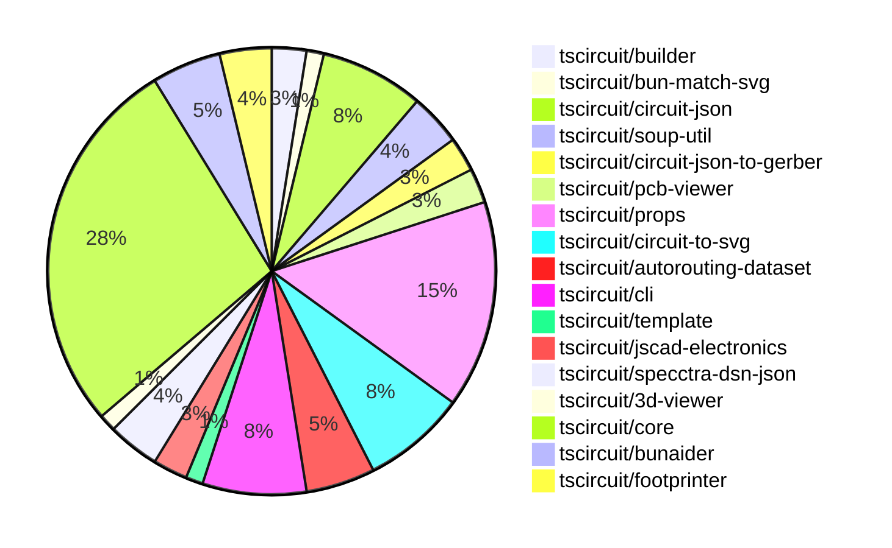

# Contribution Overview 2024-08-31

## PRs by Repository

## Contributor Overview

| Contributor | 🐳 Major | 🐙 Minor | 🐌 Tiny |
|-------------|-------|-------|-------|
| ShiboSoftwareDev | 2 | 4 | 1 |
| imrishabh18 | 7 | 8 | 0 |
| abhijitxy | 1 | 2 | 0 |
| seveibar | 32 | 15 | 0 |
| tscircuitbot | 0 | 4 | 0 |
| anas-sarkez | 2 | 0 | 0 |
| andrii-balitskyi | 1 | 1 | 0 |

## Changes by Repository

### [tscircuit/builder](https://github.com/tscircuit/builder)

| PR # | Impact | Contributor | Description |
|------|--------|-------------|-------------|
| [#106](https://github.com/tscircuit/builder/pull/106) | 🐳 Major | ShiboSoftwareDev | Gerber now supports board outline |
| [#107](https://github.com/tscircuit/builder/pull/107) | 🐙 Minor | ShiboSoftwareDev | Changed the unit format from inches to metric in the `convertSoupToExcellonDrillCommands` function. |

### [tscircuit/bun-match-svg](https://github.com/tscircuit/bun-match-svg)

| PR # | Impact | Contributor | Description |
|------|--------|-------------|-------------|
| [#2](https://github.com/tscircuit/bun-match-svg/pull/2) | 🐳 Major | ShiboSoftwareDev | Added a new matcher function `toMatchMultipleSvgSnapshots` that allows matching multiple SVG snapshots in a single test. |

### [tscircuit/circuit-json](https://github.com/tscircuit/circuit-json)

| PR # | Impact | Contributor | Description |
|------|--------|-------------|-------------|
| [#35](https://github.com/tscircuit/circuit-json/pull/35) | 🐳 Major | imrishabh18 | Add support for circular PCB keepouts |
| [#32](https://github.com/tscircuit/circuit-json/pull/32) | 🐙 Minor | ShiboSoftwareDev | Changed the data type of the `layer` property in `pcb_trace` from `string` to `layer_ref`. |
| [#39](https://github.com/tscircuit/circuit-json/pull/39) | 🐙 Minor | seveibar | Implement `pcb_hole_id` and add typechecking to CI |
| [#41](https://github.com/tscircuit/circuit-json/pull/41) | 🐙 Minor | tscircuitbot | Fix the PCB keepout schema by renaming the `layer` field to `layers` and making it an array of strings. |
| [#37](https://github.com/tscircuit/circuit-json/pull/37) | 🐙 Minor | tscircuitbot | Add a `pcb_plated_hole_id` field to the PCB plated hole schema. |
| [#34](https://github.com/tscircuit/circuit-json/pull/34) | 🐌 Tiny | ShiboSoftwareDev | Fixed the import source for the `layer_ref` module. |

### [tscircuit/soup-util](https://github.com/tscircuit/soup-util)

| PR # | Impact | Contributor | Description |
|------|--------|-------------|-------------|
| [#10](https://github.com/tscircuit/soup-util/pull/10) | 🐙 Minor | ShiboSoftwareDev | Specify the version of the @tscircuit/soup dependency to ^0.0.66 instead of using the wildcard version. |
| [#12](https://github.com/tscircuit/soup-util/pull/12) | 🐙 Minor | imrishabh18 | Update the transformation logic for `pcb_keepout` elements to apply the transformation to the `center` property regardless of the shape. |
| [#11](https://github.com/tscircuit/soup-util/pull/11) | 🐙 Minor | imrishabh18 | Added support for transforming `pcb_keepout` elements in the `transformSchematicElement` function. |

### [tscircuit/circuit-json-to-gerber](https://github.com/tscircuit/circuit-json-to-gerber)

| PR # | Impact | Contributor | Description |
|------|--------|-------------|-------------|
| [#5](https://github.com/tscircuit/circuit-json-to-gerber/pull/5) | 🐳 Major | anas-sarkez | Fixed an issue with the rendering of multilayer SVG gerber layers. |
| [#4](https://github.com/tscircuit/circuit-json-to-gerber/pull/4) | 🐙 Minor | ShiboSoftwareDev | Upgrade dependencies and fix a type issue in the code. |

### [tscircuit/pcb-viewer](https://github.com/tscircuit/pcb-viewer)

| PR # | Impact | Contributor | Description |
|------|--------|-------------|-------------|
| [#45](https://github.com/tscircuit/pcb-viewer/pull/45) | 🐳 Major | imrishabh18 | Introduce a new feature for drawing PCB keepout areas using a mesh pattern. |
| [#44](https://github.com/tscircuit/pcb-viewer/pull/44) | 🐳 Major | imrishabh18 | Fix trace rendering by handling both "constant" and "interpolated" route_thickness_mode. |

### [tscircuit/props](https://github.com/tscircuit/props)

| PR # | Impact | Contributor | Description |
|------|--------|-------------|-------------|
| [#41](https://github.com/tscircuit/props/pull/41) | 🐳 Major | imrishabh18 | Add `keepout` props to the library |
| [#47](https://github.com/tscircuit/props/pull/47) | 🐳 Major | seveibar | Improve Hole Props, allow specifying radius, infer diameter in every case |
| [#45](https://github.com/tscircuit/props/pull/45) | 🐳 Major | seveibar | Refactor and fix requirements for PCB SMT pad component |
| [#44](https://github.com/tscircuit/props/pull/44) | 🐳 Major | seveibar | Fix the `pcb` prop being required for constraints, and add `edgeToEdge`, `centerToCenter`, and other constraint properties to clarify application. |
| [#42](https://github.com/tscircuit/props/pull/42) | 🐳 Major | seveibar | Refactor the `chip` component to use the new type pattern, and add the `constrainedlayout` and `constraint` components. |
| [#39](https://github.com/tscircuit/props/pull/39) | 🐳 Major | seveibar | Introduce subcircuit group props |
| [#35](https://github.com/tscircuit/props/pull/35) | 🐳 Major | seveibar | Refactor the codebase to better define props, split out capacitor and resistor, add jumper, and add pullupFor and decouplingFor properties. |
| [#46](https://github.com/tscircuit/props/pull/46) | 🐙 Minor | seveibar | Make `pcbX` and `pcbY` optional for `pcbLayoutProps` interface and `pcbLayoutProps` object. |
| [#43](https://github.com/tscircuit/props/pull/43) | 🐙 Minor | seveibar | Remove legacy constraint props |
| [#38](https://github.com/tscircuit/props/pull/38) | 🐙 Minor | seveibar | Introduce a new component called `net` with a `NetProps` interface and a `netProps` Zod schema. |
| [#37](https://github.com/tscircuit/props/pull/37) | 🐙 Minor | seveibar | Refactor group props by moving the definition to a separate file and exporting it. |
| [#36](https://github.com/tscircuit/props/pull/36) | 🐙 Minor | seveibar | Add schematic direction to jumper component |

### [tscircuit/circuit-to-svg](https://github.com/tscircuit/circuit-to-svg)

| PR # | Impact | Contributor | Description |
|------|--------|-------------|-------------|
| [#43](https://github.com/tscircuit/circuit-to-svg/pull/43) | 🐳 Major | imrishabh18 | Modify the `createPcbTrace` function to generate smooth traces with rounded corners. |
| [#28](https://github.com/tscircuit/circuit-to-svg/pull/28) | 🐳 Major | imrishabh18 | Fix for the attributes of schematic symbols, including position, width, height, and rotation. |
| [#44](https://github.com/tscircuit/circuit-to-svg/pull/44) | 🐙 Minor | imrishabh18 | Fix the order of the silkscreen layer to be the topmost layer in the SVG. |
| [#39](https://github.com/tscircuit/circuit-to-svg/pull/39) | 🐙 Minor | imrishabh18 | Fix the silkscreen rendering in the PCB viewer. |
| [#38](https://github.com/tscircuit/circuit-to-svg/pull/38) | 🐙 Minor | imrishabh18 | Fix the appearance of plated holes and standardize the color usage in the PCB SVG rendering. |
| [#34](https://github.com/tscircuit/circuit-to-svg/pull/34) | 🐙 Minor | imrishabh18 | Rename files from "pcb-soup-to-svg" and "soup-to-svg" to "circuit-to-pcb-svg" and "circuit-to-schematic-svg" respectively. |

### [tscircuit/autorouting-dataset](https://github.com/tscircuit/autorouting-dataset)

| PR # | Impact | Contributor | Description |
|------|--------|-------------|-------------|
| [#40](https://github.com/tscircuit/autorouting-dataset/pull/40) | 🐳 Major | imrishabh18 | Add PCB keepout areas as obstacles in the circuit solver |
| [#41](https://github.com/tscircuit/autorouting-dataset/pull/41) | 🐳 Major | seveibar | Add a GitHub Actions workflow for publishing the `@tscircuit/infgrid-ijump-astar` package to npm. |
| [#39](https://github.com/tscircuit/autorouting-dataset/pull/39) | 🐳 Major | seveibar | The pull request introduces PCB trace support in the dataset autorouting by adding workflows, refactoring code to break out getObstaclesFromCircuitJson, and fixing types. |
| [#42](https://github.com/tscircuit/autorouting-dataset/pull/42) | 🐙 Minor | seveibar | Add a format check GitHub Action to the project. |

### [tscircuit/cli](https://github.com/tscircuit/cli)

| PR # | Impact | Contributor | Description |
|------|--------|-------------|-------------|
| [#155](https://github.com/tscircuit/cli/pull/155) | 🐳 Major | seveibar | Fixes issues with custom keyboard, entrypoint errors, and progress on switch shaft rendering. |
| [#149](https://github.com/tscircuit/cli/pull/149) | 🐳 Major | seveibar | Update the core library usage in the project, making manual editing working again. |
| [#142](https://github.com/tscircuit/cli/pull/142) | 🐙 Minor | imrishabh18 | Fix an issue in the `tsci dev init` command by updating the import path for the `MyCircuit` component. |
| [#161](https://github.com/tscircuit/cli/pull/161) | 🐙 Minor | abhijitxy | Fix the dropdown appearing under the circuit by adding a z-index to the PopoverContent component. |
| [#159](https://github.com/tscircuit/cli/pull/159) | 🐙 Minor | seveibar | Improve entrypoint file error reporting for the 9key macrokeypad project. |
| [#144](https://github.com/tscircuit/cli/pull/144) | 🐙 Minor | seveibar | Fix the `dev:test-project` command in the package.json file. |

### [tscircuit/template](https://github.com/tscircuit/template)

| PR # | Impact | Contributor | Description |
|------|--------|-------------|-------------|
| [#3](https://github.com/tscircuit/template/pull/3) | 🐙 Minor | imrishabh18 | Fix a bug in the CLI (Command-Line Interface) by updating the import path for the `MyCircuit` component. |

### [tscircuit/jscad-electronics](https://github.com/tscircuit/jscad-electronics)

| PR # | Impact | Contributor | Description |
|------|--------|-------------|-------------|
| [#20](https://github.com/tscircuit/jscad-electronics/pull/20) | 🐳 Major | abhijitxy | Introduce a new `QFP` component that renders a quad flat package with configurable pin count and dimensions. |
| [#22](https://github.com/tscircuit/jscad-electronics/pull/22) | 🐙 Minor | abhijitxy | Use `zAxisUp` in all fixtures |

### [tscircuit/specctra-dsn-json](https://github.com/tscircuit/specctra-dsn-json)

| PR # | Impact | Contributor | Description |
|------|--------|-------------|-------------|
| [#13](https://github.com/tscircuit/specctra-dsn-json/pull/13) | 🐳 Major | seveibar | Add GitHub Actions workflows for running Bun tests and type checks. |
| [#11](https://github.com/tscircuit/specctra-dsn-json/pull/11) | 🐳 Major | andrii-balitskyi | Update zod schemas and var names, and convert DSN `via` element to soup. |
| [#12](https://github.com/tscircuit/specctra-dsn-json/pull/12) | 🐙 Minor | andrii-balitskyi | Convert the test suite from Ava to Bun:test |

### [tscircuit/3d-viewer](https://github.com/tscircuit/3d-viewer)

| PR # | Impact | Contributor | Description |
|------|--------|-------------|-------------|
| [#14](https://github.com/tscircuit/3d-viewer/pull/14) | 🐳 Major | seveibar | Add support for rendering holes onto the board |

### [tscircuit/core](https://github.com/tscircuit/core)

| PR # | Impact | Contributor | Description |
|------|--------|-------------|-------------|
| [#55](https://github.com/tscircuit/core/pull/55) | 🐳 Major | seveibar | Rename the `_getCircuitJsonBounds` method to `_getPcbCircuitJsonBounds` and fix the usage of the `pcb_port_id` property to determine the position of a `Port` component for autorouting. |
| [#53](https://github.com/tscircuit/core/pull/53) | 🐳 Major | seveibar | Introduce a new `SilkscreenText` component and register it in the component catalogue. |
| [#41](https://github.com/tscircuit/core/pull/41) | 🐳 Major | seveibar | Various fixes for constraint and layout calculation |
| [#36](https://github.com/tscircuit/core/pull/36) | 🐳 Major | seveibar | Implement `sameX` and `sameY` constraints, and refactor constraint reference code in preparation for edge selectors. |
| [#35](https://github.com/tscircuit/core/pull/35) | 🐳 Major | seveibar | Introduce a new "ydist" constraint for positioning components vertically, add type checking to the CI workflow, and fix an issue with the "edgeToEdge" constraint. |
| [#34](https://github.com/tscircuit/core/pull/34) | 🐳 Major | seveibar | Implement the `Hole` and `pcb_hole` rendering components. |
| [#33](https://github.com/tscircuit/core/pull/33) | 🐳 Major | seveibar | Introduce a new base component called `PrimitiveContainer` to handle constraint solving for footprints, and make various changes to the `Project`, `NormalComponent`, and `PrimitiveComponent` classes. |
| [#32](https://github.com/tscircuit/core/pull/32) | 🐳 Major | seveibar | Refactor the Project class, implement the InitializePortsFromChildren render phase, and fix the footprint port initialization. |
| [#31](https://github.com/tscircuit/core/pull/31) | 🐳 Major | seveibar | Correctly compute the size of PCB components by examining their children and updating the database accordingly. |
| [#30](https://github.com/tscircuit/core/pull/30) | 🐳 Major | seveibar | Fix manual placements not moving SMTPads and add a snapshot test. |
| [#29](https://github.com/tscircuit/core/pull/29) | 🐳 Major | seveibar | Implement a new feature that allows for manual placement of PCB components within a board layout. |
| [#28](https://github.com/tscircuit/core/pull/28) | 🐳 Major | seveibar | Improve same-net detection and handling for the autorouter, and fully route the example1 circuit. |
| [#26](https://github.com/tscircuit/core/pull/26) | 🐳 Major | seveibar | Rename "OpaqueGroup" to "Subcircuit" and add support for creating nets from component properties |
| [#21](https://github.com/tscircuit/core/pull/21) | 🐳 Major | seveibar | Add GitHub Actions workflows for the "bunaider" tool, which automates PR review responses and issue auto-fixes. |
| [#20](https://github.com/tscircuit/core/pull/20) | 🐳 Major | seveibar | Introduce support for opaque groups, rename Project to Circuit, add pullupFor and pullupTo props for resistors, and add decouplingTo and decouplingFor props. |
| [#18](https://github.com/tscircuit/core/pull/18) | 🐳 Major | seveibar | Fix trace overlapping, fix SMTPads not rotating, and fix SilkscreenPaths transforming properly. |
| [#16](https://github.com/tscircuit/core/pull/16) | 🐳 Major | seveibar | Add support for rendering PCB plated holes. |
| [#15](https://github.com/tscircuit/core/pull/15) | 🐳 Major | seveibar | Introduce jumper support, fix chip pin label selectors, add Resistor.pullup, Capacitor.decoupling, and Silkscreen drawings |
| [#54](https://github.com/tscircuit/core/pull/54) | 🐙 Minor | seveibar | Fix the position of ports in the layout phase |
| [#44](https://github.com/tscircuit/core/pull/44) | 🐙 Minor | seveibar | Fix the rendering of diodes in the components index. |
| [#27](https://github.com/tscircuit/core/pull/27) | 🐙 Minor | seveibar | Upgrade the `circuit-to-svg` dependency to version `0.0.18` to improve the appearance of the SVG snapshots. |
| [#23](https://github.com/tscircuit/core/pull/23) | 🐙 Minor | seveibar | The pull request adds support for tagging with 'bunaider' in the GitHub Actions workflow. |

### [tscircuit/bunaider](https://github.com/tscircuit/bunaider)

| PR # | Impact | Contributor | Description |
|------|--------|-------------|-------------|
| [#19](https://github.com/tscircuit/bunaider/pull/19) | 🐳 Major | seveibar | Improve error handling and logging for branch creation and pushing |
| [#16](https://github.com/tscircuit/bunaider/pull/16) | 🐳 Major | seveibar | Add support for automatically adding context files to the `aider` command |
| [#15](https://github.com/tscircuit/bunaider/pull/15) | 🐙 Minor | tscircuitbot | Automatically add TypeScript files to context (unless they're inside .aiderignore), automatically add README.md |
| [#14](https://github.com/tscircuit/bunaider/pull/14) | 🐙 Minor | tscircuitbot | Fix for issue #12 by automatically generating the pull request title based on the issue title. |

### [tscircuit/footprinter](https://github.com/tscircuit/footprinter)

| PR # | Impact | Contributor | Description |
|------|--------|-------------|-------------|
| [#29](https://github.com/tscircuit/footprinter/pull/29) | 🐳 Major | anas-sarkez | Add silkscreen for all passive-fn for example [0402,0603...], and add plus sign prop and silkscreen |
| [#30](https://github.com/tscircuit/footprinter/pull/30) | 🐙 Minor | seveibar | Reverts the changes made in tscircuit/footprinter#29, which added silkscreen for all passive-fn components and the plus sign property. |
| [#28](https://github.com/tscircuit/footprinter/pull/28) | 🐙 Minor | seveibar | Update the `circuit-to-svg` dependency to version `0.0.13` to fix issues with snapshots |

## Changes by Contributor

### [ShiboSoftwareDev](https://github.com/ShiboSoftwareDev)

| PR # | Impact | Description |
|------|--------|-------------|
| [#106](https://github.com/tscircuit/builder/pull/106) | 🐳 Major | Gerber now supports board outline |
| [#2](https://github.com/tscircuit/bun-match-svg/pull/2) | 🐳 Major | Added a new matcher function `toMatchMultipleSvgSnapshots` that allows matching multiple SVG snapshots in a single test. |
| [#107](https://github.com/tscircuit/builder/pull/107) | 🐙 Minor | Changed the unit format from inches to metric in the `convertSoupToExcellonDrillCommands` function. |
| [#32](https://github.com/tscircuit/circuit-json/pull/32) | 🐙 Minor | Changed the data type of the `layer` property in `pcb_trace` from `string` to `layer_ref`. |
| [#10](https://github.com/tscircuit/soup-util/pull/10) | 🐙 Minor | Specify the version of the @tscircuit/soup dependency to ^0.0.66 instead of using the wildcard version. |
| [#4](https://github.com/tscircuit/circuit-json-to-gerber/pull/4) | 🐙 Minor | Upgrade dependencies and fix a type issue in the code. |
| [#34](https://github.com/tscircuit/circuit-json/pull/34) | 🐌 Tiny | Fixed the import source for the `layer_ref` module. |

### [imrishabh18](https://github.com/imrishabh18)

| PR # | Impact | Description |
|------|--------|-------------|
| [#45](https://github.com/tscircuit/pcb-viewer/pull/45) | 🐳 Major | Introduce a new feature for drawing PCB keepout areas using a mesh pattern. |
| [#44](https://github.com/tscircuit/pcb-viewer/pull/44) | 🐳 Major | Fix trace rendering by handling both "constant" and "interpolated" route_thickness_mode. |
| [#35](https://github.com/tscircuit/circuit-json/pull/35) | 🐳 Major | Add support for circular PCB keepouts |
| [#41](https://github.com/tscircuit/props/pull/41) | 🐳 Major | Add `keepout` props to the library |
| [#43](https://github.com/tscircuit/circuit-to-svg/pull/43) | 🐳 Major | Modify the `createPcbTrace` function to generate smooth traces with rounded corners. |
| [#28](https://github.com/tscircuit/circuit-to-svg/pull/28) | 🐳 Major | Fix for the attributes of schematic symbols, including position, width, height, and rotation. |
| [#40](https://github.com/tscircuit/autorouting-dataset/pull/40) | 🐳 Major | Add PCB keepout areas as obstacles in the circuit solver |
| [#142](https://github.com/tscircuit/cli/pull/142) | 🐙 Minor | Fix an issue in the `tsci dev init` command by updating the import path for the `MyCircuit` component. |
| [#12](https://github.com/tscircuit/soup-util/pull/12) | 🐙 Minor | Update the transformation logic for `pcb_keepout` elements to apply the transformation to the `center` property regardless of the shape. |
| [#11](https://github.com/tscircuit/soup-util/pull/11) | 🐙 Minor | Added support for transforming `pcb_keepout` elements in the `transformSchematicElement` function. |
| [#44](https://github.com/tscircuit/circuit-to-svg/pull/44) | 🐙 Minor | Fix the order of the silkscreen layer to be the topmost layer in the SVG. |
| [#39](https://github.com/tscircuit/circuit-to-svg/pull/39) | 🐙 Minor | Fix the silkscreen rendering in the PCB viewer. |
| [#38](https://github.com/tscircuit/circuit-to-svg/pull/38) | 🐙 Minor | Fix the appearance of plated holes and standardize the color usage in the PCB SVG rendering. |
| [#34](https://github.com/tscircuit/circuit-to-svg/pull/34) | 🐙 Minor | Rename files from "pcb-soup-to-svg" and "soup-to-svg" to "circuit-to-pcb-svg" and "circuit-to-schematic-svg" respectively. |
| [#3](https://github.com/tscircuit/template/pull/3) | 🐙 Minor | Fix a bug in the CLI (Command-Line Interface) by updating the import path for the `MyCircuit` component. |

### [abhijitxy](https://github.com/abhijitxy)

| PR # | Impact | Description |
|------|--------|-------------|
| [#20](https://github.com/tscircuit/jscad-electronics/pull/20) | 🐳 Major | Introduce a new `QFP` component that renders a quad flat package with configurable pin count and dimensions. |
| [#161](https://github.com/tscircuit/cli/pull/161) | 🐙 Minor | Fix the dropdown appearing under the circuit by adding a z-index to the PopoverContent component. |
| [#22](https://github.com/tscircuit/jscad-electronics/pull/22) | 🐙 Minor | Use `zAxisUp` in all fixtures |

### [seveibar](https://github.com/seveibar)

| PR # | Impact | Description |
|------|--------|-------------|
| [#155](https://github.com/tscircuit/cli/pull/155) | 🐳 Major | Fixes issues with custom keyboard, entrypoint errors, and progress on switch shaft rendering. |
| [#149](https://github.com/tscircuit/cli/pull/149) | 🐳 Major | Update the core library usage in the project, making manual editing working again. |
| [#47](https://github.com/tscircuit/props/pull/47) | 🐳 Major | Improve Hole Props, allow specifying radius, infer diameter in every case |
| [#45](https://github.com/tscircuit/props/pull/45) | 🐳 Major | Refactor and fix requirements for PCB SMT pad component |
| [#44](https://github.com/tscircuit/props/pull/44) | 🐳 Major | Fix the `pcb` prop being required for constraints, and add `edgeToEdge`, `centerToCenter`, and other constraint properties to clarify application. |
| [#42](https://github.com/tscircuit/props/pull/42) | 🐳 Major | Refactor the `chip` component to use the new type pattern, and add the `constrainedlayout` and `constraint` components. |
| [#39](https://github.com/tscircuit/props/pull/39) | 🐳 Major | Introduce subcircuit group props |
| [#35](https://github.com/tscircuit/props/pull/35) | 🐳 Major | Refactor the codebase to better define props, split out capacitor and resistor, add jumper, and add pullupFor and decouplingFor properties. |
| [#13](https://github.com/tscircuit/specctra-dsn-json/pull/13) | 🐳 Major | Add GitHub Actions workflows for running Bun tests and type checks. |
| [#14](https://github.com/tscircuit/3d-viewer/pull/14) | 🐳 Major | Add support for rendering holes onto the board |
| [#55](https://github.com/tscircuit/core/pull/55) | 🐳 Major | Rename the `_getCircuitJsonBounds` method to `_getPcbCircuitJsonBounds` and fix the usage of the `pcb_port_id` property to determine the position of a `Port` component for autorouting. |
| [#53](https://github.com/tscircuit/core/pull/53) | 🐳 Major | Introduce a new `SilkscreenText` component and register it in the component catalogue. |
| [#41](https://github.com/tscircuit/core/pull/41) | 🐳 Major | Various fixes for constraint and layout calculation |
| [#36](https://github.com/tscircuit/core/pull/36) | 🐳 Major | Implement `sameX` and `sameY` constraints, and refactor constraint reference code in preparation for edge selectors. |
| [#35](https://github.com/tscircuit/core/pull/35) | 🐳 Major | Introduce a new "ydist" constraint for positioning components vertically, add type checking to the CI workflow, and fix an issue with the "edgeToEdge" constraint. |
| [#34](https://github.com/tscircuit/core/pull/34) | 🐳 Major | Implement the `Hole` and `pcb_hole` rendering components. |
| [#33](https://github.com/tscircuit/core/pull/33) | 🐳 Major | Introduce a new base component called `PrimitiveContainer` to handle constraint solving for footprints, and make various changes to the `Project`, `NormalComponent`, and `PrimitiveComponent` classes. |
| [#32](https://github.com/tscircuit/core/pull/32) | 🐳 Major | Refactor the Project class, implement the InitializePortsFromChildren render phase, and fix the footprint port initialization. |
| [#31](https://github.com/tscircuit/core/pull/31) | 🐳 Major | Correctly compute the size of PCB components by examining their children and updating the database accordingly. |
| [#30](https://github.com/tscircuit/core/pull/30) | 🐳 Major | Fix manual placements not moving SMTPads and add a snapshot test. |
| [#29](https://github.com/tscircuit/core/pull/29) | 🐳 Major | Implement a new feature that allows for manual placement of PCB components within a board layout. |
| [#28](https://github.com/tscircuit/core/pull/28) | 🐳 Major | Improve same-net detection and handling for the autorouter, and fully route the example1 circuit. |
| [#26](https://github.com/tscircuit/core/pull/26) | 🐳 Major | Rename "OpaqueGroup" to "Subcircuit" and add support for creating nets from component properties |
| [#21](https://github.com/tscircuit/core/pull/21) | 🐳 Major | Add GitHub Actions workflows for the "bunaider" tool, which automates PR review responses and issue auto-fixes. |
| [#20](https://github.com/tscircuit/core/pull/20) | 🐳 Major | Introduce support for opaque groups, rename Project to Circuit, add pullupFor and pullupTo props for resistors, and add decouplingTo and decouplingFor props. |
| [#18](https://github.com/tscircuit/core/pull/18) | 🐳 Major | Fix trace overlapping, fix SMTPads not rotating, and fix SilkscreenPaths transforming properly. |
| [#16](https://github.com/tscircuit/core/pull/16) | 🐳 Major | Add support for rendering PCB plated holes. |
| [#15](https://github.com/tscircuit/core/pull/15) | 🐳 Major | Introduce jumper support, fix chip pin label selectors, add Resistor.pullup, Capacitor.decoupling, and Silkscreen drawings |
| [#41](https://github.com/tscircuit/autorouting-dataset/pull/41) | 🐳 Major | Add a GitHub Actions workflow for publishing the `@tscircuit/infgrid-ijump-astar` package to npm. |
| [#39](https://github.com/tscircuit/autorouting-dataset/pull/39) | 🐳 Major | The pull request introduces PCB trace support in the dataset autorouting by adding workflows, refactoring code to break out getObstaclesFromCircuitJson, and fixing types. |
| [#19](https://github.com/tscircuit/bunaider/pull/19) | 🐳 Major | Improve error handling and logging for branch creation and pushing |
| [#16](https://github.com/tscircuit/bunaider/pull/16) | 🐳 Major | Add support for automatically adding context files to the `aider` command |
| [#159](https://github.com/tscircuit/cli/pull/159) | 🐙 Minor | Improve entrypoint file error reporting for the 9key macrokeypad project. |
| [#144](https://github.com/tscircuit/cli/pull/144) | 🐙 Minor | Fix the `dev:test-project` command in the package.json file. |
| [#39](https://github.com/tscircuit/circuit-json/pull/39) | 🐙 Minor | Implement `pcb_hole_id` and add typechecking to CI |
| [#46](https://github.com/tscircuit/props/pull/46) | 🐙 Minor | Make `pcbX` and `pcbY` optional for `pcbLayoutProps` interface and `pcbLayoutProps` object. |
| [#43](https://github.com/tscircuit/props/pull/43) | 🐙 Minor | Remove legacy constraint props |
| [#38](https://github.com/tscircuit/props/pull/38) | 🐙 Minor | Introduce a new component called `net` with a `NetProps` interface and a `netProps` Zod schema. |
| [#37](https://github.com/tscircuit/props/pull/37) | 🐙 Minor | Refactor group props by moving the definition to a separate file and exporting it. |
| [#36](https://github.com/tscircuit/props/pull/36) | 🐙 Minor | Add schematic direction to jumper component |
| [#30](https://github.com/tscircuit/footprinter/pull/30) | 🐙 Minor | Reverts the changes made in tscircuit/footprinter#29, which added silkscreen for all passive-fn components and the plus sign property. |
| [#28](https://github.com/tscircuit/footprinter/pull/28) | 🐙 Minor | Update the `circuit-to-svg` dependency to version `0.0.13` to fix issues with snapshots |
| [#54](https://github.com/tscircuit/core/pull/54) | 🐙 Minor | Fix the position of ports in the layout phase |
| [#44](https://github.com/tscircuit/core/pull/44) | 🐙 Minor | Fix the rendering of diodes in the components index. |
| [#27](https://github.com/tscircuit/core/pull/27) | 🐙 Minor | Upgrade the `circuit-to-svg` dependency to version `0.0.18` to improve the appearance of the SVG snapshots. |
| [#23](https://github.com/tscircuit/core/pull/23) | 🐙 Minor | The pull request adds support for tagging with 'bunaider' in the GitHub Actions workflow. |
| [#42](https://github.com/tscircuit/autorouting-dataset/pull/42) | 🐙 Minor | Add a format check GitHub Action to the project. |

### [tscircuitbot](https://github.com/tscircuitbot)

| PR # | Impact | Description |
|------|--------|-------------|
| [#41](https://github.com/tscircuit/circuit-json/pull/41) | 🐙 Minor | Fix the PCB keepout schema by renaming the `layer` field to `layers` and making it an array of strings. |
| [#37](https://github.com/tscircuit/circuit-json/pull/37) | 🐙 Minor | Add a `pcb_plated_hole_id` field to the PCB plated hole schema. |
| [#15](https://github.com/tscircuit/bunaider/pull/15) | 🐙 Minor | Automatically add TypeScript files to context (unless they're inside .aiderignore), automatically add README.md |
| [#14](https://github.com/tscircuit/bunaider/pull/14) | 🐙 Minor | Fix for issue #12 by automatically generating the pull request title based on the issue title. |

### [anas-sarkez](https://github.com/anas-sarkez)

| PR # | Impact | Description |
|------|--------|-------------|
| [#29](https://github.com/tscircuit/footprinter/pull/29) | 🐳 Major | Add silkscreen for all passive-fn for example [0402,0603...], and add plus sign prop and silkscreen |
| [#5](https://github.com/tscircuit/circuit-json-to-gerber/pull/5) | 🐳 Major | Fixed an issue with the rendering of multilayer SVG gerber layers. |

### [andrii-balitskyi](https://github.com/andrii-balitskyi)

| PR # | Impact | Description |
|------|--------|-------------|
| [#11](https://github.com/tscircuit/specctra-dsn-json/pull/11) | 🐳 Major | Update zod schemas and var names, and convert DSN `via` element to soup. |
| [#12](https://github.com/tscircuit/specctra-dsn-json/pull/12) | 🐙 Minor | Convert the test suite from Ava to Bun:test |

