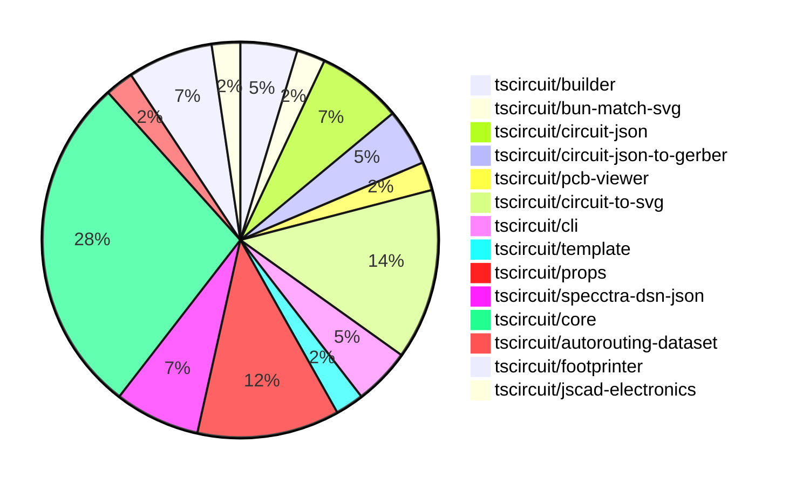

# Contribution Overview 2024-08-31

## PRs by Repository

## Contributor Overview

| Contributor | 🐳 Major | 🐙 Minor | 🐌 Tiny |
|-------------|-------|-------|-------|
| ShiboSoftwareDev | 2 | 3 | 1 |
| imrishabh18 | 6 | 4 | 0 |
| seveibar | 15 | 7 | 0 |
| anas-sarkez | 2 | 0 | 0 |
| andrii-balitskyi | 1 | 1 | 0 |
| abhijitxy | 1 | 0 | 0 |

## Changes by Repository

### [tscircuit/builder](https://github.com/tscircuit/builder)

| PR # | Impact | Contributor | Description |
|------|--------|-------------|-------------|
| [#106](https://github.com/tscircuit/builder/pull/106) | 🐳 Major | ShiboSoftwareDev | Adds support for board outline in the Gerber format. |
| [#107](https://github.com/tscircuit/builder/pull/107) | 🐙 Minor | ShiboSoftwareDev | Changed the units used in the `convertSoupToExcellonDrillCommands` function from inches to metric. |

### [tscircuit/bun-match-svg](https://github.com/tscircuit/bun-match-svg)

| PR # | Impact | Contributor | Description |
|------|--------|-------------|-------------|
| [#2](https://github.com/tscircuit/bun-match-svg/pull/2) | 🐳 Major | ShiboSoftwareDev | Added a new utility function `toMatchMultipleSvgSnapshots` to handle multiple SVG snapshots in a single test. |

### [tscircuit/circuit-json](https://github.com/tscircuit/circuit-json)

| PR # | Impact | Contributor | Description |
|------|--------|-------------|-------------|
| [#35](https://github.com/tscircuit/circuit-json/pull/35) | 🐳 Major | imrishabh18 | Add support for circular PCB keepout shapes. |
| [#32](https://github.com/tscircuit/circuit-json/pull/32) | 🐙 Minor | ShiboSoftwareDev | Changed the type of the `layer` field from `string` to `layer_ref` in the `pcb_trace` schema. |
| [#34](https://github.com/tscircuit/circuit-json/pull/34) | 🐌 Tiny | ShiboSoftwareDev | Fixed the import source for the `layer_ref` module in the `pcb_trace.ts` file. |

### [tscircuit/circuit-json-to-gerber](https://github.com/tscircuit/circuit-json-to-gerber)

| PR # | Impact | Contributor | Description |
|------|--------|-------------|-------------|
| [#5](https://github.com/tscircuit/circuit-json-to-gerber/pull/5) | 🐳 Major | anas-sarkez | Fixed a bug with multilayer SVG gerber layers |
| [#4](https://github.com/tscircuit/circuit-json-to-gerber/pull/4) | 🐙 Minor | ShiboSoftwareDev | Upgrades dependencies and fixes a type issue in the `getGerberLayerName` function. |

### [tscircuit/pcb-viewer](https://github.com/tscircuit/pcb-viewer)

| PR # | Impact | Contributor | Description |
|------|--------|-------------|-------------|
| [#44](https://github.com/tscircuit/pcb-viewer/pull/44) | 🐳 Major | imrishabh18 | Fix trace rendering with `route_thickness_mode` set to "constant" |

### [tscircuit/circuit-to-svg](https://github.com/tscircuit/circuit-to-svg)

| PR # | Impact | Contributor | Description |
|------|--------|-------------|-------------|
| [#43](https://github.com/tscircuit/circuit-to-svg/pull/43) | 🐳 Major | imrishabh18 | Fix the traces to be smoothly curved instead of straight lines. |
| [#39](https://github.com/tscircuit/circuit-to-svg/pull/39) | 🐳 Major | imrishabh18 | Fix the silkscreen coloring in the PCB SVG rendering. |
| [#38](https://github.com/tscircuit/circuit-to-svg/pull/38) | 🐳 Major | imrishabh18 | Fix the usage of `pcb_plated_hole` and standard color for PCB elements |
| [#28](https://github.com/tscircuit/circuit-to-svg/pull/28) | 🐳 Major | imrishabh18 | Fix issues with schematic symbol attributes, including position, width, height, and rotation. |
| [#44](https://github.com/tscircuit/circuit-to-svg/pull/44) | 🐙 Minor | imrishabh18 | Fix the silkscreen layer to be the topmost layer in the PCB SVG. |
| [#34](https://github.com/tscircuit/circuit-to-svg/pull/34) | 🐙 Minor | imrishabh18 | Rename `pcb-soup-to-svg.ts` to `circuit-to-pcb-svg.ts` and `soup-to-svg.ts` to `circuit-to-schematic-svg.ts`. |

### [tscircuit/cli](https://github.com/tscircuit/cli)

| PR # | Impact | Contributor | Description |
|------|--------|-------------|-------------|
| [#142](https://github.com/tscircuit/cli/pull/142) | 🐙 Minor | imrishabh18 | Fix the import path for the `MyCircuit` component in the `MyExample.tsx` file. |
| [#144](https://github.com/tscircuit/cli/pull/144) | 🐙 Minor | seveibar | Fix the `dev:test-project` command in the `package.json` file |

### [tscircuit/template](https://github.com/tscircuit/template)

| PR # | Impact | Contributor | Description |
|------|--------|-------------|-------------|
| [#3](https://github.com/tscircuit/template/pull/3) | 🐙 Minor | imrishabh18 | Fix a bug in the CLI by updating the import path of the `MyCircuit` component. |

### [tscircuit/props](https://github.com/tscircuit/props)

| PR # | Impact | Contributor | Description |
|------|--------|-------------|-------------|
| [#39](https://github.com/tscircuit/props/pull/39) | 🐳 Major | seveibar | Introduce subcircuit group props |
| [#36](https://github.com/tscircuit/props/pull/36) | 🐳 Major | seveibar | Add schematic port arrangement and direction to the jumper component. |
| [#35](https://github.com/tscircuit/props/pull/35) | 🐳 Major | seveibar | More refactoring to better define props, split out capacitor and resistor, add jumper, add pullupFor, decouplingFor. |
| [#38](https://github.com/tscircuit/props/pull/38) | 🐙 Minor | seveibar | Introduce the `netProps` interface and type for the `net` component. |
| [#37](https://github.com/tscircuit/props/pull/37) | 🐙 Minor | seveibar | Refactor the `group` component props definition to use a separate file and a zod schema. |

### [tscircuit/specctra-dsn-json](https://github.com/tscircuit/specctra-dsn-json)

| PR # | Impact | Contributor | Description |
|------|--------|-------------|-------------|
| [#13](https://github.com/tscircuit/specctra-dsn-json/pull/13) | 🐳 Major | seveibar | Add a GitHub Actions workflow for Bun testing and type checking. |
| [#11](https://github.com/tscircuit/specctra-dsn-json/pull/11) | 🐳 Major | andrii-balitskyi | The pull request updates the `convertPcbJsonToTscircuitSoupJson` function to convert the `via` element in the DSN format to the soup format. |
| [#12](https://github.com/tscircuit/specctra-dsn-json/pull/12) | 🐙 Minor | andrii-balitskyi | Convert test suite to use bun:test instead of ava |

### [tscircuit/core](https://github.com/tscircuit/core)

| PR # | Impact | Contributor | Description |
|------|--------|-------------|-------------|
| [#31](https://github.com/tscircuit/core/pull/31) | 🐳 Major | seveibar | Correctly compute PCB component size during the "PcbComponentSizeCalculation" phase. |
| [#30](https://github.com/tscircuit/core/pull/30) | 🐳 Major | seveibar | Fix manual placements not moving SMTPads (or any children) |
| [#29](https://github.com/tscircuit/core/pull/29) | 🐳 Major | seveibar | Implement a new feature to support manual placement of components on a PCB layout using a "layout" prop. |
| [#28](https://github.com/tscircuit/core/pull/28) | 🐳 Major | seveibar | Improve the same-net detection in the Autorouter and add an example1 that fully routes. |
| [#26](https://github.com/tscircuit/core/pull/26) | 🐳 Major | seveibar | Introduce a new primitive component called "Net" and update the implementation of "NormalComponent" to automatically create nets from component properties. Also, rename "OpaqueGroup" to "Subcircuit" and update the related code. |
| [#21](https://github.com/tscircuit/core/pull/21) | 🐳 Major | seveibar | Add GitHub Actions workflows for Bunaider, a tool that automatically fixes issues in pull requests. |
| [#20](https://github.com/tscircuit/core/pull/20) | 🐳 Major | seveibar | Introduce several new features, including opaque groups, renaming Project to Circuit, and adding pullupFor, pullupTo, decouplingTo, and decouplingFor props for components. |
| [#18](https://github.com/tscircuit/core/pull/18) | 🐳 Major | seveibar | Fix trace overlapping, fix SMTPads not rotating, and ensure silkscreen paths are transformed properly. |
| [#16](https://github.com/tscircuit/core/pull/16) | 🐳 Major | seveibar | Add PlatedHoles component and update createComponentsFromSoup to handle PlatedHole elements |
| [#15](https://github.com/tscircuit/core/pull/15) | 🐳 Major | seveibar | Introduces a feature for jumper support, fixes a bug in chip pin label selectors, and adds new components like Resistor.pullup, Capacitor.decoupling, and SilkscreenPath. |
| [#27](https://github.com/tscircuit/core/pull/27) | 🐙 Minor | seveibar | Upgrade the `circuit-to-svg` dependency to version 0.0.18 to improve the SVG snapshot output. |
| [#23](https://github.com/tscircuit/core/pull/23) | 🐙 Minor | seveibar | Add support for tagging with 'bunaider' in addition to 'aider' label |

### [tscircuit/autorouting-dataset](https://github.com/tscircuit/autorouting-dataset)

| PR # | Impact | Contributor | Description |
|------|--------|-------------|-------------|
| [#39](https://github.com/tscircuit/autorouting-dataset/pull/39) | 🐳 Major | seveibar | Introduce a feature to handle PCB trace support in dataset autorouting. |

### [tscircuit/footprinter](https://github.com/tscircuit/footprinter)

| PR # | Impact | Contributor | Description |
|------|--------|-------------|-------------|
| [#29](https://github.com/tscircuit/footprinter/pull/29) | 🐳 Major | anas-sarkez | Add silkscreen for all passive-fn for example [0402,0603...], and add plus sign prop and silkscreen |
| [#30](https://github.com/tscircuit/footprinter/pull/30) | 🐙 Minor | seveibar | Revert the changes made in tscircuit/footprinter#29 to add silkscreen for all passive-fn examples and add a plus sign prop and silkscreen. |
| [#28](https://github.com/tscircuit/footprinter/pull/28) | 🐙 Minor | seveibar | Update the `circuit-to-svg` dependency to fix the issue with snapshots |

### [tscircuit/jscad-electronics](https://github.com/tscircuit/jscad-electronics)

| PR # | Impact | Contributor | Description |
|------|--------|-------------|-------------|
| [#20](https://github.com/tscircuit/jscad-electronics/pull/20) | 🐳 Major | abhijitxy | Add a new component called `QFP` that represents a Quad Flat Package (QFP) component with customizable pin count and dimensions. |

## Changes by Contributor

### [ShiboSoftwareDev](https://github.com/ShiboSoftwareDev)

| PR # | Impact | Description |
|------|--------|-------------|
| [#106](https://github.com/tscircuit/builder/pull/106) | 🐳 Major | Adds support for board outline in the Gerber format. |
| [#2](https://github.com/tscircuit/bun-match-svg/pull/2) | 🐳 Major | Added a new utility function `toMatchMultipleSvgSnapshots` to handle multiple SVG snapshots in a single test. |
| [#107](https://github.com/tscircuit/builder/pull/107) | 🐙 Minor | Changed the units used in the `convertSoupToExcellonDrillCommands` function from inches to metric. |
| [#32](https://github.com/tscircuit/circuit-json/pull/32) | 🐙 Minor | Changed the type of the `layer` field from `string` to `layer_ref` in the `pcb_trace` schema. |
| [#4](https://github.com/tscircuit/circuit-json-to-gerber/pull/4) | 🐙 Minor | Upgrades dependencies and fixes a type issue in the `getGerberLayerName` function. |
| [#34](https://github.com/tscircuit/circuit-json/pull/34) | 🐌 Tiny | Fixed the import source for the `layer_ref` module in the `pcb_trace.ts` file. |

### [imrishabh18](https://github.com/imrishabh18)

| PR # | Impact | Description |
|------|--------|-------------|
| [#44](https://github.com/tscircuit/pcb-viewer/pull/44) | 🐳 Major | Fix trace rendering with `route_thickness_mode` set to "constant" |
| [#35](https://github.com/tscircuit/circuit-json/pull/35) | 🐳 Major | Add support for circular PCB keepout shapes. |
| [#43](https://github.com/tscircuit/circuit-to-svg/pull/43) | 🐳 Major | Fix the traces to be smoothly curved instead of straight lines. |
| [#39](https://github.com/tscircuit/circuit-to-svg/pull/39) | 🐳 Major | Fix the silkscreen coloring in the PCB SVG rendering. |
| [#38](https://github.com/tscircuit/circuit-to-svg/pull/38) | 🐳 Major | Fix the usage of `pcb_plated_hole` and standard color for PCB elements |
| [#28](https://github.com/tscircuit/circuit-to-svg/pull/28) | 🐳 Major | Fix issues with schematic symbol attributes, including position, width, height, and rotation. |
| [#142](https://github.com/tscircuit/cli/pull/142) | 🐙 Minor | Fix the import path for the `MyCircuit` component in the `MyExample.tsx` file. |
| [#44](https://github.com/tscircuit/circuit-to-svg/pull/44) | 🐙 Minor | Fix the silkscreen layer to be the topmost layer in the PCB SVG. |
| [#34](https://github.com/tscircuit/circuit-to-svg/pull/34) | 🐙 Minor | Rename `pcb-soup-to-svg.ts` to `circuit-to-pcb-svg.ts` and `soup-to-svg.ts` to `circuit-to-schematic-svg.ts`. |
| [#3](https://github.com/tscircuit/template/pull/3) | 🐙 Minor | Fix a bug in the CLI by updating the import path of the `MyCircuit` component. |

### [seveibar](https://github.com/seveibar)

| PR # | Impact | Description |
|------|--------|-------------|
| [#39](https://github.com/tscircuit/props/pull/39) | 🐳 Major | Introduce subcircuit group props |
| [#36](https://github.com/tscircuit/props/pull/36) | 🐳 Major | Add schematic port arrangement and direction to the jumper component. |
| [#35](https://github.com/tscircuit/props/pull/35) | 🐳 Major | More refactoring to better define props, split out capacitor and resistor, add jumper, add pullupFor, decouplingFor. |
| [#13](https://github.com/tscircuit/specctra-dsn-json/pull/13) | 🐳 Major | Add a GitHub Actions workflow for Bun testing and type checking. |
| [#31](https://github.com/tscircuit/core/pull/31) | 🐳 Major | Correctly compute PCB component size during the "PcbComponentSizeCalculation" phase. |
| [#30](https://github.com/tscircuit/core/pull/30) | 🐳 Major | Fix manual placements not moving SMTPads (or any children) |
| [#29](https://github.com/tscircuit/core/pull/29) | 🐳 Major | Implement a new feature to support manual placement of components on a PCB layout using a "layout" prop. |
| [#28](https://github.com/tscircuit/core/pull/28) | 🐳 Major | Improve the same-net detection in the Autorouter and add an example1 that fully routes. |
| [#26](https://github.com/tscircuit/core/pull/26) | 🐳 Major | Introduce a new primitive component called "Net" and update the implementation of "NormalComponent" to automatically create nets from component properties. Also, rename "OpaqueGroup" to "Subcircuit" and update the related code. |
| [#21](https://github.com/tscircuit/core/pull/21) | 🐳 Major | Add GitHub Actions workflows for Bunaider, a tool that automatically fixes issues in pull requests. |
| [#20](https://github.com/tscircuit/core/pull/20) | 🐳 Major | Introduce several new features, including opaque groups, renaming Project to Circuit, and adding pullupFor, pullupTo, decouplingTo, and decouplingFor props for components. |
| [#18](https://github.com/tscircuit/core/pull/18) | 🐳 Major | Fix trace overlapping, fix SMTPads not rotating, and ensure silkscreen paths are transformed properly. |
| [#16](https://github.com/tscircuit/core/pull/16) | 🐳 Major | Add PlatedHoles component and update createComponentsFromSoup to handle PlatedHole elements |
| [#15](https://github.com/tscircuit/core/pull/15) | 🐳 Major | Introduces a feature for jumper support, fixes a bug in chip pin label selectors, and adds new components like Resistor.pullup, Capacitor.decoupling, and SilkscreenPath. |
| [#39](https://github.com/tscircuit/autorouting-dataset/pull/39) | 🐳 Major | Introduce a feature to handle PCB trace support in dataset autorouting. |
| [#144](https://github.com/tscircuit/cli/pull/144) | 🐙 Minor | Fix the `dev:test-project` command in the `package.json` file |
| [#38](https://github.com/tscircuit/props/pull/38) | 🐙 Minor | Introduce the `netProps` interface and type for the `net` component. |
| [#37](https://github.com/tscircuit/props/pull/37) | 🐙 Minor | Refactor the `group` component props definition to use a separate file and a zod schema. |
| [#30](https://github.com/tscircuit/footprinter/pull/30) | 🐙 Minor | Revert the changes made in tscircuit/footprinter#29 to add silkscreen for all passive-fn examples and add a plus sign prop and silkscreen. |
| [#28](https://github.com/tscircuit/footprinter/pull/28) | 🐙 Minor | Update the `circuit-to-svg` dependency to fix the issue with snapshots |
| [#27](https://github.com/tscircuit/core/pull/27) | 🐙 Minor | Upgrade the `circuit-to-svg` dependency to version 0.0.18 to improve the SVG snapshot output. |
| [#23](https://github.com/tscircuit/core/pull/23) | 🐙 Minor | Add support for tagging with 'bunaider' in addition to 'aider' label |

### [anas-sarkez](https://github.com/anas-sarkez)

| PR # | Impact | Description |
|------|--------|-------------|
| [#29](https://github.com/tscircuit/footprinter/pull/29) | 🐳 Major | Add silkscreen for all passive-fn for example [0402,0603...], and add plus sign prop and silkscreen |
| [#5](https://github.com/tscircuit/circuit-json-to-gerber/pull/5) | 🐳 Major | Fixed a bug with multilayer SVG gerber layers |

### [andrii-balitskyi](https://github.com/andrii-balitskyi)

| PR # | Impact | Description |
|------|--------|-------------|
| [#11](https://github.com/tscircuit/specctra-dsn-json/pull/11) | 🐳 Major | The pull request updates the `convertPcbJsonToTscircuitSoupJson` function to convert the `via` element in the DSN format to the soup format. |
| [#12](https://github.com/tscircuit/specctra-dsn-json/pull/12) | 🐙 Minor | Convert test suite to use bun:test instead of ava |

### [abhijitxy](https://github.com/abhijitxy)

| PR # | Impact | Description |
|------|--------|-------------|
| [#20](https://github.com/tscircuit/jscad-electronics/pull/20) | 🐳 Major | Add a new component called `QFP` that represents a Quad Flat Package (QFP) component with customizable pin count and dimensions. |

