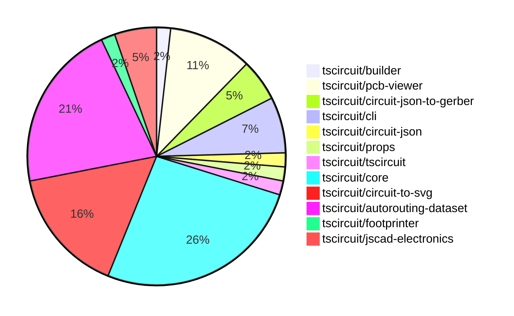

# Contribution Overview 2024-09-07

## PRs by Repository

## Contributor Overview

| Contributor | 🐳 Major | 🐙 Minor | 🐌 Tiny |
|-------------|-------|-------|-------|
| ShiboSoftwareDev | 5 | 5 | 0 |
| seveibar | 28 | 6 | 1 |
| imrishabh18 | 5 | 0 | 0 |
| abhijitxy | 4 | 2 | 0 |
| tscircuitbot | 0 | 0 | 1 |

## Changes by Repository

### [tscircuit/builder](https://github.com/tscircuit/builder)

| PR # | Impact | Contributor | Description |
|------|--------|-------------|-------------|
| [#108](https://github.com/tscircuit/builder/pull/108) | 🐳 Major | ShiboSoftwareDev | Refactored Gerber and Excellon drill generation into the `circuit-json-to-gerber` package. |

### [tscircuit/pcb-viewer](https://github.com/tscircuit/pcb-viewer)

| PR # | Impact | Contributor | Description |
|------|--------|-------------|-------------|
| [#57](https://github.com/tscircuit/pcb-viewer/pull/57) | 🐳 Major | ShiboSoftwareDev | Refactored the code to handle the highlighting of PCB hole primitives more efficiently. |
| [#56](https://github.com/tscircuit/pcb-viewer/pull/56) | 🐳 Major | ShiboSoftwareDev | Introduce a feature to highlight all connected ports/traces. |
| [#51](https://github.com/tscircuit/pcb-viewer/pull/51) | 🐳 Major | seveibar | Introduces a feature to highlight elements on hover, adding a new `is_mouse_over` property to primitives. |
| [#50](https://github.com/tscircuit/pcb-viewer/pull/50) | 🐳 Major | seveibar | Fix a bug where bad edit events were being sent when `pcb_port_id` was null. |
| [#48](https://github.com/tscircuit/pcb-viewer/pull/48) | 🐳 Major | imrishabh18 | Add a new Storybook story for a keepout example |
| [#58](https://github.com/tscircuit/pcb-viewer/pull/58) | 🐙 Minor | ShiboSoftwareDev | Reduce the z-index of the error overlay to avoid conflict with the export dialog. |

### [tscircuit/circuit-json-to-gerber](https://github.com/tscircuit/circuit-json-to-gerber)

| PR # | Impact | Contributor | Description |
|------|--------|-------------|-------------|
| [#8](https://github.com/tscircuit/circuit-json-to-gerber/pull/8) | 🐳 Major | ShiboSoftwareDev | The pull request refactored the repository layout and added tests for the excellon drill feature. |
| [#6](https://github.com/tscircuit/circuit-json-to-gerber/pull/6) | 🐳 Major | ShiboSoftwareDev | Introduce a new feature to output a drill file along with the gerber file. |
| [#7](https://github.com/tscircuit/circuit-json-to-gerber/pull/7) | 🐙 Minor | ShiboSoftwareDev | Fixed the exports in the package.json file to use the correct "main" field instead of the "module" field. |

### [tscircuit/cli](https://github.com/tscircuit/cli)

| PR # | Impact | Contributor | Description |
|------|--------|-------------|-------------|
| [#163](https://github.com/tscircuit/cli/pull/163) | 🐳 Major | seveibar | Edits the event pipeline documentation, adds debug logging, and fixes an issue where manual edits don't crash the browser. |
| [#175](https://github.com/tscircuit/cli/pull/175) | 🐙 Minor | ShiboSoftwareDev | Imports gerber functionality from the "circuit-json-to-gerber" package to be used by the builder. |
| [#170](https://github.com/tscircuit/cli/pull/170) | 🐙 Minor | seveibar | Minor fix to update the PCB viewer's key to prevent full content flashing. |
| [#161](https://github.com/tscircuit/cli/pull/161) | 🐙 Minor | abhijitxy | Fix the dropdown appearing under the circuit by setting the z-index to 50. |

### [tscircuit/circuit-json](https://github.com/tscircuit/circuit-json)

| PR # | Impact | Contributor | Description |
|------|--------|-------------|-------------|
| [#45](https://github.com/tscircuit/circuit-json/pull/45) | 🐙 Minor | ShiboSoftwareDev | Add optional color to fabrication note path and text |

### [tscircuit/props](https://github.com/tscircuit/props)

| PR # | Impact | Contributor | Description |
|------|--------|-------------|-------------|
| [#48](https://github.com/tscircuit/props/pull/48) | 🐙 Minor | ShiboSoftwareDev | Added a color prop to the FabricationNoteTextProps and FabricationNotePathProps types in the library. |

### [tscircuit/tscircuit](https://github.com/tscircuit/tscircuit)

| PR # | Impact | Contributor | Description |
|------|--------|-------------|-------------|
| [#389](https://github.com/tscircuit/tscircuit/pull/389) | 🐳 Major | seveibar | Adds a GitHub Actions workflow to run a smoke test for the tscircuit project before publishing. |

### [tscircuit/core](https://github.com/tscircuit/core)

| PR # | Impact | Contributor | Description |
|------|--------|-------------|-------------|
| [#81](https://github.com/tscircuit/core/pull/81) | 🐳 Major | seveibar | Update the Trace component to use the MultilayerIjump autorouter instead of the IJumpAutorouter |
| [#80](https://github.com/tscircuit/core/pull/80) | 🐳 Major | seveibar | Ensure that the PCB port layer matches the SMT pad layer. |
| [#79](https://github.com/tscircuit/core/pull/79) | 🐳 Major | seveibar | Implement routing disabled functionality for subcircuits |
| [#78](https://github.com/tscircuit/core/pull/78) | 🐳 Major | seveibar | Add support for fabrication note text and fabrication note path components |
| [#76](https://github.com/tscircuit/core/pull/76) | 🐳 Major | seveibar | Add a connectivity map for better obstacle exclusion in the PCB trace routing process. |
| [#75](https://github.com/tscircuit/core/pull/75) | 🐳 Major | seveibar | Fix obstacle errors and get fixes for PCB via routing |
| [#74](https://github.com/tscircuit/core/pull/74) | 🐳 Major | seveibar | Fix failed to trace errors don't block render |
| [#73](https://github.com/tscircuit/core/pull/73) | 🐳 Major | seveibar | Fix multilayer routing for traces with trace hints |
| [#71](https://github.com/tscircuit/core/pull/71) | 🐳 Major | seveibar | Introduce multilayer traces and vias support, fixing an issue where traces routed inside `Trace.ts` are always routed on the top layer. |
| [#67](https://github.com/tscircuit/core/pull/67) | 🐳 Major | seveibar | Create classes from manual trace hints and insert `pcb_trace_hint` into the database. |
| [#60](https://github.com/tscircuit/core/pull/60) | 🐳 Major | seveibar | Fixes a bug with manual trace hints and adds a new function to check if a component matches a path selector. |
| [#48](https://github.com/tscircuit/core/pull/48) | 🐳 Major | imrishabh18 | Introduce a new PCB component called "Keepout" for defining keepout areas on the PCB. |
| [#59](https://github.com/tscircuit/core/pull/59) | 🐙 Minor | seveibar | Fix missing port ids on smtpads and plated holes |
| [#63](https://github.com/tscircuit/core/pull/63) | 🐙 Minor | abhijitxy | Fix an unsupported silkscreenpath feature |
| [#69](https://github.com/tscircuit/core/pull/69) | 🐌 Tiny | tscircuitbot | Remove a console.log statement from the silkscreenpath.test.tsx file. |

### [tscircuit/circuit-to-svg](https://github.com/tscircuit/circuit-to-svg)

| PR # | Impact | Contributor | Description |
|------|--------|-------------|-------------|
| [#64](https://github.com/tscircuit/circuit-to-svg/pull/64) | 🐳 Major | seveibar | The pull request changes the order of the fabrication notes to be on top of the other PCB elements. |
| [#63](https://github.com/tscircuit/circuit-to-svg/pull/63) | 🐳 Major | seveibar | Implement fabrication note path and text rendering in the circuit-to-pcb-svg module. |
| [#57](https://github.com/tscircuit/circuit-to-svg/pull/57) | 🐳 Major | seveibar | Introduces a segments approach for rendering traces and supports multi-layer traces. |
| [#55](https://github.com/tscircuit/circuit-to-svg/pull/55) | 🐳 Major | seveibar | Introduce snapshot tests for PCB SVG rendering |
| [#68](https://github.com/tscircuit/circuit-to-svg/pull/68) | 🐳 Major | imrishabh18 | Add an optional `width` and `height` parameter to the `circuitJsonToPcbSvg` function to allow configuring the size of the generated SVG. |
| [#66](https://github.com/tscircuit/circuit-to-svg/pull/66) | 🐳 Major | imrishabh18 | Adds support for rendering plated holes with a pill shape in the PCB SVG. |
| [#62](https://github.com/tscircuit/circuit-to-svg/pull/62) | 🐳 Major | imrishabh18 | Adds support for rendering PCB silkscreen text in the circuit-to-pcb-svg conversion process. |
| [#65](https://github.com/tscircuit/circuit-to-svg/pull/65) | 🐙 Minor | seveibar | Fix the logic to close the SVG path for PCB fabrication notes. |
| [#58](https://github.com/tscircuit/circuit-to-svg/pull/58) | 🐙 Minor | seveibar | This pull request changes the rendering of SMT pads on the bottom layer to be in blue instead of the default red. |

### [tscircuit/autorouting-dataset](https://github.com/tscircuit/autorouting-dataset)

| PR # | Impact | Contributor | Description |
|------|--------|-------------|-------------|
| [#63](https://github.com/tscircuit/autorouting-dataset/pull/63) | 🐳 Major | seveibar | Fix the layerCount parameter being supplied in two places and fix a layer reference error when computing obstacles. |
| [#62](https://github.com/tscircuit/autorouting-dataset/pull/62) | 🐳 Major | seveibar | Add vias when layer changes in the PCB trace routing solution. |
| [#60](https://github.com/tscircuit/autorouting-dataset/pull/60) | 🐳 Major | seveibar | Adds support for multi-layer routing in the infinite grid A* autorouter. |
| [#59](https://github.com/tscircuit/autorouting-dataset/pull/59) | 🐳 Major | seveibar | Introduces a post-processing step to remove loops from the path generated by the autorouting algorithm. |
| [#58](https://github.com/tscircuit/autorouting-dataset/pull/58) | 🐳 Major | seveibar | Fix a major issue in the multi-margin autorouter to prevent accidental routing through pads. |
| [#57](https://github.com/tscircuit/autorouting-dataset/pull/57) | 🐳 Major | seveibar | Introduce a new implementation of the "ijump" algorithm with multi-margin support. |
| [#55](https://github.com/tscircuit/autorouting-dataset/pull/55) | 🐳 Major | seveibar | Add debug SVGs for snapshot algorithm development and fix duplicated routes returned from autorouter. |
| [#47](https://github.com/tscircuit/autorouting-dataset/pull/47) | 🐳 Major | seveibar | Adds support for PCB vias to be treated as obstacles, and improves error handling and floating-point precision for diagonal traces. |
| [#44](https://github.com/tscircuit/autorouting-dataset/pull/44) | 🐳 Major | seveibar | Add support for multi-layer trace routing in the infinite grid I-jump A* algorithm |
| [#56](https://github.com/tscircuit/autorouting-dataset/pull/56) | 🐙 Minor | seveibar | Add SVG snapshot for "get-debug-svg" test |
| [#51](https://github.com/tscircuit/autorouting-dataset/pull/51) | 🐙 Minor | seveibar | Add some default `connectedTo` IDs for obstacles in the `getObstaclesFromCircuitJson` function. |
| [#42](https://github.com/tscircuit/autorouting-dataset/pull/42) | 🐌 Tiny | seveibar | Add a GitHub Actions workflow to check code formatting using Bun. |

### [tscircuit/footprinter](https://github.com/tscircuit/footprinter)

| PR # | Impact | Contributor | Description |
|------|--------|-------------|-------------|
| [#35](https://github.com/tscircuit/footprinter/pull/35) | 🐳 Major | abhijitxy | Add a new SOD123 component to the `src/fn/index.ts` file. |

### [tscircuit/jscad-electronics](https://github.com/tscircuit/jscad-electronics)

| PR # | Impact | Contributor | Description |
|------|--------|-------------|-------------|
| [#28](https://github.com/tscircuit/jscad-electronics/pull/28) | 🐳 Major | abhijitxy | Implemented a component for the SOT-563 package |
| [#26](https://github.com/tscircuit/jscad-electronics/pull/26) | 🐳 Major | abhijitxy | Implemented a new component called `SOD123` and added an example of its usage. |
| [#24](https://github.com/tscircuit/jscad-electronics/pull/24) | 🐳 Major | abhijitxy | Implemented a QFN (Quad Flat No Lead) component with customizable dimensions. |

## Changes by Contributor

### [ShiboSoftwareDev](https://github.com/ShiboSoftwareDev)

| PR # | Impact | Description |
|------|--------|-------------|
| [#108](https://github.com/tscircuit/builder/pull/108) | 🐳 Major | Refactored Gerber and Excellon drill generation into the `circuit-json-to-gerber` package. |
| [#57](https://github.com/tscircuit/pcb-viewer/pull/57) | 🐳 Major | Refactored the code to handle the highlighting of PCB hole primitives more efficiently. |
| [#56](https://github.com/tscircuit/pcb-viewer/pull/56) | 🐳 Major | Introduce a feature to highlight all connected ports/traces. |
| [#8](https://github.com/tscircuit/circuit-json-to-gerber/pull/8) | 🐳 Major | The pull request refactored the repository layout and added tests for the excellon drill feature. |
| [#6](https://github.com/tscircuit/circuit-json-to-gerber/pull/6) | 🐳 Major | Introduce a new feature to output a drill file along with the gerber file. |
| [#58](https://github.com/tscircuit/pcb-viewer/pull/58) | 🐙 Minor | Reduce the z-index of the error overlay to avoid conflict with the export dialog. |
| [#175](https://github.com/tscircuit/cli/pull/175) | 🐙 Minor | Imports gerber functionality from the "circuit-json-to-gerber" package to be used by the builder. |
| [#45](https://github.com/tscircuit/circuit-json/pull/45) | 🐙 Minor | Add optional color to fabrication note path and text |
| [#48](https://github.com/tscircuit/props/pull/48) | 🐙 Minor | Added a color prop to the FabricationNoteTextProps and FabricationNotePathProps types in the library. |
| [#7](https://github.com/tscircuit/circuit-json-to-gerber/pull/7) | 🐙 Minor | Fixed the exports in the package.json file to use the correct "main" field instead of the "module" field. |

### [seveibar](https://github.com/seveibar)

| PR # | Impact | Description |
|------|--------|-------------|
| [#51](https://github.com/tscircuit/pcb-viewer/pull/51) | 🐳 Major | Introduces a feature to highlight elements on hover, adding a new `is_mouse_over` property to primitives. |
| [#50](https://github.com/tscircuit/pcb-viewer/pull/50) | 🐳 Major | Fix a bug where bad edit events were being sent when `pcb_port_id` was null. |
| [#389](https://github.com/tscircuit/tscircuit/pull/389) | 🐳 Major | Adds a GitHub Actions workflow to run a smoke test for the tscircuit project before publishing. |
| [#163](https://github.com/tscircuit/cli/pull/163) | 🐳 Major | Edits the event pipeline documentation, adds debug logging, and fixes an issue where manual edits don't crash the browser. |
| [#81](https://github.com/tscircuit/core/pull/81) | 🐳 Major | Update the Trace component to use the MultilayerIjump autorouter instead of the IJumpAutorouter |
| [#80](https://github.com/tscircuit/core/pull/80) | 🐳 Major | Ensure that the PCB port layer matches the SMT pad layer. |
| [#79](https://github.com/tscircuit/core/pull/79) | 🐳 Major | Implement routing disabled functionality for subcircuits |
| [#78](https://github.com/tscircuit/core/pull/78) | 🐳 Major | Add support for fabrication note text and fabrication note path components |
| [#76](https://github.com/tscircuit/core/pull/76) | 🐳 Major | Add a connectivity map for better obstacle exclusion in the PCB trace routing process. |
| [#75](https://github.com/tscircuit/core/pull/75) | 🐳 Major | Fix obstacle errors and get fixes for PCB via routing |
| [#74](https://github.com/tscircuit/core/pull/74) | 🐳 Major | Fix failed to trace errors don't block render |
| [#73](https://github.com/tscircuit/core/pull/73) | 🐳 Major | Fix multilayer routing for traces with trace hints |
| [#71](https://github.com/tscircuit/core/pull/71) | 🐳 Major | Introduce multilayer traces and vias support, fixing an issue where traces routed inside `Trace.ts` are always routed on the top layer. |
| [#67](https://github.com/tscircuit/core/pull/67) | 🐳 Major | Create classes from manual trace hints and insert `pcb_trace_hint` into the database. |
| [#60](https://github.com/tscircuit/core/pull/60) | 🐳 Major | Fixes a bug with manual trace hints and adds a new function to check if a component matches a path selector. |
| [#64](https://github.com/tscircuit/circuit-to-svg/pull/64) | 🐳 Major | The pull request changes the order of the fabrication notes to be on top of the other PCB elements. |
| [#63](https://github.com/tscircuit/circuit-to-svg/pull/63) | 🐳 Major | Implement fabrication note path and text rendering in the circuit-to-pcb-svg module. |
| [#57](https://github.com/tscircuit/circuit-to-svg/pull/57) | 🐳 Major | Introduces a segments approach for rendering traces and supports multi-layer traces. |
| [#55](https://github.com/tscircuit/circuit-to-svg/pull/55) | 🐳 Major | Introduce snapshot tests for PCB SVG rendering |
| [#63](https://github.com/tscircuit/autorouting-dataset/pull/63) | 🐳 Major | Fix the layerCount parameter being supplied in two places and fix a layer reference error when computing obstacles. |
| [#62](https://github.com/tscircuit/autorouting-dataset/pull/62) | 🐳 Major | Add vias when layer changes in the PCB trace routing solution. |
| [#60](https://github.com/tscircuit/autorouting-dataset/pull/60) | 🐳 Major | Adds support for multi-layer routing in the infinite grid A* autorouter. |
| [#59](https://github.com/tscircuit/autorouting-dataset/pull/59) | 🐳 Major | Introduces a post-processing step to remove loops from the path generated by the autorouting algorithm. |
| [#58](https://github.com/tscircuit/autorouting-dataset/pull/58) | 🐳 Major | Fix a major issue in the multi-margin autorouter to prevent accidental routing through pads. |
| [#57](https://github.com/tscircuit/autorouting-dataset/pull/57) | 🐳 Major | Introduce a new implementation of the "ijump" algorithm with multi-margin support. |
| [#55](https://github.com/tscircuit/autorouting-dataset/pull/55) | 🐳 Major | Add debug SVGs for snapshot algorithm development and fix duplicated routes returned from autorouter. |
| [#47](https://github.com/tscircuit/autorouting-dataset/pull/47) | 🐳 Major | Adds support for PCB vias to be treated as obstacles, and improves error handling and floating-point precision for diagonal traces. |
| [#44](https://github.com/tscircuit/autorouting-dataset/pull/44) | 🐳 Major | Add support for multi-layer trace routing in the infinite grid I-jump A* algorithm |
| [#170](https://github.com/tscircuit/cli/pull/170) | 🐙 Minor | Minor fix to update the PCB viewer's key to prevent full content flashing. |
| [#59](https://github.com/tscircuit/core/pull/59) | 🐙 Minor | Fix missing port ids on smtpads and plated holes |
| [#65](https://github.com/tscircuit/circuit-to-svg/pull/65) | 🐙 Minor | Fix the logic to close the SVG path for PCB fabrication notes. |
| [#58](https://github.com/tscircuit/circuit-to-svg/pull/58) | 🐙 Minor | This pull request changes the rendering of SMT pads on the bottom layer to be in blue instead of the default red. |
| [#56](https://github.com/tscircuit/autorouting-dataset/pull/56) | 🐙 Minor | Add SVG snapshot for "get-debug-svg" test |
| [#51](https://github.com/tscircuit/autorouting-dataset/pull/51) | 🐙 Minor | Add some default `connectedTo` IDs for obstacles in the `getObstaclesFromCircuitJson` function. |
| [#42](https://github.com/tscircuit/autorouting-dataset/pull/42) | 🐌 Tiny | Add a GitHub Actions workflow to check code formatting using Bun. |

### [imrishabh18](https://github.com/imrishabh18)

| PR # | Impact | Description |
|------|--------|-------------|
| [#48](https://github.com/tscircuit/pcb-viewer/pull/48) | 🐳 Major | Add a new Storybook story for a keepout example |
| [#48](https://github.com/tscircuit/core/pull/48) | 🐳 Major | Introduce a new PCB component called "Keepout" for defining keepout areas on the PCB. |
| [#68](https://github.com/tscircuit/circuit-to-svg/pull/68) | 🐳 Major | Add an optional `width` and `height` parameter to the `circuitJsonToPcbSvg` function to allow configuring the size of the generated SVG. |
| [#66](https://github.com/tscircuit/circuit-to-svg/pull/66) | 🐳 Major | Adds support for rendering plated holes with a pill shape in the PCB SVG. |
| [#62](https://github.com/tscircuit/circuit-to-svg/pull/62) | 🐳 Major | Adds support for rendering PCB silkscreen text in the circuit-to-pcb-svg conversion process. |

### [abhijitxy](https://github.com/abhijitxy)

| PR # | Impact | Description |
|------|--------|-------------|
| [#35](https://github.com/tscircuit/footprinter/pull/35) | 🐳 Major | Add a new SOD123 component to the `src/fn/index.ts` file. |
| [#28](https://github.com/tscircuit/jscad-electronics/pull/28) | 🐳 Major | Implemented a component for the SOT-563 package |
| [#26](https://github.com/tscircuit/jscad-electronics/pull/26) | 🐳 Major | Implemented a new component called `SOD123` and added an example of its usage. |
| [#24](https://github.com/tscircuit/jscad-electronics/pull/24) | 🐳 Major | Implemented a QFN (Quad Flat No Lead) component with customizable dimensions. |
| [#161](https://github.com/tscircuit/cli/pull/161) | 🐙 Minor | Fix the dropdown appearing under the circuit by setting the z-index to 50. |
| [#63](https://github.com/tscircuit/core/pull/63) | 🐙 Minor | Fix an unsupported silkscreenpath feature |

### [tscircuitbot](https://github.com/tscircuitbot)

| PR # | Impact | Description |
|------|--------|-------------|
| [#69](https://github.com/tscircuit/core/pull/69) | 🐌 Tiny | Remove a console.log statement from the silkscreenpath.test.tsx file. |

