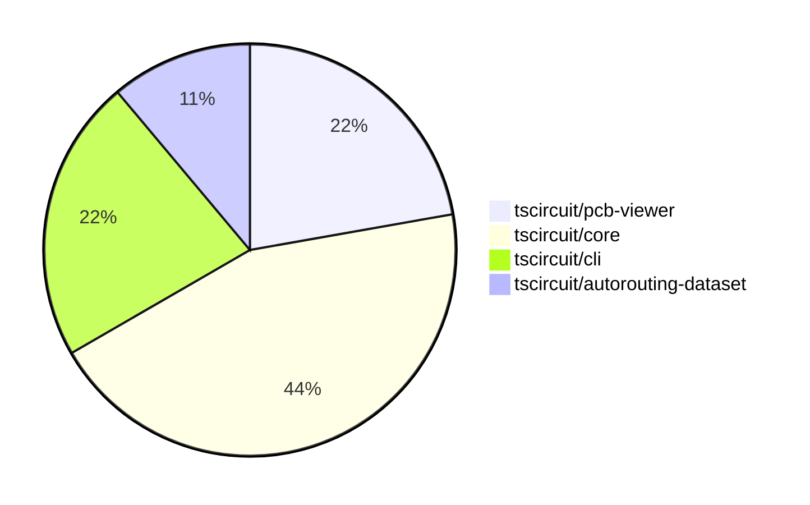

# Contribution Overview 2024-09-07

## PRs by Repository

## Contributor Overview

| Contributor | 🐳 Major | 🐙 Minor | 🐌 Tiny |
|-------------|-------|-------|-------|
| imrishabh18 | 2 | 0 | 0 |
| seveibar | 4 | 1 | 0 |
| abhijitxy | 1 | 1 | 0 |

## Changes by Repository

### [tscircuit/pcb-viewer](https://github.com/tscircuit/pcb-viewer)

| PR # | Impact | Contributor | Description |
|------|--------|-------------|-------------|
| [#48](https://github.com/tscircuit/pcb-viewer/pull/48) | 🐳 Major | imrishabh18 | Add a new example for keepout in the Storybook stories. |
| [#50](https://github.com/tscircuit/pcb-viewer/pull/50) | 🐳 Major | seveibar | Fix bad edit events being sent where `pcb_port_id` was null |

### [tscircuit/core](https://github.com/tscircuit/core)

| PR # | Impact | Contributor | Description |
|------|--------|-------------|-------------|
| [#48](https://github.com/tscircuit/core/pull/48) | 🐳 Major | imrishabh18 | Introduce a new PCB component called "Keepout" to add support for keepout areas on the PCB |
| [#60](https://github.com/tscircuit/core/pull/60) | 🐳 Major | seveibar | Fix manual trace hints and add a test for them. |
| [#59](https://github.com/tscircuit/core/pull/59) | 🐳 Major | seveibar | This pull request fixes an issue where the `pcb_port_id` field was not being properly set for `SmtPad` and `PlatedHole` components in the `PcbPortAttachment` phase. |
| [#63](https://github.com/tscircuit/core/pull/63) | 🐳 Major | abhijitxy | Fix for the unsupported `silkscreenpath` feature. |

### [tscircuit/cli](https://github.com/tscircuit/cli)

| PR # | Impact | Contributor | Description |
|------|--------|-------------|-------------|
| [#163](https://github.com/tscircuit/cli/pull/163) | 🐳 Major | seveibar | Edits the documentation for the Event Pipeline, adds debugging information, and fixes a bug where manual edits don't crash the browser. |
| [#161](https://github.com/tscircuit/cli/pull/161) | 🐙 Minor | abhijitxy | Fix the dropdown appearing under the circuit |

### [tscircuit/autorouting-dataset](https://github.com/tscircuit/autorouting-dataset)

| PR # | Impact | Contributor | Description |
|------|--------|-------------|-------------|
| [#42](https://github.com/tscircuit/autorouting-dataset/pull/42) | 🐙 Minor | seveibar | Add a GitHub Actions workflow to check the code formatting using the `bun` tool. |

## Changes by Contributor

### [imrishabh18](https://github.com/imrishabh18)

| PR # | Impact | Description |
|------|--------|-------------|
| [#48](https://github.com/tscircuit/pcb-viewer/pull/48) | 🐳 Major | Add a new example for keepout in the Storybook stories. |
| [#48](https://github.com/tscircuit/core/pull/48) | 🐳 Major | Introduce a new PCB component called "Keepout" to add support for keepout areas on the PCB |

### [seveibar](https://github.com/seveibar)

| PR # | Impact | Description |
|------|--------|-------------|
| [#50](https://github.com/tscircuit/pcb-viewer/pull/50) | 🐳 Major | Fix bad edit events being sent where `pcb_port_id` was null |
| [#163](https://github.com/tscircuit/cli/pull/163) | 🐳 Major | Edits the documentation for the Event Pipeline, adds debugging information, and fixes a bug where manual edits don't crash the browser. |
| [#60](https://github.com/tscircuit/core/pull/60) | 🐳 Major | Fix manual trace hints and add a test for them. |
| [#59](https://github.com/tscircuit/core/pull/59) | 🐳 Major | This pull request fixes an issue where the `pcb_port_id` field was not being properly set for `SmtPad` and `PlatedHole` components in the `PcbPortAttachment` phase. |
| [#42](https://github.com/tscircuit/autorouting-dataset/pull/42) | 🐙 Minor | Add a GitHub Actions workflow to check the code formatting using the `bun` tool. |

### [abhijitxy](https://github.com/abhijitxy)

| PR # | Impact | Description |
|------|--------|-------------|
| [#63](https://github.com/tscircuit/core/pull/63) | 🐳 Major | Fix for the unsupported `silkscreenpath` feature. |
| [#161](https://github.com/tscircuit/cli/pull/161) | 🐙 Minor | Fix the dropdown appearing under the circuit |

