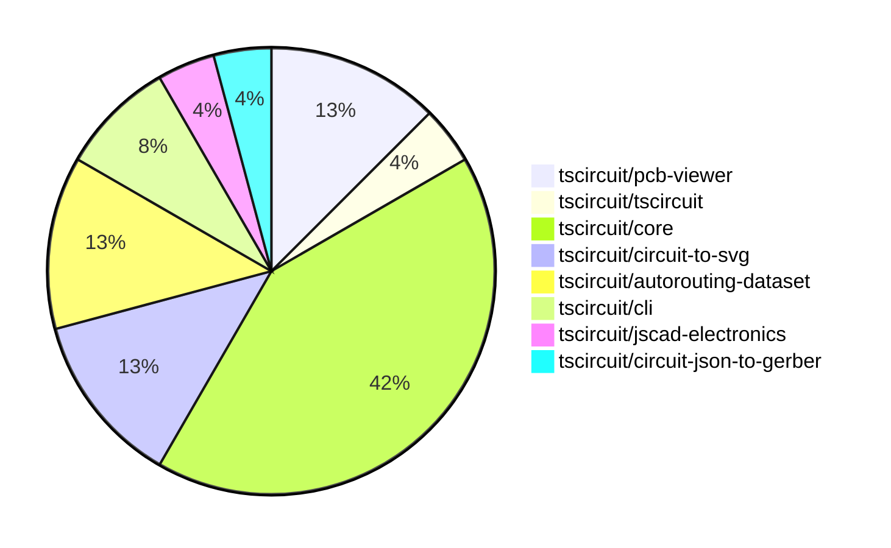

# Contribution Overview 2024-09-07

## PRs by Repository

## Contributor Overview

| Contributor | 🐳 Major | 🐙 Minor | 🐌 Tiny |
|-------------|-------|-------|-------|
| seveibar | 12 | 4 | 1 |
| imrishabh18 | 2 | 0 | 0 |
| abhijitxy | 2 | 1 | 0 |
| tscircuitbot | 0 | 0 | 1 |
| ShiboSoftwareDev | 1 | 0 | 0 |

## Changes by Repository

### [tscircuit/pcb-viewer](https://github.com/tscircuit/pcb-viewer)

| PR # | Impact | Contributor | Description |
|------|--------|-------------|-------------|
| [#51](https://github.com/tscircuit/pcb-viewer/pull/51) | 🐳 Major | seveibar | Adds hover highlights for canvas elements and introduces an `is_mouse_over` property in the `Primitive` type. |
| [#50](https://github.com/tscircuit/pcb-viewer/pull/50) | 🐳 Major | seveibar | Fix issue with sending bad edit events where `pcb_port_id` was null |
| [#48](https://github.com/tscircuit/pcb-viewer/pull/48) | 🐳 Major | imrishabh18 | Add a new example for keepout in the Storybook. |

### [tscircuit/tscircuit](https://github.com/tscircuit/tscircuit)

| PR # | Impact | Contributor | Description |
|------|--------|-------------|-------------|
| [#389](https://github.com/tscircuit/tscircuit/pull/389) | 🐳 Major | seveibar | Add a smoke test to ensure the `tscircuit` package works before publishing. |

### [tscircuit/core](https://github.com/tscircuit/core)

| PR # | Impact | Contributor | Description |
|------|--------|-------------|-------------|
| [#75](https://github.com/tscircuit/core/pull/75) | 🐳 Major | seveibar | Fix obstacle errors and get fixes for PCB via routing |
| [#74](https://github.com/tscircuit/core/pull/74) | 🐳 Major | seveibar | Fix to handle errors in the rendering process without blocking the render. |
| [#73](https://github.com/tscircuit/core/pull/73) | 🐳 Major | seveibar | Fix multilayer routing for traces with trace hints |
| [#71](https://github.com/tscircuit/core/pull/71) | 🐳 Major | seveibar | Adds support for multilayer traces and vias, and fixes an issue where traces routed inside `Trace.ts` were always routed on the top layer. |
| [#67](https://github.com/tscircuit/core/pull/67) | 🐳 Major | seveibar | Create classes from manual trace hints and insert pcb_trace_hint into the database. |
| [#60](https://github.com/tscircuit/core/pull/60) | 🐳 Major | seveibar | Fix manual trace hints by adding support for isMatchingPathSelector in the trace component. |
| [#48](https://github.com/tscircuit/core/pull/48) | 🐳 Major | imrishabh18 | Introduces a new component called `Keepout` to the PCB viewer library, allowing the creation of keepout regions on the PCB. |
| [#63](https://github.com/tscircuit/core/pull/63) | 🐳 Major | abhijitxy | Fix an issue with unsupported silkscreenpath |
| [#59](https://github.com/tscircuit/core/pull/59) | 🐙 Minor | seveibar | This pull request fixes an issue where the port IDs were missing for SMT pads and plated holes in the circuit rendering process. |
| [#69](https://github.com/tscircuit/core/pull/69) | 🐌 Tiny | tscircuitbot | Remove console.log from silkscreenpath.test.tsx |

### [tscircuit/circuit-to-svg](https://github.com/tscircuit/circuit-to-svg)

| PR # | Impact | Contributor | Description |
|------|--------|-------------|-------------|
| [#57](https://github.com/tscircuit/circuit-to-svg/pull/57) | 🐳 Major | seveibar | Introduce a segments approach for trace rendering and support multi-layer traces. |
| [#55](https://github.com/tscircuit/circuit-to-svg/pull/55) | 🐳 Major | seveibar | Introduce snapshot tests for the PCB rendering functionality |
| [#58](https://github.com/tscircuit/circuit-to-svg/pull/58) | 🐙 Minor | seveibar | The change ensures that SMT pads on the bottom layer are rendered in blue. |

### [tscircuit/autorouting-dataset](https://github.com/tscircuit/autorouting-dataset)

| PR # | Impact | Contributor | Description |
|------|--------|-------------|-------------|
| [#47](https://github.com/tscircuit/autorouting-dataset/pull/47) | 🐳 Major | seveibar | Add support for `pcb_via` becoming obstacles and fix for diagonal traces in the `getObstaclesFromTrace` function. |
| [#44](https://github.com/tscircuit/autorouting-dataset/pull/44) | 🐙 Minor | seveibar | Add layers to obstacles in the pull request. |
| [#42](https://github.com/tscircuit/autorouting-dataset/pull/42) | 🐌 Tiny | seveibar | Added a new GitHub Actions workflow to check the code formatting using the Bun tool. |

### [tscircuit/cli](https://github.com/tscircuit/cli)

| PR # | Impact | Contributor | Description |
|------|--------|-------------|-------------|
| [#163](https://github.com/tscircuit/cli/pull/163) | 🐙 Minor | seveibar | The pull request adds documentation for the Edit Event Pipeline and fixes a bug where manual edits don't crash the browser. |
| [#161](https://github.com/tscircuit/cli/pull/161) | 🐙 Minor | abhijitxy | Fix the dropdown to appear on top of the circuit |

### [tscircuit/jscad-electronics](https://github.com/tscircuit/jscad-electronics)

| PR # | Impact | Contributor | Description |
|------|--------|-------------|-------------|
| [#24](https://github.com/tscircuit/jscad-electronics/pull/24) | 🐳 Major | abhijitxy | Introduced a new component `QFN` (Quad Flat No Lead) that renders a 3D model of a QFN package with customizable dimensions. |

### [tscircuit/circuit-json-to-gerber](https://github.com/tscircuit/circuit-json-to-gerber)

| PR # | Impact | Contributor | Description |
|------|--------|-------------|-------------|
| [#6](https://github.com/tscircuit/circuit-json-to-gerber/pull/6) | 🐳 Major | ShiboSoftwareDev | Adds support for generating Excellon drill files in the gerber output. |

## Changes by Contributor

### [seveibar](https://github.com/seveibar)

| PR # | Impact | Description |
|------|--------|-------------|
| [#51](https://github.com/tscircuit/pcb-viewer/pull/51) | 🐳 Major | Adds hover highlights for canvas elements and introduces an `is_mouse_over` property in the `Primitive` type. |
| [#50](https://github.com/tscircuit/pcb-viewer/pull/50) | 🐳 Major | Fix issue with sending bad edit events where `pcb_port_id` was null |
| [#389](https://github.com/tscircuit/tscircuit/pull/389) | 🐳 Major | Add a smoke test to ensure the `tscircuit` package works before publishing. |
| [#75](https://github.com/tscircuit/core/pull/75) | 🐳 Major | Fix obstacle errors and get fixes for PCB via routing |
| [#74](https://github.com/tscircuit/core/pull/74) | 🐳 Major | Fix to handle errors in the rendering process without blocking the render. |
| [#73](https://github.com/tscircuit/core/pull/73) | 🐳 Major | Fix multilayer routing for traces with trace hints |
| [#71](https://github.com/tscircuit/core/pull/71) | 🐳 Major | Adds support for multilayer traces and vias, and fixes an issue where traces routed inside `Trace.ts` were always routed on the top layer. |
| [#67](https://github.com/tscircuit/core/pull/67) | 🐳 Major | Create classes from manual trace hints and insert pcb_trace_hint into the database. |
| [#60](https://github.com/tscircuit/core/pull/60) | 🐳 Major | Fix manual trace hints by adding support for isMatchingPathSelector in the trace component. |
| [#57](https://github.com/tscircuit/circuit-to-svg/pull/57) | 🐳 Major | Introduce a segments approach for trace rendering and support multi-layer traces. |
| [#55](https://github.com/tscircuit/circuit-to-svg/pull/55) | 🐳 Major | Introduce snapshot tests for the PCB rendering functionality |
| [#47](https://github.com/tscircuit/autorouting-dataset/pull/47) | 🐳 Major | Add support for `pcb_via` becoming obstacles and fix for diagonal traces in the `getObstaclesFromTrace` function. |
| [#163](https://github.com/tscircuit/cli/pull/163) | 🐙 Minor | The pull request adds documentation for the Edit Event Pipeline and fixes a bug where manual edits don't crash the browser. |
| [#59](https://github.com/tscircuit/core/pull/59) | 🐙 Minor | This pull request fixes an issue where the port IDs were missing for SMT pads and plated holes in the circuit rendering process. |
| [#58](https://github.com/tscircuit/circuit-to-svg/pull/58) | 🐙 Minor | The change ensures that SMT pads on the bottom layer are rendered in blue. |
| [#44](https://github.com/tscircuit/autorouting-dataset/pull/44) | 🐙 Minor | Add layers to obstacles in the pull request. |
| [#42](https://github.com/tscircuit/autorouting-dataset/pull/42) | 🐌 Tiny | Added a new GitHub Actions workflow to check the code formatting using the Bun tool. |

### [imrishabh18](https://github.com/imrishabh18)

| PR # | Impact | Description |
|------|--------|-------------|
| [#48](https://github.com/tscircuit/pcb-viewer/pull/48) | 🐳 Major | Add a new example for keepout in the Storybook. |
| [#48](https://github.com/tscircuit/core/pull/48) | 🐳 Major | Introduces a new component called `Keepout` to the PCB viewer library, allowing the creation of keepout regions on the PCB. |

### [abhijitxy](https://github.com/abhijitxy)

| PR # | Impact | Description |
|------|--------|-------------|
| [#63](https://github.com/tscircuit/core/pull/63) | 🐳 Major | Fix an issue with unsupported silkscreenpath |
| [#24](https://github.com/tscircuit/jscad-electronics/pull/24) | 🐳 Major | Introduced a new component `QFN` (Quad Flat No Lead) that renders a 3D model of a QFN package with customizable dimensions. |
| [#161](https://github.com/tscircuit/cli/pull/161) | 🐙 Minor | Fix the dropdown to appear on top of the circuit |

### [tscircuitbot](https://github.com/tscircuitbot)

| PR # | Impact | Description |
|------|--------|-------------|
| [#69](https://github.com/tscircuit/core/pull/69) | 🐌 Tiny | Remove console.log from silkscreenpath.test.tsx |

### [ShiboSoftwareDev](https://github.com/ShiboSoftwareDev)

| PR # | Impact | Description |
|------|--------|-------------|
| [#6](https://github.com/tscircuit/circuit-json-to-gerber/pull/6) | 🐳 Major | Adds support for generating Excellon drill files in the gerber output. |

