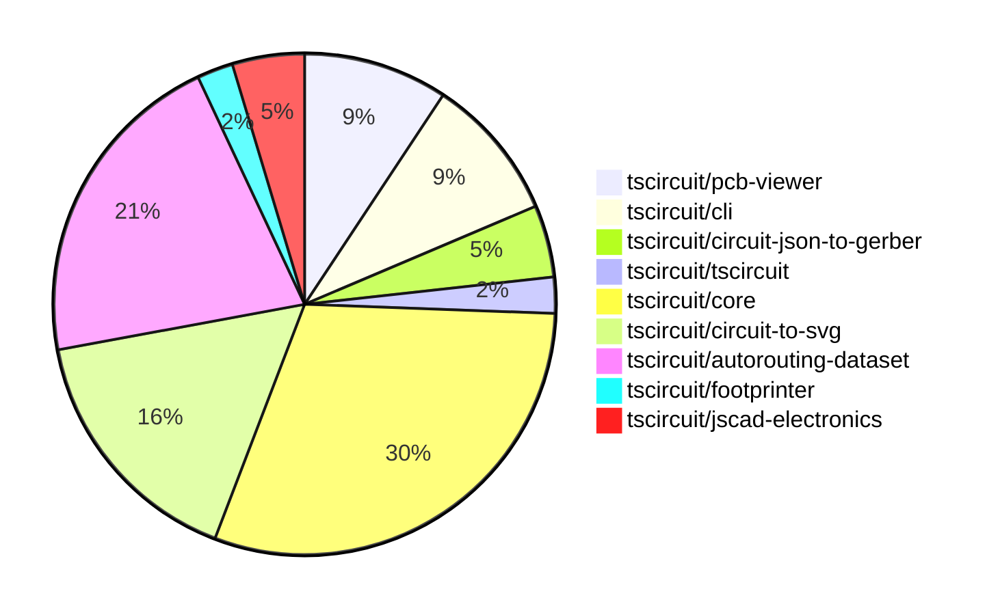

# Contribution Overview 2024-09-07

## PRs by Repository

## Contributor Overview

| Contributor | 🐳 Major | 🐙 Minor | 🐌 Tiny |
|-------------|-------|-------|-------|
| ShiboSoftwareDev | 3 | 1 | 0 |
| seveibar | 24 | 6 | 0 |
| imrishabh18 | 3 | 0 | 0 |
| abhijitxy | 4 | 1 | 0 |
| tscircuitbot | 0 | 0 | 1 |

## Changes by Repository

### [tscircuit/pcb-viewer](https://github.com/tscircuit/pcb-viewer)

| PR # | Impact | Contributor | Description |
|------|--------|-------------|-------------|
| [#56](https://github.com/tscircuit/pcb-viewer/pull/56) | 🐳 Major | ShiboSoftwareDev | Introduce a feature to highlight all connected ports/traces |
| [#51](https://github.com/tscircuit/pcb-viewer/pull/51) | 🐳 Major | seveibar | Add hover highlighting for canvas elements and add `is_mouse_over` property to primitives |
| [#50](https://github.com/tscircuit/pcb-viewer/pull/50) | 🐳 Major | seveibar | Fix bad edit events being sent where pcb_port_id was null |
| [#48](https://github.com/tscircuit/pcb-viewer/pull/48) | 🐳 Major | imrishabh18 | Add a new keepout example to the Storybook stories |

### [tscircuit/cli](https://github.com/tscircuit/cli)

| PR # | Impact | Contributor | Description |
|------|--------|-------------|-------------|
| [#175](https://github.com/tscircuit/cli/pull/175) | 🐳 Major | ShiboSoftwareDev | Introduce the "circuit-json-to-gerber" module to import gerber functionality. |
| [#163](https://github.com/tscircuit/cli/pull/163) | 🐳 Major | seveibar | The pull request edits the Event Pipeline docs, and ensures that manual edits do not crash the browser. |
| [#170](https://github.com/tscircuit/cli/pull/170) | 🐙 Minor | seveibar | Fix a minor bug in the PCB viewer that caused full content flashing. |
| [#161](https://github.com/tscircuit/cli/pull/161) | 🐙 Minor | abhijitxy | Fix the z-index of the dropdown to appear above the circuit |

### [tscircuit/circuit-json-to-gerber](https://github.com/tscircuit/circuit-json-to-gerber)

| PR # | Impact | Contributor | Description |
|------|--------|-------------|-------------|
| [#6](https://github.com/tscircuit/circuit-json-to-gerber/pull/6) | 🐳 Major | ShiboSoftwareDev | Add support for outputting a drill file in the gerber repository. |
| [#7](https://github.com/tscircuit/circuit-json-to-gerber/pull/7) | 🐙 Minor | ShiboSoftwareDev | Fixed exports by adding the `excellon-drill` module to the exports |

### [tscircuit/tscircuit](https://github.com/tscircuit/tscircuit)

| PR # | Impact | Contributor | Description |
|------|--------|-------------|-------------|
| [#389](https://github.com/tscircuit/tscircuit/pull/389) | 🐳 Major | seveibar | Add a smoke test to ensure the `tscircuit` package works before publishing. |

### [tscircuit/core](https://github.com/tscircuit/core)

| PR # | Impact | Contributor | Description |
|------|--------|-------------|-------------|
| [#79](https://github.com/tscircuit/core/pull/79) | 🐳 Major | seveibar | Implement routing disabled for subcircuits, fixing issue #7. |
| [#78](https://github.com/tscircuit/core/pull/78) | 🐳 Major | seveibar | Add support for fabrication note text and fabrication note path |
| [#76](https://github.com/tscircuit/core/pull/76) | 🐳 Major | seveibar | Add connectivity map for better obstacle exclusion |
| [#75](https://github.com/tscircuit/core/pull/75) | 🐳 Major | seveibar | Fix obstacle errors and get fixes for PCB via routing |
| [#74](https://github.com/tscircuit/core/pull/74) | 🐳 Major | seveibar | Fix for failed to trace errors not blocking render |
| [#73](https://github.com/tscircuit/core/pull/73) | 🐳 Major | seveibar | Fix multilayer routing for traces with trace hints |
| [#71](https://github.com/tscircuit/core/pull/71) | 🐳 Major | seveibar | This pull request adds support for multilayer traces and vias, and fixes an issue where traces routed inside Trace.ts were always routed on the top layer. |
| [#67](https://github.com/tscircuit/core/pull/67) | 🐳 Major | seveibar | Introduce a new component `TraceHint` and add logic to create and render trace hints from manual trace hints specified in the layout props. Additionally, insert the trace hints into the database. |
| [#60](https://github.com/tscircuit/core/pull/60) | 🐳 Major | seveibar | Fix the manual trace hints functionality by adding a new `isMatchingPathSelector` function to check if a component matches a path selector. |
| [#59](https://github.com/tscircuit/core/pull/59) | 🐳 Major | seveibar | The pull request fixes an issue where port IDs were not being assigned to SMT pads and plated holes in the PCB rendering process. |
| [#48](https://github.com/tscircuit/core/pull/48) | 🐳 Major | imrishabh18 | Introduce a new primitive component `Keepout` to handle PCB keepout areas. |
| [#63](https://github.com/tscircuit/core/pull/63) | 🐳 Major | abhijitxy | Fix unsupported silkscreenpath issue |
| [#69](https://github.com/tscircuit/core/pull/69) | 🐌 Tiny | tscircuitbot | Remove console.log from silkscreenpath.test.tsx |

### [tscircuit/circuit-to-svg](https://github.com/tscircuit/circuit-to-svg)

| PR # | Impact | Contributor | Description |
|------|--------|-------------|-------------|
| [#63](https://github.com/tscircuit/circuit-to-svg/pull/63) | 🐳 Major | seveibar | Adds support for rendering PCB fabrication note paths and text in the SVG output. |
| [#57](https://github.com/tscircuit/circuit-to-svg/pull/57) | 🐳 Major | seveibar | Introduces a segments-based approach for trace rendering and adds support for multi-layer traces |
| [#55](https://github.com/tscircuit/circuit-to-svg/pull/55) | 🐳 Major | seveibar | Introduce snapshot tests for the PCB rendering functionality. |
| [#62](https://github.com/tscircuit/circuit-to-svg/pull/62) | 🐳 Major | imrishabh18 | Add support for rendering PCB silkscreen text in the SVG output. |
| [#65](https://github.com/tscircuit/circuit-to-svg/pull/65) | 🐙 Minor | seveibar | Fixes the issue of not closing the path for the PCB fabrication note |
| [#64](https://github.com/tscircuit/circuit-to-svg/pull/64) | 🐙 Minor | seveibar | Order the fabrication notes to be on top of the SVG elements. |
| [#58](https://github.com/tscircuit/circuit-to-svg/pull/58) | 🐙 Minor | seveibar | Update the rendering of SMT pads on the bottom layer to be in blue color. |

### [tscircuit/autorouting-dataset](https://github.com/tscircuit/autorouting-dataset)

| PR # | Impact | Contributor | Description |
|------|--------|-------------|-------------|
| [#59](https://github.com/tscircuit/autorouting-dataset/pull/59) | 🐳 Major | seveibar | Introduce a post-processing step to remove loops in the calculated path. |
| [#58](https://github.com/tscircuit/autorouting-dataset/pull/58) | 🐳 Major | seveibar | Fix a major bug in the multi-margin autorouter, preventing accidental routing through pads. |
| [#57](https://github.com/tscircuit/autorouting-dataset/pull/57) | 🐳 Major | seveibar | Adds a new SVG file for the `multimargin.snap` test, which appears to be a rendering of a PCB (Printed Circuit Board) layout. |
| [#56](https://github.com/tscircuit/autorouting-dataset/pull/56) | 🐳 Major | seveibar | Add SVG for a PCB board with components and pads |
| [#55](https://github.com/tscircuit/autorouting-dataset/pull/55) | 🐳 Major | seveibar | Add debug SVGs for snapshot algorithm development, fix duplicated routes returned from autorouter. |
| [#47](https://github.com/tscircuit/autorouting-dataset/pull/47) | 🐳 Major | seveibar | Add support for `pcb_via` becoming an obstacle and improve error handling for diagonal traces. |
| [#44](https://github.com/tscircuit/autorouting-dataset/pull/44) | 🐳 Major | seveibar | Adds layers to obstacles in the circuit layout |
| [#51](https://github.com/tscircuit/autorouting-dataset/pull/51) | 🐙 Minor | seveibar | Add default `connectedTo` IDs for obstacles to be used in the `getObstaclesFromCircuitJson` function. |
| [#42](https://github.com/tscircuit/autorouting-dataset/pull/42) | 🐙 Minor | seveibar | Add a format check action in the GitHub workflow to check the code format. |

### [tscircuit/footprinter](https://github.com/tscircuit/footprinter)

| PR # | Impact | Contributor | Description |
|------|--------|-------------|-------------|
| [#35](https://github.com/tscircuit/footprinter/pull/35) | 🐳 Major | abhijitxy | Add a new component "sod123" to the library |

### [tscircuit/jscad-electronics](https://github.com/tscircuit/jscad-electronics)

| PR # | Impact | Contributor | Description |
|------|--------|-------------|-------------|
| [#26](https://github.com/tscircuit/jscad-electronics/pull/26) | 🐳 Major | abhijitxy | Implemented the SOD-123 component with its lead and body parts. |
| [#24](https://github.com/tscircuit/jscad-electronics/pull/24) | 🐳 Major | abhijitxy | Implemented QFN (Quad Flat No Lead) component for 3D rendering |

## Changes by Contributor

### [ShiboSoftwareDev](https://github.com/ShiboSoftwareDev)

| PR # | Impact | Description |
|------|--------|-------------|
| [#56](https://github.com/tscircuit/pcb-viewer/pull/56) | 🐳 Major | Introduce a feature to highlight all connected ports/traces |
| [#175](https://github.com/tscircuit/cli/pull/175) | 🐳 Major | Introduce the "circuit-json-to-gerber" module to import gerber functionality. |
| [#6](https://github.com/tscircuit/circuit-json-to-gerber/pull/6) | 🐳 Major | Add support for outputting a drill file in the gerber repository. |
| [#7](https://github.com/tscircuit/circuit-json-to-gerber/pull/7) | 🐙 Minor | Fixed exports by adding the `excellon-drill` module to the exports |

### [seveibar](https://github.com/seveibar)

| PR # | Impact | Description |
|------|--------|-------------|
| [#51](https://github.com/tscircuit/pcb-viewer/pull/51) | 🐳 Major | Add hover highlighting for canvas elements and add `is_mouse_over` property to primitives |
| [#50](https://github.com/tscircuit/pcb-viewer/pull/50) | 🐳 Major | Fix bad edit events being sent where pcb_port_id was null |
| [#389](https://github.com/tscircuit/tscircuit/pull/389) | 🐳 Major | Add a smoke test to ensure the `tscircuit` package works before publishing. |
| [#163](https://github.com/tscircuit/cli/pull/163) | 🐳 Major | The pull request edits the Event Pipeline docs, and ensures that manual edits do not crash the browser. |
| [#79](https://github.com/tscircuit/core/pull/79) | 🐳 Major | Implement routing disabled for subcircuits, fixing issue #7. |
| [#78](https://github.com/tscircuit/core/pull/78) | 🐳 Major | Add support for fabrication note text and fabrication note path |
| [#76](https://github.com/tscircuit/core/pull/76) | 🐳 Major | Add connectivity map for better obstacle exclusion |
| [#75](https://github.com/tscircuit/core/pull/75) | 🐳 Major | Fix obstacle errors and get fixes for PCB via routing |
| [#74](https://github.com/tscircuit/core/pull/74) | 🐳 Major | Fix for failed to trace errors not blocking render |
| [#73](https://github.com/tscircuit/core/pull/73) | 🐳 Major | Fix multilayer routing for traces with trace hints |
| [#71](https://github.com/tscircuit/core/pull/71) | 🐳 Major | This pull request adds support for multilayer traces and vias, and fixes an issue where traces routed inside Trace.ts were always routed on the top layer. |
| [#67](https://github.com/tscircuit/core/pull/67) | 🐳 Major | Introduce a new component `TraceHint` and add logic to create and render trace hints from manual trace hints specified in the layout props. Additionally, insert the trace hints into the database. |
| [#60](https://github.com/tscircuit/core/pull/60) | 🐳 Major | Fix the manual trace hints functionality by adding a new `isMatchingPathSelector` function to check if a component matches a path selector. |
| [#59](https://github.com/tscircuit/core/pull/59) | 🐳 Major | The pull request fixes an issue where port IDs were not being assigned to SMT pads and plated holes in the PCB rendering process. |
| [#63](https://github.com/tscircuit/circuit-to-svg/pull/63) | 🐳 Major | Adds support for rendering PCB fabrication note paths and text in the SVG output. |
| [#57](https://github.com/tscircuit/circuit-to-svg/pull/57) | 🐳 Major | Introduces a segments-based approach for trace rendering and adds support for multi-layer traces |
| [#55](https://github.com/tscircuit/circuit-to-svg/pull/55) | 🐳 Major | Introduce snapshot tests for the PCB rendering functionality. |
| [#59](https://github.com/tscircuit/autorouting-dataset/pull/59) | 🐳 Major | Introduce a post-processing step to remove loops in the calculated path. |
| [#58](https://github.com/tscircuit/autorouting-dataset/pull/58) | 🐳 Major | Fix a major bug in the multi-margin autorouter, preventing accidental routing through pads. |
| [#57](https://github.com/tscircuit/autorouting-dataset/pull/57) | 🐳 Major | Adds a new SVG file for the `multimargin.snap` test, which appears to be a rendering of a PCB (Printed Circuit Board) layout. |
| [#56](https://github.com/tscircuit/autorouting-dataset/pull/56) | 🐳 Major | Add SVG for a PCB board with components and pads |
| [#55](https://github.com/tscircuit/autorouting-dataset/pull/55) | 🐳 Major | Add debug SVGs for snapshot algorithm development, fix duplicated routes returned from autorouter. |
| [#47](https://github.com/tscircuit/autorouting-dataset/pull/47) | 🐳 Major | Add support for `pcb_via` becoming an obstacle and improve error handling for diagonal traces. |
| [#44](https://github.com/tscircuit/autorouting-dataset/pull/44) | 🐳 Major | Adds layers to obstacles in the circuit layout |
| [#170](https://github.com/tscircuit/cli/pull/170) | 🐙 Minor | Fix a minor bug in the PCB viewer that caused full content flashing. |
| [#65](https://github.com/tscircuit/circuit-to-svg/pull/65) | 🐙 Minor | Fixes the issue of not closing the path for the PCB fabrication note |
| [#64](https://github.com/tscircuit/circuit-to-svg/pull/64) | 🐙 Minor | Order the fabrication notes to be on top of the SVG elements. |
| [#58](https://github.com/tscircuit/circuit-to-svg/pull/58) | 🐙 Minor | Update the rendering of SMT pads on the bottom layer to be in blue color. |
| [#51](https://github.com/tscircuit/autorouting-dataset/pull/51) | 🐙 Minor | Add default `connectedTo` IDs for obstacles to be used in the `getObstaclesFromCircuitJson` function. |
| [#42](https://github.com/tscircuit/autorouting-dataset/pull/42) | 🐙 Minor | Add a format check action in the GitHub workflow to check the code format. |

### [imrishabh18](https://github.com/imrishabh18)

| PR # | Impact | Description |
|------|--------|-------------|
| [#48](https://github.com/tscircuit/pcb-viewer/pull/48) | 🐳 Major | Add a new keepout example to the Storybook stories |
| [#48](https://github.com/tscircuit/core/pull/48) | 🐳 Major | Introduce a new primitive component `Keepout` to handle PCB keepout areas. |
| [#62](https://github.com/tscircuit/circuit-to-svg/pull/62) | 🐳 Major | Add support for rendering PCB silkscreen text in the SVG output. |

### [abhijitxy](https://github.com/abhijitxy)

| PR # | Impact | Description |
|------|--------|-------------|
| [#35](https://github.com/tscircuit/footprinter/pull/35) | 🐳 Major | Add a new component "sod123" to the library |
| [#63](https://github.com/tscircuit/core/pull/63) | 🐳 Major | Fix unsupported silkscreenpath issue |
| [#26](https://github.com/tscircuit/jscad-electronics/pull/26) | 🐳 Major | Implemented the SOD-123 component with its lead and body parts. |
| [#24](https://github.com/tscircuit/jscad-electronics/pull/24) | 🐳 Major | Implemented QFN (Quad Flat No Lead) component for 3D rendering |
| [#161](https://github.com/tscircuit/cli/pull/161) | 🐙 Minor | Fix the z-index of the dropdown to appear above the circuit |

### [tscircuitbot](https://github.com/tscircuitbot)

| PR # | Impact | Description |
|------|--------|-------------|
| [#69](https://github.com/tscircuit/core/pull/69) | 🐌 Tiny | Remove console.log from silkscreenpath.test.tsx |

