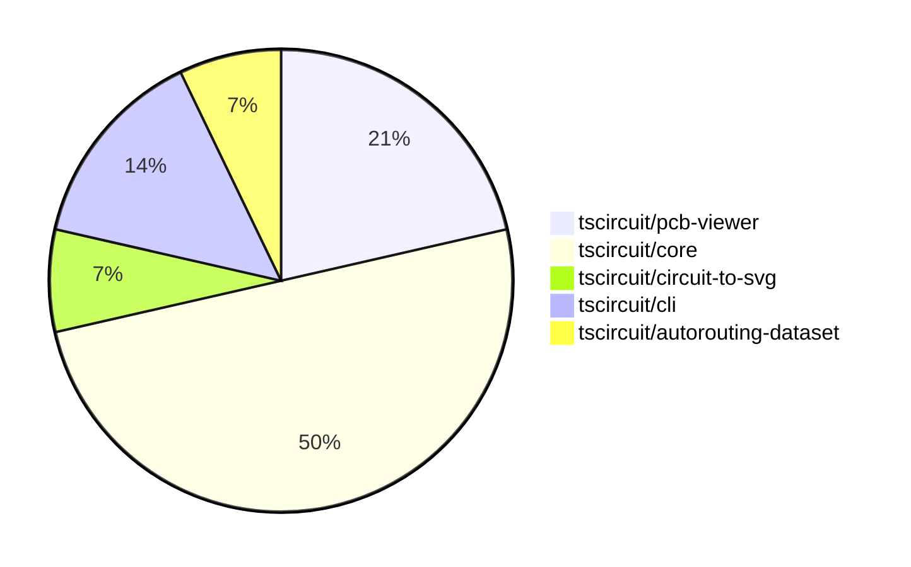

# Contribution Overview 2024-09-07

## PRs by Repository

## Contributor Overview

| Contributor | 🐳 Major | 🐙 Minor | 🐌 Tiny |
|-------------|-------|-------|-------|
| seveibar | 7 | 2 | 0 |
| imrishabh18 | 2 | 0 | 0 |
| abhijitxy | 1 | 1 | 0 |
| tscircuitbot | 0 | 0 | 1 |

## Changes by Repository

### [tscircuit/pcb-viewer](https://github.com/tscircuit/pcb-viewer)

| PR # | Impact | Contributor | Description |
|------|--------|-------------|-------------|
| [#51](https://github.com/tscircuit/pcb-viewer/pull/51) | 🐳 Major | seveibar | Add hover highlight functionality for canvas elements and introduce `is_mouse_over` field to primitives |
| [#50](https://github.com/tscircuit/pcb-viewer/pull/50) | 🐳 Major | seveibar | Fix bad edit events being sent where `pcb_port_id` was null. |
| [#48](https://github.com/tscircuit/pcb-viewer/pull/48) | 🐳 Major | imrishabh18 | Add a keepout example to the Storybook of the PCBViewer component. |

### [tscircuit/core](https://github.com/tscircuit/core)

| PR # | Impact | Contributor | Description |
|------|--------|-------------|-------------|
| [#71](https://github.com/tscircuit/core/pull/71) | 🐳 Major | seveibar | This pull request introduces support for multilayer traces and vias, and fixes an issue where traces routed inside Trace.ts were always routed on the top layer. |
| [#67](https://github.com/tscircuit/core/pull/67) | 🐳 Major | seveibar | The pull request introduces a new feature to create classes from manual trace hints and insert the `pcb_trace_hint` into the database. |
| [#60](https://github.com/tscircuit/core/pull/60) | 🐳 Major | seveibar | Fixes the handling of manual trace hints, and adds a new utility function to check if a component matches a path selector. |
| [#59](https://github.com/tscircuit/core/pull/59) | 🐳 Major | seveibar | Fix missing port ids on smtpads and plated holes |
| [#48](https://github.com/tscircuit/core/pull/48) | 🐳 Major | imrishabh18 | Introduce a new primitive component `Keepout` to support PCB keepout regions. |
| [#63](https://github.com/tscircuit/core/pull/63) | 🐳 Major | abhijitxy | Fix an unsupported silkscreenpath feature |
| [#69](https://github.com/tscircuit/core/pull/69) | 🐌 Tiny | tscircuitbot | Remove unnecessary `console.log()` statement from `silkscreenpath.test.tsx` file. |

### [tscircuit/circuit-to-svg](https://github.com/tscircuit/circuit-to-svg)

| PR # | Impact | Contributor | Description |
|------|--------|-------------|-------------|
| [#55](https://github.com/tscircuit/circuit-to-svg/pull/55) | 🐳 Major | seveibar | Introduce snapshot tests for the circuit JSON to PCB SVG conversion feature. |

### [tscircuit/cli](https://github.com/tscircuit/cli)

| PR # | Impact | Contributor | Description |
|------|--------|-------------|-------------|
| [#163](https://github.com/tscircuit/cli/pull/163) | 🐙 Minor | seveibar | Edit Event Pipeline docs, manual edits don't crash browser |
| [#161](https://github.com/tscircuit/cli/pull/161) | 🐙 Minor | abhijitxy | Fix the dropdown menu appearing under the circuit |

### [tscircuit/autorouting-dataset](https://github.com/tscircuit/autorouting-dataset)

| PR # | Impact | Contributor | Description |
|------|--------|-------------|-------------|
| [#42](https://github.com/tscircuit/autorouting-dataset/pull/42) | 🐙 Minor | seveibar | Add a GitHub Actions workflow to check the format of the project using the Bun runtime. |

## Changes by Contributor

### [seveibar](https://github.com/seveibar)

| PR # | Impact | Description |
|------|--------|-------------|
| [#51](https://github.com/tscircuit/pcb-viewer/pull/51) | 🐳 Major | Add hover highlight functionality for canvas elements and introduce `is_mouse_over` field to primitives |
| [#50](https://github.com/tscircuit/pcb-viewer/pull/50) | 🐳 Major | Fix bad edit events being sent where `pcb_port_id` was null. |
| [#71](https://github.com/tscircuit/core/pull/71) | 🐳 Major | This pull request introduces support for multilayer traces and vias, and fixes an issue where traces routed inside Trace.ts were always routed on the top layer. |
| [#67](https://github.com/tscircuit/core/pull/67) | 🐳 Major | The pull request introduces a new feature to create classes from manual trace hints and insert the `pcb_trace_hint` into the database. |
| [#60](https://github.com/tscircuit/core/pull/60) | 🐳 Major | Fixes the handling of manual trace hints, and adds a new utility function to check if a component matches a path selector. |
| [#59](https://github.com/tscircuit/core/pull/59) | 🐳 Major | Fix missing port ids on smtpads and plated holes |
| [#55](https://github.com/tscircuit/circuit-to-svg/pull/55) | 🐳 Major | Introduce snapshot tests for the circuit JSON to PCB SVG conversion feature. |
| [#163](https://github.com/tscircuit/cli/pull/163) | 🐙 Minor | Edit Event Pipeline docs, manual edits don't crash browser |
| [#42](https://github.com/tscircuit/autorouting-dataset/pull/42) | 🐙 Minor | Add a GitHub Actions workflow to check the format of the project using the Bun runtime. |

### [imrishabh18](https://github.com/imrishabh18)

| PR # | Impact | Description |
|------|--------|-------------|
| [#48](https://github.com/tscircuit/pcb-viewer/pull/48) | 🐳 Major | Add a keepout example to the Storybook of the PCBViewer component. |
| [#48](https://github.com/tscircuit/core/pull/48) | 🐳 Major | Introduce a new primitive component `Keepout` to support PCB keepout regions. |

### [abhijitxy](https://github.com/abhijitxy)

| PR # | Impact | Description |
|------|--------|-------------|
| [#63](https://github.com/tscircuit/core/pull/63) | 🐳 Major | Fix an unsupported silkscreenpath feature |
| [#161](https://github.com/tscircuit/cli/pull/161) | 🐙 Minor | Fix the dropdown menu appearing under the circuit |

### [tscircuitbot](https://github.com/tscircuitbot)

| PR # | Impact | Description |
|------|--------|-------------|
| [#69](https://github.com/tscircuit/core/pull/69) | 🐌 Tiny | Remove unnecessary `console.log()` statement from `silkscreenpath.test.tsx` file. |

