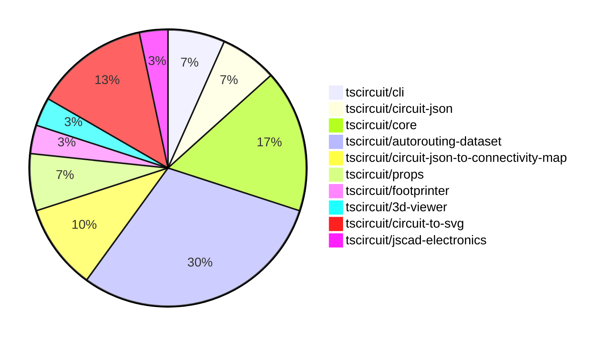

# Contribution Overview 2024-09-14

## PRs by Repository

## Contributor Overview

| Contributor | 🐳 Major | 🐙 Minor | 🐌 Tiny |
|-------------|-------|-------|-------|
| seveibar | 14 | 8 | 0 |
| anas-sarkez | 0 | 1 | 0 |
| ShiboSoftwareDev | 3 | 1 | 0 |
| abhijitxy | 1 | 0 | 0 |
| imrishabh18 | 1 | 1 | 0 |

## Changes by Repository

### [tscircuit/cli](https://github.com/tscircuit/cli)

| PR # | Impact | Contributor | Description |
|------|--------|-------------|-------------|
| [#185](https://github.com/tscircuit/cli/pull/185) | 🐳 Major | seveibar | Fix Gerber Exporting, add tests for gerber export |
| [#179](https://github.com/tscircuit/cli/pull/179) | 🐳 Major | seveibar | Fully route the macrokeypad project |

### [tscircuit/circuit-json](https://github.com/tscircuit/circuit-json)

| PR # | Impact | Contributor | Description |
|------|--------|-------------|-------------|
| [#46](https://github.com/tscircuit/circuit-json/pull/46) | 🐳 Major | seveibar | Update the release workflow to use the bun runtime for building, update naming conventions, and switch to using `AnyCircuitElement` instead of `AnySoupElement`. |
| [#44](https://github.com/tscircuit/circuit-json/pull/44) | 🐙 Minor | seveibar | Update dependency "@biomejs/biome" to version 1.9.1 and add correctly named fabrication note/path ids |

### [tscircuit/core](https://github.com/tscircuit/core)

| PR # | Impact | Contributor | Description |
|------|--------|-------------|-------------|
| [#91](https://github.com/tscircuit/core/pull/91) | 🐳 Major | seveibar | Add support for minTraceWidth option in the Trace component. |
| [#90](https://github.com/tscircuit/core/pull/90) | 🐳 Major | seveibar | Fix traces switching layers accidentally, cleanup trace code, and add test for 9 key keyboard. |
| [#89](https://github.com/tscircuit/core/pull/89) | 🐳 Major | seveibar | Enable goalbox optimization for PCB routing |
| [#92](https://github.com/tscircuit/core/pull/92) | 🐳 Major | ShiboSoftwareDev | Adds support for a board outline in the Board component. |
| [#86](https://github.com/tscircuit/core/pull/86) | 🐙 Minor | seveibar | Upgrade the `@tscircuit/infgrid-ijump-astar` dependency to version `0.0.17`. |

### [tscircuit/autorouting-dataset](https://github.com/tscircuit/autorouting-dataset)

| PR # | Impact | Contributor | Description |
|------|--------|-------------|-------------|
| [#73](https://github.com/tscircuit/autorouting-dataset/pull/73) | 🐳 Major | seveibar | Introduce Github Action Benchmarks to automatically run and record algorithm performance results. |
| [#72](https://github.com/tscircuit/autorouting-dataset/pull/72) | 🐳 Major | seveibar | Implement a preprocessing step to adjust connection points based on previous iterations, and a postprocessing step to update the connectivity map with solved traces. |
| [#71](https://github.com/tscircuit/autorouting-dataset/pull/71) | 🐳 Major | seveibar | Introduce alternative goal boxes calculation, snapshot example for fixing, and math utilities |
| [#69](https://github.com/tscircuit/autorouting-dataset/pull/69) | 🐳 Major | seveibar | Introduce a new interface `ConnectionWithGoalAlternatives` and functions `getAlternativeGoalBoxes` and `getConnectionWithAlternativeGoalBoxes` to handle connections with alternative goal boxes. |
| [#66](https://github.com/tscircuit/autorouting-dataset/pull/66) | 🐳 Major | seveibar | Add vias for PCB trace routes. |
| [#78](https://github.com/tscircuit/autorouting-dataset/pull/78) | 🐙 Minor | seveibar | Move `minTraceWidth` from `GeneralizedAstar` and `MultilayerIjump` to `SimpleRouteJson` |
| [#77](https://github.com/tscircuit/autorouting-dataset/pull/77) | 🐙 Minor | seveibar | Add `minTraceWidth` option to the `GeneralizedAstar` and `MultilayerIjump` classes to configure the minimum trace width of the generated routing paths. |
| [#74](https://github.com/tscircuit/autorouting-dataset/pull/74) | 🐙 Minor | seveibar | Fix a broken dependency in the GitHub workflow that builds the `infgrid-ijump-astar` algorithm. |
| [#67](https://github.com/tscircuit/autorouting-dataset/pull/67) | 🐙 Minor | seveibar | Adds a snapshot for Keyboard Sample 7 against multilayer autorouter as a preparation for Route to Neighbor Strategy. |

### [tscircuit/circuit-json-to-connectivity-map](https://github.com/tscircuit/circuit-json-to-connectivity-map)

| PR # | Impact | Contributor | Description |
|------|--------|-------------|-------------|
| [#5](https://github.com/tscircuit/circuit-json-to-connectivity-map/pull/5) | 🐳 Major | seveibar | Introduce support for initializing an empty PCB connectivity map when no circuit JSON is provided. |
| [#4](https://github.com/tscircuit/circuit-json-to-connectivity-map/pull/4) | 🐳 Major | seveibar | Introduce methods to add connections to an existing connectivity map and support merging dynamically created connectivity nets. |
| [#3](https://github.com/tscircuit/circuit-json-to-connectivity-map/pull/3) | 🐳 Major | seveibar | Introduce a feature to create a PCB Connectivity Map that can analyze the connectivity of traces and ports on a PCB. |

### [tscircuit/props](https://github.com/tscircuit/props)

| PR # | Impact | Contributor | Description |
|------|--------|-------------|-------------|
| [#51](https://github.com/tscircuit/props/pull/51) | 🐙 Minor | seveibar | Add a new `defaultTraceWidth` prop to the `Board` and `Group` components. |
| [#50](https://github.com/tscircuit/props/pull/50) | 🐙 Minor | seveibar | Add key as an optional parameter for trace props. |

### [tscircuit/footprinter](https://github.com/tscircuit/footprinter)

| PR # | Impact | Contributor | Description |
|------|--------|-------------|-------------|
| [#37](https://github.com/tscircuit/footprinter/pull/37) | 🐙 Minor | anas-sarkez | Updated the `circuit-to-svg` dependency and modified the SVG styles |

### [tscircuit/3d-viewer](https://github.com/tscircuit/3d-viewer)

| PR # | Impact | Contributor | Description |
|------|--------|-------------|-------------|
| [#17](https://github.com/tscircuit/3d-viewer/pull/17) | 🐳 Major | ShiboSoftwareDev | Implemented a function to create a board geometry with an outline defined by a list of points. |

### [tscircuit/circuit-to-svg](https://github.com/tscircuit/circuit-to-svg)

| PR # | Impact | Contributor | Description |
|------|--------|-------------|-------------|
| [#73](https://github.com/tscircuit/circuit-to-svg/pull/73) | 🐳 Major | ShiboSoftwareDev | Introduces the ability to draw PCB boards with a rectangular shape and an outlined shape. |
| [#70](https://github.com/tscircuit/circuit-to-svg/pull/70) | 🐳 Major | imrishabh18 | Adds a new feature to create SVG objects from PCB vias. |
| [#69](https://github.com/tscircuit/circuit-to-svg/pull/69) | 🐙 Minor | ShiboSoftwareDev | Implemented colored fabrication note path and text |
| [#71](https://github.com/tscircuit/circuit-to-svg/pull/71) | 🐙 Minor | imrishabh18 | Update the deprecated name "soup" to "AnyCircuitElement" in the library's API and implementation. |

### [tscircuit/jscad-electronics](https://github.com/tscircuit/jscad-electronics)

| PR # | Impact | Contributor | Description |
|------|--------|-------------|-------------|
| [#35](https://github.com/tscircuit/jscad-electronics/pull/35) | 🐳 Major | abhijitxy | Add a new SOT-723 component to the library |

## Changes by Contributor

### [seveibar](https://github.com/seveibar)

| PR # | Impact | Description |
|------|--------|-------------|
| [#185](https://github.com/tscircuit/cli/pull/185) | 🐳 Major | Fix Gerber Exporting, add tests for gerber export |
| [#179](https://github.com/tscircuit/cli/pull/179) | 🐳 Major | Fully route the macrokeypad project |
| [#46](https://github.com/tscircuit/circuit-json/pull/46) | 🐳 Major | Update the release workflow to use the bun runtime for building, update naming conventions, and switch to using `AnyCircuitElement` instead of `AnySoupElement`. |
| [#91](https://github.com/tscircuit/core/pull/91) | 🐳 Major | Add support for minTraceWidth option in the Trace component. |
| [#90](https://github.com/tscircuit/core/pull/90) | 🐳 Major | Fix traces switching layers accidentally, cleanup trace code, and add test for 9 key keyboard. |
| [#89](https://github.com/tscircuit/core/pull/89) | 🐳 Major | Enable goalbox optimization for PCB routing |
| [#73](https://github.com/tscircuit/autorouting-dataset/pull/73) | 🐳 Major | Introduce Github Action Benchmarks to automatically run and record algorithm performance results. |
| [#72](https://github.com/tscircuit/autorouting-dataset/pull/72) | 🐳 Major | Implement a preprocessing step to adjust connection points based on previous iterations, and a postprocessing step to update the connectivity map with solved traces. |
| [#71](https://github.com/tscircuit/autorouting-dataset/pull/71) | 🐳 Major | Introduce alternative goal boxes calculation, snapshot example for fixing, and math utilities |
| [#69](https://github.com/tscircuit/autorouting-dataset/pull/69) | 🐳 Major | Introduce a new interface `ConnectionWithGoalAlternatives` and functions `getAlternativeGoalBoxes` and `getConnectionWithAlternativeGoalBoxes` to handle connections with alternative goal boxes. |
| [#66](https://github.com/tscircuit/autorouting-dataset/pull/66) | 🐳 Major | Add vias for PCB trace routes. |
| [#5](https://github.com/tscircuit/circuit-json-to-connectivity-map/pull/5) | 🐳 Major | Introduce support for initializing an empty PCB connectivity map when no circuit JSON is provided. |
| [#4](https://github.com/tscircuit/circuit-json-to-connectivity-map/pull/4) | 🐳 Major | Introduce methods to add connections to an existing connectivity map and support merging dynamically created connectivity nets. |
| [#3](https://github.com/tscircuit/circuit-json-to-connectivity-map/pull/3) | 🐳 Major | Introduce a feature to create a PCB Connectivity Map that can analyze the connectivity of traces and ports on a PCB. |
| [#44](https://github.com/tscircuit/circuit-json/pull/44) | 🐙 Minor | Update dependency "@biomejs/biome" to version 1.9.1 and add correctly named fabrication note/path ids |
| [#51](https://github.com/tscircuit/props/pull/51) | 🐙 Minor | Add a new `defaultTraceWidth` prop to the `Board` and `Group` components. |
| [#50](https://github.com/tscircuit/props/pull/50) | 🐙 Minor | Add key as an optional parameter for trace props. |
| [#86](https://github.com/tscircuit/core/pull/86) | 🐙 Minor | Upgrade the `@tscircuit/infgrid-ijump-astar` dependency to version `0.0.17`. |
| [#78](https://github.com/tscircuit/autorouting-dataset/pull/78) | 🐙 Minor | Move `minTraceWidth` from `GeneralizedAstar` and `MultilayerIjump` to `SimpleRouteJson` |
| [#77](https://github.com/tscircuit/autorouting-dataset/pull/77) | 🐙 Minor | Add `minTraceWidth` option to the `GeneralizedAstar` and `MultilayerIjump` classes to configure the minimum trace width of the generated routing paths. |
| [#74](https://github.com/tscircuit/autorouting-dataset/pull/74) | 🐙 Minor | Fix a broken dependency in the GitHub workflow that builds the `infgrid-ijump-astar` algorithm. |
| [#67](https://github.com/tscircuit/autorouting-dataset/pull/67) | 🐙 Minor | Adds a snapshot for Keyboard Sample 7 against multilayer autorouter as a preparation for Route to Neighbor Strategy. |

### [anas-sarkez](https://github.com/anas-sarkez)

| PR # | Impact | Description |
|------|--------|-------------|
| [#37](https://github.com/tscircuit/footprinter/pull/37) | 🐙 Minor | Updated the `circuit-to-svg` dependency and modified the SVG styles |

### [ShiboSoftwareDev](https://github.com/ShiboSoftwareDev)

| PR # | Impact | Description |
|------|--------|-------------|
| [#17](https://github.com/tscircuit/3d-viewer/pull/17) | 🐳 Major | Implemented a function to create a board geometry with an outline defined by a list of points. |
| [#92](https://github.com/tscircuit/core/pull/92) | 🐳 Major | Adds support for a board outline in the Board component. |
| [#73](https://github.com/tscircuit/circuit-to-svg/pull/73) | 🐳 Major | Introduces the ability to draw PCB boards with a rectangular shape and an outlined shape. |
| [#69](https://github.com/tscircuit/circuit-to-svg/pull/69) | 🐙 Minor | Implemented colored fabrication note path and text |

### [abhijitxy](https://github.com/abhijitxy)

| PR # | Impact | Description |
|------|--------|-------------|
| [#35](https://github.com/tscircuit/jscad-electronics/pull/35) | 🐳 Major | Add a new SOT-723 component to the library |

### [imrishabh18](https://github.com/imrishabh18)

| PR # | Impact | Description |
|------|--------|-------------|
| [#70](https://github.com/tscircuit/circuit-to-svg/pull/70) | 🐳 Major | Adds a new feature to create SVG objects from PCB vias. |
| [#71](https://github.com/tscircuit/circuit-to-svg/pull/71) | 🐙 Minor | Update the deprecated name "soup" to "AnyCircuitElement" in the library's API and implementation. |

