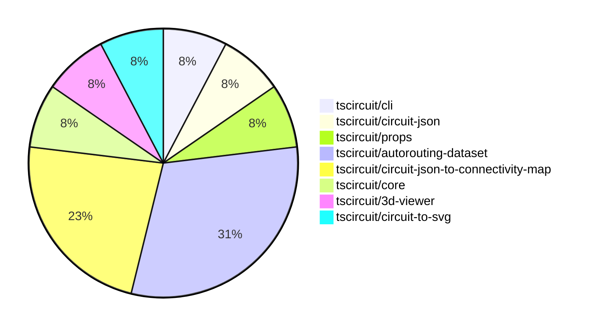

# Contribution Overview 2024-09-14

## PRs by Repository

## Contributor Overview

| Contributor | 🐳 Major | 🐙 Minor | 🐌 Tiny |
|-------------|-------|-------|-------|
| seveibar | 7 | 3 | 0 |
| ShiboSoftwareDev | 2 | 0 | 0 |

## Changes by Repository

### [tscircuit/cli](https://github.com/tscircuit/cli)

| PR # | Impact | Contributor | Description |
|------|--------|-------------|-------------|
| [#179](https://github.com/tscircuit/cli/pull/179) | 🐳 Major | seveibar | Update routing information for the macrokeypad project. |

### [tscircuit/circuit-json](https://github.com/tscircuit/circuit-json)

| PR # | Impact | Contributor | Description |
|------|--------|-------------|-------------|
| [#46](https://github.com/tscircuit/circuit-json/pull/46) | 🐳 Major | seveibar | Updating naming convention, switch to bun, switch AnySoupElement to AnyCircuitElement with deprecated comments |

### [tscircuit/props](https://github.com/tscircuit/props)

| PR # | Impact | Contributor | Description |
|------|--------|-------------|-------------|
| [#50](https://github.com/tscircuit/props/pull/50) | 🟣 | seveibar | Add `key` as an optional parameter for `trace` props. |

### [tscircuit/autorouting-dataset](https://github.com/tscircuit/autorouting-dataset)

| PR # | Impact | Contributor | Description |
|------|--------|-------------|-------------|
| [#71](https://github.com/tscircuit/autorouting-dataset/pull/71) | 🐳 Major | seveibar | This pull request introduces changes to the goal box calculation and adds a snapshot "worst case" example to fix. |
| [#69](https://github.com/tscircuit/autorouting-dataset/pull/69) | 🐳 Major | seveibar | Introduce alternative goal box functions for connections in the solver-utils module. |
| [#66](https://github.com/tscircuit/autorouting-dataset/pull/66) | 🐳 Major | seveibar | Adds vias for PCB trace routes in the solution soup. |
| [#67](https://github.com/tscircuit/autorouting-dataset/pull/67) | 🐙 Minor | seveibar | Add a snapshot file for the Keyboard Sample 7 against the multilayer autorouter. |

### [tscircuit/circuit-json-to-connectivity-map](https://github.com/tscircuit/circuit-json-to-connectivity-map)

| PR # | Impact | Contributor | Description |
|------|--------|-------------|-------------|
| [#4](https://github.com/tscircuit/circuit-json-to-connectivity-map/pull/4) | 🐳 Major | seveibar | The pull request adds support for adding connections to an existing connectivity map. |
| [#3](https://github.com/tscircuit/circuit-json-to-connectivity-map/pull/3) | 🐳 Major | seveibar | Implement PCB connectivity map functionality to determine what traces a port is physically connected to. |
| [#5](https://github.com/tscircuit/circuit-json-to-connectivity-map/pull/5) | 🐙 Minor | seveibar | Add support for initializing an empty PCB connectivity map |

### [tscircuit/core](https://github.com/tscircuit/core)

| PR # | Impact | Contributor | Description |
|------|--------|-------------|-------------|
| [#86](https://github.com/tscircuit/core/pull/86) | 🐙 Minor | seveibar | Upgrade the "@tscircuit/infgrid-ijump-astar" dependency to version 0.0.17 |

### [tscircuit/3d-viewer](https://github.com/tscircuit/3d-viewer)

| PR # | Impact | Contributor | Description |
|------|--------|-------------|-------------|
| [#17](https://github.com/tscircuit/3d-viewer/pull/17) | 🐳 Major | ShiboSoftwareDev | Introduced a new function `createBoardWithOutline` to create a 3D board geometry from a list of points representing the board outline. |

### [tscircuit/circuit-to-svg](https://github.com/tscircuit/circuit-to-svg)

| PR # | Impact | Contributor | Description |
|------|--------|-------------|-------------|
| [#69](https://github.com/tscircuit/circuit-to-svg/pull/69) | 🐳 Major | ShiboSoftwareDev | Implemented colored fabrication note path and text |

## Changes by Contributor

### [seveibar](https://github.com/seveibar)

| PR # | Impact | Description |
|------|--------|-------------|
| [#179](https://github.com/tscircuit/cli/pull/179) | 🐳 Major | Update routing information for the macrokeypad project. |
| [#46](https://github.com/tscircuit/circuit-json/pull/46) | 🐳 Major | Updating naming convention, switch to bun, switch AnySoupElement to AnyCircuitElement with deprecated comments |
| [#50](https://github.com/tscircuit/props/pull/50) | 🟣 | Add `key` as an optional parameter for `trace` props. |
| [#71](https://github.com/tscircuit/autorouting-dataset/pull/71) | 🐳 Major | This pull request introduces changes to the goal box calculation and adds a snapshot "worst case" example to fix. |
| [#69](https://github.com/tscircuit/autorouting-dataset/pull/69) | 🐳 Major | Introduce alternative goal box functions for connections in the solver-utils module. |
| [#66](https://github.com/tscircuit/autorouting-dataset/pull/66) | 🐳 Major | Adds vias for PCB trace routes in the solution soup. |
| [#4](https://github.com/tscircuit/circuit-json-to-connectivity-map/pull/4) | 🐳 Major | The pull request adds support for adding connections to an existing connectivity map. |
| [#3](https://github.com/tscircuit/circuit-json-to-connectivity-map/pull/3) | 🐳 Major | Implement PCB connectivity map functionality to determine what traces a port is physically connected to. |
| [#86](https://github.com/tscircuit/core/pull/86) | 🐙 Minor | Upgrade the "@tscircuit/infgrid-ijump-astar" dependency to version 0.0.17 |
| [#67](https://github.com/tscircuit/autorouting-dataset/pull/67) | 🐙 Minor | Add a snapshot file for the Keyboard Sample 7 against the multilayer autorouter. |
| [#5](https://github.com/tscircuit/circuit-json-to-connectivity-map/pull/5) | 🐙 Minor | Add support for initializing an empty PCB connectivity map |

### [ShiboSoftwareDev](https://github.com/ShiboSoftwareDev)

| PR # | Impact | Description |
|------|--------|-------------|
| [#17](https://github.com/tscircuit/3d-viewer/pull/17) | 🐳 Major | Introduced a new function `createBoardWithOutline` to create a 3D board geometry from a list of points representing the board outline. |
| [#69](https://github.com/tscircuit/circuit-to-svg/pull/69) | 🐳 Major | Implemented colored fabrication note path and text |

