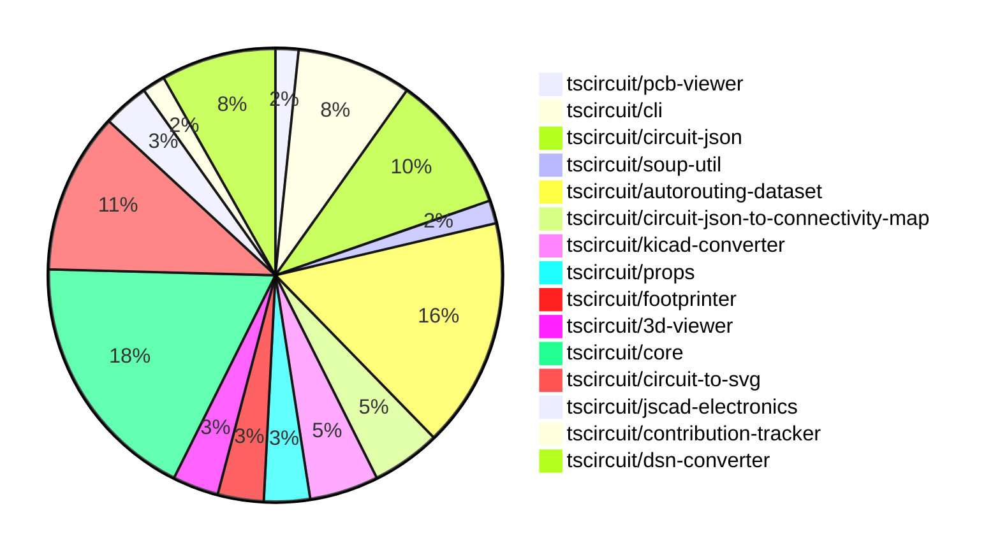

# Contribution Overview 2024-09-14

## PRs by Repository

## Contributor Overview

| Contributor | 🐳 Major | 🐙 Minor | 🐌 Tiny |
|-------------|-------|-------|-------|
| seveibar | 34 | 10 | 1 |
| anas-sarkez | 0 | 1 | 0 |
| ShiboSoftwareDev | 4 | 0 | 0 |
| abhijitxy | 2 | 0 | 0 |
| tscircuitbot | 1 | 0 | 0 |
| imrishabh18 | 5 | 2 | 0 |

## Changes by Repository

### [tscircuit/pcb-viewer](https://github.com/tscircuit/pcb-viewer)

| PR # | Impact | Contributor | Description |
|------|--------|-------------|-------------|
| [#62](https://github.com/tscircuit/pcb-viewer/pull/62) | 🐳 Major | seveibar | Refactor code to deprecate builder and @tscircuit/soup, add hole test and keyboard test. |

### [tscircuit/cli](https://github.com/tscircuit/cli)

| PR # | Impact | Contributor | Description |
|------|--------|-------------|-------------|
| [#193](https://github.com/tscircuit/cli/pull/193) | 🐳 Major | seveibar | Remove the @tscircuit/builder dependency and replace it with smaller, more specific libraries. |
| [#189](https://github.com/tscircuit/cli/pull/189) | 🐳 Major | seveibar | The pull request updates the kicad-converter by deleting temporary entrypoint files prior to creating new ones. |
| [#188](https://github.com/tscircuit/cli/pull/188) | 🐳 Major | seveibar | Add support for exporting KiCad PCB files |
| [#185](https://github.com/tscircuit/cli/pull/185) | 🐳 Major | seveibar | Fix Gerber Exporting, add tests for gerber export |
| [#179](https://github.com/tscircuit/cli/pull/179) | 🐳 Major | seveibar | Update the manual trace hints in the example-project/src/manual-edits.ts file, changing various pcb_port_selector and offsets values. |

### [tscircuit/circuit-json](https://github.com/tscircuit/circuit-json)

| PR # | Impact | Contributor | Description |
|------|--------|-------------|-------------|
| [#49](https://github.com/tscircuit/circuit-json/pull/49) | 🐳 Major | seveibar | Introduce a new set of PCB-related types and interfaces for better AI-assisted circuit design. |
| [#47](https://github.com/tscircuit/circuit-json/pull/47) | 🐳 Major | seveibar | Fix the naming of `pcb_hole.hole_shape` from "round" to "circle" and add a zod transform to correctly handle old data. |
| [#46](https://github.com/tscircuit/circuit-json/pull/46) | 🐳 Major | seveibar | The pull request updates the naming convention, switches to the Bun runtime, and updates the "AnySoupElement" to "AnyCircuitElement" with deprecated comments. |
| [#50](https://github.com/tscircuit/circuit-json/pull/50) | 🐙 Minor | seveibar | Add an optional `pcb_trace_id` field to the PCB via object. |
| [#48](https://github.com/tscircuit/circuit-json/pull/48) | 🐙 Minor | seveibar | Fix an issue with the `hole_shape` enum in the `pcb_hole` type, removing the "oval" option and simplifying the transformation logic. |
| [#44](https://github.com/tscircuit/circuit-json/pull/44) | 🐙 Minor | seveibar | Update package.json dependency and add correctly named fabrication note/path ids |

### [tscircuit/soup-util](https://github.com/tscircuit/soup-util)

| PR # | Impact | Contributor | Description |
|------|--------|-------------|-------------|
| [#15](https://github.com/tscircuit/soup-util/pull/15) | 🐳 Major | seveibar | Add reference docs for better understanding and add function to get bounds of PCB elements. |

### [tscircuit/autorouting-dataset](https://github.com/tscircuit/autorouting-dataset)

| PR # | Impact | Contributor | Description |
|------|--------|-------------|-------------|
| [#73](https://github.com/tscircuit/autorouting-dataset/pull/73) | 🐳 Major | seveibar | Introduce Github Action Benchmarks |
| [#72](https://github.com/tscircuit/autorouting-dataset/pull/72) | 🐳 Major | seveibar | Finish the implementation of the goal box feature, which allows for adjusting the start and end points of a connection based on previous iterations of the autorouter. |
| [#71](https://github.com/tscircuit/autorouting-dataset/pull/71) | 🐳 Major | seveibar | Introduces a feature to compute goal boxes for two targets, find optimal starting and ending points, and load them into the input. |
| [#67](https://github.com/tscircuit/autorouting-dataset/pull/67) | 🐳 Major | seveibar | Add a snapshot for Keyboard Sample 7 against multilayer autorouter (preparation for Route to Neighbor Strategy) |
| [#69](https://github.com/tscircuit/autorouting-dataset/pull/69) | 🐳 Major | seveibar | Introduce alternative goal box functions for connections in the autorouting library. |
| [#66](https://github.com/tscircuit/autorouting-dataset/pull/66) | 🐳 Major | seveibar | Add vias for PCB trace routes |
| [#79](https://github.com/tscircuit/autorouting-dataset/pull/79) | 🐙 Minor | seveibar | Add support for `pcb_hole` with `hole_shape` "circle" when deriving obstacles |
| [#78](https://github.com/tscircuit/autorouting-dataset/pull/78) | 🐙 Minor | seveibar | Move `minTraceWidth` to `SimpleRouteJson` |
| [#77](https://github.com/tscircuit/autorouting-dataset/pull/77) | 🐙 Minor | seveibar | Add a new parameter `minTraceWidth` to the `GeneralizedAstar` and `MultilayerIjump` classes. |
| [#74](https://github.com/tscircuit/autorouting-dataset/pull/74) | 🐙 Minor | seveibar | Fix dependency breaking algo build |

### [tscircuit/circuit-json-to-connectivity-map](https://github.com/tscircuit/circuit-json-to-connectivity-map)

| PR # | Impact | Contributor | Description |
|------|--------|-------------|-------------|
| [#5](https://github.com/tscircuit/circuit-json-to-connectivity-map/pull/5) | 🐳 Major | seveibar | Adds support for initializing an empty PCB connectivity map when no circuit JSON is provided |
| [#4](https://github.com/tscircuit/circuit-json-to-connectivity-map/pull/4) | 🐳 Major | seveibar | The pull request adds support for adding connections to an existing connectivity map. |
| [#3](https://github.com/tscircuit/circuit-json-to-connectivity-map/pull/3) | 🐳 Major | seveibar | Implement a PCB Connectivity Map to analyze what traces and ports are physically connected on a PCB. |

### [tscircuit/kicad-converter](https://github.com/tscircuit/kicad-converter)

| PR # | Impact | Contributor | Description |
|------|--------|-------------|-------------|
| [#7](https://github.com/tscircuit/kicad-converter/pull/7) | 🐳 Major | seveibar | Fixes issues with plated holes and vias in the PCB component specification. |
| [#6](https://github.com/tscircuit/kicad-converter/pull/6) | 🐳 Major | seveibar | Add support for plated holes and holes in the KiCad PCB converter |
| [#2](https://github.com/tscircuit/kicad-converter/pull/2) | 🐳 Major | seveibar | Adds support for converting circuit JSON to KiCad PCB files, and adds a test for this functionality. |

### [tscircuit/props](https://github.com/tscircuit/props)

| PR # | Impact | Contributor | Description |
|------|--------|-------------|-------------|
| [#51](https://github.com/tscircuit/props/pull/51) | 🐙 Minor | seveibar | Add a new `defaultTraceWidth` prop to the `Board` and `Group` components to allow setting the default trace width. |
| [#50](https://github.com/tscircuit/props/pull/50) | 🟣 | seveibar | Add `key` as an optional parameter for `trace` props |

### [tscircuit/footprinter](https://github.com/tscircuit/footprinter)

| PR # | Impact | Contributor | Description |
|------|--------|-------------|-------------|
| [#36](https://github.com/tscircuit/footprinter/pull/36) | 🐳 Major | seveibar | Add a GitHub Actions workflow to automatically format code in pull requests. |
| [#37](https://github.com/tscircuit/footprinter/pull/37) | 🐙 Minor | anas-sarkez | Updated the `circuit-to-svg` dependency and made minor style changes to the SVG output. |

### [tscircuit/3d-viewer](https://github.com/tscircuit/3d-viewer)

| PR # | Impact | Contributor | Description |
|------|--------|-------------|-------------|
| [#21](https://github.com/tscircuit/3d-viewer/pull/21) | 🐳 Major | seveibar | Fix board width and height being swapped, remove `@tscircuit/builder` dependency. |
| [#17](https://github.com/tscircuit/3d-viewer/pull/17) | 🐳 Major | ShiboSoftwareDev | Implemented a function to create a 3D board geometry with a custom outline. |

### [tscircuit/core](https://github.com/tscircuit/core)

| PR # | Impact | Contributor | Description |
|------|--------|-------------|-------------|
| [#102](https://github.com/tscircuit/core/pull/102) | 🐳 Major | seveibar | Fix routing through holes (holes not recognized as obstacles) |
| [#99](https://github.com/tscircuit/core/pull/99) | 🐳 Major | seveibar | Introduces the ability to support correct pin positions for schematic boxes |
| [#95](https://github.com/tscircuit/core/pull/95) | 🐳 Major | seveibar | Fix null `pcb_component_id` by looking at `PrimitiveContainer` |
| [#94](https://github.com/tscircuit/core/pull/94) | 🐳 Major | seveibar | Fix the bounds calculation for NormalComponent when child components have null widths. |
| [#91](https://github.com/tscircuit/core/pull/91) | 🐳 Major | seveibar | Introduce a new `minTraceWidth` property in the `Trace` component and update the `SimpleRouteJson` interface to include this property. |
| [#90](https://github.com/tscircuit/core/pull/90) | 🐳 Major | seveibar | Possible fix for traces switching layers accidentally, cleanup trace code, add test for 9 key keyboard |
| [#89](https://github.com/tscircuit/core/pull/89) | 🐳 Major | seveibar | Enable goalbox optimization for PCB routing |
| [#92](https://github.com/tscircuit/core/pull/92) | 🐳 Major | ShiboSoftwareDev | Adds support for board outline to the Board component |
| [#96](https://github.com/tscircuit/core/pull/96) | 🐙 Minor | seveibar | Add a test to ensure that PCB component IDs are populated for all SMT pads in the circuit. |
| [#86](https://github.com/tscircuit/core/pull/86) | 🐙 Minor | seveibar | Update the version of the `@tscircuit/infgrid-ijump-astar` package from `0.0.16` to `0.0.17`. |
| [#97](https://github.com/tscircuit/core/pull/97) | 🐌 Tiny | seveibar | Exclude pure TypeScript files from the bundle output by updating the `"module"` field in `package.json`. |

### [tscircuit/circuit-to-svg](https://github.com/tscircuit/circuit-to-svg)

| PR # | Impact | Contributor | Description |
|------|--------|-------------|-------------|
| [#76](https://github.com/tscircuit/circuit-to-svg/pull/76) | 🐳 Major | seveibar | Reorganize the source code structure to better separate PCB and schematic functions, and add a basic schematic snapshot test. |
| [#75](https://github.com/tscircuit/circuit-to-svg/pull/75) | 🐳 Major | seveibar | Add support for rendering PCB holes in the application. |
| [#74](https://github.com/tscircuit/circuit-to-svg/pull/74) | 🐳 Major | seveibar | Fix type issues, add typecheck and test to CI, update @tscircuit/soup |
| [#73](https://github.com/tscircuit/circuit-to-svg/pull/73) | 🐳 Major | ShiboSoftwareDev | Introduce a feature to draw PCB boards in a rectangular and outlined manner. |
| [#69](https://github.com/tscircuit/circuit-to-svg/pull/69) | 🐳 Major | ShiboSoftwareDev | Implemented colored fabrication note path and text |
| [#70](https://github.com/tscircuit/circuit-to-svg/pull/70) | 🐳 Major | imrishabh18 | Add support for creating SVG objects for PCB vias |
| [#71](https://github.com/tscircuit/circuit-to-svg/pull/71) | 🐙 Minor | imrishabh18 | Update the deprecated `AnySoupElement` type to `AnyCircuitElement` in the `soupToSvg` and `pcbSoupToSvg` function signatures. |

### [tscircuit/jscad-electronics](https://github.com/tscircuit/jscad-electronics)

| PR # | Impact | Contributor | Description |
|------|--------|-------------|-------------|
| [#38](https://github.com/tscircuit/jscad-electronics/pull/38) | 🐳 Major | abhijitxy | Implemented the BGA100 component and added an example for it. |
| [#35](https://github.com/tscircuit/jscad-electronics/pull/35) | 🐳 Major | abhijitxy | Adds a new component called `SOT-723` which represents a 3D model of a SOT-723 package. |

### [tscircuit/contribution-tracker](https://github.com/tscircuit/contribution-tracker)

| PR # | Impact | Contributor | Description |
|------|--------|-------------|-------------|
| [#3](https://github.com/tscircuit/contribution-tracker/pull/3) | 🐳 Major | tscircuitbot | Add pagination in `getRepos` function to fetch all the repositories of the organization. |

### [tscircuit/dsn-converter](https://github.com/tscircuit/dsn-converter)

| PR # | Impact | Contributor | Description |
|------|--------|-------------|-------------|
| [#7](https://github.com/tscircuit/dsn-converter/pull/7) | 🐳 Major | imrishabh18 | Convert circuit JSON to DSN PCB format |
| [#6](https://github.com/tscircuit/dsn-converter/pull/6) | 🐳 Major | imrishabh18 | Update the parsing of PCB JSON to convert padstacks to SMT pads |
| [#3](https://github.com/tscircuit/dsn-converter/pull/3) | 🐳 Major | imrishabh18 | Add a function to convert DSN PCB data to Circuit JSON |
| [#2](https://github.com/tscircuit/dsn-converter/pull/2) | 🐳 Major | imrishabh18 | Introduce a feature to convert s-expressions to JSON format. |
| [#5](https://github.com/tscircuit/dsn-converter/pull/5) | 🐙 Minor | imrishabh18 | Remove the `SourceNet` component and related code from the `pcbJsonToCircuitJson` function. |

## Changes by Contributor

### [seveibar](https://github.com/seveibar)

| PR # | Impact | Description |
|------|--------|-------------|
| [#62](https://github.com/tscircuit/pcb-viewer/pull/62) | 🐳 Major | Refactor code to deprecate builder and @tscircuit/soup, add hole test and keyboard test. |
| [#193](https://github.com/tscircuit/cli/pull/193) | 🐳 Major | Remove the @tscircuit/builder dependency and replace it with smaller, more specific libraries. |
| [#189](https://github.com/tscircuit/cli/pull/189) | 🐳 Major | The pull request updates the kicad-converter by deleting temporary entrypoint files prior to creating new ones. |
| [#188](https://github.com/tscircuit/cli/pull/188) | 🐳 Major | Add support for exporting KiCad PCB files |
| [#185](https://github.com/tscircuit/cli/pull/185) | 🐳 Major | Fix Gerber Exporting, add tests for gerber export |
| [#179](https://github.com/tscircuit/cli/pull/179) | 🐳 Major | Update the manual trace hints in the example-project/src/manual-edits.ts file, changing various pcb_port_selector and offsets values. |
| [#49](https://github.com/tscircuit/circuit-json/pull/49) | 🐳 Major | Introduce a new set of PCB-related types and interfaces for better AI-assisted circuit design. |
| [#47](https://github.com/tscircuit/circuit-json/pull/47) | 🐳 Major | Fix the naming of `pcb_hole.hole_shape` from "round" to "circle" and add a zod transform to correctly handle old data. |
| [#46](https://github.com/tscircuit/circuit-json/pull/46) | 🐳 Major | The pull request updates the naming convention, switches to the Bun runtime, and updates the "AnySoupElement" to "AnyCircuitElement" with deprecated comments. |
| [#15](https://github.com/tscircuit/soup-util/pull/15) | 🐳 Major | Add reference docs for better understanding and add function to get bounds of PCB elements. |
| [#73](https://github.com/tscircuit/autorouting-dataset/pull/73) | 🐳 Major | Introduce Github Action Benchmarks |
| [#72](https://github.com/tscircuit/autorouting-dataset/pull/72) | 🐳 Major | Finish the implementation of the goal box feature, which allows for adjusting the start and end points of a connection based on previous iterations of the autorouter. |
| [#71](https://github.com/tscircuit/autorouting-dataset/pull/71) | 🐳 Major | Introduces a feature to compute goal boxes for two targets, find optimal starting and ending points, and load them into the input. |
| [#67](https://github.com/tscircuit/autorouting-dataset/pull/67) | 🐳 Major | Add a snapshot for Keyboard Sample 7 against multilayer autorouter (preparation for Route to Neighbor Strategy) |
| [#69](https://github.com/tscircuit/autorouting-dataset/pull/69) | 🐳 Major | Introduce alternative goal box functions for connections in the autorouting library. |
| [#66](https://github.com/tscircuit/autorouting-dataset/pull/66) | 🐳 Major | Add vias for PCB trace routes |
| [#5](https://github.com/tscircuit/circuit-json-to-connectivity-map/pull/5) | 🐳 Major | Adds support for initializing an empty PCB connectivity map when no circuit JSON is provided |
| [#4](https://github.com/tscircuit/circuit-json-to-connectivity-map/pull/4) | 🐳 Major | The pull request adds support for adding connections to an existing connectivity map. |
| [#3](https://github.com/tscircuit/circuit-json-to-connectivity-map/pull/3) | 🐳 Major | Implement a PCB Connectivity Map to analyze what traces and ports are physically connected on a PCB. |
| [#7](https://github.com/tscircuit/kicad-converter/pull/7) | 🐳 Major | Fixes issues with plated holes and vias in the PCB component specification. |
| [#6](https://github.com/tscircuit/kicad-converter/pull/6) | 🐳 Major | Add support for plated holes and holes in the KiCad PCB converter |
| [#2](https://github.com/tscircuit/kicad-converter/pull/2) | 🐳 Major | Adds support for converting circuit JSON to KiCad PCB files, and adds a test for this functionality. |
| [#50](https://github.com/tscircuit/circuit-json/pull/50) | 🐙 Minor | Add an optional `pcb_trace_id` field to the PCB via object. |
| [#48](https://github.com/tscircuit/circuit-json/pull/48) | 🐙 Minor | Fix an issue with the `hole_shape` enum in the `pcb_hole` type, removing the "oval" option and simplifying the transformation logic. |
| [#44](https://github.com/tscircuit/circuit-json/pull/44) | 🐙 Minor | Update package.json dependency and add correctly named fabrication note/path ids |
| [#51](https://github.com/tscircuit/props/pull/51) | 🐙 Minor | Add a new `defaultTraceWidth` prop to the `Board` and `Group` components to allow setting the default trace width. |
| [#50](https://github.com/tscircuit/props/pull/50) | 🟣 | Add `key` as an optional parameter for `trace` props |
| [#36](https://github.com/tscircuit/footprinter/pull/36) | 🐳 Major | Add a GitHub Actions workflow to automatically format code in pull requests. |
| [#21](https://github.com/tscircuit/3d-viewer/pull/21) | 🐳 Major | Fix board width and height being swapped, remove `@tscircuit/builder` dependency. |
| [#102](https://github.com/tscircuit/core/pull/102) | 🐳 Major | Fix routing through holes (holes not recognized as obstacles) |
| [#99](https://github.com/tscircuit/core/pull/99) | 🐳 Major | Introduces the ability to support correct pin positions for schematic boxes |
| [#95](https://github.com/tscircuit/core/pull/95) | 🐳 Major | Fix null `pcb_component_id` by looking at `PrimitiveContainer` |
| [#94](https://github.com/tscircuit/core/pull/94) | 🐳 Major | Fix the bounds calculation for NormalComponent when child components have null widths. |
| [#91](https://github.com/tscircuit/core/pull/91) | 🐳 Major | Introduce a new `minTraceWidth` property in the `Trace` component and update the `SimpleRouteJson` interface to include this property. |
| [#90](https://github.com/tscircuit/core/pull/90) | 🐳 Major | Possible fix for traces switching layers accidentally, cleanup trace code, add test for 9 key keyboard |
| [#89](https://github.com/tscircuit/core/pull/89) | 🐳 Major | Enable goalbox optimization for PCB routing |
| [#76](https://github.com/tscircuit/circuit-to-svg/pull/76) | 🐳 Major | Reorganize the source code structure to better separate PCB and schematic functions, and add a basic schematic snapshot test. |
| [#75](https://github.com/tscircuit/circuit-to-svg/pull/75) | 🐳 Major | Add support for rendering PCB holes in the application. |
| [#74](https://github.com/tscircuit/circuit-to-svg/pull/74) | 🐳 Major | Fix type issues, add typecheck and test to CI, update @tscircuit/soup |
| [#96](https://github.com/tscircuit/core/pull/96) | 🐙 Minor | Add a test to ensure that PCB component IDs are populated for all SMT pads in the circuit. |
| [#86](https://github.com/tscircuit/core/pull/86) | 🐙 Minor | Update the version of the `@tscircuit/infgrid-ijump-astar` package from `0.0.16` to `0.0.17`. |
| [#79](https://github.com/tscircuit/autorouting-dataset/pull/79) | 🐙 Minor | Add support for `pcb_hole` with `hole_shape` "circle" when deriving obstacles |
| [#78](https://github.com/tscircuit/autorouting-dataset/pull/78) | 🐙 Minor | Move `minTraceWidth` to `SimpleRouteJson` |
| [#77](https://github.com/tscircuit/autorouting-dataset/pull/77) | 🐙 Minor | Add a new parameter `minTraceWidth` to the `GeneralizedAstar` and `MultilayerIjump` classes. |
| [#74](https://github.com/tscircuit/autorouting-dataset/pull/74) | 🐙 Minor | Fix dependency breaking algo build |
| [#97](https://github.com/tscircuit/core/pull/97) | 🐌 Tiny | Exclude pure TypeScript files from the bundle output by updating the `"module"` field in `package.json`. |

### [anas-sarkez](https://github.com/anas-sarkez)

| PR # | Impact | Description |
|------|--------|-------------|
| [#37](https://github.com/tscircuit/footprinter/pull/37) | 🐙 Minor | Updated the `circuit-to-svg` dependency and made minor style changes to the SVG output. |

### [ShiboSoftwareDev](https://github.com/ShiboSoftwareDev)

| PR # | Impact | Description |
|------|--------|-------------|
| [#17](https://github.com/tscircuit/3d-viewer/pull/17) | 🐳 Major | Implemented a function to create a 3D board geometry with a custom outline. |
| [#92](https://github.com/tscircuit/core/pull/92) | 🐳 Major | Adds support for board outline to the Board component |
| [#73](https://github.com/tscircuit/circuit-to-svg/pull/73) | 🐳 Major | Introduce a feature to draw PCB boards in a rectangular and outlined manner. |
| [#69](https://github.com/tscircuit/circuit-to-svg/pull/69) | 🐳 Major | Implemented colored fabrication note path and text |

### [abhijitxy](https://github.com/abhijitxy)

| PR # | Impact | Description |
|------|--------|-------------|
| [#38](https://github.com/tscircuit/jscad-electronics/pull/38) | 🐳 Major | Implemented the BGA100 component and added an example for it. |
| [#35](https://github.com/tscircuit/jscad-electronics/pull/35) | 🐳 Major | Adds a new component called `SOT-723` which represents a 3D model of a SOT-723 package. |

### [tscircuitbot](https://github.com/tscircuitbot)

| PR # | Impact | Description |
|------|--------|-------------|
| [#3](https://github.com/tscircuit/contribution-tracker/pull/3) | 🐳 Major | Add pagination in `getRepos` function to fetch all the repositories of the organization. |

### [imrishabh18](https://github.com/imrishabh18)

| PR # | Impact | Description |
|------|--------|-------------|
| [#70](https://github.com/tscircuit/circuit-to-svg/pull/70) | 🐳 Major | Add support for creating SVG objects for PCB vias |
| [#7](https://github.com/tscircuit/dsn-converter/pull/7) | 🐳 Major | Convert circuit JSON to DSN PCB format |
| [#6](https://github.com/tscircuit/dsn-converter/pull/6) | 🐳 Major | Update the parsing of PCB JSON to convert padstacks to SMT pads |
| [#3](https://github.com/tscircuit/dsn-converter/pull/3) | 🐳 Major | Add a function to convert DSN PCB data to Circuit JSON |
| [#2](https://github.com/tscircuit/dsn-converter/pull/2) | 🐳 Major | Introduce a feature to convert s-expressions to JSON format. |
| [#71](https://github.com/tscircuit/circuit-to-svg/pull/71) | 🐙 Minor | Update the deprecated `AnySoupElement` type to `AnyCircuitElement` in the `soupToSvg` and `pcbSoupToSvg` function signatures. |
| [#5](https://github.com/tscircuit/dsn-converter/pull/5) | 🐙 Minor | Remove the `SourceNet` component and related code from the `pcbJsonToCircuitJson` function. |

