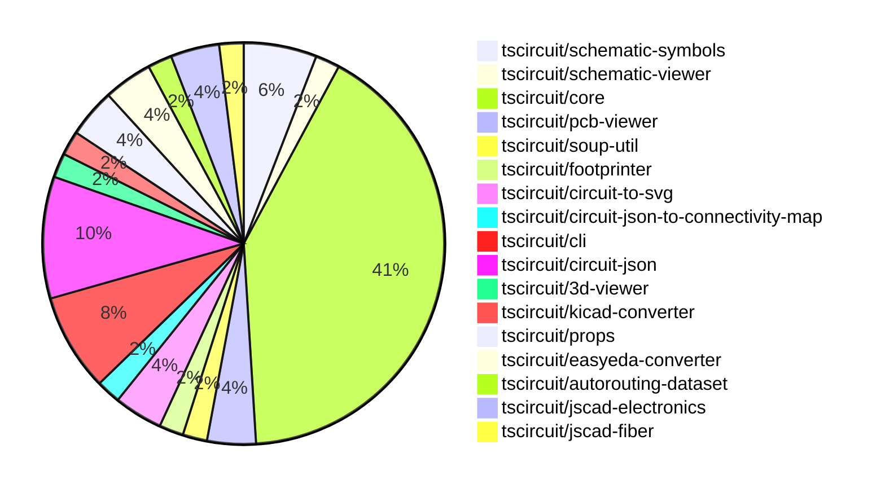

# Contribution Overview 2024-09-21

## PRs by Repository

## Contributor Overview

| Contributor | 🐳 Major | 🐙 Minor | 🐌 Tiny |
|-------------|-------|-------|-------|
| imrishabh18 | 1 | 5 | 1 |
| ShiboSoftwareDev | 5 | 1 | 0 |
| seveibar | 21 | 13 | 0 |
| andrii-balitskyi | 1 | 0 | 0 |
| abhijitxy | 2 | 1 | 0 |

## Changes by Repository

### [tscircuit/schematic-symbols](https://github.com/tscircuit/schematic-symbols)

| PR # | Impact | Contributor | Description |
|------|--------|-------------|-------------|
| [#14](https://github.com/tscircuit/schematic-symbols/pull/14) | 🐳 Major | imrishabh18 | Capacitor added, fixed the generator |
| [#17](https://github.com/tscircuit/schematic-symbols/pull/17) | 🐙 Minor | imrishabh18 | Add reference and value text to the capacitor symbol. |
| [#15](https://github.com/tscircuit/schematic-symbols/pull/15) | 🐙 Minor | imrishabh18 | Fix type checking in the `normalize-svg.test.ts` file. |

### [tscircuit/schematic-viewer](https://github.com/tscircuit/schematic-viewer)

| PR # | Impact | Contributor | Description |
|------|--------|-------------|-------------|
| [#62](https://github.com/tscircuit/schematic-viewer/pull/62) | 🐙 Minor | imrishabh18 | Update dependencies in the package.json file, including a new "circuit-json" dependency and removing the "@tscircuit/soup" dependency. |

### [tscircuit/core](https://github.com/tscircuit/core)

| PR # | Impact | Contributor | Description |
|------|--------|-------------|-------------|
| [#110](https://github.com/tscircuit/core/pull/110) | 🐳 Major | ShiboSoftwareDev | Updated to `circuit-json` library and added `pcb_trace_id` to `via`. |
| [#123](https://github.com/tscircuit/core/pull/123) | 🐳 Major | seveibar | Refactor component names in the codebase by moving the component name to the config object and removing the direct assignment to the componentName property. |
| [#122](https://github.com/tscircuit/core/pull/122) | 🐳 Major | seveibar | Manually add a `componentName` property to each component class in the codebase. |
| [#121](https://github.com/tscircuit/core/pull/121) | 🐳 Major | seveibar | Fix CAD components rendering at the wrong position in 3D |
| [#116](https://github.com/tscircuit/core/pull/116) | 🐳 Major | seveibar | Adds a test case to verify the handling of trace hints with vias, and fixes the start and end PCB port IDs for traces that start or end with a wire. |
| [#113](https://github.com/tscircuit/core/pull/113) | 🐳 Major | seveibar | Add support for `rotationOffset` in `cadModel` prop of `NormalComponent`. |
| [#112](https://github.com/tscircuit/core/pull/112) | 🐳 Major | seveibar | Fix bad flipping of the bottom layer when the footprint has constraints |
| [#111](https://github.com/tscircuit/core/pull/111) | 🐳 Major | seveibar | Add rotation support for 3D CAD components in the PCB editor. |
| [#108](https://github.com/tscircuit/core/pull/108) | 🐳 Major | seveibar | Add support for flipping components to the bottom layer in the Circuit.ts file and related components. |
| [#105](https://github.com/tscircuit/core/pull/105) | 🐳 Major | seveibar | Offset the 3D model based on the board thickness |
| [#103](https://github.com/tscircuit/core/pull/103) | 🐳 Major | seveibar | Introduce initial implementation of CAD model rendering for components |
| [#102](https://github.com/tscircuit/core/pull/102) | 🐳 Major | seveibar | Fix routing through holes (holes not recognized as obstacles) |
| [#99](https://github.com/tscircuit/core/pull/99) | 🐳 Major | seveibar | Adds support for correct pin positions for schematic box |
| [#127](https://github.com/tscircuit/core/pull/127) | 🐙 Minor | imrishabh18 | Fixes a bug in the `getSchematicSymbol` function to handle the case where the `variant` parameter is not provided. |
| [#119](https://github.com/tscircuit/core/pull/119) | 🐙 Minor | imrishabh18 | Fix the schematic capacitor and resistor symbol by removing the hardcoded "_horz" suffix and using the symbol name directly. |
| [#120](https://github.com/tscircuit/core/pull/120) | 🐙 Minor | seveibar | Update the circuit JSON dependency and remove the convert-units dependency. |
| [#117](https://github.com/tscircuit/core/pull/117) | 🐙 Minor | seveibar | Use the last route point to set the `end_pcb_port_id` instead of the first route point. |
| [#114](https://github.com/tscircuit/core/pull/114) | 🐙 Minor | seveibar | Allow chips to be created without SMT pads or any ports defined |
| [#104](https://github.com/tscircuit/core/pull/104) | 🐙 Minor | seveibar | Fix the 3D model position always being at (0,0) by using the pcb_component's center coordinates. |
| [#97](https://github.com/tscircuit/core/pull/97) | 🐙 Minor | seveibar | Exclude pure TypeScript (TS) files from the bundle output to reduce the size of the distributed package. |
| [#125](https://github.com/tscircuit/core/pull/125) | 🐌 Tiny | imrishabh18 | Updates the lockfile to reflect the latest dependencies. |

### [tscircuit/pcb-viewer](https://github.com/tscircuit/pcb-viewer)

| PR # | Impact | Contributor | Description |
|------|--------|-------------|-------------|
| [#63](https://github.com/tscircuit/pcb-viewer/pull/63) | 🐳 Major | ShiboSoftwareDev | The change allows the `pcb_via` to be highlighted as part of a connectivity map. |
| [#62](https://github.com/tscircuit/pcb-viewer/pull/62) | 🐳 Major | seveibar | Refactor the codebase to deprecate the builder and @tscircuit/soup libraries, add a hole test, and add a keyboard test. |

### [tscircuit/soup-util](https://github.com/tscircuit/soup-util)

| PR # | Impact | Contributor | Description |
|------|--------|-------------|-------------|
| [#16](https://github.com/tscircuit/soup-util/pull/16) | 🐳 Major | ShiboSoftwareDev | Replaced `@tscircuit/soup` with `circuit-json`, and refactored tests from `ava` to `bun:test`. |

### [tscircuit/footprinter](https://github.com/tscircuit/footprinter)

| PR # | Impact | Contributor | Description |
|------|--------|-------------|-------------|
| [#40](https://github.com/tscircuit/footprinter/pull/40) | 🐳 Major | ShiboSoftwareDev | The pull request modifies the implementation of the `bga()`, `cap()`, `dfn()`, `diode()`, and `dip()` functions to return an object containing the circuit JSON and the parsed input parameters. |

### [tscircuit/circuit-to-svg](https://github.com/tscircuit/circuit-to-svg)

| PR # | Impact | Contributor | Description |
|------|--------|-------------|-------------|
| [#78](https://github.com/tscircuit/circuit-to-svg/pull/78) | 🐳 Major | ShiboSoftwareDev | Moved from "@tscircuit/soup" to "circuit-json" imports. |
| [#76](https://github.com/tscircuit/circuit-to-svg/pull/76) | 🐳 Major | seveibar | Reorganize the project structure to better separate stories, PCB, and schematic functions, and add a basic schematic snapshot test. |

### [tscircuit/circuit-json-to-connectivity-map](https://github.com/tscircuit/circuit-json-to-connectivity-map)

| PR # | Impact | Contributor | Description |
|------|--------|-------------|-------------|
| [#6](https://github.com/tscircuit/circuit-json-to-connectivity-map/pull/6) | 🐙 Minor | ShiboSoftwareDev | Updated the code to use the `circuit-json` package instead of the `@tscircuit/soup` package. |

### [tscircuit/cli](https://github.com/tscircuit/cli)

| PR # | Impact | Contributor | Description |
|------|--------|-------------|-------------|
| [#209](https://github.com/tscircuit/cli/pull/209) | 🐳 Major | seveibar | Add a GitHub Actions workflow to run tests on Windows. |
| [#203](https://github.com/tscircuit/cli/pull/203) | 🐳 Major | seveibar | Update the PCB Viewer and finish the Macrokeypad feature |
| [#202](https://github.com/tscircuit/cli/pull/202) | 🐳 Major | seveibar | Update the PCB viewer to fix hole issues, render the full soup, and make the keyboard example mostly working. |
| [#193](https://github.com/tscircuit/cli/pull/193) | 🐳 Major | seveibar | Remove the `@tscircuit/builder` dependency and related code. |

### [tscircuit/circuit-json](https://github.com/tscircuit/circuit-json)

| PR # | Impact | Contributor | Description |
|------|--------|-------------|-------------|
| [#54](https://github.com/tscircuit/circuit-json/pull/54) | 🐳 Major | seveibar | Remove the `convert-units` dependency and implement custom unit conversion logic. |
| [#51](https://github.com/tscircuit/circuit-json/pull/51) | 🐙 Minor | seveibar | Add support for `pcb_trace.route_order_index` field in the PCB trace schema. |
| [#53](https://github.com/tscircuit/circuit-json/pull/53) | 🐙 Minor | seveibar | Add `pcb_board.thickness` and `pcb_board.num_layers` properties to the `PcbBoardSchema` in the PCB module. |
| [#52](https://github.com/tscircuit/circuit-json/pull/52) | 🐙 Minor | seveibar | Add a new optional field `is_mirrored` to the `PcbSilkscreenText` type to indicate if the text should be mirrored. |
| [#50](https://github.com/tscircuit/circuit-json/pull/50) | 🐙 Minor | seveibar | Add an optional `pcb_trace_id` field to the `PcbVia` type. |

### [tscircuit/3d-viewer](https://github.com/tscircuit/3d-viewer)

| PR # | Impact | Contributor | Description |
|------|--------|-------------|-------------|
| [#21](https://github.com/tscircuit/3d-viewer/pull/21) | 🐳 Major | seveibar | Fix board width and height being swapped, remove @tscircuit/builder dependency |

### [tscircuit/kicad-converter](https://github.com/tscircuit/kicad-converter)

| PR # | Impact | Contributor | Description |
|------|--------|-------------|-------------|
| [#10](https://github.com/tscircuit/kicad-converter/pull/10) | 🐳 Major | seveibar | Add support for net IDs in generated KiCAD files |

### [tscircuit/props](https://github.com/tscircuit/props)

| PR # | Impact | Contributor | Description |
|------|--------|-------------|-------------|
| [#53](https://github.com/tscircuit/props/pull/53) | 🐙 Minor | seveibar | Add an optional `originalLayer` property to the `FootprintProps` interface to represent the layer the footprint was designed for. |
| [#52](https://github.com/tscircuit/props/pull/52) | 🐙 Minor | seveibar | Exporting the `cadModel` module from the library |

### [tscircuit/easyeda-converter](https://github.com/tscircuit/easyeda-converter)

| PR # | Impact | Contributor | Description |
|------|--------|-------------|-------------|
| [#40](https://github.com/tscircuit/easyeda-converter/pull/40) | 🐳 Major | andrii-balitskyi | Fix parsing of `ARC` package detail shape |
| [#41](https://github.com/tscircuit/easyeda-converter/pull/41) | 🐙 Minor | seveibar | Improve the type definitions for the EasyEda JSON schema, introducing a "BetterEasyEdaJson" type. |

### [tscircuit/autorouting-dataset](https://github.com/tscircuit/autorouting-dataset)

| PR # | Impact | Contributor | Description |
|------|--------|-------------|-------------|
| [#79](https://github.com/tscircuit/autorouting-dataset/pull/79) | 🐙 Minor | seveibar | Add support for "circle" hole shape when deriving obstacles from circuit JSON. |

### [tscircuit/jscad-electronics](https://github.com/tscircuit/jscad-electronics)

| PR # | Impact | Contributor | Description |
|------|--------|-------------|-------------|
| [#40](https://github.com/tscircuit/jscad-electronics/pull/40) | 🐳 Major | abhijitxy | Implemented QFP80 component |
| [#38](https://github.com/tscircuit/jscad-electronics/pull/38) | 🐳 Major | abhijitxy | Implemented the BGA100 component and added an example for it. |

### [tscircuit/jscad-fiber](https://github.com/tscircuit/jscad-fiber)

| PR # | Impact | Contributor | Description |
|------|--------|-------------|-------------|
| [#75](https://github.com/tscircuit/jscad-fiber/pull/75) | 🐙 Minor | abhijitxy | Add a `showGrid` prop to the `JsCadFixture` component to control the visibility of the 3D grid. |

## Changes by Contributor

### [imrishabh18](https://github.com/imrishabh18)

| PR # | Impact | Description |
|------|--------|-------------|
| [#14](https://github.com/tscircuit/schematic-symbols/pull/14) | 🐳 Major | Capacitor added, fixed the generator |
| [#62](https://github.com/tscircuit/schematic-viewer/pull/62) | 🐙 Minor | Update dependencies in the package.json file, including a new "circuit-json" dependency and removing the "@tscircuit/soup" dependency. |
| [#127](https://github.com/tscircuit/core/pull/127) | 🐙 Minor | Fixes a bug in the `getSchematicSymbol` function to handle the case where the `variant` parameter is not provided. |
| [#119](https://github.com/tscircuit/core/pull/119) | 🐙 Minor | Fix the schematic capacitor and resistor symbol by removing the hardcoded "_horz" suffix and using the symbol name directly. |
| [#17](https://github.com/tscircuit/schematic-symbols/pull/17) | 🐙 Minor | Add reference and value text to the capacitor symbol. |
| [#15](https://github.com/tscircuit/schematic-symbols/pull/15) | 🐙 Minor | Fix type checking in the `normalize-svg.test.ts` file. |
| [#125](https://github.com/tscircuit/core/pull/125) | 🐌 Tiny | Updates the lockfile to reflect the latest dependencies. |

### [ShiboSoftwareDev](https://github.com/ShiboSoftwareDev)

| PR # | Impact | Description |
|------|--------|-------------|
| [#63](https://github.com/tscircuit/pcb-viewer/pull/63) | 🐳 Major | The change allows the `pcb_via` to be highlighted as part of a connectivity map. |
| [#16](https://github.com/tscircuit/soup-util/pull/16) | 🐳 Major | Replaced `@tscircuit/soup` with `circuit-json`, and refactored tests from `ava` to `bun:test`. |
| [#40](https://github.com/tscircuit/footprinter/pull/40) | 🐳 Major | The pull request modifies the implementation of the `bga()`, `cap()`, `dfn()`, `diode()`, and `dip()` functions to return an object containing the circuit JSON and the parsed input parameters. |
| [#110](https://github.com/tscircuit/core/pull/110) | 🐳 Major | Updated to `circuit-json` library and added `pcb_trace_id` to `via`. |
| [#78](https://github.com/tscircuit/circuit-to-svg/pull/78) | 🐳 Major | Moved from "@tscircuit/soup" to "circuit-json" imports. |
| [#6](https://github.com/tscircuit/circuit-json-to-connectivity-map/pull/6) | 🐙 Minor | Updated the code to use the `circuit-json` package instead of the `@tscircuit/soup` package. |

### [seveibar](https://github.com/seveibar)

| PR # | Impact | Description |
|------|--------|-------------|
| [#62](https://github.com/tscircuit/pcb-viewer/pull/62) | 🐳 Major | Refactor the codebase to deprecate the builder and @tscircuit/soup libraries, add a hole test, and add a keyboard test. |
| [#209](https://github.com/tscircuit/cli/pull/209) | 🐳 Major | Add a GitHub Actions workflow to run tests on Windows. |
| [#203](https://github.com/tscircuit/cli/pull/203) | 🐳 Major | Update the PCB Viewer and finish the Macrokeypad feature |
| [#202](https://github.com/tscircuit/cli/pull/202) | 🐳 Major | Update the PCB viewer to fix hole issues, render the full soup, and make the keyboard example mostly working. |
| [#193](https://github.com/tscircuit/cli/pull/193) | 🐳 Major | Remove the `@tscircuit/builder` dependency and related code. |
| [#54](https://github.com/tscircuit/circuit-json/pull/54) | 🐳 Major | Remove the `convert-units` dependency and implement custom unit conversion logic. |
| [#21](https://github.com/tscircuit/3d-viewer/pull/21) | 🐳 Major | Fix board width and height being swapped, remove @tscircuit/builder dependency |
| [#123](https://github.com/tscircuit/core/pull/123) | 🐳 Major | Refactor component names in the codebase by moving the component name to the config object and removing the direct assignment to the componentName property. |
| [#122](https://github.com/tscircuit/core/pull/122) | 🐳 Major | Manually add a `componentName` property to each component class in the codebase. |
| [#121](https://github.com/tscircuit/core/pull/121) | 🐳 Major | Fix CAD components rendering at the wrong position in 3D |
| [#116](https://github.com/tscircuit/core/pull/116) | 🐳 Major | Adds a test case to verify the handling of trace hints with vias, and fixes the start and end PCB port IDs for traces that start or end with a wire. |
| [#113](https://github.com/tscircuit/core/pull/113) | 🐳 Major | Add support for `rotationOffset` in `cadModel` prop of `NormalComponent`. |
| [#112](https://github.com/tscircuit/core/pull/112) | 🐳 Major | Fix bad flipping of the bottom layer when the footprint has constraints |
| [#111](https://github.com/tscircuit/core/pull/111) | 🐳 Major | Add rotation support for 3D CAD components in the PCB editor. |
| [#108](https://github.com/tscircuit/core/pull/108) | 🐳 Major | Add support for flipping components to the bottom layer in the Circuit.ts file and related components. |
| [#105](https://github.com/tscircuit/core/pull/105) | 🐳 Major | Offset the 3D model based on the board thickness |
| [#103](https://github.com/tscircuit/core/pull/103) | 🐳 Major | Introduce initial implementation of CAD model rendering for components |
| [#102](https://github.com/tscircuit/core/pull/102) | 🐳 Major | Fix routing through holes (holes not recognized as obstacles) |
| [#99](https://github.com/tscircuit/core/pull/99) | 🐳 Major | Adds support for correct pin positions for schematic box |
| [#76](https://github.com/tscircuit/circuit-to-svg/pull/76) | 🐳 Major | Reorganize the project structure to better separate stories, PCB, and schematic functions, and add a basic schematic snapshot test. |
| [#10](https://github.com/tscircuit/kicad-converter/pull/10) | 🐳 Major | Add support for net IDs in generated KiCAD files |
| [#51](https://github.com/tscircuit/circuit-json/pull/51) | 🐙 Minor | Add support for `pcb_trace.route_order_index` field in the PCB trace schema. |
| [#53](https://github.com/tscircuit/circuit-json/pull/53) | 🐙 Minor | Add `pcb_board.thickness` and `pcb_board.num_layers` properties to the `PcbBoardSchema` in the PCB module. |
| [#52](https://github.com/tscircuit/circuit-json/pull/52) | 🐙 Minor | Add a new optional field `is_mirrored` to the `PcbSilkscreenText` type to indicate if the text should be mirrored. |
| [#50](https://github.com/tscircuit/circuit-json/pull/50) | 🐙 Minor | Add an optional `pcb_trace_id` field to the `PcbVia` type. |
| [#53](https://github.com/tscircuit/props/pull/53) | 🐙 Minor | Add an optional `originalLayer` property to the `FootprintProps` interface to represent the layer the footprint was designed for. |
| [#52](https://github.com/tscircuit/props/pull/52) | 🐙 Minor | Exporting the `cadModel` module from the library |
| [#41](https://github.com/tscircuit/easyeda-converter/pull/41) | 🐙 Minor | Improve the type definitions for the EasyEda JSON schema, introducing a "BetterEasyEdaJson" type. |
| [#120](https://github.com/tscircuit/core/pull/120) | 🐙 Minor | Update the circuit JSON dependency and remove the convert-units dependency. |
| [#117](https://github.com/tscircuit/core/pull/117) | 🐙 Minor | Use the last route point to set the `end_pcb_port_id` instead of the first route point. |
| [#114](https://github.com/tscircuit/core/pull/114) | 🐙 Minor | Allow chips to be created without SMT pads or any ports defined |
| [#104](https://github.com/tscircuit/core/pull/104) | 🐙 Minor | Fix the 3D model position always being at (0,0) by using the pcb_component's center coordinates. |
| [#97](https://github.com/tscircuit/core/pull/97) | 🐙 Minor | Exclude pure TypeScript (TS) files from the bundle output to reduce the size of the distributed package. |
| [#79](https://github.com/tscircuit/autorouting-dataset/pull/79) | 🐙 Minor | Add support for "circle" hole shape when deriving obstacles from circuit JSON. |

### [andrii-balitskyi](https://github.com/andrii-balitskyi)

| PR # | Impact | Description |
|------|--------|-------------|
| [#40](https://github.com/tscircuit/easyeda-converter/pull/40) | 🐳 Major | Fix parsing of `ARC` package detail shape |

### [abhijitxy](https://github.com/abhijitxy)

| PR # | Impact | Description |
|------|--------|-------------|
| [#40](https://github.com/tscircuit/jscad-electronics/pull/40) | 🐳 Major | Implemented QFP80 component |
| [#38](https://github.com/tscircuit/jscad-electronics/pull/38) | 🐳 Major | Implemented the BGA100 component and added an example for it. |
| [#75](https://github.com/tscircuit/jscad-fiber/pull/75) | 🐙 Minor | Add a `showGrid` prop to the `JsCadFixture` component to control the visibility of the 3D grid. |

