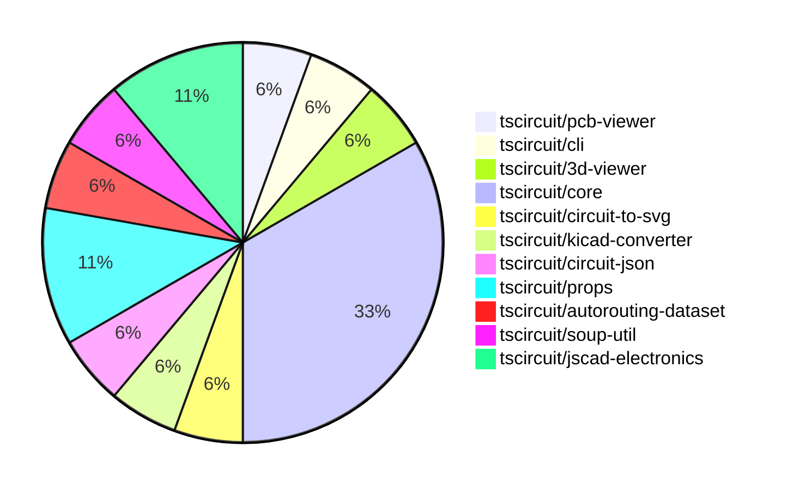

# Contribution Overview 2024-09-21

## PRs by Repository

## Contributor Overview

| Contributor | 🐳 Major | 🐙 Minor | 🐌 Tiny |
|-------------|-------|-------|-------|
| seveibar | 9 | 6 | 0 |
| ShiboSoftwareDev | 1 | 0 | 0 |
| abhijitxy | 2 | 0 | 0 |

## Changes by Repository

### [tscircuit/pcb-viewer](https://github.com/tscircuit/pcb-viewer)

| PR # | Impact | Contributor | Description |
|------|--------|-------------|-------------|
| [#62](https://github.com/tscircuit/pcb-viewer/pull/62) | 🐳 Major | seveibar | Refactoring to deprecate builder and @tscircuit/soup, add hole test, and add keyboard test. |

### [tscircuit/cli](https://github.com/tscircuit/cli)

| PR # | Impact | Contributor | Description |
|------|--------|-------------|-------------|
| [#193](https://github.com/tscircuit/cli/pull/193) | 🐳 Major | seveibar | Remove the dependency on @tscircuit/builder and use the functionality from the @tscircuit/core package instead. |

### [tscircuit/3d-viewer](https://github.com/tscircuit/3d-viewer)

| PR # | Impact | Contributor | Description |
|------|--------|-------------|-------------|
| [#21](https://github.com/tscircuit/3d-viewer/pull/21) | 🐳 Major | seveibar | Fix board width and height being swapped, remove @tscircuit/builder |

### [tscircuit/core](https://github.com/tscircuit/core)

| PR # | Impact | Contributor | Description |
|------|--------|-------------|-------------|
| [#105](https://github.com/tscircuit/core/pull/105) | 🐳 Major | seveibar | Offset the 3D model of components based on the board thickness. |
| [#104](https://github.com/tscircuit/core/pull/104) | 🐳 Major | seveibar | Fix the issue where 3D models are always placed at (0,0) by using the PCB component's center coordinate. |
| [#103](https://github.com/tscircuit/core/pull/103) | 🐳 Major | seveibar | Introduce a new feature to render CAD models for PCB components. |
| [#99](https://github.com/tscircuit/core/pull/99) | 🐳 Major | seveibar | Add support for correct pin positions for schematic box |
| [#102](https://github.com/tscircuit/core/pull/102) | 🐙 Minor | seveibar | Update the dependency "@tscircuit/infgrid-ijump-astar" to version 0.0.21 and add the "circuit-json" and "performance-now" dependencies. |
| [#97](https://github.com/tscircuit/core/pull/97) | 🐙 Minor | seveibar | Exclude TypeScript (TS) source files from the bundle output and only include the compiled JavaScript (dist) files. |

### [tscircuit/circuit-to-svg](https://github.com/tscircuit/circuit-to-svg)

| PR # | Impact | Contributor | Description |
|------|--------|-------------|-------------|
| [#76](https://github.com/tscircuit/circuit-to-svg/pull/76) | 🐳 Major | seveibar | Reorganize the codebase to better separate stories, PCB, and schematic functions, and add a basic schematic snapshot test. |

### [tscircuit/kicad-converter](https://github.com/tscircuit/kicad-converter)

| PR # | Impact | Contributor | Description |
|------|--------|-------------|-------------|
| [#10](https://github.com/tscircuit/kicad-converter/pull/10) | 🐳 Major | seveibar | Add support for net IDs in generated KiCAD files |

### [tscircuit/circuit-json](https://github.com/tscircuit/circuit-json)

| PR # | Impact | Contributor | Description |
|------|--------|-------------|-------------|
| [#50](https://github.com/tscircuit/circuit-json/pull/50) | 🐙 Minor | seveibar | Adds an optional `pcb_trace_id` field to the `PcbVia` type. |

### [tscircuit/props](https://github.com/tscircuit/props)

| PR # | Impact | Contributor | Description |
|------|--------|-------------|-------------|
| [#53](https://github.com/tscircuit/props/pull/53) | 🐙 Minor | seveibar | Add the `originalLayer` property to the `FootprintProps` interface and refactor the code. |
| [#52](https://github.com/tscircuit/props/pull/52) | 🐙 Minor | seveibar | Adds the export for the `cadModel` module in the library. |

### [tscircuit/autorouting-dataset](https://github.com/tscircuit/autorouting-dataset)

| PR # | Impact | Contributor | Description |
|------|--------|-------------|-------------|
| [#79](https://github.com/tscircuit/autorouting-dataset/pull/79) | 🐙 Minor | seveibar | Adds support for PCB holes with "circle" hole shape when deriving obstacles. |

### [tscircuit/soup-util](https://github.com/tscircuit/soup-util)

| PR # | Impact | Contributor | Description |
|------|--------|-------------|-------------|
| [#16](https://github.com/tscircuit/soup-util/pull/16) | 🐳 Major | ShiboSoftwareDev | Replaced `@tscircuit/soup` with `circuit-json`, refactored tests from `ava` to `bun:test`, and changed `AnySoupElement` to `AnyCircuitElement`. |

### [tscircuit/jscad-electronics](https://github.com/tscircuit/jscad-electronics)

| PR # | Impact | Contributor | Description |
|------|--------|-------------|-------------|
| [#40](https://github.com/tscircuit/jscad-electronics/pull/40) | 🐳 Major | abhijitxy | Implemented QFP80 component |
| [#38](https://github.com/tscircuit/jscad-electronics/pull/38) | 🐳 Major | abhijitxy | Implemented the BGA100 component |

## Changes by Contributor

### [seveibar](https://github.com/seveibar)

| PR # | Impact | Description |
|------|--------|-------------|
| [#62](https://github.com/tscircuit/pcb-viewer/pull/62) | 🐳 Major | Refactoring to deprecate builder and @tscircuit/soup, add hole test, and add keyboard test. |
| [#193](https://github.com/tscircuit/cli/pull/193) | 🐳 Major | Remove the dependency on @tscircuit/builder and use the functionality from the @tscircuit/core package instead. |
| [#21](https://github.com/tscircuit/3d-viewer/pull/21) | 🐳 Major | Fix board width and height being swapped, remove @tscircuit/builder |
| [#105](https://github.com/tscircuit/core/pull/105) | 🐳 Major | Offset the 3D model of components based on the board thickness. |
| [#104](https://github.com/tscircuit/core/pull/104) | 🐳 Major | Fix the issue where 3D models are always placed at (0,0) by using the PCB component's center coordinate. |
| [#103](https://github.com/tscircuit/core/pull/103) | 🐳 Major | Introduce a new feature to render CAD models for PCB components. |
| [#99](https://github.com/tscircuit/core/pull/99) | 🐳 Major | Add support for correct pin positions for schematic box |
| [#76](https://github.com/tscircuit/circuit-to-svg/pull/76) | 🐳 Major | Reorganize the codebase to better separate stories, PCB, and schematic functions, and add a basic schematic snapshot test. |
| [#10](https://github.com/tscircuit/kicad-converter/pull/10) | 🐳 Major | Add support for net IDs in generated KiCAD files |
| [#50](https://github.com/tscircuit/circuit-json/pull/50) | 🐙 Minor | Adds an optional `pcb_trace_id` field to the `PcbVia` type. |
| [#53](https://github.com/tscircuit/props/pull/53) | 🐙 Minor | Add the `originalLayer` property to the `FootprintProps` interface and refactor the code. |
| [#52](https://github.com/tscircuit/props/pull/52) | 🐙 Minor | Adds the export for the `cadModel` module in the library. |
| [#102](https://github.com/tscircuit/core/pull/102) | 🐙 Minor | Update the dependency "@tscircuit/infgrid-ijump-astar" to version 0.0.21 and add the "circuit-json" and "performance-now" dependencies. |
| [#97](https://github.com/tscircuit/core/pull/97) | 🐙 Minor | Exclude TypeScript (TS) source files from the bundle output and only include the compiled JavaScript (dist) files. |
| [#79](https://github.com/tscircuit/autorouting-dataset/pull/79) | 🐙 Minor | Adds support for PCB holes with "circle" hole shape when deriving obstacles. |

### [ShiboSoftwareDev](https://github.com/ShiboSoftwareDev)

| PR # | Impact | Description |
|------|--------|-------------|
| [#16](https://github.com/tscircuit/soup-util/pull/16) | 🐳 Major | Replaced `@tscircuit/soup` with `circuit-json`, refactored tests from `ava` to `bun:test`, and changed `AnySoupElement` to `AnyCircuitElement`. |

### [abhijitxy](https://github.com/abhijitxy)

| PR # | Impact | Description |
|------|--------|-------------|
| [#40](https://github.com/tscircuit/jscad-electronics/pull/40) | 🐳 Major | Implemented QFP80 component |
| [#38](https://github.com/tscircuit/jscad-electronics/pull/38) | 🐳 Major | Implemented the BGA100 component |

