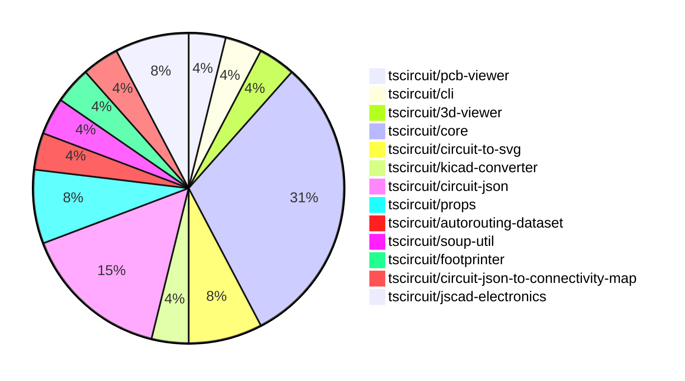

# Contribution Overview 2024-09-21

## PRs by Repository

## Contributor Overview

| Contributor | 🐳 Major | 🐙 Minor | 🐌 Tiny |
|-------------|-------|-------|-------|
| seveibar | 12 | 8 | 0 |
| ShiboSoftwareDev | 4 | 0 | 0 |
| abhijitxy | 2 | 0 | 0 |

## Changes by Repository

### [tscircuit/pcb-viewer](https://github.com/tscircuit/pcb-viewer)

| PR # | Impact | Contributor | Description |
|------|--------|-------------|-------------|
| [#62](https://github.com/tscircuit/pcb-viewer/pull/62) | 🐳 Major | seveibar | Refactoring to deprecate builder and @tscircuit/soup, add hole test, and add keyboard test |

### [tscircuit/cli](https://github.com/tscircuit/cli)

| PR # | Impact | Contributor | Description |
|------|--------|-------------|-------------|
| [#193](https://github.com/tscircuit/cli/pull/193) | 🐳 Major | seveibar | Remove the dependency on the `@tscircuit/builder` package, disabling the BOM export feature. |

### [tscircuit/3d-viewer](https://github.com/tscircuit/3d-viewer)

| PR # | Impact | Contributor | Description |
|------|--------|-------------|-------------|
| [#21](https://github.com/tscircuit/3d-viewer/pull/21) | 🐳 Major | seveibar | Fix board width and height being swapped, remove `@tscircuit/builder` dependency |

### [tscircuit/core](https://github.com/tscircuit/core)

| PR # | Impact | Contributor | Description |
|------|--------|-------------|-------------|
| [#111](https://github.com/tscircuit/core/pull/111) | 🐳 Major | seveibar | Adds support for rotation of 3D CAD components based on the PCB component rotation. |
| [#108](https://github.com/tscircuit/core/pull/108) | 🐳 Major | seveibar | Adds support for flipping components to the bottom layer in the Circuit class. |
| [#105](https://github.com/tscircuit/core/pull/105) | 🐳 Major | seveibar | Offset the 3D model based on the board thickness to ensure proper positioning of the model on the board. |
| [#104](https://github.com/tscircuit/core/pull/104) | 🐳 Major | seveibar | Fix the 3D model of a chip always being at (0,0) position |
| [#103](https://github.com/tscircuit/core/pull/103) | 🐳 Major | seveibar | Introduce initial implementation of CAD model rendering for PCB components. |
| [#102](https://github.com/tscircuit/core/pull/102) | 🐳 Major | seveibar | Fixes a bug where holes were not recognized as obstacles in the routing algorithm. |
| [#99](https://github.com/tscircuit/core/pull/99) | 🐳 Major | seveibar | Add support for correct pin positions for schematic box |
| [#97](https://github.com/tscircuit/core/pull/97) | 🐙 Minor | seveibar | Exclude pure TypeScript files from the bundle output |

### [tscircuit/circuit-to-svg](https://github.com/tscircuit/circuit-to-svg)

| PR # | Impact | Contributor | Description |
|------|--------|-------------|-------------|
| [#76](https://github.com/tscircuit/circuit-to-svg/pull/76) | 🐳 Major | seveibar | Reorganize the project structure to better separate stories, PCB, and schematic functions, and add a basic schematic snapshot test. |
| [#78](https://github.com/tscircuit/circuit-to-svg/pull/78) | 🐳 Major | ShiboSoftwareDev | The pull request moves the imports from "@tscircuit/soup" to "circuit-json". |

### [tscircuit/kicad-converter](https://github.com/tscircuit/kicad-converter)

| PR # | Impact | Contributor | Description |
|------|--------|-------------|-------------|
| [#10](https://github.com/tscircuit/kicad-converter/pull/10) | 🐳 Major | seveibar | Add support for net IDs in generated KiCAD files |

### [tscircuit/circuit-json](https://github.com/tscircuit/circuit-json)

| PR # | Impact | Contributor | Description |
|------|--------|-------------|-------------|
| [#51](https://github.com/tscircuit/circuit-json/pull/51) | 🐙 Minor | seveibar | Add support for `pcb_trace.route_order_index` property |
| [#53](https://github.com/tscircuit/circuit-json/pull/53) | 🐙 Minor | seveibar | Add `pcb_board.thickness` and `pcb_board.num_layers` fields to the `PCBBoard` type |
| [#52](https://github.com/tscircuit/circuit-json/pull/52) | 🐙 Minor | seveibar | Add a new `is_mirrored` property to the `pcb_silkscreen_text` schema. |
| [#50](https://github.com/tscircuit/circuit-json/pull/50) | 🐙 Minor | seveibar | Add an optional `pcb_trace_id` field to the `PcbViaDefinition` and `PcbVia` types. |

### [tscircuit/props](https://github.com/tscircuit/props)

| PR # | Impact | Contributor | Description |
|------|--------|-------------|-------------|
| [#53](https://github.com/tscircuit/props/pull/53) | 🐙 Minor | seveibar | Add the `originalLayer` property to the `FootprintProps` interface and refactor the code to use the `z` library for type validation. |
| [#52](https://github.com/tscircuit/props/pull/52) | 🐙 Minor | seveibar | Export `cadModel` prop from the library |

### [tscircuit/autorouting-dataset](https://github.com/tscircuit/autorouting-dataset)

| PR # | Impact | Contributor | Description |
|------|--------|-------------|-------------|
| [#79](https://github.com/tscircuit/autorouting-dataset/pull/79) | 🐙 Minor | seveibar | Add support for pcb_hole with hole_shape "circle" when deriving obstacles. |

### [tscircuit/soup-util](https://github.com/tscircuit/soup-util)

| PR # | Impact | Contributor | Description |
|------|--------|-------------|-------------|
| [#16](https://github.com/tscircuit/soup-util/pull/16) | 🐳 Major | ShiboSoftwareDev | Replaced @tscircuit/soup with circuit-json, refactored tests from ava to bun:test, and changed AnySoupElement to AnyCircuitElement |

### [tscircuit/footprinter](https://github.com/tscircuit/footprinter)

| PR # | Impact | Contributor | Description |
|------|--------|-------------|-------------|
| [#40](https://github.com/tscircuit/footprinter/pull/40) | 🐳 Major | ShiboSoftwareDev | Adds the `fn` field to the `bga_def` schema and returns the parsed parameters along with the circuit JSON elements. |

### [tscircuit/circuit-json-to-connectivity-map](https://github.com/tscircuit/circuit-json-to-connectivity-map)

| PR # | Impact | Contributor | Description |
|------|--------|-------------|-------------|
| [#6](https://github.com/tscircuit/circuit-json-to-connectivity-map/pull/6) | 🐳 Major | ShiboSoftwareDev | Updated to use the `circuit-json` package instead of `@tscircuit/soup`. |

### [tscircuit/jscad-electronics](https://github.com/tscircuit/jscad-electronics)

| PR # | Impact | Contributor | Description |
|------|--------|-------------|-------------|
| [#40](https://github.com/tscircuit/jscad-electronics/pull/40) | 🐳 Major | abhijitxy | Implemented QFP80 component |
| [#38](https://github.com/tscircuit/jscad-electronics/pull/38) | 🐳 Major | abhijitxy | Implemented the BGA100 component with an example in the codebase. |

## Changes by Contributor

### [seveibar](https://github.com/seveibar)

| PR # | Impact | Description |
|------|--------|-------------|
| [#62](https://github.com/tscircuit/pcb-viewer/pull/62) | 🐳 Major | Refactoring to deprecate builder and @tscircuit/soup, add hole test, and add keyboard test |
| [#193](https://github.com/tscircuit/cli/pull/193) | 🐳 Major | Remove the dependency on the `@tscircuit/builder` package, disabling the BOM export feature. |
| [#21](https://github.com/tscircuit/3d-viewer/pull/21) | 🐳 Major | Fix board width and height being swapped, remove `@tscircuit/builder` dependency |
| [#111](https://github.com/tscircuit/core/pull/111) | 🐳 Major | Adds support for rotation of 3D CAD components based on the PCB component rotation. |
| [#108](https://github.com/tscircuit/core/pull/108) | 🐳 Major | Adds support for flipping components to the bottom layer in the Circuit class. |
| [#105](https://github.com/tscircuit/core/pull/105) | 🐳 Major | Offset the 3D model based on the board thickness to ensure proper positioning of the model on the board. |
| [#104](https://github.com/tscircuit/core/pull/104) | 🐳 Major | Fix the 3D model of a chip always being at (0,0) position |
| [#103](https://github.com/tscircuit/core/pull/103) | 🐳 Major | Introduce initial implementation of CAD model rendering for PCB components. |
| [#102](https://github.com/tscircuit/core/pull/102) | 🐳 Major | Fixes a bug where holes were not recognized as obstacles in the routing algorithm. |
| [#99](https://github.com/tscircuit/core/pull/99) | 🐳 Major | Add support for correct pin positions for schematic box |
| [#76](https://github.com/tscircuit/circuit-to-svg/pull/76) | 🐳 Major | Reorganize the project structure to better separate stories, PCB, and schematic functions, and add a basic schematic snapshot test. |
| [#10](https://github.com/tscircuit/kicad-converter/pull/10) | 🐳 Major | Add support for net IDs in generated KiCAD files |
| [#51](https://github.com/tscircuit/circuit-json/pull/51) | 🐙 Minor | Add support for `pcb_trace.route_order_index` property |
| [#53](https://github.com/tscircuit/circuit-json/pull/53) | 🐙 Minor | Add `pcb_board.thickness` and `pcb_board.num_layers` fields to the `PCBBoard` type |
| [#52](https://github.com/tscircuit/circuit-json/pull/52) | 🐙 Minor | Add a new `is_mirrored` property to the `pcb_silkscreen_text` schema. |
| [#50](https://github.com/tscircuit/circuit-json/pull/50) | 🐙 Minor | Add an optional `pcb_trace_id` field to the `PcbViaDefinition` and `PcbVia` types. |
| [#53](https://github.com/tscircuit/props/pull/53) | 🐙 Minor | Add the `originalLayer` property to the `FootprintProps` interface and refactor the code to use the `z` library for type validation. |
| [#52](https://github.com/tscircuit/props/pull/52) | 🐙 Minor | Export `cadModel` prop from the library |
| [#97](https://github.com/tscircuit/core/pull/97) | 🐙 Minor | Exclude pure TypeScript files from the bundle output |
| [#79](https://github.com/tscircuit/autorouting-dataset/pull/79) | 🐙 Minor | Add support for pcb_hole with hole_shape "circle" when deriving obstacles. |

### [ShiboSoftwareDev](https://github.com/ShiboSoftwareDev)

| PR # | Impact | Description |
|------|--------|-------------|
| [#16](https://github.com/tscircuit/soup-util/pull/16) | 🐳 Major | Replaced @tscircuit/soup with circuit-json, refactored tests from ava to bun:test, and changed AnySoupElement to AnyCircuitElement |
| [#40](https://github.com/tscircuit/footprinter/pull/40) | 🐳 Major | Adds the `fn` field to the `bga_def` schema and returns the parsed parameters along with the circuit JSON elements. |
| [#78](https://github.com/tscircuit/circuit-to-svg/pull/78) | 🐳 Major | The pull request moves the imports from "@tscircuit/soup" to "circuit-json". |
| [#6](https://github.com/tscircuit/circuit-json-to-connectivity-map/pull/6) | 🐳 Major | Updated to use the `circuit-json` package instead of `@tscircuit/soup`. |

### [abhijitxy](https://github.com/abhijitxy)

| PR # | Impact | Description |
|------|--------|-------------|
| [#40](https://github.com/tscircuit/jscad-electronics/pull/40) | 🐳 Major | Implemented QFP80 component |
| [#38](https://github.com/tscircuit/jscad-electronics/pull/38) | 🐳 Major | Implemented the BGA100 component with an example in the codebase. |

