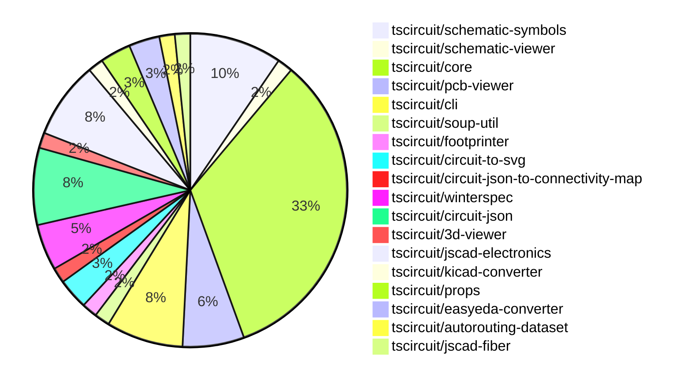

# Contribution Overview 2024-09-21

## PRs by Repository

## Contributor Overview

| Contributor | 🐳 Major | 🐙 Minor | 🐌 Tiny |
|-------------|-------|-------|-------|
| imrishabh18 | 1 | 6 | 1 |
| anas-sarkez | 1 | 1 | 0 |
| ShiboSoftwareDev | 7 | 2 | 0 |
| seveibar | 20 | 18 | 0 |
| andrii-balitskyi | 1 | 0 | 0 |
| abhijitxy | 2 | 1 | 0 |
| Abse2001 | 1 | 0 | 0 |

## Changes by Repository

### [tscircuit/schematic-symbols](https://github.com/tscircuit/schematic-symbols)

| PR # | Impact | Contributor | Description |
|------|--------|-------------|-------------|
| [#14](https://github.com/tscircuit/schematic-symbols/pull/14) | 🐳 Major | imrishabh18 | Capacitor symbol added to the project |
| [#21](https://github.com/tscircuit/schematic-symbols/pull/21) | 🐳 Major | Abse2001 | Added new push button symbols for normally open momentary switches in horizontal and vertical orientations. |
| [#20](https://github.com/tscircuit/schematic-symbols/pull/20) | 🐙 Minor | imrishabh18 | Fix path issues for Windows by importing `path/posix` instead of `path`. |
| [#19](https://github.com/tscircuit/schematic-symbols/pull/19) | 🐙 Minor | imrishabh18 | Refactor the project by moving the `capacitor_polarized.json` and `diode_bipolar_zener.json` files to the `/dev/null` directory. |
| [#17](https://github.com/tscircuit/schematic-symbols/pull/17) | 🐙 Minor | imrishabh18 | Adds reference and value text to the capacitor symbol. |
| [#15](https://github.com/tscircuit/schematic-symbols/pull/15) | 🐌 Tiny | imrishabh18 | Fix type checking in the `normalize-svg.test.ts` file. |

### [tscircuit/schematic-viewer](https://github.com/tscircuit/schematic-viewer)

| PR # | Impact | Contributor | Description |
|------|--------|-------------|-------------|
| [#62](https://github.com/tscircuit/schematic-viewer/pull/62) | 🐙 Minor | imrishabh18 | Update dependencies in the project |

### [tscircuit/core](https://github.com/tscircuit/core)

| PR # | Impact | Contributor | Description |
|------|--------|-------------|-------------|
| [#123](https://github.com/tscircuit/core/pull/123) | 🐳 Major | seveibar | Refactor the component names by moving the componentName property to the config object. |
| [#121](https://github.com/tscircuit/core/pull/121) | 🐳 Major | seveibar | Fix the rendering of CAD components at the wrong position in 3D |
| [#113](https://github.com/tscircuit/core/pull/113) | 🐳 Major | seveibar | Add support for `cadModel.rotationOffset` to allow for custom rotation of the CAD model. |
| [#112](https://github.com/tscircuit/core/pull/112) | 🐳 Major | seveibar | Fixes a bug where the footprint was being flipped to the bottom layer incorrectly when the component had constraints. |
| [#111](https://github.com/tscircuit/core/pull/111) | 🐳 Major | seveibar | Adds rotation support for 3D CAD components in the PCB circuit |
| [#108](https://github.com/tscircuit/core/pull/108) | 🐳 Major | seveibar | Introduce support for flipping components to the bottom layer |
| [#105](https://github.com/tscircuit/core/pull/105) | 🐳 Major | seveibar | Offsets the 3D model of the component based on the board thickness |
| [#103](https://github.com/tscircuit/core/pull/103) | 🐳 Major | seveibar | Add initial implementation of CAD model rendering for components |
| [#99](https://github.com/tscircuit/core/pull/99) | 🐳 Major | seveibar | Introduce changes to support correct pin positions for schematic boxes. |
| [#127](https://github.com/tscircuit/core/pull/127) | 🐙 Minor | imrishabh18 | Removed the `variant` parameter from the `getSchematicSymbol` function and simplified the logic to use the `config.schematicSymbolName` directly. |
| [#125](https://github.com/tscircuit/core/pull/125) | 🟣 | imrishabh18 | Updates the project's lockfile |
| [#110](https://github.com/tscircuit/core/pull/110) | 🐳 Major | ShiboSoftwareDev | Updated to use circuit-json and added pcb_trace_id to via. |
| [#119](https://github.com/tscircuit/core/pull/119) | 🐙 Minor | imrishabh18 | Fix the schematic symbol for capacitor and resistor components. |
| [#122](https://github.com/tscircuit/core/pull/122) | 🐙 Minor | seveibar | Manually assign a componentName property to each component in the codebase. |
| [#120](https://github.com/tscircuit/core/pull/120) | 🐙 Minor | seveibar | Update circuit-json dependency to version 0.0.82 and remove convert-units dependency. |
| [#117](https://github.com/tscircuit/core/pull/117) | 🐙 Minor | seveibar | Use the last route point for the end_pcb_port_id instead of the first one. |
| [#116](https://github.com/tscircuit/core/pull/116) | 🐙 Minor | seveibar | Fixes the start and end `pcb_port_id` for traces with route type "wire" when a `pcbPortA` or `pcbPortB` is provided. |
| [#114](https://github.com/tscircuit/core/pull/114) | 🐙 Minor | seveibar | Allow chips to not have SMT pads/any ports defined |
| [#104](https://github.com/tscircuit/core/pull/104) | 🐙 Minor | seveibar | Fix the position of the 3D model by using the `pcbX` and `pcbY` properties to set the center of the 3D model. |
| [#102](https://github.com/tscircuit/core/pull/102) | 🐙 Minor | seveibar | Update the dependency "@tscircuit/infgrid-ijump-astar" to version 0.0.21 and add the "circuit-json" and "performance-now" dependencies. |
| [#97](https://github.com/tscircuit/core/pull/97) | 🐙 Minor | seveibar | Exclude pure TypeScript files from the bundle output |

### [tscircuit/pcb-viewer](https://github.com/tscircuit/pcb-viewer)

| PR # | Impact | Contributor | Description |
|------|--------|-------------|-------------|
| [#61](https://github.com/tscircuit/pcb-viewer/pull/61) | 🐳 Major | anas-sarkez | Added hotkeys for all layers |
| [#63](https://github.com/tscircuit/pcb-viewer/pull/63) | 🐳 Major | ShiboSoftwareDev | The pull request introduces the ability to highlight PCB vias as part of a connectivity map. |
| [#62](https://github.com/tscircuit/pcb-viewer/pull/62) | 🐳 Major | seveibar | Refactor the codebase to deprecate the `builder` and `@tscircuit/soup` dependencies, add a new test for "hole" functionality, and add a new test for keyboard functionality. |
| [#65](https://github.com/tscircuit/pcb-viewer/pull/65) | 🐙 Minor | anas-sarkez | Replace the deprecated `AnySoupElement` and `PCBSMTPad` imports with the new `AnyCircuitElement` and `PcbSmtPad` imports. |

### [tscircuit/cli](https://github.com/tscircuit/cli)

| PR # | Impact | Contributor | Description |
|------|--------|-------------|-------------|
| [#212](https://github.com/tscircuit/cli/pull/212) | 🐳 Major | ShiboSoftwareDev | Fixed a filepath bug in various parts of the codebase. |
| [#203](https://github.com/tscircuit/cli/pull/203) | 🐳 Major | seveibar | Update the macrokeypad example with the latest PCB viewer changes, including fixes for keyswitches and the Arduino Pro Micro breakout. |
| [#202](https://github.com/tscircuit/cli/pull/202) | 🐳 Major | seveibar | Update pcb viewer to fix hole issue, render full soup, and make keyboard mostly working |
| [#193](https://github.com/tscircuit/cli/pull/193) | 🐳 Major | seveibar | Remove dependency on `@tscircuit/builder` and migrate to `circuit-json-to-bom-csv` and `circuit-json-to-pnp-csv` libraries. |
| [#209](https://github.com/tscircuit/cli/pull/209) | 🐙 Minor | seveibar | Adds a GitHub Actions workflow to run tests on Windows. |

### [tscircuit/soup-util](https://github.com/tscircuit/soup-util)

| PR # | Impact | Contributor | Description |
|------|--------|-------------|-------------|
| [#16](https://github.com/tscircuit/soup-util/pull/16) | 🐳 Major | ShiboSoftwareDev | Replaced the dependency from `@tscircuit/soup` to `circuit-json` and refactored the tests from `ava` to `bun:test`. |

### [tscircuit/footprinter](https://github.com/tscircuit/footprinter)

| PR # | Impact | Contributor | Description |
|------|--------|-------------|-------------|
| [#40](https://github.com/tscircuit/footprinter/pull/40) | 🐳 Major | ShiboSoftwareDev | Return a string of used parameters in addition to the circuit JSON |

### [tscircuit/circuit-to-svg](https://github.com/tscircuit/circuit-to-svg)

| PR # | Impact | Contributor | Description |
|------|--------|-------------|-------------|
| [#78](https://github.com/tscircuit/circuit-to-svg/pull/78) | 🐳 Major | ShiboSoftwareDev | Moved the imports from `@tscircuit/soup` to `circuit-json` throughout the codebase. |
| [#76](https://github.com/tscircuit/circuit-to-svg/pull/76) | 🐳 Major | seveibar | Reorganize to better separate stories, pcb and schematic functions, and add basic schematic snapshot test. |

### [tscircuit/circuit-json-to-connectivity-map](https://github.com/tscircuit/circuit-json-to-connectivity-map)

| PR # | Impact | Contributor | Description |
|------|--------|-------------|-------------|
| [#6](https://github.com/tscircuit/circuit-json-to-connectivity-map/pull/6) | 🐳 Major | ShiboSoftwareDev | Updated the library to use the `circuit-json` package instead of `@tscircuit/soup`. |

### [tscircuit/winterspec](https://github.com/tscircuit/winterspec)

| PR # | Impact | Contributor | Description |
|------|--------|-------------|-------------|
| [#9](https://github.com/tscircuit/winterspec/pull/9) | 🐳 Major | seveibar | Fix a bug in the input validation middleware that caused issues when the `jsonBody` and `commonParams` were both required. |
| [#11](https://github.com/tscircuit/winterspec/pull/11) | 🐙 Minor | ShiboSoftwareDev | Fixed a bug in the bundle-routes command by using the correct path module. |
| [#10](https://github.com/tscircuit/winterspec/pull/10) | 🐙 Minor | ShiboSoftwareDev | Update the bundle route command to use `path/posix` to fix a Windows-specific bug with invalid routes. |

### [tscircuit/circuit-json](https://github.com/tscircuit/circuit-json)

| PR # | Impact | Contributor | Description |
|------|--------|-------------|-------------|
| [#54](https://github.com/tscircuit/circuit-json/pull/54) | 🐳 Major | seveibar | Remove the `convert-units` dependency |
| [#51](https://github.com/tscircuit/circuit-json/pull/51) | 🐙 Minor | seveibar | Add support for `pcb_trace.route_order_index` field. |
| [#53](https://github.com/tscircuit/circuit-json/pull/53) | 🐙 Minor | seveibar | Add `pcb_board.thickness` and `pcb_board.num_layers` properties to the PCB board definition. |
| [#52](https://github.com/tscircuit/circuit-json/pull/52) | 🐙 Minor | seveibar | Add `is_mirrored` field to the `pcb_silkscreen_text` schema. |
| [#50](https://github.com/tscircuit/circuit-json/pull/50) | 🐙 Minor | seveibar | Adds an optional `pcb_trace_id` field to the `PcbVia` type. |

### [tscircuit/3d-viewer](https://github.com/tscircuit/3d-viewer)

| PR # | Impact | Contributor | Description |
|------|--------|-------------|-------------|
| [#21](https://github.com/tscircuit/3d-viewer/pull/21) | 🐳 Major | seveibar | Fix the issue of board width and height being swapped, and remove the `@tscircuit/builder` dependency. |

### [tscircuit/jscad-electronics](https://github.com/tscircuit/jscad-electronics)

| PR # | Impact | Contributor | Description |
|------|--------|-------------|-------------|
| [#44](https://github.com/tscircuit/jscad-electronics/pull/44) | 🐳 Major | seveibar | Fixes the QFN footprint to be positioned properly and improves the rendering of footprint pads. |
| [#34](https://github.com/tscircuit/jscad-electronics/pull/34) | 🐳 Major | seveibar | Introduce a new component `<Footprinter3d />` that takes a `footprint` string and outputs a 3D model for the corresponding footprint. |
| [#40](https://github.com/tscircuit/jscad-electronics/pull/40) | 🐳 Major | abhijitxy | Implemented QFP80 component |
| [#38](https://github.com/tscircuit/jscad-electronics/pull/38) | 🐳 Major | abhijitxy | Implemented the BGA100 component and example. |
| [#43](https://github.com/tscircuit/jscad-electronics/pull/43) | 🐙 Minor | seveibar | Fixes path issues and makes minor formatting changes in the examples for the Footprinter3d library. |

### [tscircuit/kicad-converter](https://github.com/tscircuit/kicad-converter)

| PR # | Impact | Contributor | Description |
|------|--------|-------------|-------------|
| [#10](https://github.com/tscircuit/kicad-converter/pull/10) | 🐳 Major | seveibar | Add support for net IDs in the generated KiCAD files. |

### [tscircuit/props](https://github.com/tscircuit/props)

| PR # | Impact | Contributor | Description |
|------|--------|-------------|-------------|
| [#53](https://github.com/tscircuit/props/pull/53) | 🐙 Minor | seveibar | Add an `originalLayer` property to the `FootprintProps` interface, and perform a minor refactor. |
| [#52](https://github.com/tscircuit/props/pull/52) | 🐙 Minor | seveibar | Adds export for `cadModel` from the `lib/common/cadModel` module. |

### [tscircuit/easyeda-converter](https://github.com/tscircuit/easyeda-converter)

| PR # | Impact | Contributor | Description |
|------|--------|-------------|-------------|
| [#40](https://github.com/tscircuit/easyeda-converter/pull/40) | 🐳 Major | andrii-balitskyi | Fix parsing `ARC` package detail shape |
| [#41](https://github.com/tscircuit/easyeda-converter/pull/41) | 🐙 Minor | seveibar | Improve the type names used in the codebase, making the types more descriptive. |

### [tscircuit/autorouting-dataset](https://github.com/tscircuit/autorouting-dataset)

| PR # | Impact | Contributor | Description |
|------|--------|-------------|-------------|
| [#79](https://github.com/tscircuit/autorouting-dataset/pull/79) | 🐙 Minor | seveibar | Adds support for "circle" hole shape in deriving obstacles from circuit JSON. |

### [tscircuit/jscad-fiber](https://github.com/tscircuit/jscad-fiber)

| PR # | Impact | Contributor | Description |
|------|--------|-------------|-------------|
| [#75](https://github.com/tscircuit/jscad-fiber/pull/75) | 🐙 Minor | abhijitxy | Add a showGrid prop to the JsCadFixture component to enable/disable the display of a grid in the 3D scene. |

## Changes by Contributor

### [imrishabh18](https://github.com/imrishabh18)

| PR # | Impact | Description |
|------|--------|-------------|
| [#14](https://github.com/tscircuit/schematic-symbols/pull/14) | 🐳 Major | Capacitor symbol added to the project |
| [#62](https://github.com/tscircuit/schematic-viewer/pull/62) | 🐙 Minor | Update dependencies in the project |
| [#127](https://github.com/tscircuit/core/pull/127) | 🐙 Minor | Removed the `variant` parameter from the `getSchematicSymbol` function and simplified the logic to use the `config.schematicSymbolName` directly. |
| [#125](https://github.com/tscircuit/core/pull/125) | 🟣 | Updates the project's lockfile |
| [#119](https://github.com/tscircuit/core/pull/119) | 🐙 Minor | Fix the schematic symbol for capacitor and resistor components. |
| [#20](https://github.com/tscircuit/schematic-symbols/pull/20) | 🐙 Minor | Fix path issues for Windows by importing `path/posix` instead of `path`. |
| [#19](https://github.com/tscircuit/schematic-symbols/pull/19) | 🐙 Minor | Refactor the project by moving the `capacitor_polarized.json` and `diode_bipolar_zener.json` files to the `/dev/null` directory. |
| [#17](https://github.com/tscircuit/schematic-symbols/pull/17) | 🐙 Minor | Adds reference and value text to the capacitor symbol. |
| [#15](https://github.com/tscircuit/schematic-symbols/pull/15) | 🐌 Tiny | Fix type checking in the `normalize-svg.test.ts` file. |

### [anas-sarkez](https://github.com/anas-sarkez)

| PR # | Impact | Description |
|------|--------|-------------|
| [#61](https://github.com/tscircuit/pcb-viewer/pull/61) | 🐳 Major | Added hotkeys for all layers |
| [#65](https://github.com/tscircuit/pcb-viewer/pull/65) | 🐙 Minor | Replace the deprecated `AnySoupElement` and `PCBSMTPad` imports with the new `AnyCircuitElement` and `PcbSmtPad` imports. |

### [ShiboSoftwareDev](https://github.com/ShiboSoftwareDev)

| PR # | Impact | Description |
|------|--------|-------------|
| [#63](https://github.com/tscircuit/pcb-viewer/pull/63) | 🐳 Major | The pull request introduces the ability to highlight PCB vias as part of a connectivity map. |
| [#212](https://github.com/tscircuit/cli/pull/212) | 🐳 Major | Fixed a filepath bug in various parts of the codebase. |
| [#16](https://github.com/tscircuit/soup-util/pull/16) | 🐳 Major | Replaced the dependency from `@tscircuit/soup` to `circuit-json` and refactored the tests from `ava` to `bun:test`. |
| [#40](https://github.com/tscircuit/footprinter/pull/40) | 🐳 Major | Return a string of used parameters in addition to the circuit JSON |
| [#110](https://github.com/tscircuit/core/pull/110) | 🐳 Major | Updated to use circuit-json and added pcb_trace_id to via. |
| [#78](https://github.com/tscircuit/circuit-to-svg/pull/78) | 🐳 Major | Moved the imports from `@tscircuit/soup` to `circuit-json` throughout the codebase. |
| [#6](https://github.com/tscircuit/circuit-json-to-connectivity-map/pull/6) | 🐳 Major | Updated the library to use the `circuit-json` package instead of `@tscircuit/soup`. |
| [#11](https://github.com/tscircuit/winterspec/pull/11) | 🐙 Minor | Fixed a bug in the bundle-routes command by using the correct path module. |
| [#10](https://github.com/tscircuit/winterspec/pull/10) | 🐙 Minor | Update the bundle route command to use `path/posix` to fix a Windows-specific bug with invalid routes. |

### [seveibar](https://github.com/seveibar)

| PR # | Impact | Description |
|------|--------|-------------|
| [#62](https://github.com/tscircuit/pcb-viewer/pull/62) | 🐳 Major | Refactor the codebase to deprecate the `builder` and `@tscircuit/soup` dependencies, add a new test for "hole" functionality, and add a new test for keyboard functionality. |
| [#203](https://github.com/tscircuit/cli/pull/203) | 🐳 Major | Update the macrokeypad example with the latest PCB viewer changes, including fixes for keyswitches and the Arduino Pro Micro breakout. |
| [#202](https://github.com/tscircuit/cli/pull/202) | 🐳 Major | Update pcb viewer to fix hole issue, render full soup, and make keyboard mostly working |
| [#193](https://github.com/tscircuit/cli/pull/193) | 🐳 Major | Remove dependency on `@tscircuit/builder` and migrate to `circuit-json-to-bom-csv` and `circuit-json-to-pnp-csv` libraries. |
| [#54](https://github.com/tscircuit/circuit-json/pull/54) | 🐳 Major | Remove the `convert-units` dependency |
| [#21](https://github.com/tscircuit/3d-viewer/pull/21) | 🐳 Major | Fix the issue of board width and height being swapped, and remove the `@tscircuit/builder` dependency. |
| [#9](https://github.com/tscircuit/winterspec/pull/9) | 🐳 Major | Fix a bug in the input validation middleware that caused issues when the `jsonBody` and `commonParams` were both required. |
| [#123](https://github.com/tscircuit/core/pull/123) | 🐳 Major | Refactor the component names by moving the componentName property to the config object. |
| [#121](https://github.com/tscircuit/core/pull/121) | 🐳 Major | Fix the rendering of CAD components at the wrong position in 3D |
| [#113](https://github.com/tscircuit/core/pull/113) | 🐳 Major | Add support for `cadModel.rotationOffset` to allow for custom rotation of the CAD model. |
| [#112](https://github.com/tscircuit/core/pull/112) | 🐳 Major | Fixes a bug where the footprint was being flipped to the bottom layer incorrectly when the component had constraints. |
| [#111](https://github.com/tscircuit/core/pull/111) | 🐳 Major | Adds rotation support for 3D CAD components in the PCB circuit |
| [#108](https://github.com/tscircuit/core/pull/108) | 🐳 Major | Introduce support for flipping components to the bottom layer |
| [#105](https://github.com/tscircuit/core/pull/105) | 🐳 Major | Offsets the 3D model of the component based on the board thickness |
| [#103](https://github.com/tscircuit/core/pull/103) | 🐳 Major | Add initial implementation of CAD model rendering for components |
| [#99](https://github.com/tscircuit/core/pull/99) | 🐳 Major | Introduce changes to support correct pin positions for schematic boxes. |
| [#44](https://github.com/tscircuit/jscad-electronics/pull/44) | 🐳 Major | Fixes the QFN footprint to be positioned properly and improves the rendering of footprint pads. |
| [#34](https://github.com/tscircuit/jscad-electronics/pull/34) | 🐳 Major | Introduce a new component `<Footprinter3d />` that takes a `footprint` string and outputs a 3D model for the corresponding footprint. |
| [#76](https://github.com/tscircuit/circuit-to-svg/pull/76) | 🐳 Major | Reorganize to better separate stories, pcb and schematic functions, and add basic schematic snapshot test. |
| [#10](https://github.com/tscircuit/kicad-converter/pull/10) | 🐳 Major | Add support for net IDs in the generated KiCAD files. |
| [#209](https://github.com/tscircuit/cli/pull/209) | 🐙 Minor | Adds a GitHub Actions workflow to run tests on Windows. |
| [#51](https://github.com/tscircuit/circuit-json/pull/51) | 🐙 Minor | Add support for `pcb_trace.route_order_index` field. |
| [#53](https://github.com/tscircuit/circuit-json/pull/53) | 🐙 Minor | Add `pcb_board.thickness` and `pcb_board.num_layers` properties to the PCB board definition. |
| [#52](https://github.com/tscircuit/circuit-json/pull/52) | 🐙 Minor | Add `is_mirrored` field to the `pcb_silkscreen_text` schema. |
| [#50](https://github.com/tscircuit/circuit-json/pull/50) | 🐙 Minor | Adds an optional `pcb_trace_id` field to the `PcbVia` type. |
| [#53](https://github.com/tscircuit/props/pull/53) | 🐙 Minor | Add an `originalLayer` property to the `FootprintProps` interface, and perform a minor refactor. |
| [#52](https://github.com/tscircuit/props/pull/52) | 🐙 Minor | Adds export for `cadModel` from the `lib/common/cadModel` module. |
| [#41](https://github.com/tscircuit/easyeda-converter/pull/41) | 🐙 Minor | Improve the type names used in the codebase, making the types more descriptive. |
| [#122](https://github.com/tscircuit/core/pull/122) | 🐙 Minor | Manually assign a componentName property to each component in the codebase. |
| [#120](https://github.com/tscircuit/core/pull/120) | 🐙 Minor | Update circuit-json dependency to version 0.0.82 and remove convert-units dependency. |
| [#117](https://github.com/tscircuit/core/pull/117) | 🐙 Minor | Use the last route point for the end_pcb_port_id instead of the first one. |
| [#116](https://github.com/tscircuit/core/pull/116) | 🐙 Minor | Fixes the start and end `pcb_port_id` for traces with route type "wire" when a `pcbPortA` or `pcbPortB` is provided. |
| [#114](https://github.com/tscircuit/core/pull/114) | 🐙 Minor | Allow chips to not have SMT pads/any ports defined |
| [#104](https://github.com/tscircuit/core/pull/104) | 🐙 Minor | Fix the position of the 3D model by using the `pcbX` and `pcbY` properties to set the center of the 3D model. |
| [#102](https://github.com/tscircuit/core/pull/102) | 🐙 Minor | Update the dependency "@tscircuit/infgrid-ijump-astar" to version 0.0.21 and add the "circuit-json" and "performance-now" dependencies. |
| [#97](https://github.com/tscircuit/core/pull/97) | 🐙 Minor | Exclude pure TypeScript files from the bundle output |
| [#43](https://github.com/tscircuit/jscad-electronics/pull/43) | 🐙 Minor | Fixes path issues and makes minor formatting changes in the examples for the Footprinter3d library. |
| [#79](https://github.com/tscircuit/autorouting-dataset/pull/79) | 🐙 Minor | Adds support for "circle" hole shape in deriving obstacles from circuit JSON. |

### [andrii-balitskyi](https://github.com/andrii-balitskyi)

| PR # | Impact | Description |
|------|--------|-------------|
| [#40](https://github.com/tscircuit/easyeda-converter/pull/40) | 🐳 Major | Fix parsing `ARC` package detail shape |

### [abhijitxy](https://github.com/abhijitxy)

| PR # | Impact | Description |
|------|--------|-------------|
| [#40](https://github.com/tscircuit/jscad-electronics/pull/40) | 🐳 Major | Implemented QFP80 component |
| [#38](https://github.com/tscircuit/jscad-electronics/pull/38) | 🐳 Major | Implemented the BGA100 component and example. |
| [#75](https://github.com/tscircuit/jscad-fiber/pull/75) | 🐙 Minor | Add a showGrid prop to the JsCadFixture component to enable/disable the display of a grid in the 3D scene. |

### [Abse2001](https://github.com/Abse2001)

| PR # | Impact | Description |
|------|--------|-------------|
| [#21](https://github.com/tscircuit/schematic-symbols/pull/21) | 🐳 Major | Added new push button symbols for normally open momentary switches in horizontal and vertical orientations. |

