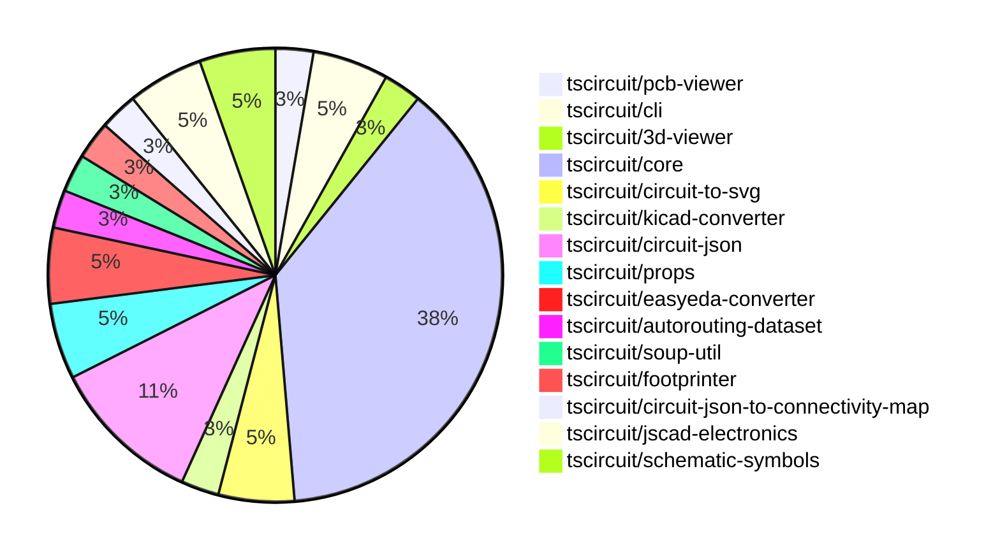

# Contribution Overview 2024-09-21

## PRs by Repository

## Contributor Overview

| Contributor | 🐳 Major | 🐙 Minor | 🐌 Tiny |
|-------------|-------|-------|-------|
| seveibar | 17 | 10 | 0 |
| ShiboSoftwareDev | 5 | 0 | 0 |
| andrii-balitskyi | 1 | 0 | 0 |
| abhijitxy | 2 | 0 | 0 |
| imrishabh18 | 1 | 1 | 0 |

## Changes by Repository

### [tscircuit/pcb-viewer](https://github.com/tscircuit/pcb-viewer)

| PR # | Impact | Contributor | Description |
|------|--------|-------------|-------------|
| [#62](https://github.com/tscircuit/pcb-viewer/pull/62) | 🐳 Major | seveibar | The pull request refactors the code to deprecate the builder and @tscircuit/soup, adds a hole test, and adds a keyboard test. |

### [tscircuit/cli](https://github.com/tscircuit/cli)

| PR # | Impact | Contributor | Description |
|------|--------|-------------|-------------|
| [#202](https://github.com/tscircuit/cli/pull/202) | 🐳 Major | seveibar | Update 3d viewer, core and pcb viewer. Add switches to keyboard example. |
| [#193](https://github.com/tscircuit/cli/pull/193) | 🐳 Major | seveibar | Remove the dependency on the `@tscircuit/builder` package. |

### [tscircuit/3d-viewer](https://github.com/tscircuit/3d-viewer)

| PR # | Impact | Contributor | Description |
|------|--------|-------------|-------------|
| [#21](https://github.com/tscircuit/3d-viewer/pull/21) | 🐳 Major | seveibar | Fix board width and height being swapped, remove `@tscircuit/builder` |

### [tscircuit/core](https://github.com/tscircuit/core)

| PR # | Impact | Contributor | Description |
|------|--------|-------------|-------------|
| [#116](https://github.com/tscircuit/core/pull/116) | 🐳 Major | seveibar | Update the `Trace` component to set the `start_pcb_port_id` and `end_pcb_port_id` properties of the `route` object when the `pcbPortA` and `pcbPortB` parameters are provided and the `route_type` is "wire". Also, add a snapshot test for the trace hints with vias. |
| [#114](https://github.com/tscircuit/core/pull/114) | 🐳 Major | seveibar | Allow chips to not have SMT pads or any ports defined |
| [#113](https://github.com/tscircuit/core/pull/113) | 🐳 Major | seveibar | Add support for `cadModel.rotationOffset` in the `NormalComponent` class |
| [#112](https://github.com/tscircuit/core/pull/112) | 🐳 Major | seveibar | Fix a bug where the footprint was being flipped incorrectly when placed on the bottom layer of the PCB. |
| [#111](https://github.com/tscircuit/core/pull/111) | 🐳 Major | seveibar | Add rotation support for 3D CAD components |
| [#108](https://github.com/tscircuit/core/pull/108) | 🐳 Major | seveibar | Introduce support for flipping components to the bottom layer |
| [#105](https://github.com/tscircuit/core/pull/105) | 🐳 Major | seveibar | Offset the 3D model based on board thickness |
| [#104](https://github.com/tscircuit/core/pull/104) | 🐳 Major | seveibar | Add a method to get the PCB circuit JSON bounds based on the PCB component ID |
| [#103](https://github.com/tscircuit/core/pull/103) | 🐳 Major | seveibar | Introduce initial implementation of CAD model rendering for PCB components |
| [#102](https://github.com/tscircuit/core/pull/102) | 🐳 Major | seveibar | Fix routing through holes (holes not recognized as obstacles) |
| [#99](https://github.com/tscircuit/core/pull/99) | 🐳 Major | seveibar | Modify the position of ports to correctly match the schematic box dimensions. |
| [#110](https://github.com/tscircuit/core/pull/110) | 🐳 Major | ShiboSoftwareDev | Updated to circuit-json and added pcb_trace_id to via |
| [#117](https://github.com/tscircuit/core/pull/117) | 🐙 Minor | seveibar | Use the last route point for the `end_pcb_port_id` instead of the first route point. |
| [#97](https://github.com/tscircuit/core/pull/97) | 🐙 Minor | seveibar | Exclude pure TypeScript files from the bundle output |

### [tscircuit/circuit-to-svg](https://github.com/tscircuit/circuit-to-svg)

| PR # | Impact | Contributor | Description |
|------|--------|-------------|-------------|
| [#76](https://github.com/tscircuit/circuit-to-svg/pull/76) | 🐳 Major | seveibar | Reorganize the project structure to better separate stories, PCB, and schematic functions, and add a basic schematic snapshot test. |
| [#78](https://github.com/tscircuit/circuit-to-svg/pull/78) | 🐳 Major | ShiboSoftwareDev | Moved imports from "@tscircuit/soup" to "circuit-json" |

### [tscircuit/kicad-converter](https://github.com/tscircuit/kicad-converter)

| PR # | Impact | Contributor | Description |
|------|--------|-------------|-------------|
| [#10](https://github.com/tscircuit/kicad-converter/pull/10) | 🐳 Major | seveibar | Adds support for net IDs in the generated KiCad PCB files. |

### [tscircuit/circuit-json](https://github.com/tscircuit/circuit-json)

| PR # | Impact | Contributor | Description |
|------|--------|-------------|-------------|
| [#51](https://github.com/tscircuit/circuit-json/pull/51) | 🐙 Minor | seveibar | Add support for `pcb_trace.route_order_index` field to track the order in which traces were routed. |
| [#53](https://github.com/tscircuit/circuit-json/pull/53) | 🐙 Minor | seveibar | Add `pcb_board.thickness` and `pcb_board.num_layers` properties to the `PcbBoard` type. |
| [#52](https://github.com/tscircuit/circuit-json/pull/52) | 🐙 Minor | seveibar | Add the `is_mirrored` property to the `pcb_silkscreen_text` type. |
| [#50](https://github.com/tscircuit/circuit-json/pull/50) | 🐙 Minor | seveibar | Added an optional `pcb_trace_id` field to the `PcbVia` type to store the ID of the associated PCB trace. |

### [tscircuit/props](https://github.com/tscircuit/props)

| PR # | Impact | Contributor | Description |
|------|--------|-------------|-------------|
| [#53](https://github.com/tscircuit/props/pull/53) | 🐙 Minor | seveibar | Add the `originalLayer` property to the `FootprintProps` interface and export it from the `lib/components/footprint.ts` file. |
| [#52](https://github.com/tscircuit/props/pull/52) | 🐙 Minor | seveibar | Export `cadModel` prop from the library |

### [tscircuit/easyeda-converter](https://github.com/tscircuit/easyeda-converter)

| PR # | Impact | Contributor | Description |
|------|--------|-------------|-------------|
| [#40](https://github.com/tscircuit/easyeda-converter/pull/40) | 🐳 Major | andrii-balitskyi | Fix parsing `ARC` package detail shape |
| [#41](https://github.com/tscircuit/easyeda-converter/pull/41) | 🐙 Minor | seveibar | Improve typing by renaming EasyEdaJson to BetterEasyEdaJson and adding a new RawEasyEdaJson type. |

### [tscircuit/autorouting-dataset](https://github.com/tscircuit/autorouting-dataset)

| PR # | Impact | Contributor | Description |
|------|--------|-------------|-------------|
| [#79](https://github.com/tscircuit/autorouting-dataset/pull/79) | 🐙 Minor | seveibar | Add support for `pcb_hole` with `hole_shape` of "circle" when deriving obstacles. |

### [tscircuit/soup-util](https://github.com/tscircuit/soup-util)

| PR # | Impact | Contributor | Description |
|------|--------|-------------|-------------|
| [#16](https://github.com/tscircuit/soup-util/pull/16) | 🐳 Major | ShiboSoftwareDev | Replaced @tscircuit/soup with circuit-json, refactored tests from ava to bun:test, and renamed AnySoupElement to AnyCircuitElement. |

### [tscircuit/footprinter](https://github.com/tscircuit/footprinter)

| PR # | Impact | Contributor | Description |
|------|--------|-------------|-------------|
| [#40](https://github.com/tscircuit/footprinter/pull/40) | 🐳 Major | ShiboSoftwareDev | The pull request updates the `.json()` function to return an object with the `circuitJson` and `parameters` properties, instead of just returning the `circuitJson` array. |

### [tscircuit/circuit-json-to-connectivity-map](https://github.com/tscircuit/circuit-json-to-connectivity-map)

| PR # | Impact | Contributor | Description |
|------|--------|-------------|-------------|
| [#6](https://github.com/tscircuit/circuit-json-to-connectivity-map/pull/6) | 🐳 Major | ShiboSoftwareDev | Updated the code to use the `circuit-json` library instead of the `@tscircuit/soup` library. |

### [tscircuit/jscad-electronics](https://github.com/tscircuit/jscad-electronics)

| PR # | Impact | Contributor | Description |
|------|--------|-------------|-------------|
| [#40](https://github.com/tscircuit/jscad-electronics/pull/40) | 🐳 Major | abhijitxy | Implemented QFP80 component |
| [#38](https://github.com/tscircuit/jscad-electronics/pull/38) | 🐳 Major | abhijitxy | Implemented the BGA100 component in the project. |

### [tscircuit/schematic-symbols](https://github.com/tscircuit/schematic-symbols)

| PR # | Impact | Contributor | Description |
|------|--------|-------------|-------------|
| [#14](https://github.com/tscircuit/schematic-symbols/pull/14) | 🐳 Major | imrishabh18 | Capacitor added and generator fixed |
| [#15](https://github.com/tscircuit/schematic-symbols/pull/15) | 🐙 Minor | imrishabh18 | Fix types in normalize-svg.test.ts file |

## Changes by Contributor

### [seveibar](https://github.com/seveibar)

| PR # | Impact | Description |
|------|--------|-------------|
| [#62](https://github.com/tscircuit/pcb-viewer/pull/62) | 🐳 Major | The pull request refactors the code to deprecate the builder and @tscircuit/soup, adds a hole test, and adds a keyboard test. |
| [#202](https://github.com/tscircuit/cli/pull/202) | 🐳 Major | Update 3d viewer, core and pcb viewer. Add switches to keyboard example. |
| [#193](https://github.com/tscircuit/cli/pull/193) | 🐳 Major | Remove the dependency on the `@tscircuit/builder` package. |
| [#21](https://github.com/tscircuit/3d-viewer/pull/21) | 🐳 Major | Fix board width and height being swapped, remove `@tscircuit/builder` |
| [#116](https://github.com/tscircuit/core/pull/116) | 🐳 Major | Update the `Trace` component to set the `start_pcb_port_id` and `end_pcb_port_id` properties of the `route` object when the `pcbPortA` and `pcbPortB` parameters are provided and the `route_type` is "wire". Also, add a snapshot test for the trace hints with vias. |
| [#114](https://github.com/tscircuit/core/pull/114) | 🐳 Major | Allow chips to not have SMT pads or any ports defined |
| [#113](https://github.com/tscircuit/core/pull/113) | 🐳 Major | Add support for `cadModel.rotationOffset` in the `NormalComponent` class |
| [#112](https://github.com/tscircuit/core/pull/112) | 🐳 Major | Fix a bug where the footprint was being flipped incorrectly when placed on the bottom layer of the PCB. |
| [#111](https://github.com/tscircuit/core/pull/111) | 🐳 Major | Add rotation support for 3D CAD components |
| [#108](https://github.com/tscircuit/core/pull/108) | 🐳 Major | Introduce support for flipping components to the bottom layer |
| [#105](https://github.com/tscircuit/core/pull/105) | 🐳 Major | Offset the 3D model based on board thickness |
| [#104](https://github.com/tscircuit/core/pull/104) | 🐳 Major | Add a method to get the PCB circuit JSON bounds based on the PCB component ID |
| [#103](https://github.com/tscircuit/core/pull/103) | 🐳 Major | Introduce initial implementation of CAD model rendering for PCB components |
| [#102](https://github.com/tscircuit/core/pull/102) | 🐳 Major | Fix routing through holes (holes not recognized as obstacles) |
| [#99](https://github.com/tscircuit/core/pull/99) | 🐳 Major | Modify the position of ports to correctly match the schematic box dimensions. |
| [#76](https://github.com/tscircuit/circuit-to-svg/pull/76) | 🐳 Major | Reorganize the project structure to better separate stories, PCB, and schematic functions, and add a basic schematic snapshot test. |
| [#10](https://github.com/tscircuit/kicad-converter/pull/10) | 🐳 Major | Adds support for net IDs in the generated KiCad PCB files. |
| [#51](https://github.com/tscircuit/circuit-json/pull/51) | 🐙 Minor | Add support for `pcb_trace.route_order_index` field to track the order in which traces were routed. |
| [#53](https://github.com/tscircuit/circuit-json/pull/53) | 🐙 Minor | Add `pcb_board.thickness` and `pcb_board.num_layers` properties to the `PcbBoard` type. |
| [#52](https://github.com/tscircuit/circuit-json/pull/52) | 🐙 Minor | Add the `is_mirrored` property to the `pcb_silkscreen_text` type. |
| [#50](https://github.com/tscircuit/circuit-json/pull/50) | 🐙 Minor | Added an optional `pcb_trace_id` field to the `PcbVia` type to store the ID of the associated PCB trace. |
| [#53](https://github.com/tscircuit/props/pull/53) | 🐙 Minor | Add the `originalLayer` property to the `FootprintProps` interface and export it from the `lib/components/footprint.ts` file. |
| [#52](https://github.com/tscircuit/props/pull/52) | 🐙 Minor | Export `cadModel` prop from the library |
| [#41](https://github.com/tscircuit/easyeda-converter/pull/41) | 🐙 Minor | Improve typing by renaming EasyEdaJson to BetterEasyEdaJson and adding a new RawEasyEdaJson type. |
| [#117](https://github.com/tscircuit/core/pull/117) | 🐙 Minor | Use the last route point for the `end_pcb_port_id` instead of the first route point. |
| [#97](https://github.com/tscircuit/core/pull/97) | 🐙 Minor | Exclude pure TypeScript files from the bundle output |
| [#79](https://github.com/tscircuit/autorouting-dataset/pull/79) | 🐙 Minor | Add support for `pcb_hole` with `hole_shape` of "circle" when deriving obstacles. |

### [ShiboSoftwareDev](https://github.com/ShiboSoftwareDev)

| PR # | Impact | Description |
|------|--------|-------------|
| [#16](https://github.com/tscircuit/soup-util/pull/16) | 🐳 Major | Replaced @tscircuit/soup with circuit-json, refactored tests from ava to bun:test, and renamed AnySoupElement to AnyCircuitElement. |
| [#40](https://github.com/tscircuit/footprinter/pull/40) | 🐳 Major | The pull request updates the `.json()` function to return an object with the `circuitJson` and `parameters` properties, instead of just returning the `circuitJson` array. |
| [#110](https://github.com/tscircuit/core/pull/110) | 🐳 Major | Updated to circuit-json and added pcb_trace_id to via |
| [#78](https://github.com/tscircuit/circuit-to-svg/pull/78) | 🐳 Major | Moved imports from "@tscircuit/soup" to "circuit-json" |
| [#6](https://github.com/tscircuit/circuit-json-to-connectivity-map/pull/6) | 🐳 Major | Updated the code to use the `circuit-json` library instead of the `@tscircuit/soup` library. |

### [andrii-balitskyi](https://github.com/andrii-balitskyi)

| PR # | Impact | Description |
|------|--------|-------------|
| [#40](https://github.com/tscircuit/easyeda-converter/pull/40) | 🐳 Major | Fix parsing `ARC` package detail shape |

### [abhijitxy](https://github.com/abhijitxy)

| PR # | Impact | Description |
|------|--------|-------------|
| [#40](https://github.com/tscircuit/jscad-electronics/pull/40) | 🐳 Major | Implemented QFP80 component |
| [#38](https://github.com/tscircuit/jscad-electronics/pull/38) | 🐳 Major | Implemented the BGA100 component in the project. |

### [imrishabh18](https://github.com/imrishabh18)

| PR # | Impact | Description |
|------|--------|-------------|
| [#14](https://github.com/tscircuit/schematic-symbols/pull/14) | 🐳 Major | Capacitor added and generator fixed |
| [#15](https://github.com/tscircuit/schematic-symbols/pull/15) | 🐙 Minor | Fix types in normalize-svg.test.ts file |

