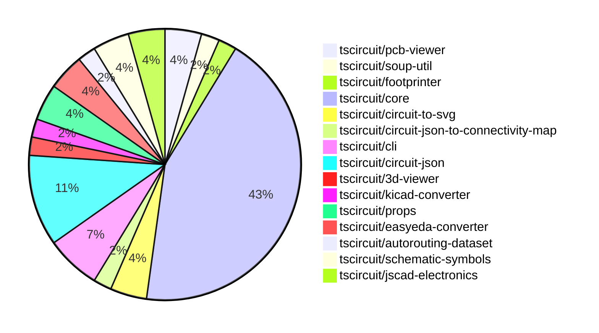

# Contribution Overview 2024-09-21

## PRs by Repository

## Contributor Overview

| Contributor | 🐳 Major | 🐙 Minor | 🐌 Tiny |
|-------------|-------|-------|-------|
| ShiboSoftwareDev | 6 | 0 | 0 |
| seveibar | 21 | 12 | 0 |
| andrii-balitskyi | 1 | 0 | 0 |
| imrishabh18 | 1 | 1 | 2 |
| abhijitxy | 2 | 0 | 0 |

## Changes by Repository

### [tscircuit/pcb-viewer](https://github.com/tscircuit/pcb-viewer)

| PR # | Impact | Contributor | Description |
|------|--------|-------------|-------------|
| [#63](https://github.com/tscircuit/pcb-viewer/pull/63) | 🐳 Major | ShiboSoftwareDev | The change allows PCB vias to be highlighted as part of a connectivity map. |
| [#62](https://github.com/tscircuit/pcb-viewer/pull/62) | 🐳 Major | seveibar | Refactor to deprecate builder and @tscircuit/soup, add hole test, and add keyboard test |

### [tscircuit/soup-util](https://github.com/tscircuit/soup-util)

| PR # | Impact | Contributor | Description |
|------|--------|-------------|-------------|
| [#16](https://github.com/tscircuit/soup-util/pull/16) | 🐳 Major | ShiboSoftwareDev | Replaced `@tscircuit/soup` with `circuit-json`, refactored tests from `ava` to `bun:test`, and updated `AnySoupElement` to `AnyCircuitElement`. |

### [tscircuit/footprinter](https://github.com/tscircuit/footprinter)

| PR # | Impact | Contributor | Description |
|------|--------|-------------|-------------|
| [#40](https://github.com/tscircuit/footprinter/pull/40) | 🐳 Major | ShiboSoftwareDev | The pull request changes the return type of the `bga()` function to return an object with `circuitJson` and `parameters` properties, instead of just returning the `AnySoupElement[]`. Similar changes are made to other component functions like `cap()`, `dfn()`, `dip()`, and `diode()`. |

### [tscircuit/core](https://github.com/tscircuit/core)

| PR # | Impact | Contributor | Description |
|------|--------|-------------|-------------|
| [#110](https://github.com/tscircuit/core/pull/110) | 🐳 Major | ShiboSoftwareDev | Updated the codebase to use circuit-json and added the pcb_trace_id property to the via component. |
| [#123](https://github.com/tscircuit/core/pull/123) | 🐳 Major | seveibar | Refactor component names to use a consistent naming convention. |
| [#121](https://github.com/tscircuit/core/pull/121) | 🐳 Major | seveibar | Fix the issue where CAD components are rendered at the wrong position in 3D. |
| [#116](https://github.com/tscircuit/core/pull/116) | 🐳 Major | seveibar | Fix the start and end pcb_port_id for traces with a "wire" route_type. |
| [#114](https://github.com/tscircuit/core/pull/114) | 🐳 Major | seveibar | Allow chips to be created without any defined SMTPADS or ports. |
| [#113](https://github.com/tscircuit/core/pull/113) | 🐳 Major | seveibar | Add support for `rotationOffset` in `cadModel` prop of `NormalComponent`. |
| [#112](https://github.com/tscircuit/core/pull/112) | 🐳 Major | seveibar | Fix a bug where flipping a footprint to the bottom layer would result in the constraints being applied incorrectly. |
| [#111](https://github.com/tscircuit/core/pull/111) | 🐳 Major | seveibar | Add rotation support for 3D CAD components |
| [#108](https://github.com/tscircuit/core/pull/108) | 🐳 Major | seveibar | Add support for flipping primitive components when the parent primitive container is on the bottom layer. |
| [#105](https://github.com/tscircuit/core/pull/105) | 🐳 Major | seveibar | Offset the 3D model based on the board thickness |
| [#104](https://github.com/tscircuit/core/pull/104) | 🐳 Major | seveibar | Fix the issue where the 3D model was always positioned at (0,0) by using the PCB component's center coordinates. |
| [#103](https://github.com/tscircuit/core/pull/103) | 🐳 Major | seveibar | Initial implementation of CAD model rendering for PCB components. |
| [#102](https://github.com/tscircuit/core/pull/102) | 🐳 Major | seveibar | The pull request fixes an issue where holes in the footprint were not recognized as obstacles during routing. |
| [#99](https://github.com/tscircuit/core/pull/99) | 🐳 Major | seveibar | Update the port positions for schematic box components to ensure accurate pin placement. |
| [#122](https://github.com/tscircuit/core/pull/122) | 🐙 Minor | seveibar | Manually add a `componentName` property to each component in the codebase. |
| [#120](https://github.com/tscircuit/core/pull/120) | 🐙 Minor | seveibar | Update circuit JSON, removing convert-units dependency |
| [#117](https://github.com/tscircuit/core/pull/117) | 🐙 Minor | seveibar | Use the last route point for the end_pcb_port_id instead of the first route point. |
| [#97](https://github.com/tscircuit/core/pull/97) | 🐙 Minor | seveibar | Exclude TypeScript-only files from the bundle output |
| [#119](https://github.com/tscircuit/core/pull/119) | 🐙 Minor | imrishabh18 | Fix the schematic symbol for capacitor and resistor components. |
| [#125](https://github.com/tscircuit/core/pull/125) | 🐌 Tiny | imrishabh18 | Updates the lockfile to the latest versions of dependencies. |

### [tscircuit/circuit-to-svg](https://github.com/tscircuit/circuit-to-svg)

| PR # | Impact | Contributor | Description |
|------|--------|-------------|-------------|
| [#78](https://github.com/tscircuit/circuit-to-svg/pull/78) | 🐳 Major | ShiboSoftwareDev | Moved the dependencies from `@tscircuit/soup` to `circuit-json`. |
| [#76](https://github.com/tscircuit/circuit-to-svg/pull/76) | 🐳 Major | seveibar | Reorganize the project structure to better separate stories, PCB, and schematic functions, and add a basic schematic snapshot test. |

### [tscircuit/circuit-json-to-connectivity-map](https://github.com/tscircuit/circuit-json-to-connectivity-map)

| PR # | Impact | Contributor | Description |
|------|--------|-------------|-------------|
| [#6](https://github.com/tscircuit/circuit-json-to-connectivity-map/pull/6) | 🐳 Major | ShiboSoftwareDev | Updated the code to use the `circuit-json` library instead of the `@tscircuit/soup` library. |

### [tscircuit/cli](https://github.com/tscircuit/cli)

| PR # | Impact | Contributor | Description |
|------|--------|-------------|-------------|
| [#203](https://github.com/tscircuit/cli/pull/203) | 🐳 Major | seveibar | Update the Macrokeypad example with new PCB dimensions and keyswitches working properly without SMTPAD. |
| [#202](https://github.com/tscircuit/cli/pull/202) | 🐳 Major | seveibar | Update 3d viewer, core and pcb viewer. Add switches to keyboard example |
| [#193](https://github.com/tscircuit/cli/pull/193) | 🐳 Major | seveibar | Remove the dependency on @tscircuit/builder and disable BOM export. |

### [tscircuit/circuit-json](https://github.com/tscircuit/circuit-json)

| PR # | Impact | Contributor | Description |
|------|--------|-------------|-------------|
| [#54](https://github.com/tscircuit/circuit-json/pull/54) | 🐳 Major | seveibar | Remove the `convert-units` dependency and replace it with a custom implementation for handling SI unit conversions. |
| [#51](https://github.com/tscircuit/circuit-json/pull/51) | 🐙 Minor | seveibar | Add support for `pcb_trace.route_order_index` field |
| [#53](https://github.com/tscircuit/circuit-json/pull/53) | 🐙 Minor | seveibar | Add `thickness` and `num_layers` properties to the `pcb_board` type. |
| [#52](https://github.com/tscircuit/circuit-json/pull/52) | 🐙 Minor | seveibar | Add a new `is_mirrored` field to the `pcb_silkscreen_text` schema. |
| [#50](https://github.com/tscircuit/circuit-json/pull/50) | 🐙 Minor | seveibar | Adds an optional `pcb_trace_id` field to the `PCBVia` type. |

### [tscircuit/3d-viewer](https://github.com/tscircuit/3d-viewer)

| PR # | Impact | Contributor | Description |
|------|--------|-------------|-------------|
| [#21](https://github.com/tscircuit/3d-viewer/pull/21) | 🐳 Major | seveibar | Fix board width and height being swapped, remove `@tscircuit/builder` |

### [tscircuit/kicad-converter](https://github.com/tscircuit/kicad-converter)

| PR # | Impact | Contributor | Description |
|------|--------|-------------|-------------|
| [#10](https://github.com/tscircuit/kicad-converter/pull/10) | 🐳 Major | seveibar | Add support for net IDs in the generated KiCAD PCB files. |

### [tscircuit/props](https://github.com/tscircuit/props)

| PR # | Impact | Contributor | Description |
|------|--------|-------------|-------------|
| [#53](https://github.com/tscircuit/props/pull/53) | 🐙 Minor | seveibar | Add the `originalLayer` property to the `FootprintProps` interface to indicate the intended layer for the footprint. |
| [#52](https://github.com/tscircuit/props/pull/52) | 🐙 Minor | seveibar | Export the `cadModel` prop from the library |

### [tscircuit/easyeda-converter](https://github.com/tscircuit/easyeda-converter)

| PR # | Impact | Contributor | Description |
|------|--------|-------------|-------------|
| [#40](https://github.com/tscircuit/easyeda-converter/pull/40) | 🐳 Major | andrii-balitskyi | Fix parsing `ARC` package detail shape |
| [#41](https://github.com/tscircuit/easyeda-converter/pull/41) | 🐙 Minor | seveibar | Improve type names and typing in the project. |

### [tscircuit/autorouting-dataset](https://github.com/tscircuit/autorouting-dataset)

| PR # | Impact | Contributor | Description |
|------|--------|-------------|-------------|
| [#79](https://github.com/tscircuit/autorouting-dataset/pull/79) | 🐙 Minor | seveibar | Add support for "circle" hole shape when deriving obstacles from circuit JSON. |

### [tscircuit/schematic-symbols](https://github.com/tscircuit/schematic-symbols)

| PR # | Impact | Contributor | Description |
|------|--------|-------------|-------------|
| [#14](https://github.com/tscircuit/schematic-symbols/pull/14) | 🐳 Major | imrishabh18 | Adds a new component called "capacitor" and updates the "base-symbol-names" and "symbols-index" files accordingly. |
| [#15](https://github.com/tscircuit/schematic-symbols/pull/15) | 🐌 Tiny | imrishabh18 | Fix type checking issue in the `normalize-svg.test.ts` file. |

### [tscircuit/jscad-electronics](https://github.com/tscircuit/jscad-electronics)

| PR # | Impact | Contributor | Description |
|------|--------|-------------|-------------|
| [#40](https://github.com/tscircuit/jscad-electronics/pull/40) | 🐳 Major | abhijitxy | Implemented QFP80 component |
| [#38](https://github.com/tscircuit/jscad-electronics/pull/38) | 🐳 Major | abhijitxy | Implemented the BGA100 component. |

## Changes by Contributor

### [ShiboSoftwareDev](https://github.com/ShiboSoftwareDev)

| PR # | Impact | Description |
|------|--------|-------------|
| [#63](https://github.com/tscircuit/pcb-viewer/pull/63) | 🐳 Major | The change allows PCB vias to be highlighted as part of a connectivity map. |
| [#16](https://github.com/tscircuit/soup-util/pull/16) | 🐳 Major | Replaced `@tscircuit/soup` with `circuit-json`, refactored tests from `ava` to `bun:test`, and updated `AnySoupElement` to `AnyCircuitElement`. |
| [#40](https://github.com/tscircuit/footprinter/pull/40) | 🐳 Major | The pull request changes the return type of the `bga()` function to return an object with `circuitJson` and `parameters` properties, instead of just returning the `AnySoupElement[]`. Similar changes are made to other component functions like `cap()`, `dfn()`, `dip()`, and `diode()`. |
| [#110](https://github.com/tscircuit/core/pull/110) | 🐳 Major | Updated the codebase to use circuit-json and added the pcb_trace_id property to the via component. |
| [#78](https://github.com/tscircuit/circuit-to-svg/pull/78) | 🐳 Major | Moved the dependencies from `@tscircuit/soup` to `circuit-json`. |
| [#6](https://github.com/tscircuit/circuit-json-to-connectivity-map/pull/6) | 🐳 Major | Updated the code to use the `circuit-json` library instead of the `@tscircuit/soup` library. |

### [seveibar](https://github.com/seveibar)

| PR # | Impact | Description |
|------|--------|-------------|
| [#62](https://github.com/tscircuit/pcb-viewer/pull/62) | 🐳 Major | Refactor to deprecate builder and @tscircuit/soup, add hole test, and add keyboard test |
| [#203](https://github.com/tscircuit/cli/pull/203) | 🐳 Major | Update the Macrokeypad example with new PCB dimensions and keyswitches working properly without SMTPAD. |
| [#202](https://github.com/tscircuit/cli/pull/202) | 🐳 Major | Update 3d viewer, core and pcb viewer. Add switches to keyboard example |
| [#193](https://github.com/tscircuit/cli/pull/193) | 🐳 Major | Remove the dependency on @tscircuit/builder and disable BOM export. |
| [#54](https://github.com/tscircuit/circuit-json/pull/54) | 🐳 Major | Remove the `convert-units` dependency and replace it with a custom implementation for handling SI unit conversions. |
| [#21](https://github.com/tscircuit/3d-viewer/pull/21) | 🐳 Major | Fix board width and height being swapped, remove `@tscircuit/builder` |
| [#123](https://github.com/tscircuit/core/pull/123) | 🐳 Major | Refactor component names to use a consistent naming convention. |
| [#121](https://github.com/tscircuit/core/pull/121) | 🐳 Major | Fix the issue where CAD components are rendered at the wrong position in 3D. |
| [#116](https://github.com/tscircuit/core/pull/116) | 🐳 Major | Fix the start and end pcb_port_id for traces with a "wire" route_type. |
| [#114](https://github.com/tscircuit/core/pull/114) | 🐳 Major | Allow chips to be created without any defined SMTPADS or ports. |
| [#113](https://github.com/tscircuit/core/pull/113) | 🐳 Major | Add support for `rotationOffset` in `cadModel` prop of `NormalComponent`. |
| [#112](https://github.com/tscircuit/core/pull/112) | 🐳 Major | Fix a bug where flipping a footprint to the bottom layer would result in the constraints being applied incorrectly. |
| [#111](https://github.com/tscircuit/core/pull/111) | 🐳 Major | Add rotation support for 3D CAD components |
| [#108](https://github.com/tscircuit/core/pull/108) | 🐳 Major | Add support for flipping primitive components when the parent primitive container is on the bottom layer. |
| [#105](https://github.com/tscircuit/core/pull/105) | 🐳 Major | Offset the 3D model based on the board thickness |
| [#104](https://github.com/tscircuit/core/pull/104) | 🐳 Major | Fix the issue where the 3D model was always positioned at (0,0) by using the PCB component's center coordinates. |
| [#103](https://github.com/tscircuit/core/pull/103) | 🐳 Major | Initial implementation of CAD model rendering for PCB components. |
| [#102](https://github.com/tscircuit/core/pull/102) | 🐳 Major | The pull request fixes an issue where holes in the footprint were not recognized as obstacles during routing. |
| [#99](https://github.com/tscircuit/core/pull/99) | 🐳 Major | Update the port positions for schematic box components to ensure accurate pin placement. |
| [#76](https://github.com/tscircuit/circuit-to-svg/pull/76) | 🐳 Major | Reorganize the project structure to better separate stories, PCB, and schematic functions, and add a basic schematic snapshot test. |
| [#10](https://github.com/tscircuit/kicad-converter/pull/10) | 🐳 Major | Add support for net IDs in the generated KiCAD PCB files. |
| [#51](https://github.com/tscircuit/circuit-json/pull/51) | 🐙 Minor | Add support for `pcb_trace.route_order_index` field |
| [#53](https://github.com/tscircuit/circuit-json/pull/53) | 🐙 Minor | Add `thickness` and `num_layers` properties to the `pcb_board` type. |
| [#52](https://github.com/tscircuit/circuit-json/pull/52) | 🐙 Minor | Add a new `is_mirrored` field to the `pcb_silkscreen_text` schema. |
| [#50](https://github.com/tscircuit/circuit-json/pull/50) | 🐙 Minor | Adds an optional `pcb_trace_id` field to the `PCBVia` type. |
| [#53](https://github.com/tscircuit/props/pull/53) | 🐙 Minor | Add the `originalLayer` property to the `FootprintProps` interface to indicate the intended layer for the footprint. |
| [#52](https://github.com/tscircuit/props/pull/52) | 🐙 Minor | Export the `cadModel` prop from the library |
| [#41](https://github.com/tscircuit/easyeda-converter/pull/41) | 🐙 Minor | Improve type names and typing in the project. |
| [#122](https://github.com/tscircuit/core/pull/122) | 🐙 Minor | Manually add a `componentName` property to each component in the codebase. |
| [#120](https://github.com/tscircuit/core/pull/120) | 🐙 Minor | Update circuit JSON, removing convert-units dependency |
| [#117](https://github.com/tscircuit/core/pull/117) | 🐙 Minor | Use the last route point for the end_pcb_port_id instead of the first route point. |
| [#97](https://github.com/tscircuit/core/pull/97) | 🐙 Minor | Exclude TypeScript-only files from the bundle output |
| [#79](https://github.com/tscircuit/autorouting-dataset/pull/79) | 🐙 Minor | Add support for "circle" hole shape when deriving obstacles from circuit JSON. |

### [andrii-balitskyi](https://github.com/andrii-balitskyi)

| PR # | Impact | Description |
|------|--------|-------------|
| [#40](https://github.com/tscircuit/easyeda-converter/pull/40) | 🐳 Major | Fix parsing `ARC` package detail shape |

### [imrishabh18](https://github.com/imrishabh18)

| PR # | Impact | Description |
|------|--------|-------------|
| [#14](https://github.com/tscircuit/schematic-symbols/pull/14) | 🐳 Major | Adds a new component called "capacitor" and updates the "base-symbol-names" and "symbols-index" files accordingly. |
| [#119](https://github.com/tscircuit/core/pull/119) | 🐙 Minor | Fix the schematic symbol for capacitor and resistor components. |
| [#125](https://github.com/tscircuit/core/pull/125) | 🐌 Tiny | Updates the lockfile to the latest versions of dependencies. |
| [#15](https://github.com/tscircuit/schematic-symbols/pull/15) | 🐌 Tiny | Fix type checking issue in the `normalize-svg.test.ts` file. |

### [abhijitxy](https://github.com/abhijitxy)

| PR # | Impact | Description |
|------|--------|-------------|
| [#40](https://github.com/tscircuit/jscad-electronics/pull/40) | 🐳 Major | Implemented QFP80 component |
| [#38](https://github.com/tscircuit/jscad-electronics/pull/38) | 🐳 Major | Implemented the BGA100 component. |

