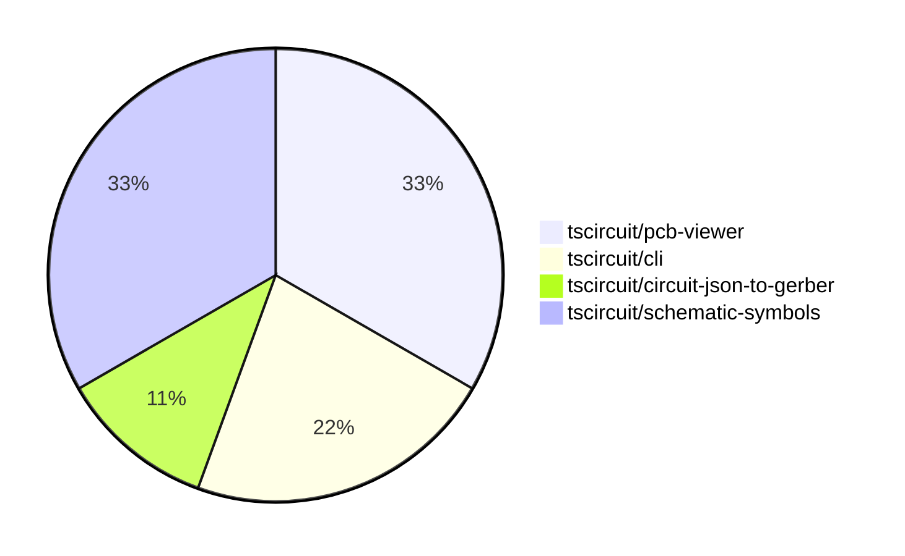

# Contribution Overview 2024-09-28

## PRs by Repository

## Contributor Overview

| Contributor | 🐳 Major | 🐙 Minor | 🐌 Tiny |
|-------------|-------|-------|-------|
| anas-sarkez | 2 | 1 | 0 |
| ShiboSoftwareDev | 0 | 2 | 0 |
| Abse2001 | 1 | 1 | 0 |
| imrishabh18 | 1 | 0 | 0 |

## Changes by Repository

### [tscircuit/pcb-viewer](https://github.com/tscircuit/pcb-viewer)

| PR # | Impact | Contributor | Description |
|------|--------|-------------|-------------|
| [#67](https://github.com/tscircuit/pcb-viewer/pull/67) | 🐳 Major | anas-sarkez | Update the `useHotKey` hook to only trigger when the window is active and the mouse is over the container. |
| [#61](https://github.com/tscircuit/pcb-viewer/pull/61) | 🐳 Major | anas-sarkez | Added hotkeys for all layers |
| [#65](https://github.com/tscircuit/pcb-viewer/pull/65) | 🐙 Minor | anas-sarkez | Replace the deprecated imports from "circuit-json" with the new ones. |

### [tscircuit/cli](https://github.com/tscircuit/cli)

| PR # | Impact | Contributor | Description |
|------|--------|-------------|-------------|
| [#213](https://github.com/tscircuit/cli/pull/213) | 🐙 Minor | ShiboSoftwareDev | Fixed the z-index of the popover content to prevent it from being hidden behind other content. |
| [#212](https://github.com/tscircuit/cli/pull/212) | 🟣 | ShiboSoftwareDev | Fixed a filepath bug that was causing issues with the API tests and exporting functionality. |

### [tscircuit/circuit-json-to-gerber](https://github.com/tscircuit/circuit-json-to-gerber)

| PR # | Impact | Contributor | Description |
|------|--------|-------------|-------------|
| [#9](https://github.com/tscircuit/circuit-json-to-gerber/pull/9) | 🐙 Minor | ShiboSoftwareDev | Fixed gerber units to work with JLCPCB and PCBWay |

### [tscircuit/schematic-symbols](https://github.com/tscircuit/schematic-symbols)

| PR # | Impact | Contributor | Description |
|------|--------|-------------|-------------|
| [#21](https://github.com/tscircuit/schematic-symbols/pull/21) | 🐳 Major | Abse2001 | Added new symbols for push_button_normally_open_momentary in horizontal and vertical orientations. |
| [#22](https://github.com/tscircuit/schematic-symbols/pull/22) | 🐳 Major | imrishabh18 | Add port reference blocks for trace fix in core |
| [#23](https://github.com/tscircuit/schematic-symbols/pull/23) | 🐙 Minor | Abse2001 | Fixed the position of the REF and VAL text labels in several electronic component symbols so that they always grow away from the symbols. |

## Changes by Contributor

### [anas-sarkez](https://github.com/anas-sarkez)

| PR # | Impact | Description |
|------|--------|-------------|
| [#67](https://github.com/tscircuit/pcb-viewer/pull/67) | 🐳 Major | Update the `useHotKey` hook to only trigger when the window is active and the mouse is over the container. |
| [#61](https://github.com/tscircuit/pcb-viewer/pull/61) | 🐳 Major | Added hotkeys for all layers |
| [#65](https://github.com/tscircuit/pcb-viewer/pull/65) | 🐙 Minor | Replace the deprecated imports from "circuit-json" with the new ones. |

### [ShiboSoftwareDev](https://github.com/ShiboSoftwareDev)

| PR # | Impact | Description |
|------|--------|-------------|
| [#213](https://github.com/tscircuit/cli/pull/213) | 🐙 Minor | Fixed the z-index of the popover content to prevent it from being hidden behind other content. |
| [#212](https://github.com/tscircuit/cli/pull/212) | 🟣 | Fixed a filepath bug that was causing issues with the API tests and exporting functionality. |
| [#9](https://github.com/tscircuit/circuit-json-to-gerber/pull/9) | 🐙 Minor | Fixed gerber units to work with JLCPCB and PCBWay |

### [Abse2001](https://github.com/Abse2001)

| PR # | Impact | Description |
|------|--------|-------------|
| [#21](https://github.com/tscircuit/schematic-symbols/pull/21) | 🐳 Major | Added new symbols for push_button_normally_open_momentary in horizontal and vertical orientations. |
| [#23](https://github.com/tscircuit/schematic-symbols/pull/23) | 🐙 Minor | Fixed the position of the REF and VAL text labels in several electronic component symbols so that they always grow away from the symbols. |

### [imrishabh18](https://github.com/imrishabh18)

| PR # | Impact | Description |
|------|--------|-------------|
| [#22](https://github.com/tscircuit/schematic-symbols/pull/22) | 🐳 Major | Add port reference blocks for trace fix in core |

