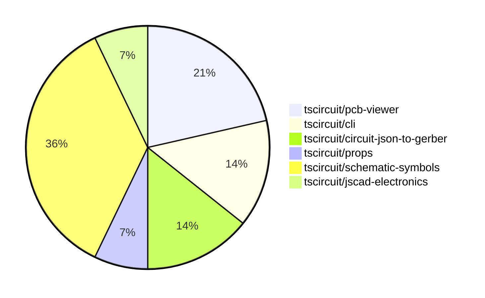

# Contribution Overview 2024-09-28

## PRs by Repository

## Contributor Overview

| Contributor | 🐳 Major | 🐙 Minor | 🐌 Tiny |
|-------------|-------|-------|-------|
| anas-sarkez | 2 | 1 | 0 |
| ShiboSoftwareDev | 2 | 2 | 0 |
| seveibar | 2 | 0 | 0 |
| abhijitxy | 0 | 1 | 0 |
| imrishabh18 | 1 | 1 | 0 |
| Abse2001 | 1 | 1 | 0 |

## Changes by Repository

### [tscircuit/pcb-viewer](https://github.com/tscircuit/pcb-viewer)

| PR # | Impact | Contributor | Description |
|------|--------|-------------|-------------|
| [#67](https://github.com/tscircuit/pcb-viewer/pull/67) | 🐳 Major | anas-sarkez | Ensure that the `hotHey` hook only triggers when the window is active and the user is interacting with the container. |
| [#61](https://github.com/tscircuit/pcb-viewer/pull/61) | 🐳 Major | anas-sarkez | Added hotkeys for all layers |
| [#65](https://github.com/tscircuit/pcb-viewer/pull/65) | 🐙 Minor | anas-sarkez | Replace the deprecated imports in the codebase. |

### [tscircuit/cli](https://github.com/tscircuit/cli)

| PR # | Impact | Contributor | Description |
|------|--------|-------------|-------------|
| [#212](https://github.com/tscircuit/cli/pull/212) | 🐳 Major | ShiboSoftwareDev | Fixed a filepath bug by using `path/posix` instead of `path`. |
| [#213](https://github.com/tscircuit/cli/pull/213) | 🐙 Minor | ShiboSoftwareDev | Fixed the incorrect z-index of the popover content. |

### [tscircuit/circuit-json-to-gerber](https://github.com/tscircuit/circuit-json-to-gerber)

| PR # | Impact | Contributor | Description |
|------|--------|-------------|-------------|
| [#11](https://github.com/tscircuit/circuit-json-to-gerber/pull/11) | 🐳 Major | ShiboSoftwareDev | Added support for `pcb_hole` elements in Excellon drill and soldermask generation, and updated the repository to use `circuit-json` instead of `@tscircuit/soup`. |
| [#9](https://github.com/tscircuit/circuit-json-to-gerber/pull/9) | 🐙 Minor | ShiboSoftwareDev | Fixed the gerber units to work with jlcpcb and pcbway |

### [tscircuit/props](https://github.com/tscircuit/props)

| PR # | Impact | Contributor | Description |
|------|--------|-------------|-------------|
| [#55](https://github.com/tscircuit/props/pull/55) | 🐳 Major | seveibar | Update the `schematicPinDefinitions.ts` file to add a new `SchematicPortArrangement` interface that extends the existing `SchematicPortArrangementWithSizes`, `SchematicPortArrangementWithSides`, and `SchematicPortArrangementWithPinCounts` interfaces. |

### [tscircuit/schematic-symbols](https://github.com/tscircuit/schematic-symbols)

| PR # | Impact | Contributor | Description |
|------|--------|-------------|-------------|
| [#72](https://github.com/tscircuit/schematic-symbols/pull/72) | 🐳 Major | seveibar | Introduced a new photodiode symbol and made the `bun run generate` command interactive to add new symbols. |
| [#22](https://github.com/tscircuit/schematic-symbols/pull/22) | 🐳 Major | imrishabh18 | Added port reference blocks for the capacitor symbol to support tracing in the core application. |
| [#21](https://github.com/tscircuit/schematic-symbols/pull/21) | 🐳 Major | Abse2001 | Added new push button symbols (horizontal and vertical) for "normally open momentary" type. |
| [#73](https://github.com/tscircuit/schematic-symbols/pull/73) | 🐙 Minor | imrishabh18 | Fixes an issue with the lockfile being frozen. |
| [#23](https://github.com/tscircuit/schematic-symbols/pull/23) | 🐙 Minor | Abse2001 | Fixed the position of the reference and value text blocks so they always grow away from the symbols. |

### [tscircuit/jscad-electronics](https://github.com/tscircuit/jscad-electronics)

| PR # | Impact | Contributor | Description |
|------|--------|-------------|-------------|
| [#45](https://github.com/tscircuit/jscad-electronics/pull/45) | 🐙 Minor | abhijitxy | Fix the position of the BGA (Ball Grid Array) component on the side |

## Changes by Contributor

### [anas-sarkez](https://github.com/anas-sarkez)

| PR # | Impact | Description |
|------|--------|-------------|
| [#67](https://github.com/tscircuit/pcb-viewer/pull/67) | 🐳 Major | Ensure that the `hotHey` hook only triggers when the window is active and the user is interacting with the container. |
| [#61](https://github.com/tscircuit/pcb-viewer/pull/61) | 🐳 Major | Added hotkeys for all layers |
| [#65](https://github.com/tscircuit/pcb-viewer/pull/65) | 🐙 Minor | Replace the deprecated imports in the codebase. |

### [ShiboSoftwareDev](https://github.com/ShiboSoftwareDev)

| PR # | Impact | Description |
|------|--------|-------------|
| [#212](https://github.com/tscircuit/cli/pull/212) | 🐳 Major | Fixed a filepath bug by using `path/posix` instead of `path`. |
| [#11](https://github.com/tscircuit/circuit-json-to-gerber/pull/11) | 🐳 Major | Added support for `pcb_hole` elements in Excellon drill and soldermask generation, and updated the repository to use `circuit-json` instead of `@tscircuit/soup`. |
| [#213](https://github.com/tscircuit/cli/pull/213) | 🐙 Minor | Fixed the incorrect z-index of the popover content. |
| [#9](https://github.com/tscircuit/circuit-json-to-gerber/pull/9) | 🐙 Minor | Fixed the gerber units to work with jlcpcb and pcbway |

### [seveibar](https://github.com/seveibar)

| PR # | Impact | Description |
|------|--------|-------------|
| [#55](https://github.com/tscircuit/props/pull/55) | 🐳 Major | Update the `schematicPinDefinitions.ts` file to add a new `SchematicPortArrangement` interface that extends the existing `SchematicPortArrangementWithSizes`, `SchematicPortArrangementWithSides`, and `SchematicPortArrangementWithPinCounts` interfaces. |
| [#72](https://github.com/tscircuit/schematic-symbols/pull/72) | 🐳 Major | Introduced a new photodiode symbol and made the `bun run generate` command interactive to add new symbols. |

### [abhijitxy](https://github.com/abhijitxy)

| PR # | Impact | Description |
|------|--------|-------------|
| [#45](https://github.com/tscircuit/jscad-electronics/pull/45) | 🐙 Minor | Fix the position of the BGA (Ball Grid Array) component on the side |

### [imrishabh18](https://github.com/imrishabh18)

| PR # | Impact | Description |
|------|--------|-------------|
| [#22](https://github.com/tscircuit/schematic-symbols/pull/22) | 🐳 Major | Added port reference blocks for the capacitor symbol to support tracing in the core application. |
| [#73](https://github.com/tscircuit/schematic-symbols/pull/73) | 🐙 Minor | Fixes an issue with the lockfile being frozen. |

### [Abse2001](https://github.com/Abse2001)

| PR # | Impact | Description |
|------|--------|-------------|
| [#21](https://github.com/tscircuit/schematic-symbols/pull/21) | 🐳 Major | Added new push button symbols (horizontal and vertical) for "normally open momentary" type. |
| [#23](https://github.com/tscircuit/schematic-symbols/pull/23) | 🐙 Minor | Fixed the position of the reference and value text blocks so they always grow away from the symbols. |

