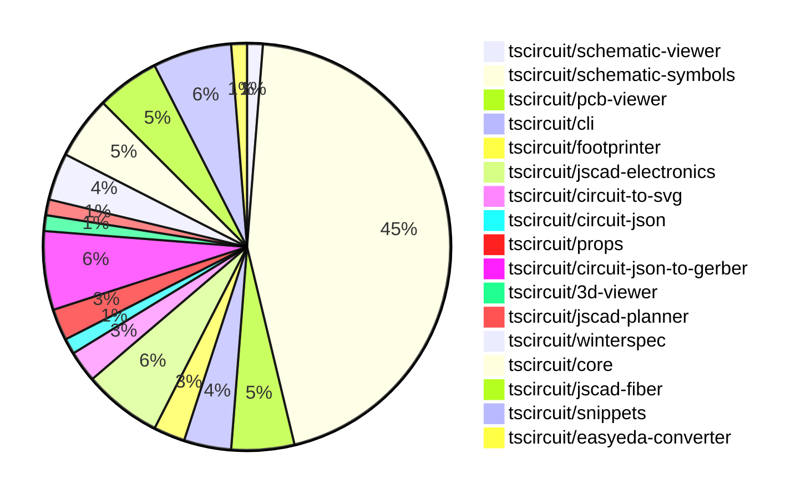

# Contribution Overview 2024-09-28

## PRs by Repository

## Contributor Overview

| Contributor | 🐳 Major | 🐙 Minor | 🐌 Tiny |
|-------------|-------|-------|-------|
| DhairyaMajmudar | 1 | 0 | 0 |
| Abse2001 | 1 | 3 | 0 |
| anas-sarkez | 10 | 3 | 0 |
| ShiboSoftwareDev | 6 | 3 | 0 |
| seveibar | 14 | 4 | 0 |
| andrii-balitskyi | 1 | 0 | 0 |
| imrishabh18 | 6 | 2 | 1 |
| abhijitxy | 0 | 1 | 0 |
| bbland1 | 5 | 1 | 0 |
| 0xkafkaa | 2 | 0 | 0 |
| aman1376 | 3 | 0 | 0 |
| MandeepPaul | 1 | 0 | 0 |
| bhavyajain511 | 1 | 0 | 0 |
| programmersoham | 1 | 0 | 0 |
| Timer00 | 4 | 3 | 0 |
| Complexlity | 1 | 1 | 1 |

## Changes by Repository

### [tscircuit/schematic-viewer](https://github.com/tscircuit/schematic-viewer)

| PR # | Impact | Contributor | Description |
|------|--------|-------------|-------------|
| [#64](https://github.com/tscircuit/schematic-viewer/pull/64) | 🐳 Major | DhairyaMajmudar | Replaced the types in core.ts files with those exported from the `circuit-json` package. |

### [tscircuit/schematic-symbols](https://github.com/tscircuit/schematic-symbols)

| PR # | Impact | Contributor | Description |
|------|--------|-------------|-------------|
| [#21](https://github.com/tscircuit/schematic-symbols/pull/21) | 🐳 Major | Abse2001 | Added horizontal and vertical symbols for the "push_button_normally_open_momentary" component. |
| [#85](https://github.com/tscircuit/schematic-symbols/pull/85) | 🐳 Major | anas-sarkez | Added a tunnel diode SVG image and JSON definition |
| [#82](https://github.com/tscircuit/schematic-symbols/pull/82) | 🐳 Major | anas-sarkez | Added an avalanche diode component to the project. |
| [#81](https://github.com/tscircuit/schematic-symbols/pull/81) | 🐳 Major | anas-sarkez | Added a zener diode symbol to the project. |
| [#80](https://github.com/tscircuit/schematic-symbols/pull/80) | 🐳 Major | anas-sarkez | Added a varactor diode symbol file and associated JSON data. |
| [#75](https://github.com/tscircuit/schematic-symbols/pull/75) | 🐳 Major | anas-sarkez | Added a Schottky diode symbol |
| [#98](https://github.com/tscircuit/schematic-symbols/pull/98) | 🐳 Major | seveibar | Update the `vercel-build` script to run `bun run build` before running `bun run ./scripts/build.ts` |
| [#72](https://github.com/tscircuit/schematic-symbols/pull/72) | 🐳 Major | seveibar | Introduce a new photodiode symbol |
| [#135](https://github.com/tscircuit/schematic-symbols/pull/135) | 🐳 Major | imrishabh18 | Adding support for cubic bezier curve in the `svgPathToPoints` function. |
| [#106](https://github.com/tscircuit/schematic-symbols/pull/106) | 🐳 Major | imrishabh18 | Introduce the 'Q' command for SVG path parsing, which handles quadratic Bézier curves. |
| [#73](https://github.com/tscircuit/schematic-symbols/pull/73) | 🐳 Major | imrishabh18 | Fixes the lockfile issue to prevent it from being frozen. |
| [#132](https://github.com/tscircuit/schematic-symbols/pull/132) | 🐳 Major | bbland1 | Fixes the centering of the diamond element in the silicon_controlled_rectifier symbol. |
| [#110](https://github.com/tscircuit/schematic-symbols/pull/110) | 🐳 Major | bbland1 | Add a new SVG and TypeScript file for a diac component. |
| [#111](https://github.com/tscircuit/schematic-symbols/pull/111) | 🐳 Major | bbland1 | Adds an SVG and TypeScript file for a unijunction transistor symbol. |
| [#108](https://github.com/tscircuit/schematic-symbols/pull/108) | 🐳 Major | bbland1 | Add SVG and TypeScript files for a silicon-controlled rectifier component. |
| [#109](https://github.com/tscircuit/schematic-symbols/pull/109) | 🐳 Major | bbland1 | Created an SVG and TypeScript file for the triac symbol. |
| [#133](https://github.com/tscircuit/schematic-symbols/pull/133) | 🐳 Major | 0xkafkaa | Adds a new JSON file for the Gunn diode symbol and updates the corresponding SVG file. |
| [#91](https://github.com/tscircuit/schematic-symbols/pull/91) | 🐳 Major | 0xkafkaa | Create a new SVG image and JSON file for a power factor meter symbol |
| [#130](https://github.com/tscircuit/schematic-symbols/pull/130) | 🐳 Major | aman1376 | Introduce a new TypeScript type `BaseSymbolName` that represents a union of all base symbol names. |
| [#129](https://github.com/tscircuit/schematic-symbols/pull/129) | 🐳 Major | aman1376 | Add a new symbol for a constant current diode |
| [#117](https://github.com/tscircuit/schematic-symbols/pull/117) | 🐳 Major | aman1376 | Add a new symbol for a laser diode component, including paths, texts, reference blocks, and bounds information. |
| [#101](https://github.com/tscircuit/schematic-symbols/pull/101) | 🐳 Major | MandeepPaul | Introduce a new SVG symbol for an IGBT transistor. |
| [#113](https://github.com/tscircuit/schematic-symbols/pull/113) | 🐳 Major | bhavyajain511 | Introduce a new circuit symbol "var_meter" with associated JSON and SVG files. |
| [#107](https://github.com/tscircuit/schematic-symbols/pull/107) | 🐳 Major | programmersoham | Added SVG files for npn bipolar transistor, pnp bipolar transistor, and phototransistor symbols. |
| [#77](https://github.com/tscircuit/schematic-symbols/pull/77) | 🐳 Major | Timer00 | Introduce a new DC ammeter symbol |
| [#94](https://github.com/tscircuit/schematic-symbols/pull/94) | 🐳 Major | Timer00 | Introduce an AC voltmeter component with paths and text elements. |
| [#89](https://github.com/tscircuit/schematic-symbols/pull/89) | 🐳 Major | Timer00 | This pull request introduces type guards for various drawing-related types, including `PathPrimitive`, `TextPrimitive`, `CirclePrimitive`, `BoxPrimitive`, `NinePointAnchor`, `Port`, `SchSymbol`, `Bounds`, and `SvgData`. These type guards will help ensure type safety when working with these types. |
| [#74](https://github.com/tscircuit/schematic-symbols/pull/74) | 🐳 Major | Timer00 | Introduce a new component called "dc_voltmeter" with paths, texts, reference blocks, and a circle. |
| [#23](https://github.com/tscircuit/schematic-symbols/pull/23) | 🐙 Minor | Abse2001 | Fixed the positioning of the ref and val text points on various electronic component symbols so that they always grow away from the symbols. |
| [#86](https://github.com/tscircuit/schematic-symbols/pull/86) | 🐙 Minor | imrishabh18 | fix: reference point added for port |
| [#22](https://github.com/tscircuit/schematic-symbols/pull/22) | 🐙 Minor | imrishabh18 | Added port reference blocks for trace fix in core |
| [#131](https://github.com/tscircuit/schematic-symbols/pull/131) | 🐙 Minor | bbland1 | Fixing the ref on the diac symbol |
| [#105](https://github.com/tscircuit/schematic-symbols/pull/105) | 🐙 Minor | Timer00 | Add a step to commit and push any changes before publishing to npm |
| [#103](https://github.com/tscircuit/schematic-symbols/pull/103) | 🐙 Minor | Timer00 | Updates the lockfile to ensure the project can be published to npm correctly. |
| [#76](https://github.com/tscircuit/schematic-symbols/pull/76) | 🐙 Minor | Timer00 | Add a formatting step to the symbol adding instructions |
| [#104](https://github.com/tscircuit/schematic-symbols/pull/104) | 🐌 Tiny | imrishabh18 | Deletes the `package-lock.json` file from the repository. |

### [tscircuit/pcb-viewer](https://github.com/tscircuit/pcb-viewer)

| PR # | Impact | Contributor | Description |
|------|--------|-------------|-------------|
| [#65](https://github.com/tscircuit/pcb-viewer/pull/65) | 🐳 Major | anas-sarkez | Replace the deprecated imports in the PCBViewer and related components. |
| [#61](https://github.com/tscircuit/pcb-viewer/pull/61) | 🐳 Major | anas-sarkez | Added hotkeys for all layers |
| [#69](https://github.com/tscircuit/pcb-viewer/pull/69) | 🐙 Minor | Abse2001 | Increased the zIndex for the ElementOverlyBox so it shows above the traces. |
| [#67](https://github.com/tscircuit/pcb-viewer/pull/67) | 🐙 Minor | anas-sarkez | The hotHey hook now only works if the window is active, ensuring that the hotkey functionality is only triggered when the user is interacting with the application. |

### [tscircuit/cli](https://github.com/tscircuit/cli)

| PR # | Impact | Contributor | Description |
|------|--------|-------------|-------------|
| [#212](https://github.com/tscircuit/cli/pull/212) | 🐳 Major | ShiboSoftwareDev | Fixed filepath bug related to path handling. |
| [#222](https://github.com/tscircuit/cli/pull/222) | 🐙 Minor | Abse2001 | Updated the `pcb_viewer` package to version `1.10.8` which fixed the via hover and the resistor example. |
| [#213](https://github.com/tscircuit/cli/pull/213) | 🐙 Minor | ShiboSoftwareDev | Fixed the `popoverContent` index to ensure it is displayed above other elements. |

### [tscircuit/footprinter](https://github.com/tscircuit/footprinter)

| PR # | Impact | Contributor | Description |
|------|--------|-------------|-------------|
| [#49](https://github.com/tscircuit/footprinter/pull/49) | 🐳 Major | anas-sarkez | Implement _silkscreenpins for dip components |
| [#47](https://github.com/tscircuit/footprinter/pull/47) | 🐳 Major | seveibar | Create an axial footprint and add circuitJson |

### [tscircuit/jscad-electronics](https://github.com/tscircuit/jscad-electronics)

| PR # | Impact | Contributor | Description |
|------|--------|-------------|-------------|
| [#58](https://github.com/tscircuit/jscad-electronics/pull/58) | 🐳 Major | anas-sarkez | Fixed the dimensions and positions of the leads and body to match the SOT-23, SOT-563, and SOT-723 footprints. |
| [#47](https://github.com/tscircuit/jscad-electronics/pull/47) | 🐳 Major | anas-sarkez | Fixed the 3D component legs with footprints for the TSSOP (Thin Shrink Small Outline Package) component. |
| [#46](https://github.com/tscircuit/jscad-electronics/pull/46) | 🐳 Major | seveibar | Add build system and checkpoint axis flipping |
| [#60](https://github.com/tscircuit/jscad-electronics/pull/60) | 🐙 Minor | anas-sarkez | Added the `showGrid` property to all test examples in the `examples` directory. |
| [#45](https://github.com/tscircuit/jscad-electronics/pull/45) | 🐙 Minor | abhijitxy | Fix the positioning of the BGA component to not be on the side |

### [tscircuit/circuit-to-svg](https://github.com/tscircuit/circuit-to-svg)

| PR # | Impact | Contributor | Description |
|------|--------|-------------|-------------|
| [#81](https://github.com/tscircuit/circuit-to-svg/pull/81) | 🐳 Major | imrishabh18 | Introduces a new feature to convert circuit JSON data to KiCad-style schematic SVG. |
| [#80](https://github.com/tscircuit/circuit-to-svg/pull/80) | 🐙 Minor | anas-sarkez | Removed the cleaning of the text value, as the developer was unable to implement the closing tag "}" |

### [tscircuit/circuit-json](https://github.com/tscircuit/circuit-json)

| PR # | Impact | Contributor | Description |
|------|--------|-------------|-------------|
| [#56](https://github.com/tscircuit/circuit-json/pull/56) | 🐳 Major | ShiboSoftwareDev | Introduces a new component called `pcb_solder_paste` for defining solder paste on a printed circuit board. |

### [tscircuit/props](https://github.com/tscircuit/props)

| PR # | Impact | Contributor | Description |
|------|--------|-------------|-------------|
| [#56](https://github.com/tscircuit/props/pull/56) | 🐳 Major | ShiboSoftwareDev | Introduce a new component called `solderpaste` with two types of properties: `RectSolderPasteProps` and `CircleSolderPasteProps`. |
| [#55](https://github.com/tscircuit/props/pull/55) | 🐳 Major | seveibar | Introduces a new type `SchematicPortArrangement` that extends the existing `SchematicPortArrangementWithSizes`, `SchematicPortArrangementWithSides`, and `SchematicPortArrangementWithPinCounts` types, and updates the `schematicPortArrangement` object to use this new type. |

### [tscircuit/circuit-json-to-gerber](https://github.com/tscircuit/circuit-json-to-gerber)

| PR # | Impact | Contributor | Description |
|------|--------|-------------|-------------|
| [#14](https://github.com/tscircuit/circuit-json-to-gerber/pull/14) | 🐳 Major | ShiboSoftwareDev | The change ensures that the `pcb_via` element now appears in the copper layer. |
| [#11](https://github.com/tscircuit/circuit-json-to-gerber/pull/11) | 🐳 Major | ShiboSoftwareDev | Implemented pcb_hole support in excellon drill and soldermask, and updated repository to use circuit-json instead of tscircuit/soup. |
| [#9](https://github.com/tscircuit/circuit-json-to-gerber/pull/9) | 🐳 Major | ShiboSoftwareDev | Fixed gerber units to work with JLCPCB and PCBWay |
| [#16](https://github.com/tscircuit/circuit-json-to-gerber/pull/16) | 🐙 Minor | ShiboSoftwareDev | Updates the test snapshot for the excellon drill file. |
| [#13](https://github.com/tscircuit/circuit-json-to-gerber/pull/13) | 🐙 Minor | ShiboSoftwareDev | Update the pcb_plated_hole aperture definition to use copper/soldermask fill instead of outline. |

### [tscircuit/3d-viewer](https://github.com/tscircuit/3d-viewer)

| PR # | Impact | Contributor | Description |
|------|--------|-------------|-------------|
| [#23](https://github.com/tscircuit/3d-viewer/pull/23) | 🐳 Major | seveibar | Improve the README, add support for 3D components generated by footprint. |

### [tscircuit/jscad-planner](https://github.com/tscircuit/jscad-planner)

| PR # | Impact | Contributor | Description |
|------|--------|-------------|-------------|
| [#3](https://github.com/tscircuit/jscad-planner/pull/3) | 🐳 Major | seveibar | Implement cuboid and polygon operations in the JSCAD library. |

### [tscircuit/winterspec](https://github.com/tscircuit/winterspec)

| PR # | Impact | Contributor | Description |
|------|--------|-------------|-------------|
| [#14](https://github.com/tscircuit/winterspec/pull/14) | 🐳 Major | seveibar | Don't require headers if `jsonBody` is optional, only parse JSON bodies if `content-type` is set, and only parse URL-encoded bodies if `content-type` is set. |
| [#15](https://github.com/tscircuit/winterspec/pull/15) | 🐙 Minor | seveibar | Fix the exports for the "dev" and "dev-server" modules in the package.json file. |
| [#13](https://github.com/tscircuit/winterspec/pull/13) | 🐙 Minor | seveibar | Ensure that the middleware doesn't require a content-type header if the form data is optional. |

### [tscircuit/core](https://github.com/tscircuit/core)

| PR # | Impact | Contributor | Description |
|------|--------|-------------|-------------|
| [#132](https://github.com/tscircuit/core/pull/132) | 🐳 Major | seveibar | Create a `cad_component` for any component with a footprint. |
| [#130](https://github.com/tscircuit/core/pull/130) | 🐳 Major | seveibar | Add error handling when there's a missing footprint for a port |
| [#135](https://github.com/tscircuit/core/pull/135) | 🐳 Major | imrishabh18 | Fix issue #134 by adding the `schematic_port` into the JSON for individual placement in the `circuit-to-svg` feature. |
| [#133](https://github.com/tscircuit/core/pull/133) | 🐳 Major | imrishabh18 | Fix the chip design by updating the import statements and adding underscorifyPinStyles and underscorifyPortArrangement functions. |

### [tscircuit/jscad-fiber](https://github.com/tscircuit/jscad-fiber)

| PR # | Impact | Contributor | Description |
|------|--------|-------------|-------------|
| [#82](https://github.com/tscircuit/jscad-fiber/pull/82) | 🐳 Major | seveibar | Add the ability to specify the rotation of a Cylinder |
| [#80](https://github.com/tscircuit/jscad-fiber/pull/80) | 🐳 Major | seveibar | Add a new component `ExtrudeFromSlices` that allows creating 3D geometry by extruding a series of 2D slices. |
| [#78](https://github.com/tscircuit/jscad-fiber/pull/78) | 🐳 Major | seveibar | Fix grid orientation with z-axis up, convert from npm to bun |
| [#81](https://github.com/tscircuit/jscad-fiber/pull/81) | 🐙 Minor | seveibar | Add `center` prop to the `Sphere` component |

### [tscircuit/snippets](https://github.com/tscircuit/snippets)

| PR # | Impact | Contributor | Description |
|------|--------|-------------|-------------|
| [#12](https://github.com/tscircuit/snippets/pull/12) | 🐳 Major | seveibar | Adds support for sessions, login pages, and accounts to the database schema, along with related CRUD operations. |
| [#9](https://github.com/tscircuit/snippets/pull/9) | 🐳 Major | Complexlity | Add a new dropdown menu in the header to create new templates |
| [#13](https://github.com/tscircuit/snippets/pull/13) | 🐙 Minor | seveibar | Format the repository, add Vercel rewrites, and make minor fixes. |
| [#6](https://github.com/tscircuit/snippets/pull/6) | 🐙 Minor | Complexlity | Remove the package-lock.json file, leaving only the bun lock file. |
| [#4](https://github.com/tscircuit/snippets/pull/4) | 🐌 Tiny | Complexlity | Update the favicon to match the one used on tscircuits sites. |

### [tscircuit/easyeda-converter](https://github.com/tscircuit/easyeda-converter)

| PR # | Impact | Contributor | Description |
|------|--------|-------------|-------------|
| [#43](https://github.com/tscircuit/easyeda-converter/pull/43) | 🐳 Major | andrii-balitskyi | Expose the 'convert' CLI command functionality under a separate function |

## Changes by Contributor

### [DhairyaMajmudar](https://github.com/DhairyaMajmudar)

| PR # | Impact | Description |
|------|--------|-------------|
| [#64](https://github.com/tscircuit/schematic-viewer/pull/64) | 🐳 Major | Replaced the types in core.ts files with those exported from the `circuit-json` package. |

### [Abse2001](https://github.com/Abse2001)

| PR # | Impact | Description |
|------|--------|-------------|
| [#21](https://github.com/tscircuit/schematic-symbols/pull/21) | 🐳 Major | Added horizontal and vertical symbols for the "push_button_normally_open_momentary" component. |
| [#69](https://github.com/tscircuit/pcb-viewer/pull/69) | 🐙 Minor | Increased the zIndex for the ElementOverlyBox so it shows above the traces. |
| [#222](https://github.com/tscircuit/cli/pull/222) | 🐙 Minor | Updated the `pcb_viewer` package to version `1.10.8` which fixed the via hover and the resistor example. |
| [#23](https://github.com/tscircuit/schematic-symbols/pull/23) | 🐙 Minor | Fixed the positioning of the ref and val text points on various electronic component symbols so that they always grow away from the symbols. |

### [anas-sarkez](https://github.com/anas-sarkez)

| PR # | Impact | Description |
|------|--------|-------------|
| [#65](https://github.com/tscircuit/pcb-viewer/pull/65) | 🐳 Major | Replace the deprecated imports in the PCBViewer and related components. |
| [#61](https://github.com/tscircuit/pcb-viewer/pull/61) | 🐳 Major | Added hotkeys for all layers |
| [#49](https://github.com/tscircuit/footprinter/pull/49) | 🐳 Major | Implement _silkscreenpins for dip components |
| [#58](https://github.com/tscircuit/jscad-electronics/pull/58) | 🐳 Major | Fixed the dimensions and positions of the leads and body to match the SOT-23, SOT-563, and SOT-723 footprints. |
| [#47](https://github.com/tscircuit/jscad-electronics/pull/47) | 🐳 Major | Fixed the 3D component legs with footprints for the TSSOP (Thin Shrink Small Outline Package) component. |
| [#85](https://github.com/tscircuit/schematic-symbols/pull/85) | 🐳 Major | Added a tunnel diode SVG image and JSON definition |
| [#82](https://github.com/tscircuit/schematic-symbols/pull/82) | 🐳 Major | Added an avalanche diode component to the project. |
| [#81](https://github.com/tscircuit/schematic-symbols/pull/81) | 🐳 Major | Added a zener diode symbol to the project. |
| [#80](https://github.com/tscircuit/schematic-symbols/pull/80) | 🐳 Major | Added a varactor diode symbol file and associated JSON data. |
| [#75](https://github.com/tscircuit/schematic-symbols/pull/75) | 🐳 Major | Added a Schottky diode symbol |
| [#67](https://github.com/tscircuit/pcb-viewer/pull/67) | 🐙 Minor | The hotHey hook now only works if the window is active, ensuring that the hotkey functionality is only triggered when the user is interacting with the application. |
| [#60](https://github.com/tscircuit/jscad-electronics/pull/60) | 🐙 Minor | Added the `showGrid` property to all test examples in the `examples` directory. |
| [#80](https://github.com/tscircuit/circuit-to-svg/pull/80) | 🐙 Minor | Removed the cleaning of the text value, as the developer was unable to implement the closing tag "}" |

### [ShiboSoftwareDev](https://github.com/ShiboSoftwareDev)

| PR # | Impact | Description |
|------|--------|-------------|
| [#212](https://github.com/tscircuit/cli/pull/212) | 🐳 Major | Fixed filepath bug related to path handling. |
| [#56](https://github.com/tscircuit/circuit-json/pull/56) | 🐳 Major | Introduces a new component called `pcb_solder_paste` for defining solder paste on a printed circuit board. |
| [#56](https://github.com/tscircuit/props/pull/56) | 🐳 Major | Introduce a new component called `solderpaste` with two types of properties: `RectSolderPasteProps` and `CircleSolderPasteProps`. |
| [#14](https://github.com/tscircuit/circuit-json-to-gerber/pull/14) | 🐳 Major | The change ensures that the `pcb_via` element now appears in the copper layer. |
| [#11](https://github.com/tscircuit/circuit-json-to-gerber/pull/11) | 🐳 Major | Implemented pcb_hole support in excellon drill and soldermask, and updated repository to use circuit-json instead of tscircuit/soup. |
| [#9](https://github.com/tscircuit/circuit-json-to-gerber/pull/9) | 🐳 Major | Fixed gerber units to work with JLCPCB and PCBWay |
| [#213](https://github.com/tscircuit/cli/pull/213) | 🐙 Minor | Fixed the `popoverContent` index to ensure it is displayed above other elements. |
| [#16](https://github.com/tscircuit/circuit-json-to-gerber/pull/16) | 🐙 Minor | Updates the test snapshot for the excellon drill file. |
| [#13](https://github.com/tscircuit/circuit-json-to-gerber/pull/13) | 🐙 Minor | Update the pcb_plated_hole aperture definition to use copper/soldermask fill instead of outline. |

### [seveibar](https://github.com/seveibar)

| PR # | Impact | Description |
|------|--------|-------------|
| [#55](https://github.com/tscircuit/props/pull/55) | 🐳 Major | Introduces a new type `SchematicPortArrangement` that extends the existing `SchematicPortArrangementWithSizes`, `SchematicPortArrangementWithSides`, and `SchematicPortArrangementWithPinCounts` types, and updates the `schematicPortArrangement` object to use this new type. |
| [#47](https://github.com/tscircuit/footprinter/pull/47) | 🐳 Major | Create an axial footprint and add circuitJson |
| [#23](https://github.com/tscircuit/3d-viewer/pull/23) | 🐳 Major | Improve the README, add support for 3D components generated by footprint. |
| [#3](https://github.com/tscircuit/jscad-planner/pull/3) | 🐳 Major | Implement cuboid and polygon operations in the JSCAD library. |
| [#14](https://github.com/tscircuit/winterspec/pull/14) | 🐳 Major | Don't require headers if `jsonBody` is optional, only parse JSON bodies if `content-type` is set, and only parse URL-encoded bodies if `content-type` is set. |
| [#132](https://github.com/tscircuit/core/pull/132) | 🐳 Major | Create a `cad_component` for any component with a footprint. |
| [#130](https://github.com/tscircuit/core/pull/130) | 🐳 Major | Add error handling when there's a missing footprint for a port |
| [#46](https://github.com/tscircuit/jscad-electronics/pull/46) | 🐳 Major | Add build system and checkpoint axis flipping |
| [#82](https://github.com/tscircuit/jscad-fiber/pull/82) | 🐳 Major | Add the ability to specify the rotation of a Cylinder |
| [#80](https://github.com/tscircuit/jscad-fiber/pull/80) | 🐳 Major | Add a new component `ExtrudeFromSlices` that allows creating 3D geometry by extruding a series of 2D slices. |
| [#78](https://github.com/tscircuit/jscad-fiber/pull/78) | 🐳 Major | Fix grid orientation with z-axis up, convert from npm to bun |
| [#98](https://github.com/tscircuit/schematic-symbols/pull/98) | 🐳 Major | Update the `vercel-build` script to run `bun run build` before running `bun run ./scripts/build.ts` |
| [#72](https://github.com/tscircuit/schematic-symbols/pull/72) | 🐳 Major | Introduce a new photodiode symbol |
| [#12](https://github.com/tscircuit/snippets/pull/12) | 🐳 Major | Adds support for sessions, login pages, and accounts to the database schema, along with related CRUD operations. |
| [#15](https://github.com/tscircuit/winterspec/pull/15) | 🐙 Minor | Fix the exports for the "dev" and "dev-server" modules in the package.json file. |
| [#13](https://github.com/tscircuit/winterspec/pull/13) | 🐙 Minor | Ensure that the middleware doesn't require a content-type header if the form data is optional. |
| [#81](https://github.com/tscircuit/jscad-fiber/pull/81) | 🐙 Minor | Add `center` prop to the `Sphere` component |
| [#13](https://github.com/tscircuit/snippets/pull/13) | 🐙 Minor | Format the repository, add Vercel rewrites, and make minor fixes. |

### [andrii-balitskyi](https://github.com/andrii-balitskyi)

| PR # | Impact | Description |
|------|--------|-------------|
| [#43](https://github.com/tscircuit/easyeda-converter/pull/43) | 🐳 Major | Expose the 'convert' CLI command functionality under a separate function |

### [imrishabh18](https://github.com/imrishabh18)

| PR # | Impact | Description |
|------|--------|-------------|
| [#135](https://github.com/tscircuit/core/pull/135) | 🐳 Major | Fix issue #134 by adding the `schematic_port` into the JSON for individual placement in the `circuit-to-svg` feature. |
| [#133](https://github.com/tscircuit/core/pull/133) | 🐳 Major | Fix the chip design by updating the import statements and adding underscorifyPinStyles and underscorifyPortArrangement functions. |
| [#81](https://github.com/tscircuit/circuit-to-svg/pull/81) | 🐳 Major | Introduces a new feature to convert circuit JSON data to KiCad-style schematic SVG. |
| [#135](https://github.com/tscircuit/schematic-symbols/pull/135) | 🐳 Major | Adding support for cubic bezier curve in the `svgPathToPoints` function. |
| [#106](https://github.com/tscircuit/schematic-symbols/pull/106) | 🐳 Major | Introduce the 'Q' command for SVG path parsing, which handles quadratic Bézier curves. |
| [#73](https://github.com/tscircuit/schematic-symbols/pull/73) | 🐳 Major | Fixes the lockfile issue to prevent it from being frozen. |
| [#86](https://github.com/tscircuit/schematic-symbols/pull/86) | 🐙 Minor | fix: reference point added for port |
| [#22](https://github.com/tscircuit/schematic-symbols/pull/22) | 🐙 Minor | Added port reference blocks for trace fix in core |
| [#104](https://github.com/tscircuit/schematic-symbols/pull/104) | 🐌 Tiny | Deletes the `package-lock.json` file from the repository. |

### [abhijitxy](https://github.com/abhijitxy)

| PR # | Impact | Description |
|------|--------|-------------|
| [#45](https://github.com/tscircuit/jscad-electronics/pull/45) | 🐙 Minor | Fix the positioning of the BGA component to not be on the side |

### [bbland1](https://github.com/bbland1)

| PR # | Impact | Description |
|------|--------|-------------|
| [#132](https://github.com/tscircuit/schematic-symbols/pull/132) | 🐳 Major | Fixes the centering of the diamond element in the silicon_controlled_rectifier symbol. |
| [#110](https://github.com/tscircuit/schematic-symbols/pull/110) | 🐳 Major | Add a new SVG and TypeScript file for a diac component. |
| [#111](https://github.com/tscircuit/schematic-symbols/pull/111) | 🐳 Major | Adds an SVG and TypeScript file for a unijunction transistor symbol. |
| [#108](https://github.com/tscircuit/schematic-symbols/pull/108) | 🐳 Major | Add SVG and TypeScript files for a silicon-controlled rectifier component. |
| [#109](https://github.com/tscircuit/schematic-symbols/pull/109) | 🐳 Major | Created an SVG and TypeScript file for the triac symbol. |
| [#131](https://github.com/tscircuit/schematic-symbols/pull/131) | 🐙 Minor | Fixing the ref on the diac symbol |

### [0xkafkaa](https://github.com/0xkafkaa)

| PR # | Impact | Description |
|------|--------|-------------|
| [#133](https://github.com/tscircuit/schematic-symbols/pull/133) | 🐳 Major | Adds a new JSON file for the Gunn diode symbol and updates the corresponding SVG file. |
| [#91](https://github.com/tscircuit/schematic-symbols/pull/91) | 🐳 Major | Create a new SVG image and JSON file for a power factor meter symbol |

### [aman1376](https://github.com/aman1376)

| PR # | Impact | Description |
|------|--------|-------------|
| [#130](https://github.com/tscircuit/schematic-symbols/pull/130) | 🐳 Major | Introduce a new TypeScript type `BaseSymbolName` that represents a union of all base symbol names. |
| [#129](https://github.com/tscircuit/schematic-symbols/pull/129) | 🐳 Major | Add a new symbol for a constant current diode |
| [#117](https://github.com/tscircuit/schematic-symbols/pull/117) | 🐳 Major | Add a new symbol for a laser diode component, including paths, texts, reference blocks, and bounds information. |

### [MandeepPaul](https://github.com/MandeepPaul)

| PR # | Impact | Description |
|------|--------|-------------|
| [#101](https://github.com/tscircuit/schematic-symbols/pull/101) | 🐳 Major | Introduce a new SVG symbol for an IGBT transistor. |

### [bhavyajain511](https://github.com/bhavyajain511)

| PR # | Impact | Description |
|------|--------|-------------|
| [#113](https://github.com/tscircuit/schematic-symbols/pull/113) | 🐳 Major | Introduce a new circuit symbol "var_meter" with associated JSON and SVG files. |

### [programmersoham](https://github.com/programmersoham)

| PR # | Impact | Description |
|------|--------|-------------|
| [#107](https://github.com/tscircuit/schematic-symbols/pull/107) | 🐳 Major | Added SVG files for npn bipolar transistor, pnp bipolar transistor, and phototransistor symbols. |

### [Timer00](https://github.com/Timer00)

| PR # | Impact | Description |
|------|--------|-------------|
| [#77](https://github.com/tscircuit/schematic-symbols/pull/77) | 🐳 Major | Introduce a new DC ammeter symbol |
| [#94](https://github.com/tscircuit/schematic-symbols/pull/94) | 🐳 Major | Introduce an AC voltmeter component with paths and text elements. |
| [#89](https://github.com/tscircuit/schematic-symbols/pull/89) | 🐳 Major | This pull request introduces type guards for various drawing-related types, including `PathPrimitive`, `TextPrimitive`, `CirclePrimitive`, `BoxPrimitive`, `NinePointAnchor`, `Port`, `SchSymbol`, `Bounds`, and `SvgData`. These type guards will help ensure type safety when working with these types. |
| [#74](https://github.com/tscircuit/schematic-symbols/pull/74) | 🐳 Major | Introduce a new component called "dc_voltmeter" with paths, texts, reference blocks, and a circle. |
| [#105](https://github.com/tscircuit/schematic-symbols/pull/105) | 🐙 Minor | Add a step to commit and push any changes before publishing to npm |
| [#103](https://github.com/tscircuit/schematic-symbols/pull/103) | 🐙 Minor | Updates the lockfile to ensure the project can be published to npm correctly. |
| [#76](https://github.com/tscircuit/schematic-symbols/pull/76) | 🐙 Minor | Add a formatting step to the symbol adding instructions |

### [Complexlity](https://github.com/Complexlity)

| PR # | Impact | Description |
|------|--------|-------------|
| [#9](https://github.com/tscircuit/snippets/pull/9) | 🐳 Major | Add a new dropdown menu in the header to create new templates |
| [#6](https://github.com/tscircuit/snippets/pull/6) | 🐙 Minor | Remove the package-lock.json file, leaving only the bun lock file. |
| [#4](https://github.com/tscircuit/snippets/pull/4) | 🐌 Tiny | Update the favicon to match the one used on tscircuits sites. |

